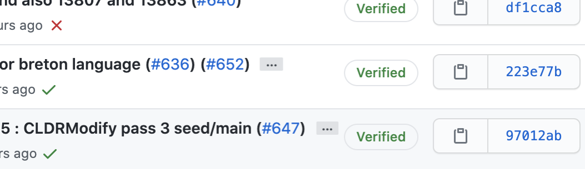
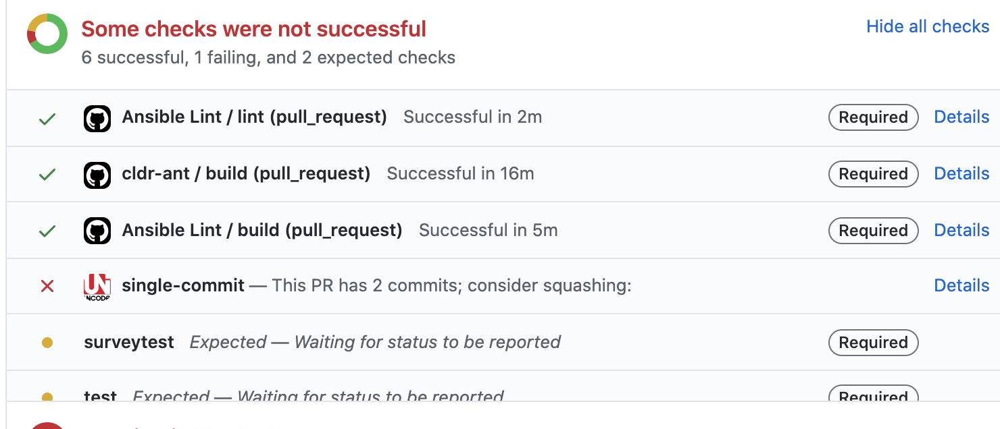

# Contributing to CLDR

## Overview

The CLDR project consists of 3 aspects:

1. **Data:** We rely on contributions by native language speakers that are most commonly used currently in the given country/region. Most data is collected through the Survey Tool. See [How to contribute][].
    - If you are not a native language speaker, but have evidence of CLDR data being incorrect, file a [Jira][] ticket to report the issue. 
    - For data that is not collected in the survey tool, such as [supplemental data][], file a [Jira][] ticket and provide evidence for changing the data.
2. **Internationalization structure:** Requires a ticket to be changed. 
    - For structural issues, note that many issues may be due to misunderstandings of the LDML spec. For example, `<pattern>¤#,##0.00</pattern>` is intended to work with number symbols.
    - File a [Jira][] ticket and provide evidence for the spec issues or to establish a new structure.
    - If your organization is not a [Unicode member][], consider becoming a member and work as a CLDR technical committee member.
3. **CLDR internal tooling** such as adding new tests or fixing tooling that enable CLDR builds and releases. See [CLDR Developer][] introduction.
    - To contribute in internal tooling, [Contact][] us.
    - See [Tools source][] and [Repository Organization][]
    
### Areas where contributions are welcome
- `cldr-apps/`: (Survey Tool).
    Improvements here include:
    - UI:  performance improvements, visual and functional refinements
    - Additional checks (CheckCLDR) to validate CLDR data.
- `java/`: The core CLDR tooling.
    Improvements could include:
    - better documentation around code components
    - updates to use newer/different library dependencies
    - writing unit tests to improve code coverage
    - better documentation around command line tools

## Requirements for merged PRs
For all PRs these steps are required before the PR is merged:

- The PR and commits must reference a [Jira][] ticket which has been accepted by the CLDR-TC. Open a ticket if there is not already a relevant one open.
- The CLA must be signed, agreeing to the [Terms of use][]. You will be prompted on the PR to sign this if you have not already done so.
- All tests must pass (See below)
- The PR must be reviewd by a TC member.
- The PR should have a single commit, and the first line of the commit must
begin with the accepted Jira ticket number.

### Sample commit message 

```
CLDR-0000 Brief Description of Change

Optionally, this is the first line of an extended description,
after the blank line.
- Here is an item
- Here is another item
```

### Licenses

- Usage of CLDR data and software is governed by the Unicode [Terms of use][] a copy of which is included as [unicode-license.txt](./unicode-license.txt)
- Some CLDR tools depend on libraries in tools/java/libs/; use of these libraries is governed by separate license agreements.
    - For example, use of the Guava, Xerces, and Myanmar Tools libraries is subject to the Apache License included as [apache-license.txt](./apache-license.txt)
- Use of the ICU libraries is subject to the ICU License, included as [ICU-LICENSE](./ICU-LICENSE).
- There must be a signed CLA before code is contributed, the PR will not be merged until the CLA is signed.

## Tests

### Running Tests Locally

Tests may be run locally prior to check-in / PR.  See [Running Tests][] on the CLDR development site.

### Automatic Test Runs

Tests are automatically run once a commit is pushed to GitHub and when a PR is opened requesting changes to CLDR. You will see the status check next to each commit's hash, it will show as a circle, x, or checkmark. (●✖✔).  For GitHub documentation, see [About Status Checks][].  A circle ● means information is not available yet, an ✖ means a failure, and a check ✔  means things are good. 



You can click on the "X" and view details about why a commit has a failing status check.

Within a PR, similar status checks show why a PR may not be ready to merge. Note that some checks are required and some are not.



A required check blocks (prevents) merging of a PR.


## Copyright

Copyright &copy; 1991-2020 Unicode, Inc.
All rights reserved. [Terms of use][]

[Terms of use]: http://www.unicode.org/copyright.html
[Jira]: http://cldr.unicode.org/index/bug-reports#TOC-Filing-a-Ticket
[Tools source]: https://github.com/unicode-org/cldr/tree/master/tools
[Repository Organization]: http://cldr.unicode.org/index/downloads#Repository_Organization
[How to contribute]: http://cldr.unicode.org/#TOC-How-to-Contribute-
[Unicode member]: https://home.unicode.org/membership/why-join/
[supplemental data]: https://github.com/unicode-org/cldr/tree/master/common/supplemental
[About Status Checks]: https://docs.github.com/en/github/collaborating-with-issues-and-pull-requests/about-status-checks
[Running Tests]: http://cldr.unicode.org/development/running-tests