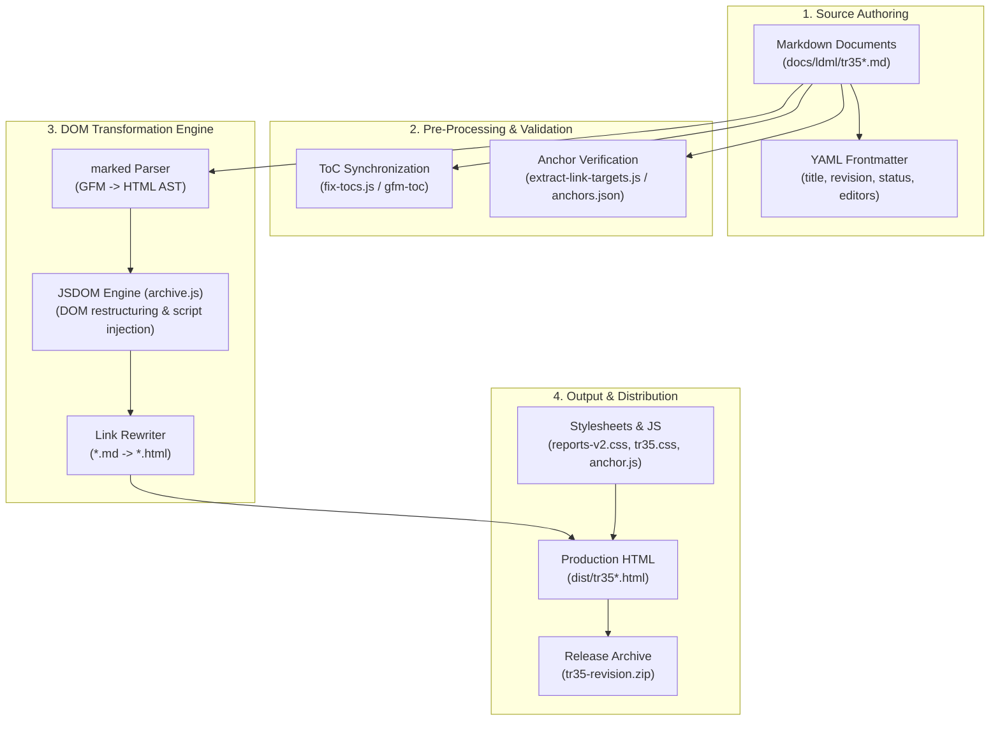
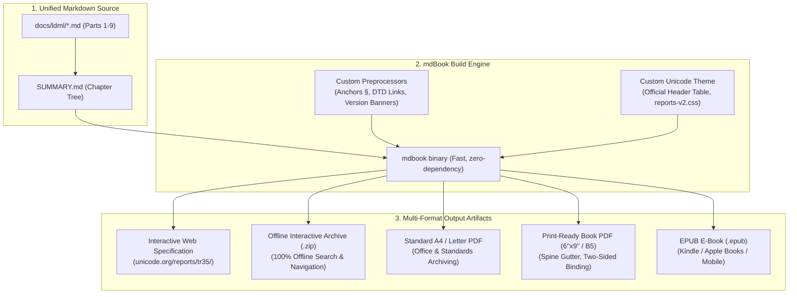

# Design Proposal: UTS #35 (LDML) Restructuring & Rendering Improvements

**Author:** Younies Mahmoud (younies@google.com)  
**Status:** Draft / Work in Progress  
**Target Specifications:** Unicode Technical Standard #35 (LDML Parts 1–9)  
**Target Repository:** `cldr` (`docs/ldml/` and `tools/scripts/tr-archive/`)  
**Tracking Tickets:** [CLDR-19681](https://unicode-org.atlassian.net/browse/CLDR-19681), [CLDR-15084](https://unicode-org.atlassian.net/browse/CLDR-15084)  

---

## 1. Executive Summary

Unicode Technical Standard #35 (LDML) is the primary specification governing locale data exchange across software platforms (ICU, ICU4X, CLDR, Android, iOS, Chrome, V8, Node.js, etc.). 

To make UTS #35 significantly easier to **implement**, **test**, and **audit**, this proposal outlines a comprehensive structural, technical, and toolchain modernization strategy:

1. **Granular Linkability**: Stable, unique anchor IDs for every rule, subsection, and item point (e.g., `#misc-patterns-approximately`).
2. **Modular "Bulleted" Structure ("Bulletability")**: Deconstructing dense prose into single-purpose normative statements with explicit **Base Rule**, **Exception**, **Fallback**, and **Special Case** sub-clauses.
3. **Visual Hierarchy & Color Differentiation**: Distinct color schemes, typography, and badges separating section headers from sub-point keys/tokens (`approximately`, `atMost`) to eliminate visual collapse.
4. **Syntax-Highlighted Code Blocks**: Enforcing fenced code snippets (XML, DTD, BCP 47, EBNF) with color themes and copy tools.
5. **Machine-Readable Conformance Test Fixtures**: Standardized JSON/YAML test files alongside the spec for automated engine validation.
6. **Interactive Schema Cross-Referencing**: Linking XML element/attribute references directly to DTD schema definitions and sample CLDR data.
7. **Structured Pattern Syntax Definitions**: Providing explicit syntax rules (formal grammars / schemas) for pattern strings (Date skeletons `yMMMd`, Number patterns `#,#0.00`).
8. **Versioned Permalinks & Revision Audit Tracking**: Support version-scoped links (e.g., `v45/tr35-numbers.html#misc-patterns-approximately`) ensuring previous version text remains accessible and showing deletion/modification audit banners in newer releases.
9. **Interactive Terminology Tooltips & Glossary**: Hoverable tooltips for technical terms (`skeleton`, `pattern`, `myriad`).
10. **Modern Reader & Publication-Grade Printable Book via mdBook**: Adopting `mdBook` as an optimal rendering engine to provide unified multi-part search, responsive navigation, and automated publication-grade printable exports (**A4/Letter PDF**, **6" × 9" Trade Book**, and **EPUB**).

---

## 2. Background: Current TR35 Authoring & Rendering Architecture

To understand how the proposed enhancements will be implemented, it is helpful to review the current pipeline used by CLDR to author, build, and publish UTS #35:



### 2.1 Current Pipeline Details
- **Source Authoring (`docs/ldml/tr35*.md`)**: UTS #35 is written in GitHub Flavored Markdown (GFM) split across multi-part files (`tr35.md`, `tr35-numbers.md`, `tr35-dates.md`, etc.). Each document begins with a YAML frontmatter block defining release metadata (revision, status, editors).
- **Pre-Processing (`tools/scripts/tr-archive/`)**:
  - `fix-tocs.js` uses `@not-dalia/gfm-toc` to parse headings and sync Table of Contents sections across parts.
  - `extract-link-targets.js` extracts section anchors into JSON files (`tr35-*.anchors.json`) to track link stability.
- **Rendering & Transformation (`archive.js`)**:
  - `marked` parses Markdown into HTML.
  - `JSDOM` manipulates the DOM in-memory: creating `<div class="body">`, rendering header tables, converting `<h6>Table: ...</h6>` to `<caption>`, and attaching client-side scripts (`anchor.min.js`, `tr35search.js`).
- **Packaging & Stylesheets (`build.mjs`)**:
  - Injects CSS stylesheets (`reports-v2.css`, `tr35.css`).
  - Serializes final `.html` files and packages them into `tr35-<revision>.zip` for publication on `unicode.org/reports/tr35/`.

### 2.2 Prior Art & Related Efforts

This proposal builds upon and integrates prior CLDR committee discussions, tickets, and modernization initiatives:
- **[CLDR-15084](https://unicode-org.atlassian.net/browse/CLDR-15084) (Overhaul / Modernize LDML Spec / TR35)**: Documents overarching goals for modernizing TR35 documentation tooling, maintainability, and navigation.
- **[CLDR-19681](https://unicode-org.atlassian.net/browse/CLDR-19681)**: Dedicated tracking issue for this structural redesign proposal (linkability, bulletability, visual hierarchy, mdBook evaluation, and automated test fixtures).

---

## 3. Motivation & Problem Statement

Currently, UTS #35 faces several implementer pain points:
- **Visual Hierarchy Collapse**: Section headers (e.g., `Miscellaneous Patterns`) and individual item sub-points (e.g., `approximately`, `atMost`, `atLeast`) use the same font style and black color, making it impossible to visually distinguish a major section from a sub-item.
- **Unlinkable Sub-Points**: Sub-items under a section (such as specific pattern keys or attributes) are rendered as plain bold text without link anchors, preventing implementers from directly linking to individual keys in conformance tests or codebase comments.
- **Dense Prose**: Paragraphs often mix primary rules, historical notes, fallback behaviors, and edge-case exceptions together.
- **Lack of Version-Scoped Permalinks**: When an implementer links a conformance test to a spec clause, subsequent spec updates can change or delete the clause without leaving an accessible versioned record (`v1/numbers#currency`) or revision audit trail.
- **Unformatted DTD/XML Snippets**: DTD declarations and XML structures are sometimes embedded as inline plain text or unhighlighted `<pre>` blocks.
- **Fragmented Search & Multi-Part Navigation**: Navigating between the 9 separate HTML files requires manual URL jumps, and search is fragmented across parts.

---

## 4. Core Proposal Pillars

### 4.1 Pillar 1: Granular Linkability (Point-Level Anchors)

#### Requirements
- Every normative statement, rule point, sub-item key (`approximately`, `atMost`), fallback clause, and exception must be directly addressable via a deep URL permalink (e.g., `tr35-numbers.html#misc-patterns-approximately`).
- Links must remain stable across spec revisions.

#### Design & Implementation
1. **Anchor Naming Convention**:
   - Standardized human-readable ID convention:  
     `#<section>-<topic>-<clause_type_or_key>`  
     *Example:* `#misc-patterns-approximately` or `#number-format-fallback-rule-1`

2. **Clean Authoring (Zero Raw HTML Required)**:
   With `mdBook`'s preprocessor pipeline, specification authors do **not** need to manually insert raw `<a id="...">` HTML tags. Authors simply write clean, natural Markdown:
   ```markdown
   * `approximately`:
     * **Description**: Indicates an approximate number format (e.g., `"~99"`).
   ```
   The `mdBook` preprocessor automatically transforms this into an anchored list item:
   ```html
   <li id="misc-patterns-approximately">
     <a href="#misc-patterns-approximately" class="anchor-symbol" title="Permalink">§</a>
     <code class="token-key">approximately</code>
   </li>
   ```

3. **Tooling & Build Pipeline Integration**:
   - The preprocessor automatically attaches hover anchor icons (`§` or `#`) to headings and item tokens.
   - Automatically records all generated item-level anchors into `tr35-*.anchors.json` to guarantee permalink stability across releases.

---

### 4.2 Pillar 2: Visual Hierarchy & Color Differentiation

#### Requirements
- Clear, distinct visual contrast between **Section Headings** (`h1`–`h4`), **Item Keys / Attribute Tokens** (`approximately`, `atMost`), and **Body Text**.
- Sub-item keys must be rendered in distinct code/badge styling to immediately signify they are data keys/tokens, not section headings.

#### Color & Typography Palette

| Element | Visual Style | CSS Palette (Light Mode) | Example |
| :--- | :--- | :--- | :--- |
| **Section Headings (`h2`, `h3`)** | Bold, sans-serif, border bottom | `#0969da` (Deep Primary Blue) | **Miscellaneous Patterns** |
| **Sub-Item Keys (`dt`, `code`)** | Monospace, code badge, link anchor | `#0550ae` (Token Blue) on `#f6f8fa` bg | `approximately` |
| **DTD Declarations** | Monospace dark syntax container | `#24292e` bg, `#d73a49` tags | `<!ELEMENT miscPatterns ...>` |
| **Body Prose** | Standard serif/sans-serif body | `#1f2328` (Charcoal) | Indicates an approximate number... |

---

### 4.3 Pillar 3: "Bulletability" (Modular Rule Decomposition)

#### Requirements
- Paragraphs must contain **only one primary concept or rule**.
- Multi-faceted logic must be split into structured bulleted lists.
- Exceptions, fallbacks, and special cases must be explicitly segregated into labeled sub-clauses.

#### Standard Rule Blueprint
```markdown
### <Section Title>

* **Base Rule**: [Single concise normative requirement]
* **Exceptions**:
  * **[Exception-1]**: [Specific condition where base rule does not apply]
* **Fallback Behavior**:
  * **[Fallback-1]**: [Action taken when locale data is missing]
* **Special Cases**:
  * **[Special Case]**: [Edge-case handling for specific scripts/locales]
```

---

### 4.4 Pillar 4: Syntax-Highlighted Code & DTD Blocks

#### Requirements
- All XML snippets, DTD element declarations (`<!ELEMENT miscPatterns ...>`), BCP 47 tags, and pseudocode must be rendered in syntax-highlighted code containers with copy controls.

---

### 4.5 Pillar 5: Machine-Readable Conformance Test Fixtures

#### Requirements
- Standalone JSON test fixtures (`docs/ldml/testdata/*.json`) accompanying spec clauses for automated conformance testing across ICU4C, ICU4J, ICU4X, V8, and WebKit.

---

### 4.6 Pillar 6: XML Schema & DTD Cross-Referencing

#### Requirements
- XML elements (e.g. `<miscPatterns>`) automatically link to their official schema definitions in `common/dtd/ldml.dtd`.

---

### 4.7 Pillar 7: Structured Pattern Syntax Definitions

#### Requirements
- Provide explicit, unambiguous syntax definitions (grammars / schemas) for pattern strings (Date skeletons `yMMMd`, Number patterns `#,#0.00`, Plural rules) so implementers have a precise reference for valid pattern combinations.

---

### 4.8 Pillar 8: Versioned Permalinks & Revision Audit Tracking

#### Requirements
- **Version-Scoped URL Schema**: Support version-prefixed permalinks (e.g., `v45/tr35-numbers.html#misc-patterns-approximately` or `v44/tr35-dates.html#skeleton-yMMMd`).
- **Immutable Version Archiving**: When a new CLDR specification version is released (e.g. v46), previous version links (`v45/...`) remain permanently hosted and readable.
- **Revision & Deletion Audit Banners**: If a section, rule, or sub-item key is modified, moved, or deleted in subsequent versions, viewing the versioned permalink displays an explicit banner:
  - *e.g., "Note: This rule from Version 45 was modified in Version 46 → [View v46 Diff] [See Current Version]"*
  - *e.g., "Warning: This pattern key from Version 44 was deleted in Version 45 → [View Deprecation Notice]"*

---

### 4.9 Pillar 9: Interactive Terminology Tooltips & Glossary

#### Requirements
- Inline hover tooltips for technical terms (*skeleton*, *myriad*, *exemplar set*) linked to a master glossary.

---

## 5. Rendering Engine Evaluation: Adopting mdBook for UTS #35

To deliver the best possible developer and implementer experience, this proposal evaluates **`mdBook`** as a primary static rendering engine for UTS #35.



### 5.1 Why mdBook Directly Solves the Core Challenges

1. **Native Syntax Highlighting & Code Copy Buttons**:
   - Out-of-the-box syntax highlighting for XML, JSON, DTD, and EBNF.
   - Built-in, responsive **"Copy to Clipboard" button** on every code block.

2. **Unified Search Across All 9 Specification Parts**:
   - Compiles a fast, client-side search index (`elasticlunr.js`) that indexes all 9 parts simultaneously.
   - Works **100% offline** without requiring an external search API or backend server.

3. **Hierarchical Navigation Sidebar (`SUMMARY.md`)**:
   - Naturally mirrors UTS #35's structure (Part 1: Core, Part 2: General, Part 3: Numbers, Part 4: Dates, etc.).
   - Provides collapsible sub-sections and previous/next chapter shortcuts.

4. **Deep Linkability & Anchor Management**:
   - Generates clean, clickable hover anchors (`#`) on all headings and supports custom preprocessor hooks for point-level identifiers (`§`).

5. **Extensibility via Preprocessors**:
   - Custom preprocessors (written in Rust, Python, or Node.js) communicate via standard JSON `stdin`/`stdout` to inject DTD schema links, item-level link badges, and revision audit notices.

6. **Single Fast Binary**:
   - Zero `node_modules` dependency sprawl in CI/CD pipelines.

---

### 5.2 Publication-Grade Printable Outputs (PDF, A4 & Physical Book)

Historically, Unicode Standards (v1.0 through v5.0) were published as physical, hardbound reference books. Modern specifications are often printed or archived as official PDFs by standards bodies (ISO, W3C, ECMA) and enterprise users.

`mdBook` provides first-class support for multi-format printable outputs:

#### 1. Single-Page Consolidated View (`print.html`)
- Automatically compiles all 9 parts into a single continuous document, enabling full-document in-browser search (`Ctrl+F`) and clean one-click browser printing.

#### 2. Standard A4 / US Letter PDF Specification
- Configured in `book.toml` (`paper-format = "A4"` or `paper-format = "Letter"`) with:
  - Running headers displaying the current part name.
  - Centered running footers with `Page X of Y`.
  - Non-breaking blocks (`break-inside: avoid`) ensuring XML snippets and DTD tables are never sliced across page breaks.

#### 3. Print-Ready Physical Book (6" × 9" Trade / B5 Academic)
- Configured for physical print-on-demand (paperback or hardcover) with:
  - Custom trim sizes: `6.0in × 9.0in` or standard ISO B5 (`176mm × 250mm`).
  - **Two-sided layout with alternating margins**: Inside spine gutter margin (`margin-left: 0.85in` on odd pages, `margin-right: 0.85in` on even pages) via CSS `@page :left` and `@page :right`.
  - Alternating page number placements for double-sided binding.

#### 4. EPUB E-Book (`.epub`)
- Compiles an e-reader-friendly `.epub` bundle for Kindle, Apple Books, and mobile devices.

---

### 5.3 Multi-Version History & Revision Audit Tracking in mdBook

1. **Immutable Version Directories**:
   - Each CLDR release publishes a static version directory (`/v44/`, `/v45/`, `/v46/`, `/latest/`). Links to older versions never break.
2. **Historical Version Warning Banner**:
   - Visiting older releases displays a top notification banner:  
     *“⚠️ You are viewing an archived version (v44). This rule was modified in v46. [Go to Current Version]”*
3. **Top-Bar Version Switcher Dropdown**:
   - Integrated dropdown in the top navigation bar allowing users to switch between releases (`v44`, `v45`, `v46 (latest)`) with one click.
4. **Smart Anchor Fallbacks & Tombstones**:
   - Preserves tombstone references for deleted sections in newer releases and provides redirect notices if an older anchor is accessed.

---

### 5.4 Unicode Specification Compliance Layer

To maintain 100% compliance with Unicode Consortium publication guidelines, the mdBook setup includes:
- **Custom Template (`theme/index.hbs`)**: Renders the official Unicode TR header table (Editors, Status, Dates, Version, DTD link) and legal copyright footer.
- **Legacy URL/Anchor Aliases**: Preprocessor mapping ensuring legacy permalinks (`tr35-numbers.html#Number_Format_Patterns`) continue resolving seamlessly.
- **Official Styling**: Integrates `reports-v2.css` alongside modern syntax and badge color themes.

---

## 6. Concrete Example: Before vs. After Transformation

To see the difference in readability, linkability, and visual hierarchy, consider this real-world example from `tr35-numbers.md#Miscellaneous_Patterns`:

### 6.1 Current Specification (Before)

> [!WARNING]
> **Problems in current spec**:
> - Sub-item keys (`approximately`, `atMost`, `atLeast`) use the same font and style as section headers, causing visual collapse.
> - Sub-items have no anchors or permalinks—developers cannot cite them in code comments or conformance tests.
> - DTD declarations and examples lack syntax containers and color highlighting.

```markdown
Miscellaneous Patterns

<!ELEMENT miscPatterns (alias | (default*, pattern*, special*)) >
<!ATTLIST miscPatterns numberSystem CDATA #IMPLIED >

The miscPatterns supply additional patterns for special purposes. The currently defined values are:

approximately
    indicates an approximate number, such as: “~99”. This pattern is not currently in use; see ICU-20163.

atMost
    indicates a number or lower, such as: “≤99” to indicate that there are 99 items or fewer.

atLeast
    indicates a number or higher, such as: “99+” to indicate that there are 99 items or more.
```

---

### 6.2 Proposed Redesign (After)

> [!NOTE]
> **Key Improvements**:
> 1. **Clear Heading & Version Badge**: `3.10 Miscellaneous Patterns [v42]` establishes exact section hierarchy.
> 2. **Syntax-Highlighted DTD Block**: Distinct code container with monospace typography.
> 3. **Granular Linkability**: Every sub-item key has its own dedicated anchor tag (`[§ v45]`).
> 4. **Structured "Bulleted" Layout**: Single-purpose descriptions with notes cleanly segregated.

#### Visual Presentation (Rendered in the Specification)

---

#### 3.10 Miscellaneous Patterns &nbsp; `[v42]`

```dtd
<!ELEMENT miscPatterns (alias | (default*, pattern*, special*)) >
<!ATTLIST miscPatterns numberSystem CDATA #IMPLIED >
```

The `<miscPatterns>` element supplies additional pattern templates for boundary and estimation formatting:

* [`[§ v45]`](#misc-patterns-approximately) `approximately`
  * **Description**: Indicates an approximate number format (e.g., `"~99"`).
  * **Note**: See tracking issue [ICU-20163](https://unicode-org.atlassian.net/browse/ICU-20163).
* [`[§ v45]`](#misc-patterns-atmost) `atMost`
  * **Description**: Indicates an upper-bound maximum format (e.g., `"≤99"` to indicate 99 items or fewer).
* [`[§ v45]`](#misc-patterns-atleast) `atLeast`
  * **Description**: Indicates a lower-bound minimum format (e.g., `"99+"` to indicate 99 items or more).

---

#### Clean Markdown Authoring Source (No Raw HTML Tags Needed)

````markdown
### 3.10 Miscellaneous Patterns `[v42]`

```dtd
<!ELEMENT miscPatterns (alias | (default*, pattern*, special*)) >
<!ATTLIST miscPatterns numberSystem CDATA #IMPLIED >
```

The `<miscPatterns>` element supplies additional pattern templates for boundary and estimation formatting:

* `approximately`:
  * **Description**: Indicates an approximate number format (e.g., `"~99"`).
  * **Note**: See tracking issue [ICU-20163](https://unicode-org.atlassian.net/browse/ICU-20163).
* `atMost`:
  * **Description**: Indicates an upper-bound maximum format (e.g., `"≤99"` to indicate 99 items or fewer).
* `atLeast`:
  * **Description**: Indicates a lower-bound minimum format (e.g., `"99+"` to indicate 99 items or more).
````

*(The `mdBook` preprocessor automatically synthesizes the `#misc-patterns-approximately` anchor ID and clickable `[§ v45]` permalink on each list item during build time).*

---

## 7. Migration & Implementation Plan

1. **Phase 1: Tooling Infrastructure & mdBook Prototype (Weeks 1–2)**
   - Configure `book.toml` and custom Unicode theme (`theme/index.hbs`, `theme/custom.css`, `reports-v2.css`).
   - Implement preprocessor for point-level anchors (`§`), DTD cross-linking, and legacy anchor aliases.
   - Configure multi-format exports: A4/Letter PDF and print-ready book layout.
2. **Phase 2: Authoring Guidelines & Test Harness (Weeks 2–3)**
   - Publish updated `docs/ldml/README.md` authoring guide (bulletability, linkability, fenced code blocks).
   - Establish JSON schema for normative test fixtures (`docs/ldml/testdata/`).
3. **Phase 3: Progressive Specification Refactoring (Weeks 3–6)**
   - Incrementally refactor UTS #35 Parts 1–9 to follow the structured, linkable, bulleted format.
