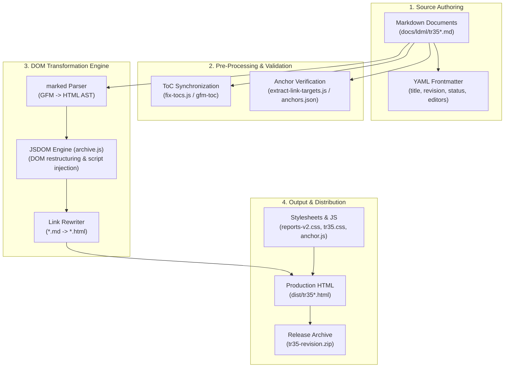

# Design Proposal: UTS #35 (LDML) Restructuring & Rendering Improvements

**Author:** Younies Mahmoud (younies@google.com)  
**Status:** Draft  
**Target Specifications:** Unicode Technical Standard #35 (LDML Parts 1–9)  
**Target Repository:** `cldr` (`docs/ldml/` and `tools/scripts/tr-archive/`)  

---

## 1. Executive Summary

Unicode Technical Standard #35 (LDML) is the primary specification governing locale data exchange across software platforms (ICU, ICU4X, CLDR, Android, iOS, Chrome, V8, Node.js, etc.). 

To make UTS #35 significantly easier to **implement**, **test**, and **audit**, this proposal outlines a comprehensive structural, technical, and toolchain modernization strategy:

1. **Granular Linkability**: Stable, unique anchor IDs for every rule, subsection, and item point (e.g., `#misc-patterns-approximately`).
2. **Modular "Bulleted" Structure ("Bulletability")**: Deconstructing dense prose into single-purpose normative statements with explicit **Base Rule**, **Exception**, **Fallback**, and **Special Case** sub-clauses.
3. **Visual Hierarchy & Color Differentiation**: Distinct color schemes, typography, and badges separating section headers from sub-point keys/tokens (`approximately`, `atMost`) to eliminate visual collapse.
4. **Syntax-Highlighted Code Blocks**: Enforcing fenced code snippets (XML, DTD, BCP 47, EBNF) with color themes and copy tools.
5. **Machine-Readable Conformance Test Fixtures**: Standardized JSON/YAML test files alongside the spec for automated engine validation.
6. **Interactive Schema Cross-Referencing**: Linking XML element/attribute references directly to DTD schema definitions and sample CLDR data.
7. **Structured Pattern Syntax Definitions**: Providing explicit syntax rules (formal grammars / schemas) for pattern strings (Date skeletons `yMMMd`, Number patterns `#,#0.00`).
8. **Versioned Permalinks & Revision Audit Tracking**: Support version-scoped links (e.g., `v45/tr35-numbers.html#misc-patterns-approximately`) ensuring previous version text remains accessible and showing deletion/modification audit banners in newer releases.
9. **Interactive Terminology Tooltips & Glossary**: Hoverable tooltips for technical terms (`skeleton`, `pattern`, `myriad`).

---

## 2. Background: Current TR35 Authoring & Rendering Architecture

To understand how the proposed enhancements will be implemented, it is helpful to review the current pipeline used by CLDR to author, build, and publish UTS #35:



### 2.1 Current Pipeline Pipeline Details
- **Source Authoring (`docs/ldml/tr35*.md`)**: UTS #35 is written in GitHub Flavored Markdown (GFM) split across multi-part files (`tr35.md`, `tr35-numbers.md`, `tr35-dates.md`, etc.). Each document begins with a YAML frontmatter block defining release metadata (revision, status, editors).
- **Pre-Processing (`tools/scripts/tr-archive/`)**:
  - `fix-tocs.js` uses `@not-dalia/gfm-toc` to parse headings and sync Table of Contents sections across parts.
  - `extract-link-targets.js` extracts section anchors into JSON files (`tr35-*.anchors.json`) to track link stability.
- **Rendering & Transformation (`archive.js`)**:
  - `marked` parses Markdown into HTML.
  - `JSDOM` manipulates the DOM in-memory: creating `<div class="body">`, rendering header tables, converting `<h6>Table: ...</h6>` to `<caption>`, and attaching client-side scripts (`anchor.min.js`, `tr35search.js`).
- **Packaging & Stylesheets (`build.mjs`)**:
  - Injects CSS stylesheets (`reports-v2.css`, `tr35.css`).
  - Serializes final `.html` files and packages them into `tr35-<revision>.zip` for publication on `unicode.org/reports/tr35/`.

> **Key Takeaway**: The proposed improvements build directly on top of this existing architecture. Features like **syntax highlighting**, **point-level hover anchors (`§`)**, **color hierarchy**, and **versioned permalinks** will be implemented by enhancing `tools/scripts/tr-archive/archive.js` and `tr35.css` without requiring a new framework.

---

## 3. Motivation & Problem Statement

Currently, UTS #35 faces several implementer pain points:
- **Visual Hierarchy Collapse**: Section headers (e.g., `Miscellaneous Patterns`) and individual item sub-points (e.g., `approximately`, `atMost`, `atLeast`) use the same font style and black color, making it impossible to visually distinguish a major section from a sub-item.
- **Unlinkable Sub-Points**: Sub-items under a section (such as specific pattern keys or attributes) are rendered as plain bold text without link anchors, preventing implementers from directly linking to individual keys in conformance tests or codebase comments.
- **Dense Prose**: Paragraphs often mix primary rules, historical notes, fallback behaviors, and edge-case exceptions together.
- **Lack of Version-Scoped Permalinks**: When an implementer links a conformance test to a spec clause, subsequent spec updates can change or delete the clause without leaving an accessible versioned record (`v1/numbers#currency`) or revision audit trail.
- **Unformatted DTD/XML Snippets**: DTD declarations and XML structures are sometimes embedded as inline plain text or unhighlighted `<pre>` blocks.

---

## 4. Core Proposal Pillars

### 4.1 Pillar 1: Granular Linkability (Point-Level Anchors)

#### Requirements
- Every normative statement, rule point, sub-item key (`approximately`, `atMost`), fallback clause, and exception must be directly addressable via a deep URL permalink (e.g., `tr35-numbers.html#misc-patterns-approximately`).
- Links must remain stable across spec revisions.

#### Design & Implementation
1. **Anchor Naming Convention**:
   - Standardized human-readable ID convention:  
     `#<section>-<topic>-<clause_type_or_key>`  
     *Example:* `#misc-patterns-approximately` or `#number-format-fallback-rule-1`

2. **Definition List & List Item Anchors**:
   ```html
   <dl class="spec-items">
     <dt id="misc-patterns-approximately">
       <a href="#misc-patterns-approximately" class="anchor-link">§</a> <code>approximately</code>
     </dt>
     <dd>Indicates an approximate number, such as “~99”.</dd>
   </dl>
   ```

3. **Tooling & Build Pipeline Extensions**:
   - **`AnchorJS` Integration**: Update `archive.js` to attach hover anchor icons (`§` or `#`) to `<dt id="...">` and `<li id="...">` elements.
   - **Anchor Target Registry**: Update `extract-link-targets.js` to track all item-level anchors in `tr35-*.anchors.json`.

---

### 4.2 Pillar 2: Visual Hierarchy & Color Differentiation

#### Requirements
- Clear, distinct visual contrast between **Section Headings** (`h1`–`h4`), **Item Keys / Attribute Tokens** (`approximately`, `atMost`), and **Body Text**.
- Sub-item keys must be rendered in distinct code/badge styling to immediately signify they are data keys/tokens, not section headings.

#### Color & Typography Palette

| Element | Visual Style | CSS Palette (Light Mode) | Example |
| :--- | :--- | :--- | :--- |
| **Section Headings (`h2`, `h3`)** | Bold, sans-serif, border bottom | `#0969da` (Deep Primary Blue) | **Miscellaneous Patterns** |
| **Sub-Item Keys (`dt`, `code`)** | Monospace, code badge, link anchor | `#0550ae` (Token Blue) on `#f6f8fa` bg | `approximately` |
| **DTD Declarations** | Monospace dark syntax container | `#24292e` bg, `#d73a49` tags | `<!ELEMENT miscPatterns ...>` |
| **Body Prose** | Standard serif/sans-serif body | `#1f2328` (Charcoal) | Indicates an approximate number... |

---

### 4.3 Pillar 3: "Bulletability" (Modular Rule Decomposition)

#### Requirements
- Paragraphs must contain **only one primary concept or rule**.
- Multi-faceted logic must be split into structured bulleted lists.
- Exceptions, fallbacks, and special cases must be explicitly segregated into labeled sub-clauses.

#### Standard Rule Blueprint
```markdown
### <Section Title>

* **Base Rule**: [Single concise normative requirement]
* **Exceptions**:
  * **[Exception-1]**: [Specific condition where base rule does not apply]
* **Fallback Behavior**:
  * **[Fallback-1]**: [Action taken when locale data is missing]
* **Special Cases**:
  * **[Special Case]**: [Edge-case handling for specific scripts/locales]
```

---

### 4.4 Pillar 4: Syntax-Highlighted Code & DTD Blocks

#### Requirements
- All XML snippets, DTD element declarations (`<!ELEMENT miscPatterns ...>`), BCP 47 tags, and pseudocode must be rendered in syntax-highlighted code containers with copy controls.

---

### 4.5 Pillar 5: Machine-Readable Conformance Test Fixtures

#### Requirements
- Standalone JSON test fixtures (`docs/ldml/testdata/*.json`) accompanying spec clauses for automated conformance testing across ICU4C, ICU4J, ICU4X, V8, and WebKit.

---

### 4.6 Pillar 6: XML Schema & DTD Cross-Referencing

#### Requirements
- XML elements (e.g. `<miscPatterns>`) automatically link to their official schema definitions in `common/dtd/ldml.dtd`.

---

### 4.7 Pillar 7: Structured Pattern Syntax Definitions

#### Requirements
- Provide explicit, unambiguous syntax definitions (grammars / schemas) for pattern strings (Date skeletons `yMMMd`, Number patterns `#,#0.00`, Plural rules) so implementers have a precise reference for valid pattern combinations.

---

### 4.8 Pillar 8: Versioned Permalinks & Revision Audit Tracking

#### Requirements
- **Version-Scoped URL Schema**: Support version-prefixed permalinks (e.g., `v45/tr35-numbers.html#misc-patterns-approximately` or `v44/tr35-dates.html#skeleton-yMMMd`).
- **Immutable Version Archiving**: When a new CLDR specification version is released (e.g. v46), previous version links (`v45/...`) remain permanently hosted and readable.
- **Revision & Deletion Audit Banners**: If a section, rule, or sub-item key is modified, moved, or deleted in subsequent versions, viewing the versioned permalink displays an explicit banner:
  - *e.g., "Note: This rule from Version 45 was modified in Version 46 → [View v46 Diff] [See Current Version]"*
  - *e.g., "Warning: This pattern key from Version 44 was deleted in Version 45 → [View Deprecation Notice]"*

---

### 4.9 Pillar 9: Interactive Terminology Tooltips & Glossary

#### Requirements
- Inline hover tooltips for technical terms (*skeleton*, *myriad*, *exemplar set*) linked to a master glossary.

---

## 5. Concrete Example: Before vs. After Transformation

### Before (Current Spec Rendering)
> **Miscellaneous Patterns**  
> `<!ELEMENT miscPatterns (alias | (default*, pattern*, special*)) >`  
> The miscPatterns supply additional patterns for special purposes. The currently defined values are:  
> **approximately**  
> &nbsp;&nbsp;&nbsp;&nbsp;indicates an approximate number, such as: “~99”.  
> **atMost**  
> &nbsp;&nbsp;&nbsp;&nbsp;indicates a number or lower...  
*(Problem: Everything is plain black text; `approximately` and `atMost` look like headers but have no links or styling differentiation).*

---

### After (Redesigned with Hierarchy, Colors, Versioned Permalinks & Point Linkability)

#### <a id="Miscellaneous_Patterns" href="#Miscellaneous_Patterns">3.10 Miscellaneous Patterns</a> <span class="badge badge-v42">v42</span>

```dtd
<!ELEMENT miscPatterns (alias | (default*, pattern*, special*)) >
<!ATTLIST miscPatterns numberSystem CDATA #IMPLIED >
```

The `<miscPatterns>` element supplies additional patterns for special formatting purposes.

<dl class="spec-item-list">
  <dt id="misc-patterns-approximately">
    <a href="v45/tr35-numbers.html#misc-patterns-approximately" class="anchor-symbol" title="Versioned Permalink (v45)">§ v45</a>
    <code class="token-key">approximately</code>
  </dt>
  <dd>
    Indicates an approximate number format (e.g., “~99”).
    <div class="note-box"><strong>Note:</strong> See ICU-20163 for usage tracking.</div>
  </dd>

  <dt id="misc-patterns-atmost">
    <a href="v45/tr35-numbers.html#misc-patterns-atmost" class="anchor-symbol" title="Versioned Permalink (v45)">§ v45</a>
    <code class="token-key">atMost</code>
  </dt>
  <dd>
    Indicates an upper-bound maximum format (e.g., “≤99”).
  </dd>

  <dt id="misc-patterns-atleast">
    <a href="v45/tr35-numbers.html#misc-patterns-atleast" class="anchor-symbol" title="Versioned Permalink (v45)">§ v45</a>
    <code class="token-key">atLeast</code>
  </dt>
  <dd>
    Indicates a lower-bound minimum format (e.g., “99+”).
  </dd>
</dl>

---

## 6. Migration & Implementation Plan

1. **Phase 1: Infrastructure & Build Pipeline (Weeks 1–2)**
   - Update `tools/scripts/tr-archive/archive.js` and `tr35.css` for code syntax highlighting, deep anchor markers, visual color hierarchy, versioned permalink generation (`vXX/...`), version audit banners, and tooltip styles.
2. **Phase 2: Authoring Guidelines & Test Harness (Weeks 2–3)**
   - Update `docs/ldml/README.md` for specification contributors.
   - Establish JSON schema for normative test fixtures (`docs/ldml/testdata/`).
3. **Phase 3: Progressive Specification Refactoring (Weeks 3–6)**
   - Incremental refactoring of UTS #35 Parts 1–9.
