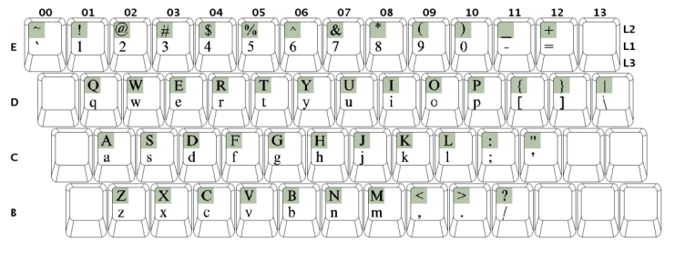
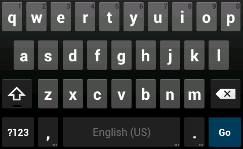

## Unicode Technical Standard #35

# Unicode Locale Data Markup Language (LDML)<br/>Part 7: Keyboards

<!-- HTML: no th -->
<table><tbody>
<tr><td>Version</td><td>41</td></tr>
<tr><td>Editors</td><td>Steven Loomis (<a href="mailto:srl@icu-project.org">srl@icu-project.org</a>) and <a href="tr35.html#Acknowledgments">other CLDR committee members</a></td></tr>
</tbody></table>

For the full header, summary, and status, see [Part 1: Core](tr35.md).

#### _Important Note_

> The CLDR [Keyboard Workgroup](https://cldr.unicode.org/index/keyboard-workgroup) is currently
> developing major changes to the CLDR keyboard specification. These changes are targeted for
> CLDR version 41. Please see [CLDR-15034](https://unicode-org.atlassian.net/browse/CLDR-15034) for
> the latest information.
### _Summary_

This document describes parts of an XML format (_vocabulary_) for the exchange of structured locale data. This format is used in the [Unicode Common Locale Data Repository](https://unicode.org/cldr/).

This is a partial document, describing keyboard mappings. For the other parts of the LDML see the [main LDML document](tr35.md) and the links above.

_Note:_
Some links may lead to in-development or older
versions of the data files.
See <https://cldr.unicode.org> for up-to-date CLDR release data.

### _Status_

_This document has been reviewed by Unicode members and other interested parties, and has been approved for publication by the Unicode Consortium. This is a stable document and may be used as reference material or cited as a normative reference by other specifications._

> _**A Unicode Technical Standard (UTS)** is an independent specification. Conformance to the Unicode Standard does not imply conformance to any UTS._

_Please submit corrigenda and other comments with the CLDR bug reporting form [[Bugs](tr35.md#Bugs)]. Related information that is useful in understanding this document is found in the [References](tr35.md#References). For the latest version of the Unicode Standard see [[Unicode](tr35.md#Unicode)]. For a list of current Unicode Technical Reports see [[Reports](tr35.md#Reports)]. For more information about versions of the Unicode Standard, see [[Versions](tr35.md#Versions)]._

## <a name="Parts" href="#Parts">Parts</a>

The LDML specification is divided into the following parts:

*   Part 1: [Core](tr35.md#Contents) (languages, locales, basic structure)
*   Part 2: [General](tr35-general.md#Contents) (display names & transforms, etc.)
*   Part 3: [Numbers](tr35-numbers.md#Contents) (number & currency formatting)
*   Part 4: [Dates](tr35-dates.md#Contents) (date, time, time zone formatting)
*   Part 5: [Collation](tr35-collation.md#Contents) (sorting, searching, grouping)
*   Part 6: [Supplemental](tr35-info.md#Contents) (supplemental data)
*   Part 7: [Keyboards](tr35-keyboards.md#Contents) (keyboard mappings)

## <a name="Contents" href="#Contents">Contents of Part 7, Keyboards</a>

  * [_Important Note_](#important-note)
  * [_Summary_](#summary)
  * [_Status_](#status)
* [Parts](#Parts)
* [Contents of Part 7, Keyboards](#Contents)
* 1 [Keyboards](#Introduction)
* 2 [Goals and Non-goals](#Goals_and_Nongoals)
* 3 [Definitions](#Definitions)
  * 3.1 [Escaping](#Escaping)
* 4 [File and Directory Structure](#File_and_Dir_Structure)
* 5 [Element Hierarchy - Layout File](#Element_Heirarchy_Layout_File)
  * 5.1 [Element: keyboard](#Element_Keyboard)
  * 5.2 [Element: version](#Element_version)
  * 5.3 ~~[Element: generation](#Element_generation)~~
  * 5.4 [Element: info](#Element_info)
  * 5.5 [Element: names](#Element_names)
  * 5.6 [Element: name](#Element_name)
  * 5.7 [Element: settings](#Element_settings)
  * 5.8 [Element: keyMap](#Element_keyMap)
    * Table: [Possible Modifier Keys](#Possible_Modifier_Keys)
  * 5.9 [Element: map](#Element_map)
    * 5.9.1 [Elements: flicks, flick](#Element_flicks)
  * 5.10 [Element: import](#Element_import)
  * 5.11 [Element: displayMap](#Element_displayMap)
  * 5.12 [Element: display](#Element_display)
  * 5.13 [Element: layer](#Element_layer)
  * 5.14 [Element: row](#Element_row)
  * 5.15 [Element: switch](#Element_switch)
  * 5.16 [Element: vkeys](#Element_vkeys)
  * 5.17 [Element: vkey](#Element_vkey)
  * 5.18 [Element: transforms](#Element_transforms)
  * 5.19 [Element: transform](#Element_transform)
  * 5.20 [Element: reorders, reorder](#Element_reorder)
  * 5.21 [Element: transform final](#Element_final)
  * 5.22 [Element: backspaces](#Element_backspaces)
  * 5.23 [Element: backspace](#Element_backspace)
* 6 [Element Hierarchy - Platform File](#Element_Heirarchy_Platform_File)
  * 6.1 [Element: platform](#Element_platform)
  * 6.2 [Element: hardwareMap](#Element_hardwareMap)
  * 6.3 [Element: map](#Element_hardwareMap_map)
* 7 [Invariants](#Invariants)
* 8 [Data Sources](#Data_Sources)
  * Table: [Key Map Data Sources](#Key_Map_Data_Sources)
* 9 [Keyboard IDs](#Keyboard_IDs)
  * 9.1 [Principles for Keyboard Ids](#Principles_for_Keyboard_Ids)
* 10 [Platform Behaviors in Edge Cases](#Platform_Behaviors_in_Edge_Cases)

## 1 <a name="Introduction" href="#Introduction">Keyboards</a>

The CLDR keyboard format provides for the communication of keyboard mapping data between different modules, and the comparison of data across different vendors and platforms. The standardized identifier for keyboards can be used to communicate, internally or externally, a request for a particular keyboard mapping that is to be used to transform either text or keystrokes. The corresponding data can then be used to perform the requested actions.

For example, a web-based virtual keyboard may transform text in the following way. Suppose the user types a key that produces a "W" on a qwerty keyboard. A web-based tool using an azerty virtual keyboard can map that text ("W") to the text that would have resulted from typing a key on an azerty keyboard, by transforming "W" to "Z". Such transforms are in fact performed in existing web applications.

The data can also be used in analysis of the capabilities of different keyboards. It also allows better interoperability by making it easier for keyboard designers to see which characters are generally supported on keyboards for given languages.

To illustrate this specification, here is an abridged layout representing the English US 101 keyboard on the Mac OSX operating system (with an inserted long-press example). For more complete examples, and information collected about keyboards, see keyboard data in XML.

```xml
<keyboard locale="en-t-k0-osx">
    <version platform="10.4" number="$Revision: 8294 $" />
    <names>
        <name value="U.S." />
    </names>
    <keyMap>
        <map iso="E00" to="`" />
        <map iso="E01" to="1" />
        <map iso="D01" to="q" />
        <map iso="D02" to="w" />
        <map iso="D03" to="e" longPress="é è ê ë" />
        …
    </keyMap>
    <keyMap modifiers="caps">
        <map iso="E00" to="`" />
        <map iso="E01" to="1" />
        <map iso="D01" to="Q" />
        <map iso="D02" to="W" />
        …
    </keyMap>
    <keyMap modifiers="opt">
        <map iso="E00" to="`" />
        <map iso="E01" to="¡" /> <!-- key=1 -->
        <map iso="D01" to="œ" /> <!-- key=Q -->
        <map iso="D02" to="∑" /> <!-- key=W -->
        …
    </keyMap>
    <transforms type="simple">
        <transform from="` " to="`" />
        <transform from="`a" to="à" />
        <transform from="`A" to="À" />
        <transform from="´ " to="´" />
        <transform from="´a" to="á" />
        <transform from="´A" to="Á" />
        <transform from="˜ " to="˜" />
        <transform from="˜a" to="ã" />
        <transform from="˜A" to="Ã" />
        …
    </transforms>
</keyboard>
```

And its associated platform file (which includes the hardware mapping):

```xml
<platform id="osx">
    <hardwareMap>
        <map keycode="0" iso="C01" />
        <map keycode="1" iso="C02" />
        <map keycode="6" iso="B01" />
        <map keycode="7" iso="B02" />
        <map keycode="12" iso="D01" />
        <map keycode="13" iso="D02" />
        <map keycode="18" iso="E01" />
        <map keycode="50" iso="E00" />
    </hardwareMap>
</platform>
```

* * *

## 2 <a name="Goals_and_Nongoals" href="#Goals_and_Nongoals">Goals and Non-goals</a>

Some goals of this format are:

1. Make the XML as readable as possible.
2. Represent faithfully keyboard data from major platforms: it should be possible to create a functionally-equivalent data file (such that given any input, it can produce the same output).
3. Make as much commonality in the data across platforms as possible to make comparison easy.

Some non-goals (outside the scope of the format) currently are:

1. Display names or symbols for keycaps (eg, the German name for "Return"). If that were added to LDML, it would be in a different structure, outside the scope of this section.
2. Advanced IME features, handwriting recognition, etc.
3. Roundtrip mappings—the ability to recover precisely the same format as an original platform's representation. In particular, the internal structure may have no relation to the internal structure of external keyboard source data, the only goal is functional equivalence.

Note: During development of this section, it was considered whether the modifier RAlt (=AltGr) should be merged with Option. In the end, they were kept separate, but for comparison across platforms implementers may choose to unify them.

Note that in parts of this document, the format `@x` is used to indicate the _attribute_ **x**.

* * *

## 3 <a name="Definitions" href="#Definitions">Definitions</a>

**Arrangement** is the term used to describe the relative position of the rectangles that represent keys, either physically or virtually. A physical keyboard has a static arrangement while a virtual keyboard may have a dynamic arrangement that changes per language and/or layer. While the arrangement of keys on a keyboard may be fixed, the mapping of those keys may vary.

**Base character:** The character emitted by a particular key when no modifiers are active. In ISO terms, this is group 1, level 1.

**Base map:** A mapping from the ISO positions to the base characters. There is only one base map per layout. The characters on this map can be output by not using any modifier keys.

**Core keyboard layout:** also known as “alpha” block. The primary set of key values on a keyboard that are used for typing the target language of the keyboard. For example, the three rows of letters on a standard US QWERTY keyboard (QWERTYUIOP, ASDFGHJKL, ZXCVBNM) together with the most significant punctuation keys. Usually this equates to the minimal keyset for a language as seen on mobile phone keyboards.

**Hardware map:** A mapping between key codes and ISO layout positions.

**Input Method Editor (IME):** a component or program that supports input of large character sets. Typically, IMEs employ contextual logic and candidate UI to identify the Unicode characters intended by the user.

**ISO position:** The corresponding position of a key using the ISO layout convention where rows are identified by letters and columns are identified by numbers. For example, "D01" corresponds to the "Q" key on a US keyboard. For the purposes of this document, an ISO layout position is depicted by a one-letter row identifier followed by a two digit column number (like "B03", "E12" or "C00"). The following diagram depicts a typical US keyboard layout superimposed with the ISO layout indicators (it is important to note that the number of keys and their physical placement relative to each-other in this diagram is irrelevant, rather what is important is their logical placement using the ISO convention):



One may also extend the notion of the ISO layout to support keys that don't map directly to the diagram above (such as the Android device - see diagram). Per the ISO standard, the space bar is mapped to "A03", so the period and comma keys are mapped to "A02" and "A04" respectively based on their relative position to the space bar. Also note that the "E" row does not exist on the Android keyboard.



If it becomes necessary in the future, the format could extend the ISO layout to support keys that are located to the left of the "00" column by using negative column numbers "-01", "-02" and so on, or 100's complement "99", "98",...

**Key:** A key on a physical keyboard.

**Key code:** The integer code sent to the application on pressing a key.

**Key map:** The basic mapping between ISO positions and the output characters for each set of modifier combinations associated with a particular layout. There may be multiple key maps for each layout.

**Keyboard:** The physical keyboard.

**Keyboard layout:** A layout is the overall keyboard configuration for a particular locale. Within a keyboard layout, there is a single base map, one or more key maps and zero or more transforms.

**Layer** is an arrangement of keys on a virtual keyboard. Since it is often not intended to use two hands on a visual keyboard to allow the pressing of modifier keys. Modifier keys are made sticky in that one presses one, the visual representation, and even arrangement, of the keys change, and you press the key. This visual representation is a layer. Thus a virtual keyboard is made up of a set of layers.

**Long-press key:** also known as a “child key”. A secondary key that is invoked from a top level key on a software keyboard. Secondary keys typically provide access to variants of the top level key, such as accented variants (a => á, à, ä, ã)

**Modifier:** A key that is held to change the behavior of a keyboard. For example, the "Shift" key allows access to upper-case characters on a US keyboard. Other modifier keys include but is not limited to: Ctrl, Alt, Option, Command and Caps Lock.

**Physical keyboard** is a keyboard that has individual keys that are pressed. Each key has a unique identifier and the arrangement doesn't change, even if the mapping of those keys does.

**Transform:** A transform is an element that specifies a set of conversions from sequences of code points into one (or more) other code points. For example, in most latin keyboards hitting the "^" dead-key followed by the "e" key produces "ê".

**Virtual keyboard** is a keyboard that is rendered on a, typically, touch surface. It has a dynamic arrangement and contrasts with a physical keyboard. This term has many synonyms: touch keyboard, software keyboard, SIP (Software Input Panel). This contrasts with other uses of the term virtual keyboard as an on-screen keyboard for reference or accessibility data entry.

### 3.1 <a name="Escaping" href="#Escaping">Escaping</a>

When explicitly specified, attributes can contain escaped characters. This specification uses two methods of escaping, the _UnicodeSet_ notation and the `\u{...}` notation.

The _UnicodeSet_ notation is described in [UTS#35 section 5.3.3](tr35.md#Unicode_Sets) and allows for comprehensive character matching, including by character range, properties, names, or codepoints. Currently, the following attributes allow _UnicodeSet_ notation:

* `from`, `before`, `after` on the `<transform>` element
* `from`, `before`, `after` on the `<reorder>` element
* `from`, `before`, `after` on the `<backspace>` element

The `\u{...}` notation, a subset of hex notation, is described in [UTS#18 section 1.1](https://www.unicode.org/reports/tr18/#Hex_notation). It can refer to one or multiple individual codepoints. Currently, the following attributes allow the `\u{...}` notation:

* `to`, `longPress`, `multitap`, `hint` on the `<map>` element
* `to` on the `<transform>` element
* `to` on the `<backspace>` element

Characters of general category of Combining Mark (M), Control characters (Cc), Format characters (Cf), and whitespace other than space should be encoded using one of the notation above as appropriate.

* * *

## 4 <a name="File_and_Dir_Structure" href="#File_and_Dir_Structure">File and Directory Structure</a>

Each platform has its own directory, where a "platform" is a designation for a set of keyboards available from a particular source, such as Windows or ChromeOS. This directory name is the platform name (see Table 2 located further in the document). Within this directory there are two types of files:

1. A single platform file (see XML structure for Platform file), this file includes a mapping of hardware key codes to the ISO layout positions. This file is also open to expansion for any configuration elements that are valid across the whole platform and that are not layout specific. This file is simply called `_platform.xml`.
2. Multiple layout files named by their locale identifiers. (eg. `lt-t-k0-chromeos.xml` or `ne-t-k0-windows.xml`).

Keyboard data that is not supported on a given platform, but intended for use with that platform, may be added to the directory `/und/`. For example, there could be a file `/und/lt-t-k0-chromeos.xml`, where the data is intended for use with ChromeOS, but does not reflect data that is distributed as part of a standard ChromeOS release.

* * *

## 5 <a name="Element_Heirarchy_Layout_File" href="#Element_Heirarchy_Layout_File">Element Hierarchy - Layout File</a>

### 5.1 <a name="Element_Keyboard" href="#Element_Keyboard">Element: keyboard</a>

This is the top level element. All other elements defined below are under this element.

**Syntax**

```xml
<keyboard locale="{locale ID}">
    {definition of the layout as described by the elements defined below}
</keyboard>
```

> <small>
>
> Parents: _none_
> Children: [version](#Element_version), [~~generation~~](#Element_generation), [info](#Element_info), [names](#Element_names), [settings](#Element_settings), [import](#Element_import), [keyMap](#Element_KeyMap), [displayMap](#Element_DisplayMap), [layer](#Element_layer), [vkeys](#Element_vkeys), [transforms](#Element_transforms), [reorders](#Element_reorder), [backspaces](#Element_backspaces)
> Occurence: required, single
>
> </small>

_Attribute:_ `locale` (required)

This mandatory attribute represents the locale of the keyboard using Unicode locale identifiers (see [LDML](tr35.md)) - for example `"el"` for Greek. Sometimes, the locale may not specify the base language. For example, a Devanagari keyboard for many languages could be specified by BCP-47 code: `"und-Deva"`. For details, see [Keyboard IDs](#Keyboard_IDs) .

**Example** (for illustrative purposes only, not indicative of the real data)

```xml
<keyboard locale="ka-t-k0-qwerty-windows">
  …
</keyboard>
```
```xml
<keyboard locale="fr-CH-t-k0-android">
  …
</keyboard>
```

* * *

### 5.2 <a name="Element_version" href="#Element_version">Element: version</a>

Element used to keep track of the source data version.

**Syntax**

```xml
<version platform=".." number="..">
```

> <small>
>
> Parents: [keyboard](#Element_keyboard)
> Children: _none_
> Occurence: required, single
>
> </small>

_Attribute:_ `platform` (required)

> The platform source version. Specifies what version of the platform the data is from. For example, data from Mac OSX 10.4 would be specified as `platform="10.4"`. For platforms that have unstable version numbers which change frequently (like Linux), this field is set to an integer representing the iteration of the data starting with `"1"`. This number would only increase if there were any significant changes in the keyboard data.

_Attribute:_ `number` (required)

> The data revision version. The attribute value must start with `$Revision` and end with `$`.

_Attribute:_ `cldrVersion` (fixed by DTD)

> The CLDR specification version that is associated with this data file. This value is fixed and is inherited from the [DTD file](https://github.com/unicode-org/cldr/tree/main/keyboards/dtd) and therefore does not show up directly in the XML file.

**Example**

```xml
<keyboard locale="..-osx">
    …
    <version platform="10.4" number="1"/>
    …
</keyboard>
```

* * *

### 5.3 ~~<a name="Element_generation" href="#Element_generation">Element: generation</a>~~

The `generation` element is now deprecated. It was used to keep track of the generation date of the data.

* * *

### 5.4 <a name="Element_info" href="#Element_info">Element: info</a>

Element containing informative properties about the layout, for displaying in user interfaces etc.

**Syntax**

```xml
<info [author="{author}"]
      [normalization="{form}"]
      [layout="{hint of the layout}"]
      [indicator="{short identifier}"] />
```

> <small>
>
> Parents: [keyboard](#Element_keyboard)
> Children: _none_
> Occurence: optional, single
>
> </small>

_Attribute:_ `author` (optional)

> The `author` attribute contains the name of the author of the layout file.

_Attribute:_ `normalization` (optional)

> The `normalization` attribute describes the intended normalization form of the keyboard layout output. The valid values are `NFC`, `NFD` or `other`.
> An example use case is aiding user to choose among the two same layouts with one outputting characters in the normalization form C and one in the normalization form D.

_Attribute:_ `layout` (optional)

> The `layout` attribtue describes the layout pattern, such as QWERTY, DVORAK, INSCRIPT, etc. typically used to distinguish various layouts for the same language.

_Attribute:_ `indicator` (optional)

> The `indicator` attribute describes a short string to be used in currently selected layout indicator, such as US, SI9 etc.
> Typically, this is shown on a UI element that allows switching keyboard layouts and/or input languages.

* * *

### 5.5 <a name="Element_names" href="#Element_names">Element: names</a>

Element used to store any names given to the layout by the platform.

**Syntax**

```xml
<names>
    {set of name elements}
</names>
```

> <small>
>
> Parents: [keyboard](#Element_keyboard)
> Children: [name](#Element_name)
> Occurence: required, single
>
> </small>

### 5.6 <a name="Element_name" href="#Element_name">Element: name</a>

A single name given to the layout by the platform.

**Syntax**

```xml
<name value="..">
```

> <small>
>
> Parents: [names](#Element_names)
> Children: _none_
> Occurence: required, multiple
> </small>

_Attribute:_ `value` (required)

> The name of the layout.

**Example**

```xml
<keyboard locale="bg-t-k0-windows-phonetic-trad">
    …
    <names>
        <name value="Bulgarian (Phonetic Traditional)" />
    </names>
    …
</keyboard>
```

* * *

### 5.7 <a name="Element_settings" href="#Element_settings">Element: settings</a>

An element used to keep track of layout specific settings. This element may or may not show up on a layout. These settings reflect the normal practice on the platform. However, an implementation using the data may customize the behavior. For example, for `transformFailure` the implementation could ignore the setting, or modify the text buffer in some other way (such as by emitting backspaces).

**Syntax**

```xml
<settings [fallback="omit"] [transformFailure="omit"] [transformPartial="hide"] />
```

> <small>
>
> Parents: [keyboard](#Element_keyboard)
> Children: _none_
> Occurence: optional, single
>
> </small>

_Attribute:_ `fallback="omit"` (optional)

> The presence of this attribute means that when a modifier key combination goes unmatched, no output is produced. The default behavior (when this attribute is not present) is to fallback to the base map when the modifier key combination goes unmatched.

If this attribute is present, it must have a value of omit.

_Attribute:_ `transformFailure="omit"` (optional)

> This attribute describes the behavior of a transform when it is escaped (see the `transform` element in the Layout file for more information). A transform is escaped when it can no longer continue due to the entry of an invalid key. For example, suppose the following set of transforms are valid:
>
> ^e → ê
>
> ^a → â

Suppose a user now enters the "\^" key then "\^" is now stored in a buffer and may or may not be shown to the user (see the `partial` attribute).

If a user now enters d, then the transform has failed and there are two options for output.

1. default behavior - "^d"

2. omit - "" (nothing and the buffer is cleared)

The default behavior (when this attribute is not present) is to emit the contents of the buffer upon failure of a transform.

If this attribute is present, it must have a value of omit.

_Attribute:_ `transformPartial="hide"` (optional)

> This attribute describes the behavior the system while in a transform. When this attribute is present then don't show the values of the buffer as the user is typing a transform (this behavior can be seen on Windows or Linux platforms).

By default (when this attribute is not present), show the values of the buffer as the user is typing a transform (this behavior can be seen on the Mac OSX platform).

If this attribute is present, it must have a value of hide.

**Example**

```xml
<keyboard locale="bg-t-k0-windows-phonetic-trad">
    …
    <settings fallback="omit" transformPartial="hide" />
    …
</keyboard>
```

Indicates that:

1.  When a modifier combination goes unmatched, do not output anything when a key is pressed.
2.  If a transform is escaped, output the contents of the buffer.
3.  During a transform, hide the contents of the buffer as the user is typing.

* * *

### 5.8 <a name="Element_keyMap" href="#Element_keyMap">Element: keyMap</a>

This element defines the group of mappings for all the keys that use the same set of modifier keys. It contains one or more map elements.

**Syntax**

```xml
<keyMap [modifiers="{Set of Modifier Combinations}"]>
    {a set of map elements}
</keyMap>
```

> <small>
>
> Parents: [keyboard](#Element_keyboard)
> Children: [map](#Element_map), [flicks](#Element_flicks)
> Occurence: required, multiple
>
> </small>

_Attribute:_ `modifiers` (optional)

> A set of modifier combinations that cause this key map to be "active". Each combination is separated by a space. The interpretation is that there is a match if any of the combinations match, that is, they are ORed. Therefore, the order of the combinations within this attribute does not matter.

> A combination is simply a concatenation of words to represent the simultaneous activation of one or more modifier keys. The order of the modifier keys within a combination does not matter, although don't care cases are generally added to the end of the string for readability (see next paragraph). For example: `"cmd+caps"` represents the Caps Lock and Command modifier key combination. Some keys have right or left variant keys, specified by a 'R' or 'L' suffix. For example: `"ctrlR+caps"` would represent the Right-Control and Caps Lock combination. For simplicity, the presence of a modifier without a 'R' or 'L' suffix means that either its left or right variants are valid. So `"ctrl+caps"` represents the same as `"ctrlL+ctrlR?+caps ctrlL?+ctrlR+caps"`.

A modifier key may be further specified to be in a "don't care" state using the '?' suffix. The "don't care" state simply means that the preceding modifier key may be either ON or OFF. For example `"ctrl+shift?"` could be expanded into `"ctrl ctrl+shift"`.

Within a combination, the presence of a modifier WITHOUT the '?' suffix indicates this key MUST be on. The converse is also true, the absence of a modifier key means it MUST be off for the combination to be active.

Here is an exhaustive list of all possible modifier keys:

###### Table: <a name="Possible_Modifier_Keys" href="#Possible_Modifier_Keys">Possible Modifier Keys</a>

| Modifier Keys |          | Comments                        |
|---------------|----------|---------------------------------|
| `altL`        | `altR`   | xAlty → xAltR+AltL? xAltR?AltLy |
| `ctrlL`       | `ctrlR`  | ditto for Ctrl                  |
| `shiftL`      | `shiftR` | ditto for Shift                 |
| `optL`        | `optR`   | ditto for Opt                   |
| `caps`        |          | Caps Lock                       |
| `cmd`         |          | Command on the Mac              |

All sets of modifier combinations within a layout are disjoint with no-overlap existing between the key maps. That is, for every possible modifier combination, there is at most a single match within the layout file. There are thus never multiple matches. If no exact match is available, the match falls back to the base map unless the `fallback="omit"` attribute in the `settings` element is set, in which case there would be no output at all.

**Example**

To illustrate, the following example produces an invalid layout because pressing the "Ctrl" modifier key produces an indeterminate result:

```xml
<keyMap modifiers="ctrl+shift?">
    …
</keyMap>
```

```xml
<keyMap modifiers="ctrl">
    …
</keyMap>
```

Modifier Examples:

```xml
<keyMap modifiers="cmd?+opt+caps?+shift" />
```

Caps-Lock may be ON or OFF, Option must be ON, Shift must be ON and Command may be ON or OFF.

```xml
<keyMap modifiers="shift caps" />
```

Caps-Lock must be ON OR Shift must be ON.

If the `modifiers` attribute is not present on a `keyMap` then that particular key map is the base map.

* * *

### 5.9 <a name="Element_map" href="#Element_map">Element: map</a>

This element defines a mapping between the base character and the output for a particular set of active modifier keys. This element must have the `keyMap` element as its parent.

If a `map` element for a particular ISO layout position has not been defined then if this key is pressed, no output is produced.

**Syntax**

```xml
<map
 iso="{the iso position}"
 to="{the output}"
 [longPress="{long press keys}"]
 [transform="no"]
 [multitap="{the output on subsequent taps}"]
 [longPress-status="optional"]
 [optional="{optional mappings}"]
 [hint="{hint to long press content}"]
 /><!-- {Comment to improve readability (if needed)} -->
```

> <small>
>
> Parents: [keyMap](#Element_keyMap)
> Children: _none_
> Occurence: optional, multiple
>
> </small>

_Attribute:_ `iso` (exactly one of base and iso is required)

> The `iso` attribute represents the ISO layout position of the key (see the definition at the beginning of the document for more information).

_Attribute:_ `to` (required)

> The `to` attribute contains the output sequence of characters that is emitted when pressing this particular key. Control characters, whitespace (other than the regular space character) and combining marks in this attribute are escaped using the `\u{...}` notation.

_Attribute:_ `longPress="optional"` (optional)

> The `longPress` attribute contains any characters that can be emitted by "long-pressing" a key, this feature is prominent in mobile devices. The possible sequences of characters that can be emitted are whitespace delimited. Control characters, combining marks and whitespace (which is intended to be a long-press option) in this attribute are escaped using the `\u{...}` notation.

_Attribute:_ `transform="no"` (optional)

> The `transform` attribute is used to define a key that never participates in a transform but its output shows up as part of a transform. This attribute is necessary because two different keys could output the same characters (with different keys or modifier combinations) but only one of them is intended to be a dead-key and participate in a transform. This attribute value must be no if it is present.

_Attribute:_ `multitap` (optional)

> A space-delimited list of strings, where each successive element of the list is produced by the corresponding number of quick taps. For example, three taps on the key C01 will produce a “c” in the following example (first tap produces “a”, two taps produce “bb” etc.).
>
> _Example:_
>
> ```xml
> <map iso="C01" to="a" multitap="bb c d">
> ```
> Control characters, combining marks and whitespace (which is intended to be a multitap option) in this attribute are escaped using the `\u{...}` notation.

_Attribute:_ `longPress-status` (optional)

> Indicates optional `longPress` values. Must only occur with a `longPress` value. May be suppressed or shown, depending on user settings. There can be two `map` elements that differ only by `longPress-status`, allowing two different sets of `longPress` values.
>
> _Example:_
>
> ```xml
> <map iso="D01" to="a" longPress="à â % æ á ä ã å ā ª" />
> <map iso="D01" to="a" longPress="à â á ä ã å ā" longPress-status="optional" />
> ```

_Attribute:_ `optional` (optional)

> Indicates optional mappings. May be suppressed or shown, depending on user settings.

_Attribute:_ `hint` (optional)

> Indicates a hint as to long-press contents, such as the first character of the `longPress` value, that can be displayed on the key. May be suppressed or shown, depending on user Settings. Characters in this attribute can be escaped using the `\u{...}` notation.
>
> _Example:_ where the hint is "{":
>
> 

For example, suppose there are the following keys, their output and one transform:

```
E00 outputs `
Option+E00 outputs ` (the dead-version which participates in transforms).
`e → è
```

Then the first key must be tagged with `transform="no"` to indicate that it should never participate in a transform.

Comment: US key equivalent, base key, escaped output and escaped longpress

In the generated files, a comment is included to help the readability of the document. This comment simply shows the English key equivalent (with prefix `key=`), the base character (`base=`), the escaped output (`to=`) and escaped long-press keys (`long=`). These comments have been inserted strategically in places to improve readability. Not all comments include all components since some of them may be obvious.

**Example**

```xml
<keyboard locale="fr-BE-t-k0-windows">
    …
    <keyMap modifiers="shift">
        <map iso="D01" to="A" /> <!-- key=Q -->
        <map iso="D02" to="Z" /> <!-- key=W -->
        <map iso="D03" to="E" />
        <map iso="D04" to="R" />
        <map iso="D05" to="T" />
        <map iso="D06" to="Y" />
        …
    </keyMap>
     …
</keyboard>
```

```xml
<keyboard locale="ps-t-k0-windows">
    …
    <keyMap modifiers='altR+caps? ctrl+alt+caps?'>
        <map iso="D04" to="\u{200e}" /> <!-- key=R base=ق -->
        <map iso="D05" to="\u{200f}" /> <!-- key=T base=ف -->
        <map iso="D08" to="\u{670}" /> <!-- key=I base=ه to= ٰ -->
        …
    </keyMap>
    …
</keyboard>
```

* * *

#### 5.9.1 <a name="Element_flicks" href="#Element_flicks">Elements: flicks, flick</a>

The `flicks` element is used to generate results from a "flick" of the finger on a mobile device.

**Syntax**

```xml
<flicks iso="{the iso position}">
    {a set of flick elements}
</flicks>
```

> <small>
>
> Parents: [keyMap](#Element_keyMap)
> Children: [flick](#Element_flicks)
> Occurence: optional, multiple
>
> </small>

_Attribute:_ `iso` (required)

> The `iso` attribute represents the ISO layout position of the key (see the definition at the beginning of the document for more information).

**Syntax**

```xml
<flick directions="{list of directions}" to="{the output}" />
```

> <small>
>
> Parents: [flicks](#Element_flicks)
> Children: _none_
> Occurence: required, multiple
>
> </small>

_Attribute:_ `directions` (required)

> The `directions` attribute value is a space-delimited list of keywords, that describe a path, currently restricted to the cardinal and intercardinal directions `{n e s w ne nw se sw}`.

_Attribute:_ `to` (required)

> The to attribute value is the result of (one or more) flicks.

**Example**
where a flick to the Northeast then South produces two code points.

```xml
<flicks iso="C01">
    <flick directions="ne s" to="\uABCD\uDCBA" />
</flicks>
```

* * *

### 5.10 <a name="Element_import" href="#Element_import">Element: import</a>

The `import` element references another file of the same type and includes all the subelements of the top level element as though the `import` element were being replaced by those elements, in the appropriate section of the XML file. For example:

**Syntax**

```xml
<import path="standard_transforms.xml">
```

> <small>
>
> Parents: [keyboard](#Element_keyboard)
> Children: _none_
> Occurence: optional, multiple
>
> </small>

_Attribute:_ `path` (required)

> The value is contains a relative path to the included ldml file. There is a standard set of directories to be searched that an application may provide. This set is always prepended with the directory in which the current file being read, is stored.

If two identical elements, as described below, are defined, the later element will take precedence. Thus if a `hardwareMap/map` for the same keycode on the same page is defined twice (for example once in an included file), the later one will be the resulting mapping.

Elements are considered to have three attributes that make them unique: the tag of the element, the parent and the identifying attribute. The parent in its turn is a unique element and so on up the chain. If the distinguishing attribute is optional, its non-existence is represented with an empty value. Here is a list of elements and their defining attributes. If an element is not listed then if it is a leaf element, only one occurs and it is merely replaced. If it has children, then the subelements are considered, in effect merging the element in question.

| Element      | Parent       | Distinguishing attribute     |
|--------------|--------------|------------------------------|
| `import`     | `keyboard`   | `@path`                      |
| `keyMap`     | `keyboard`   | `@modifiers`                 |
| `map`        | `keyMap`     | `@iso`                       |
| `flicks`     | `keyMap`     | `@iso`                       |
| `flick`      | `flicks`     | `@directions`                |
| `display`    | `displayMap` | `@to`                        |
| `layer`      | `keyboard`   | `@modifier`                  |
| `row`        | `layer`      | `@keys`                      |
| `switch`     | `layer`      | `@iso`                       |
| `vkeys`      | `layer`      | `@iso`                       |
| `transforms` | `keyboard`   | `@type`                      |
| `transform`  | `keyboard`   | `@before`, `@from`, `@after` |
| `reorder`    | `reorders`   | `@before`, `@from`, `@after` |
| `backspace`  | `backspaces` | `@before`, `@from`, `@after` |

In order to help identify mistakes, it is an error if a file contains two elements that override each other. All element overrides must come as a result of an `<include>` element either for the element overridden or the element overriding.

The following elements are not imported from the source file:

* `version`
* `generation`
* `names`
* `settings`

* * *

### 5.11 <a name="Element_displayMap" href="#Element_displayMap">Element: displayMap</a>

The displayMap can be used to describe what is to be displayed on the keytops for various keys. For the most part, such explicit information is unnecessary since the `@to` element from the `keyMap/map` element can be used. But there are some characters, such as diacritics, that do not display well on their own and so explicit overrides for such characters can help. The `displayMap` consists of a list of display subelements.

DisplayMaps are designed to be shared across many different keyboard layout descriptions, and included in where needed.

**Syntax**

```xml
<displayMap>
    {a set of display elements}
</displayMap>
```

> <small>
>
> Parents: [keyboard](#Element_keyboard)
> Children: [display](#Element_display)
> Occurence: optional, single
>
> </small>

* * *

### 5.12 <a name="Element_display" href="#Element_display">Element: display</a>

The `display` element describes how a character, that has come from a `keyMap/map` element, should be displayed on a keyboard layout where such display is possible.

**Syntax**

```xml
<display to="{the output}" display="{show as}" />
```

> <small>
>
> Parents: [displayMap](#Element_displayMap)
> Children: _none_
> Occurence: required, multiple
>
> </small>

_Attribute:_ `to` (required)

> Specifies the character or character sequence from the `keyMap/map` element that is to have a special display.

_Attribute:_ `display` (required)

> Required and specifies the character sequence that should be displayed on the keytop for any key that generates the `@to` sequence. (It is an error if the value of the `display` attribute is the same as the value of the `to` attribute.)

**Example**

```xml
<keyboard>
    <keyMap>
        <map iso="C01" to="a" longpress="\u0301 \u0300" />
    </keyMap>
    <displayMap>
        <display to="\u0300" display="\u02CB" />
        <display to="\u0301" display="\u02CA" />
    </displayMap>
</keyboard>
```

To allow `displayMap`s to be shared across descriptions, there is no requirement that `@to` in a `display` element matches any `@to` in any `keyMap/map` element in the keyboard description.

* * *

### 5.13 <a name="Element_layer" href="#Element_layer">Element: layer</a>

A `layer` element describes the configuration of keys on a particular layer of a keyboard. It contains one or more `row` elements to describe which keys exist in each `row` and optionally one or more `switch` elements that describe how keys in the layer switch the layer to another. In addition, for platforms that require a mapping from a key to a virtual key (for example Windows or Mac) there is also an optional `vkeys` element to describe the mapping.

**Syntax**

```xml
<layer modifier="{Set of Modifier Combinations}">
    ...
</layer>
```

> <small>
>
> Parents: [keyboard](#Element_keyboard)
> Children: [row](#Element_row), [switch](#Element_switch), [vkeys](#Element_vkeys)
> Occurence: optional, multiple
>
> </small>

_Attribute:_ `modifier` (required)

> This has two roles. It acts as an identifier for the `layer` element and also provides the linkage into a keyMap. A modifier is a single modifier combination such that it is matched by one of the modifier combinations in one of the `keyMap/@modifiers` attribute. To indicate that no modifiers apply the reserved name of "none" is used. For the purposes of fallback vkey mapping, the following modifier components are reserved: "shift", "ctrl", "alt", "caps", "cmd", "opt" along with the "L" and "R" optional single suffixes for the first 3 in that list. There must be a `keyMap` whose `@modifiers` attribute matches the `@modifier` attribute of the `layer` element. It is an error if there is no such `keyMap`.

The `keymap/@modifier` often includes multiple combinations that match. It is not necessary (or prefered) to include all of these. Instead a minimal matching element should be used, such that exactly one keymap is matched.

The following are examples of situations where the `@modifiers` and `@modifier` do not match, with a different keymap definition than above.

| `keyMap/@modifiers` | `layer/@modifier`   |
|---------------------|---------------------|
| `shiftL`            | `shift` (ambiguous) |
| `altR`              | `alt`               |
| `shiftL?+shiftR`    | `shift`             |

And these do match:

| `keyMap/@modifiers` | `layer/@modifier` |
|---------------------|-------------------|
| `shiftL shiftR`     | `shift`           |

The use of `@modifier` as an identifier for a layer, is sufficient since it is always unique among the set of `layer` elements in a keyboard.

* * *

### 5.14 <a name="Element_row" href="#Element_row">Element: row</a>

A `row` element describes the keys that are present in the row of a keyboard. `row` elements are ordered within a `layout` element with the top visual row being stored first.

The row element introduces the `keyId` which may be an `ISOKey` or a `specialKey`. More formally:

```
keyId = ISOKey | specialKey
ISOKey = [A-Z][0-9][0-9]
specialKey = [a-z][a-zA-Z0-9]{2,7}
```

ISOKey denotes a key having an [ISO Position](#Definitions). SpecialKey is used to identify functional keys occurring on a virtual keyboard layout.

**Syntax**

```xml
<row keys="{keyId}" />
```

> <small>
>
> Parents: [layer](#Element_layer)
> Children: _none_
> Occurence: required, multiple
>
> </small>

_Attribute:_ `keys` (required)

> This is a string that lists the `keyId` for each of the keys in a row. Key ranges may be contracted to firstkey-lastkey but only for `ISOKey` type `keyId`s. The interpolation between the first and last keys names is entirely numeric. Thus `D00-D03` is equivalent to `D00 D01 D02 D03`. It is an error if the first and last keys do not have the same alphabetic prefix or the last key numeric component is less than or equal to the first key numeric component.

`specialKey` type `keyId`s may take any value within their syntactic constraint. But the following `specialKey`s are reserved to allow applications to identify them and give them special handling:

* `"bksp"`, `"enter"`, `"space"`, `"tab"`, "`esc"`, `"sym"`, `"num"`
* all the reserved modifier names
* specialKeys starting with the letter "x" for future reserved names.

**Example**

Here is an example of a `row` element:

```xml
<layer modifier="none">
    <row keys="D01-D10" />
    <row keys="C01-C09" />
    <row keys="shift B01-B07 bksp" />
    <row keys="sym A01 smilies A02-A03 enter" />
</layer>
```

* * *

### 5.15 <a name="Element_switch" href="#Element_switch">Element: switch</a>

The `switch` element describes a function key that has been included in the layout. It specifies which layer pressing the key switches you to and also what the key looks like.

**Syntax**

```xml
<switch iso="{specialKey}"
        layer="{Set of Modifier Combinations}"
        display="{show as}" />
```

> <small>
>
> Parents: [layer](#Element_layer)
> Children: _none_
> Occurence: optional, multiple
>
> </small>

_Attribute:_ `iso` (required)

> The `keyId` as specified in one of the `row` elements. This must be a `specialKey` and not an `ISOKey`.

_Attribute:_ `layer` (required)

> The modifier attribute of the resulting `layer` element that describes the layer the user gets switched to.

_Attribute:_ `display` (required)

> A string to be displayed on the key.

**Example**

Here is an example of a `switch` element for a shift key:

```xml
<layer modifier="none">
    <row keys="D01-D10" />
    <row keys="C01-C09" />
    <row keys="shift B01-B07 bksp" />
    <row keys="sym A01 smilies A02-A03 enter" />
    <switch iso="shift" layer="shift" display="&#x21EA;" />
</layer>
<layer modifier="shift">
    <row keys="D01-D10" />
    <row keys="C01-C09" />
    <row keys="shift B01-B07 bksp" />
    <row keys="sym A01 smilies A02-A03 enter" />
    <switch iso="shift" layer="none" display="&#x21EA;" />
</layer>
```

* * *

### 5.16 <a name="Element_vkeys" href="#Element_vkeys">Element: vkeys</a>

On some architectures, applications may directly interact with keys before they are converted to characters. The keys are identified using a virtual key identifier or vkey. The mapping between a physical keyboard key and a vkey is keyboard-layout dependent. For example, a French keyboard would identify the D01 key as being an 'a' with a vkey of 'a' as opposed to 'q' on a US English keyboard. While vkeys are layout dependent, they are not modifier dependent. A shifted key always has the same vkey as its unshifted counterpart. In effect, a key is identified by its vkey and the modifiers active at the time the key was pressed.

**Syntax**

```xml
<vkeys>
    {a set of vkey elements}
</vkeys>
```

> <small>
>
> Parents: [layer](#Element_layer), [keyboard](#Element_keyboard)
> Children: [vkey](#Element_vkey)
> Occurence: optional, multiple
>
> </small>

_Attribute:_ `type`

> Current values: android, chromeos, osx, und, windows.

For a physical keyboard there is a layout specific default mapping of keys to vkeys. These are listed in a `vkeys` element which takes a list of `vkey` element mappings and is identified by a type. There are different vkey mappings required for different platforms. While `type="windows"` vkeys are very similar to `type="osx"` vkeys, they are not identical and require their own mapping.

The most common model for specifying vkeys is to import a standard mapping, say to the US layout, and then to add a `vkeys` element to change the mapping appropriately for the specific layout.

In addition to describing physical keyboards, vkeys also get used in virtual keyboards. Here the vkey mapping is local to a layer and therefore a `vkeys` element may occur within a `layout` element. In the case where a `layout` element has no `vkeys` element then the resulting mapping may either be empty (none of the keys represent keys that have vkey identifiers) or may fallback to the layout wide vkeys mapping. Fallback only occurs if the layout's `modifier` attribute consists only of standard modifiers as listed as being reserved in the description of the `layout/@modifier` attribute, and if the modifiers are standard for the platform involved. So for Windows, `"cmd"` is a reserved modifier but it is not standard for Windows. Therefore on Windows the vkey mapping for a layout with `@modifier="cmd" `would be empty.

A `vkeys` element consists of a list of `vkey` elements.

* * *

### 5.17 <a name="Element_vkey" href="#Element_vkey">Element: vkey</a>

A `vkey` element describes a mapping between a key and a vkey for a particular platform.

**Syntax**

```xml
<vkey iso="{iso position}" vkey="{identifier}"
      [modifier="{Set of Modifier Combinations}"] />
```

> <small>
>
> Parents: [vkeys](#Element_vkeys)
> Children: _none_
> Occurence: required, multiple
>
> </small>

_Attribute:_ `iso` (required)

> The ISOkey being mapped.

_Attribute:_ `vkey` (required)

> The resultant vkey identifier (the value is platform specific).

_Attribute:_ `modifier`

> This attribute may only be used if the parent `vkeys` element is a child of a `layout` element. If present it allows an unmodified key from a layer to represent a modified virtual key.

**Example**

This example shows some of the mappings for a French keyboard layout:

 _shared/win-vkey.xml_
```xml
<keyboard>
    <vkeys type="windows">
        <vkey iso="D01" vkey="VK_Q" />
        <vkey iso="D02" vkey="VK_W" />
        <vkey iso="C01" vkey="VK_A" />
        <vkey iso="B01" vkey="VK_Z" />
    </vkeys>
</keyboard>
```

_shared/win-fr.xml_

```xml
<keyboard>
    <import path="shared/win-vkey.xml">
    <keyMap>
        <map iso="D01" to="a" />
        <map iso="D02" to="z" />
        <map iso="C01" to="q" />
        <map iso="B01" to="w" />
    </keyMap>
    <keyMap modifiers="shift">
        <map iso="D01" to="A" />
        <map iso="D02" to="Z" />
        <map iso="C01" to="Q" />
        <map iso="B01" to="W" />
    </keyMap>
    <vkeys type="windows">
        <vkey iso="D01" vkey="VK_A" />
        <vkey iso="D02" vkey="VK_Z" />
        <vkey iso="C01" vkey="VK_Q" />
        <vkey iso="B01" vkey="VK_W" />
    </vkeys>
</keyboard>
```

In the context of a virtual keyboard there might be a symbol layer with the following layout:

```xml
<keyboard>
    <keyMap>
        <map iso="D01" to="1" />
        <map iso="D02" to="2" />
        ...
        <map iso="D09" to="9" />
        <map iso="D10" to="0" />
        <map iso="C01" to="!" />
        <map iso="C02" to="@" />
        ...
        <map iso="C09" to="(" />
        <map iso="C10" to=")" />
    </keyMap>
    <layer modifier="sym">
        <row keys="D01-D10" />
        <row keys="C01-C09" />
        <row keys="shift B01-B07 bksp" />
        <row keys="sym A00-A03 enter" />
        <switch iso="sym" layer="none" display="ABC" />
        <switch iso="shift" layer="sym+shift" display="&amp;=/<" />
        <vkeys type="windows">
            <vkey iso="D01" vkey="VK_1" />
            ...
            <vkey iso="D10" vkey="VK_0" />
            <vkey iso="C01" vkey="VK_1" modifier="shift" />
            ...
            <vkey iso="C10" vkey="VK_0" modifier="shift" />
        </vkeys>
    </layer>
</keyboard>
```

* * *

### 5.18 <a name="Element_transforms" href="#Element_transforms">Element: transforms</a>

This element defines a group of one or more `transform` elements associated with this keyboard layout. This is used to support features such as dead-keys, character reordering, etc. using a straightforward structure that works for all the keyboards tested, and that results in readable source data.

There can be multiple `<transforms>` elements

Syntax

```xml
<transforms type="...">
    {a set of transform elements}
</transforms>
```

> <small>
>
> Parents: [keyboard](#Element_keyboard)
> Children: [transform](#Element_transform)
> Occurence: optional, multiple
>
> </small>

_Attribute:_ `type` (required)

> Current values: `simple`, `final`.


There are other keying behaviors that are needed particularly in handing complex orthographies from various parts of the world. The behaviors intended to be covered by the transforms are:

* Reordering combining marks. The order required for underlying storage may differ considerably from the desired typing order. In addition, a keyboard may want to allow for different typing orders.
* Error indication. Sometimes a keyboard layout will want to specify to the application that a particular keying sequence in a context is in error and that the application should indicate that that particular keypress is erroneous.
* Backspace handling. There are various approaches to handling the backspace key. An application may treat it as an undo of the last key input, or it may simply delete the last character in the currently output text, or it may use transform rules to tell it how much to delete.

We consider each transform type in turn and consider attributes to the `<transforms>` element pertinent to that type.

* * *

### 5.19 <a name="Element_transform" href="#Element_transform">Element: transform</a>

This element must have the `transforms` element as its parent. This element represents a single transform that may be performed using the keyboard layout. A transform is an element that specifies a set of conversions from sequences of code points into one (or more) other code points.. For example, in most French keyboards hitting the "^" dead-key followed by the "e" key produces "ê".

**Syntax**

```xml
<transform from="{combination of characters}" to="{output}"
   [before="{look-behind required match}"]
   [after="{look-ahead required match}"]
   [error="fail"] />
```

> <small>
>
> Parents: [transforms](#Element_transforms)
> Children: _none_
> Occurence: required, multiple
>
> </small>

_Attribute:_ `from` (required)

> The `from` attribute consists of a sequence of elements. Each element matches one character and may consist of a codepoint or a UnicodeSet (both as defined in [UTS#35 section 5.3.3](https://www.unicode.org/reports/tr35/#Unicode_Sets)).

For example, suppose there are the following transforms:

```
^e → ê
^a → â
^o → ô
```

If the user types a key that produces "\^", the keyboard enters a dead state. When the user then types a key that produces an "e", the transform is invoked, and "ê" is output. Suppose a user presses keys producing "\^" then "u". In this case, there is no match for the "\^u", and the "\^" is output if the `transformFailure` attribute in the `settings` element is set to emit. If there is no transform starting with "u", then it is also output (again only if `transformFailure` is set to emit) and the mechanism leaves the "dead" state.

The UI may show an initial sequence of matching characters with a special format, as is done with dead-keys on the Mac, and modify them as the transform completes. This behavior is specified in the `partial` attribute in the `transform` element.

Most transforms in practice have only a couple of characters. But for completeness, the behavior is defined on all strings. The following applies when no exact match exists:

1. If there could be a longer match if the user were to type additional keys, go into a 'dead' state.
2. If there could not be a longer match, find the longest actual match, emit the transformed text (if `transformFailure` is set to emit), and start processing again with the remainder.
3. If there is no possible match, output the first character, and start processing again with the remainder.

Suppose that there are the following transforms:

```
ab → x
abc → y
abef → z
bc → m
beq → n
```

Here's what happens when the user types various sequence characters:

| Input characters | Result | Comments |
|------------------|--------|----------|
| ab               |        | No output, since there is a longer transform with this as prefix. |
| abc              | y      | Complete transform match. |
| abd              | xd     | The longest match is "ab", so that is converted and output. The 'd' follows, since it is not the start of any transform. |
| abeq             | xeq    | "ab" wins over "beq", since it comes first. That is, there is no longer possible match starting with 'a'. |
| bc               | m      |          |

Control characters, combining marks and whitespace in this attribute are escaped using the `\u{...}` notation.

_Attribute:_ `to` (required)

> This attribute represents the characters that are output from the transform. The output can contain more than one character, so you could have `<transform from="´A" to="Fred"/>`

Control characters, whitespace (other than the regular space character) and combining marks in this attribute are escaped using the `\u{...}` notation.

Examples

```xml
<keyboard locale="fr-CA-t-k0-CSA-osx">
    <transforms type="simple">
        <transform from="´a" to="á" />
        <transform from="´A" to="Á" />
        <transform from="´e" to="é" />
        <transform from="´E" to="É" />
        <transform from="´i" to="í" />
        <transform from="´I" to="Í" />
        <transform from="´o" to="ó" />
        <transform from="´O" to="Ó" />
        <transform from="´u" to="ú" />
        <transform from="´U" to="Ú" />
    </transforms>
    ...
</keyboard>
```

```xml
<keyboard locale="nl-BE-t-k0-chromeos">
    <transforms type="simple">
        <transform from="\u{30c}a" to="ǎ" /> <!-- ̌a → ǎ -->
        <transform from="\u{30c}A" to="Ǎ" /> <!-- ̌A → Ǎ -->
        <transform from="\u{30a}a" to="å" /> <!-- ̊a → å -->
        <transform from="\u{30a}A" to="Å" /> <!-- ̊A → Å -->
    </transforms>
    ...
</keyboard>
```

_Attribute:_ `before` (optional)

> This attribute consists of a sequence of elements (codepoint or UnicodeSet) to match the text up to the current position in the text (this is similar to a regex "look behind" assertion: `(?<=a)b` matches a "b" that is preceded by an "a"). The attribute must match for the transform to apply. If missing, no before constraint is applied. The attribute value must not be empty.

_Attribute:_ `after` (optional)

> This attribute consists of a sequence of elements (codepoint or UnicodeSet) and matches as a zero-width assertion after the `@from` sequence. The attribute must match for the transform to apply. If missing, no after constraint is applied. The attribute value must not be empty. When the transform is applied, the string matched by the `@from` attribute is replaced by the string in the `@to` attribute, with the text matched by the `@after` attribute left unchanged. After the change, the current position is reset to just after the text output from the `@to` attribute and just before the text matched by the `@after` attribute. Warning: some legacy implementations may not be able to make such an adjustment and will place the current position after the `@after` matched string.

_Attribute:_ `error="fail"` (optional)

> If set this attribute indicates that the keyboarding application may indicate an error to the user in some way. Processing may stop and rewind to any state before the key was pressed. If processing does stop, no further transforms on the same input are applied. The `@error` attribute takes the value `"fail"`, or must be absent. If processing continues, the `@to` is used for output as normal. It thus should contain a reasonable value.

For example:

```xml
<transform from="\u037A\u037A" to="\u037A" error="fail" />
```

This indicates that it is an error to type two iota subscripts immediately after each other.

In terms of how these different attributes work in processing a sequences of transforms, consider the transform:

```xml
<transform before="X" from="Y" after="Z" to="B" />
```

This would transform the string:

```
XYZ → XBZ
```

If we mark where the current match position is before and after the transform we see:

```
X | Y Z → X B | Z
```

And a subsequent transform could transform the Z string, looking back (using @before) to match the B.

* * *

### 5.20 <a name="Element_reorder" href="#Element_reorder">Element: reorders, reorder</a>

The reorder transform is applied after all transform except for those with `type="final"`.

This transform has the job of reordering sequences of characters that have been typed, from their typed order to the desired output order. The primary concern in this transform is to sort combining marks into their correct relative order after a base, as described in this section. The reorder transforms can be quite complex, keyboard layouts will almost always import them.

The reordering algorithm consists of four parts:

1. Create a sort key for each character in the input string. A sort key has 4 parts: (primary, index, tertiary).
   * The **primary weight** is the primary order value.
   * The **secondary weight** is the index, a position in the input string, usually of the character itself, but it may be of a character earlier in the string.
   * The **tertiary weight** is a tertiary order value (defaulting to 0).
   * The **quaternary weight** is the index of the character in the string. This is solely to ensure a stable sort for sequences of characters with the same tertiary weight.
2. Mark each character as to whether it is a prebase character, one that is typed before the base and logically stored after. Thus it will have a primary order > 0.
3. Use the sort key and the prebase mark to identify runs. A run starts with a prefix that contains any prebase characters and a single base character whose primary and tertiary key is 0. The run extends until, but not including, the start of the prefix of the next run or end of the string.
   * `run := prebase* (primary=0 && tertiary=0) ((primary≠0 || tertiary≠0) && !prebase)*`
4. Sort the character order of each character in the run based on its sort key.

The primary order of a character with the Unicode property Combining_Character_Class (ccc) of 0 may well not be 0. In addition, a character may receive a different primary order dependent on context. For example, in the Devanagari sequence ka halant ka, the first ka would have a primary order 0 while the halant ka sequence would give both halant and the second ka a primary order > 0, for example 2. Note that “base” character in this discussion is not a Unicode base character. It is instead a character with primary=0.

In order to get the characters into the correct relative order, it is necessary not only to order combining marks relative to the base character, but also to order some combining marks in a subsequence following another combining mark. For example in Devanagari, a nukta may follow consonant character, but it may also follow a conjunct consisting of consonant, halant, consonant. Notice that the second consonant is not, in this model, the start of a new run because some characters may need to be reordered to before the first base, for example repha. The repha would get primary < 0, and be sorted before the character with order = 0, which is, in the case of Devanagari, the initial consonant of the orthographic syllable.

The reorder transform consists of a single element type: `<reorder>` encapsulated in a `<reorders>` element. Each is a rule that matches against a string of characters with the action of setting the various ordering attributes (`primary`, `tertiary`, `tertiary_base`, `prebase`) for the matched characters in the string.

**Syntax**

```xml
<reorder from="{combination of characters}"
   [before="{look-behind required match}"]
   [after="{look-ahead required match}"]
   [order="{list of weights}"]
   [tertiary="{list of weights}"]
   [tertiary_base="{list of true/false}"]
   [prebase="{list of true/false}"] />
```

> <small>
>
> Parents: [reorders](#Element_reorder)
> Children: _none_
> Occurence: required, multiple
>
> </small>

_Attribute:_ `from` (required)

> This attribute follows the `transform/@from` attribute and contains a string of elements. Each element matches one character and may consist of a codepoint or a UnicodeSet (both as defined in UTS#35 section 5.3.3).

_Attribute:_ `before`

> This attribute follows the `transform/@before` attribute and contains the element string that must match the string immediately preceding the start of the string that the @from matches.

_Attribute:_ `after`

> This attribute follows the `transform/@after` attribute and contains the element string that must match the string immediately following the end of the string that the `@from` matches.

_Attribute:_ `order`

> This attribute gives the primary order for the elements in the matched string in the `@from` attribute. The value is a simple integer between -128 and +127 inclusive, or a space separated list of such integers. For a single integer, it is applied to all the elements in the matched string. Details of such list type attributes are given after all the attributes are described. If missing, the order value of all the matched characters is 0. We consider the order value for a matched character in the string.
>
> * If the value is 0 and its tertiary value is 0, then the character is the base of a new run.
> * If the value is 0 and its tertiary value is non-zero, then it is a normal character in a run, with ordering semantics as described in the `@tertiary` attribute.
> * If the value is negative, then the character is a primary character and will reorder to be before the base of the run.
> * If the value is positive, then the character is a primary character and is sorted based on the order value as the primary key following a previous base character.
>
> A character with a zero tertiary value is a primary character and receives a sort key consisting of:
>
> * Primary weight is the order value
> * Secondary weight is the index of the character. This may be any value (character index, codepoint index) such that its value is greater than the character before it and less than the character after it.
> * Tertiary weight is 0.
> * Quaternary weight is the same as the secondary weight.

_Attribute:_ `tertiary`

> This attribute gives the tertiary order value to the characters matched. The value is a simple integer between -128 and +127 inclusive, or a space separated list of such integers. If missing, the value for all the characters matched is 0. We consider the tertiary value for a matched character in the string.
>
> * If the value is 0 then the character is considered to have a primary order as specified in its order value and is a primary character.
> * If the value is non zero, then the order value must be zero otherwise it is an error. The character is considered as a tertiary character for the purposes of ordering.
>
> A tertiary character receives its primary order and index from a previous character, which it is intended to sort closely after. The sort key for a tertiary character consists of:
>
> * Primary weight is the primary weight of the primary character
> * Secondary weight is the index of the primary character, not the tertiary character
> * Tertiary weight is the tertiary value for the character.
> * Quaternary weight is the index of the tertiary character.

_Attribute:_ `tertiary_base`

> This attribute is a space separated list of `"true"` or `"false"` values corresponding to each character matched. It is illegal for a tertiary character to have a true `tertiary_base` value. For a primary character it marks that this character may have tertiary characters moved after it. When calculating the secondary weight for a tertiary character, the most recently encountered primary character with a true `tertiary_base` attribute is used. Primary characters with an `@order` value of 0 automatically are treated as having `tertiary_base` true regardless of what is specified for them.

_Attribute:_ `prebase`

> This attribute gives the prebase attribute for each character matched. The value may be `"true"` or `"false"` or a space separated list of such values. If missing the value for all the characters matched is false. It is illegal for a tertiary character to have a true prebase value.
>
> If a primary character has a true prebase value then the character is marked as being typed before the base character of a run, even though it is intended to be stored after it. The primary order gives the intended position in the order after the base character, that the prebase character will end up. Thus `@order` shall not be 0. These characters are part of the run prefix. If such characters are typed then, in order to give the run a base character after which characters can be sorted, an appropriate base character, such as a dotted circle, is inserted into the output run, until a real base character has been typed. A value of `"false"` indicates that the character is not a prebase.

There is no `@error` attribute.

For `@from` attributes with a match string length greater than 1, the sort key information (`@order`, `@tertiary`, `@tertiary_base`, `@prebase`) may consist of a space separated list of values, one for each element matched. The last value is repeated to fill out any missing values. Such a list may not contain more values than there are elements in the `@from` attribute:

```
if len(@from) < len(@list) then error
else
    while len(@from) > len(@list)
        append lastitem(@list) to @list
    endwhile
endif
```

**Example**

For example, consider the word Northern Thai (nod-Lana) word: ᨡ᩠ᩅᩫ᩶ 'roasted'. This is ideally encoded as the following:

| name | _kha_ | _sakot_ | _wa_ | _o_  | _t2_ |
|------|-------|---------|------|------|------|
| code | 1A21  | 1A60    | 1A45 | 1A6B | 1A76 |
| ccc  | 0     | 9       | 0    | 0    | 230  |

(That sequence is already in NFC format.)

Some users may type the upper component of the vowel first, and the tone before or after the lower component. Thus someone might type it as:

| name | _kha_ | _o_  | _t2_ | _sakot_ | _wa_ |
|------|-------|------|------|---------|------|
| code | 1A21  | 1A6B | 1A76 | 1A60    | 1A45 |
| ccc  | 0     | 0    | 230  | 9       | 0    |

The Unicode NFC format of that typed value reorders to:

| name | _kha_ | _o_  | _sakot_ | _t2_ | _wa_ |
|------|-------|------|---------|------|------|
| code | 1A21  | 1A6B | 1A60    | 1A76 | 1A45 |
| ccc  | 0     | 0    | 9       | 230  | 0    |

Finally, the user might also type in the sequence with the tone _after_ the lower component.

| name | _kha_ | _o_  | _sakot_ | _wa_ | _t2_ |
|------|-------|------|---------|------|------|
| code | 1A21  | 1A6B | 1A60    | 1A45 | 1A76 |
| ccc  | 0     | 0    | 9       | 0    | 230  |

(That sequence is already in NFC format.)

We want all of these sequences to end up ordered as the first. To do this, we use the following rules:

```xml
<reorder from="\u1A60" order="127" />      <!-- max possible order -->
<reorder from="\u1A6B" order="42" />
<reorder from="[\u1A75-\u1A79]" order="55" />
<reorder before="\u1A6B" from="\u1A60\u1A45" order="10" />
<reorder before="\u1A6B[\u1A75-\u1A79]" from="\u1A60\u1A45" order="10" />
<reorder before="\u1A6B" from="\u1A60[\u1A75-\u1A79]\u1A45" order="10 55 10" />
```

The first reorder is the default ordering for the _sakot_ which allows for it to be placed anywhere in a sequence, but moves any non-consonants that may immediately follow it, back before it in the sequence. The next two rules give the orders for the top vowel component and tone marks respectively. The next three rules give the _sakot_ and _wa_ characters a primary order that places them before the _o_. Notice particularly the final reorder rule where the _sakot_+_wa_ is split by the tone mark. This rule is necessary in case someone types into the middle of previously normalized text.

`<reorder>` elements are priority ordered based first on the length of string their `@from` attribute matches and then the sum of the lengths of the strings their `@before` and `@after` attributes match.

If a layout has two `<reorders>` elements, e.g. from importing one and specifying the second, then `<reorder>` elements are merged. The @from string in a `<reorder>` element describes a set of strings that it matches. This also holds for the `@before` and `@after` attributes. The intersection of two `<reorder>` elements consists of the intersections of their `@from`, `@before` and `@after` string sets. It is illegal for the intersection between any two `<reorder>` elements in the same `<reorders>` element to be non empty, although implementors are encouraged to have pity on layout authors when reporting such errors, since they can be hard to track down.

If two `<reorder>` elements in two different `<reorders>` elements have a non empty intersection, then they are split and merged. They are split such that where there were two `<reorder>` elements, there are, in effect (but not actuality), three elements consisting of:

* `@from`, `@before`, `@after` that match the intersection of the two rules. The other attributes are merged, as described below.
* `@from`, `@before`, `@after` that match the set of strings in the first rule not in the intersection with the other attributes from the first rule.
* `@from`, `@before`, `@after` that match the set of strings in the second rule not in the intersection, with the other attributes from the second rule.

When merging the other attributes, the second rule is taken to have priority (occurring later in the layout description file). Where the second rule does not define the value for a character but the first does, it is taken from the first rule, otherwise it is taken from the second rule.

Notice that it is possible for two rules to match the same string, but for them not to merge because the distribution of the string across `@before`, `@from`, and `@after` is different. For example:

```xml
<reorder before="ab" from="cd" after="e" />
```

would not merge with:

```xml
<reorder before="a" from="bcd" after="e" />
```

When two `<reorders>` elements merge as the result of an import, the resulting `reorder` elements are sorted into priority order for matching.

Consider this fragment from a shared reordering for the Myanmar script:

```xml
<!-- medial-r -->
<reorder from="\u103C" order="20" />

<!-- [medial-wa or shan-medial-wa] -->
<reorder from="[\u103D\u1082]" order="25" />

<!-- [medial-ha or shan-medial-wa]+asat = Mon asat -->
<reorder from="[\u103E\u1082]\u103A" order="27" />

<!-- [medial-ha or mon-medial-wa] -->
<reorder from="[\u103E\u1060]" order="27" />

<!-- [e-vowel or shan-e-vowel] -->
<reorder from="[\u1031\u1084]" order="30" />

<reorder from="[\u102D\u102E\u1033-\u1035\u1071-\u1074\u1085\u109D\uA9E5]" order="35" />
```

A particular Myanmar keyboard layout can have this `reorders` element:

```xml
<reorders>
    <!-- Kinzi -->
    <reorder from="\u1004\u103A\u1039" order="-1" />

    <!-- e-vowel -->
    <reorder from="\u1031" prebase="1" />

    <!-- medial-r -->
    <reorder from="\u103C" prebase="1" />
</reorders>
```

The effect of this that the _e-vowel_ will be identified as a prebase and will have an order of 30. Likewise a _medial-r_ will be identified as a prebase and will have an order of 20. Notice that a _shan-e-vowel_ will not be identified as a prebase (even if it should be!). The _kinzi_ is described in the layout since it moves something across a run boundary. By separating such movements (prebase or moving to in front of a base) from the shared ordering rules, the shared ordering rules become a self-contained combining order description that can be used in other keyboards or even in other contexts than keyboarding.

* * *

### 5.21 <a name="Element_final" href="#Element_final">Element: transform final</a>

The final transform is applied after the reorder transform. It executes in a similar way to the simple transform with the settings ignored, as if there were no settings in the `<settings>` element.

**Example**

This is an example from Khmer where split vowels are combined after reordering.

```xml
<transforms type="final">
    <transform from="\u17C1\u17B8" to="\u17BE" />
    <transform from="\u17C1\u17B6" to="\u17C4" />
</transforms>
```

Another example allows a keyboard implementation to alert or stop people typing two lower vowels in a Burmese cluster:

```xml
<transform from="[\u102F\u1030\u1048\u1059][\u102F\u1030\u1048\u1059]" error="fail" />
```

* * *

### 5.22 <a name="Element_backspaces" href="#Element_backspaces">Element: backspaces</a>

The backspace transform is an optional transform that is not applied on input of normal characters, but is only used to perform extra backspace modifications to previously committed text.

Keyboarding applications typically, but are not required, to work in one of two modes:

**_text entry_**

> text entry happens while a user is typing new text. A user typically wants the backspace key to undo whatever they last typed, whether or not they typed things in the 'right' order.

**_text editing_**

> text editing happens when a user moves the cursor into some previously entered text which may have been entered by someone else. As such, there is no way to know in which order things were typed, but a user will still want appropriate behaviour when they press backspace. This may involve deleting more than one character or replacing a sequence of characters with a different sequence.

In the text entry mode, there is no need for any special description of backspace behaviour. A keyboarding application will typically keep a history of previous output states and just revert to the previous state when backspace is hit.

In text editing mode, different keyboard layouts may behave differently in the same textual context. The backspace transform allows the keyboard layout to specify the effect of pressing backspace in a particular textual context. This is done by specifying a set of backspace rules that match a string before the cursor and replace it with another string. The rules are expressed as `backspace` elements encapsulated in a `backspaces` element.

**Syntax**

```xml
<backspaces>
    {a set of backspace elements}
</backspace>
```

> <small>
>
> Parents: [keyboard](#Element_keyboard)
> Children: [backspace](#Element_backspace)
> Occurence: optional, single
>
> </small>

* * *

### 5.23 <a name="Element_backspace" href="#Element_backspace">Element: backspace</a>

**Syntax**

```xml
<backspace from="{combination of characters}" [to="{output}"]
   [before="{look-behind required match}"]
   [after="{look-ahead required match}"]
   [error="fail"] />
```

> <small>
>
> Parents: [backspaces](#Element_backspaces)
> Children: _none_
> Occurence: required, multiple
>
> </small>

The `backspace` element has the same `@before`, `@from`, `@after`, `@to`, `@error` of the `transform` element. The `@to` is optional with `backspace`.

**Example**

For example, consider deleting a Devanagari ksha:

```xml
<backspaces>
    <backspace from="\u0915\u094D\u0936"/>
</backspaces>
```

Here there is no `@to` attribute since the whole string is being deleted. This is not uncommon in the backspace transforms.

A more complex example comes from a Burmese visually ordered keyboard:

```xml
<backspaces>
    <!-- Kinzi -->
    <backspace from="[\u1004\u101B\u105A]\u103A\u1039" />

    <!-- subjoined consonant -->
    <backspace from="\u1039[\u1000-\u101C\u101E\u1020\u1021\u1050\u1051\u105A-\u105D]" />

    <!-- tone mark -->
    <backspace from="\u102B\u103A" />

    <!-- Handle prebases -->
    <!-- diacritics stored before e-vowel -->
    <backspace from="[\u103A-\u103F\u105E-\u1060\u1082]\u1031" to="\u1031" />

    <!-- diacritics stored before medial r -->
    <backspace from="[\u103A-\u103B\u105E-\u105F]\u103C" to="\u103C" />

    <!-- subjoined consonant before e-vowel -->
    <backspace from="\u1039[\u1000-\u101C\u101E\u1020\u1021]\u1031" to="\u1031" />

    <!-- base consonant before e-vowel -->
    <backspace from="[\u1000-\u102A\u103F-\u1049\u104E]\u1031" to="\uFDDF\u1031" />

    <!-- subjoined consonant before medial r -->
    <backspace from="\u1039[\u1000-\u101C\u101E\u1020\u1021]\u103C" to="\u103C" />

    <!-- base consonant before medial r -->
    <backspace from="[\u1000-\u102A\u103F-\u1049\u104E]\u103C" to="\uFDDF\u103C" />

    <!-- delete lone medial r or e-vowel -->
    <backspace from="\uFDDF[\u1031\u103C]" />
</backspaces>
```

The above example is simplified, and doesn't fully handle the interaction between medial-r and e-vowel.

The character \\uFDDF does not represent a literal character, but is instead a special placeholder, a "filler string". When a keyboard implementation handles a user pressing a key that inserts a prebase character, it also has to insert a special filler string before the prebase to ensure that the prebase character does not combine with the previous cluster. See the reorder transform for details. The precise filler string is implementation dependent. Rather than requiring keyboard layout designers to know what the filler string is, we reserve a special character that the keyboard layout designer may use to reference this filler string. It is up to the keyboard implementation to, in effect, replace that character with the filler string.

The first three transforms above delete various ligatures with a single keypress. The other transforms handle prebase characters. There are two in this Burmese keyboard. The transforms delete the characters preceding the prebase character up to base which gets replaced with the prebase filler string, which represents a null base. Finally the prebase filler string + prebase is deleted as a unit.

The backspace transform is much like other transforms except in its processing model. If we consider the same transform as in the simple transform example, but as a backspace:

```xml
<backspace before="X" from="Y" after="Z" to="B"/>
```

This would transform the string:

```
XYZ → XBZ
```

If we mark where the current match position is before and after the transform we see:

```
X Y | Z → X B | Z
```

Whereas a simple or final transform would then run other transforms in the transform list, advancing the processing position until it gets to the end of the string, the backspace transform only matches a single backspace rule and then finishes.

* * *

## 6 <a name="Element_Heirarchy_Platform_File" href="#Element_Heirarchy_Platform_File">Element Hierarchy - Platform File</a>

There is a separate XML structure for platform-specific configuration elements. The most notable component is a mapping between the hardware key codes to the ISO layout positions for that platform.

### 6.1 <a name="Element_platform" href="#Element_platform">Element: platform</a>

This is the top level element. This element contains a set of elements defined below. A document shall only contain a single instance of this element.

**Syntax**

```xml
<platform>
    {platform-specific elements}
</platform>
```

> <small>
>
> Parents: _none_
> Children: [hardwareMap](#Element_hardwareMap)
> Occurence: required, single
>
> </small>


### 6.2 <a name="Element_hardwareMap" href="#Element_hardwareMap">Element: hardwareMap</a>

This element must have a `platform` element as its parent. This element contains a set of map elements defined below. A document shall only contain a single instance of this element.

**Syntax**

```xml
<platform>
    <hardwareMap>
        {a set of map elements}
    </hardwareMap>
</platform>
```

> <small>
>
> Parents: [platform](#Element_platform)
> Children: [map](#Element_hardwareMap_map)
> Occurence: optional, single
>
> </small>

### 6.3 <a name="Element_hardwareMap_map" href="#Element_hardwareMap_map">Element: map</a>

This element must have a `hardwareMap` element as its parent. This element maps between a hardware keycode and the corresponding ISO layout position of the key.

**Syntax**

```xml
<map keycode="{hardware keycode}" iso="{ISO layout position}" />
```

> <small>
>
> Parents: [hardwareMap](#Element_hardwareMap)
> Children: _none_
> Occurence: required, multiple
> </small>

_Attribute:_ `keycode` (required)

> The hardware key code value of the key. This value is an integer which is provided by the keyboard driver.

_Attribute:_ `iso` (required)

> The corresponding position of a key using the ISO layout convention where rows are identified by letters and columns are identified by numbers. For example, "D01" corresponds to the "Q" key on a US keyboard. (See the definition at the beginning of the document for a diagram).

**Example**

```xml
<platform>
    <hardwareMap>
        <map keycode="2" iso="E01" />
        <map keycode="3" iso="E02" />
        <map keycode="4" iso="E03" />
        <map keycode="5" iso="E04" />
        <map keycode="6" iso="E05" />
        <map keycode="7" iso="E06" />
        <map keycode="41" iso="E00" />
    </hardwareMap>
</platform>
```

* * *

## 7 <a name="Invariants" href="#Invariants">Invariants</a>

Beyond what the DTD imposes, certain other restrictions on the data are imposed on the data.

1.  For a given platform, every `map[@iso]` value must be in the hardwareMap if there is one (`_keycodes.xml`)
2.  Every `map[@base]` value must also be in `base[@base]` value
3.  No `keyMap[@modifiers]` value can overlap with another `keyMap[@modifiers]` value.
    * eg you can't have `"RAlt Ctrl"` in one `keyMap`, and `"Alt Shift"` in another (because Alt = RAltLAlt).
4.  Every sequence of characters in a `transform[@from]` value must be a concatenation of two or more `map[@to]` values.
    * eg with `<transform from="xyz" to="q">` there must be some map values to get there, such as `<map... to="xy">` & `<map... to="z">`
5.  If the base and chars values for `modifiers=""` are all identical, and there are no longpresses, that `keyMap` must not appear (??)
6.  There will never be overlaps among modifier values.
7.  A modifier set will never have ? (optional) on all values
    * eg, you'll never have `RCtrl?Caps?LShift?`
8.  Every `base[@base`] value must be unique.
9. A `modifier` attribute value will aways be minimal, observing the following simplification rules.

| Notation                                 | Notes |
|------------------------------------------|-------|
| Lower case character (eg. _x_ )          | Interpreted as any combination of modifiers. <br/> (eg. _x_ = CtrlShiftOption) |
| Upper-case character (eg. _Y_ )          | Interpreted as a single modifier key (which may or may not have a L and R variant) <br/> (eg. _Y_ = Ctrl, _RY_ = RCtrl, etc..) |
| Y? ⇔ Y ∨ ∅ <br/> Y ⇔ LY ∨ RY ∨ LYRY | Eg. Opt? ⇔ ROpt ∨ LOpt ∨ ROptLOpt ∨ ∅ <br/> Eg. Opt ⇔ ROpt ∨ LOpt ∨ ROptLOpt |


| Axiom                                       | Example                                      |
|---------------------------------------------|----------------------------------------------|
| xY ∨ x ⇒ xY?                              | OptCtrlShift OptCtrl → OptCtrlShift?         |
| xRY ∨ xY? ⇒ xY? <br/> xLY ∨ xY? ⇒ xY?   | OptCtrlRShift OptCtrlShift? → OptCtrlShift?  |
| xRY? ∨ xY ⇒ xY? <br/> xLY? ∨ xY ⇒ xY?   | OptCtrlRShift? OptCtrlShift → OptCtrlShift?  |
| xRY? ∨ xY? ⇒ xY? <br/> xLY? ∨ xY? ⇒ xY? | OptCtrlRShift? OptCtrlShift? → OptCtrlShift? |
| xRY ∨ xY ⇒ xY <br/> xLY ∨ xY ⇒ xY       | OptCtrlRShift OptCtrlShift → OptCtrlShift?   |
| LY?RY?                                      | OptRCtrl?LCtrl? → OptCtrl?                   |
| xLY? ⋁ xLY ⇒ xLY?                          |                                              |
| xY? ⋁ xY ⇒ xY?                             |                                              |
| xY? ⋁ x ⇒ xY?                              |                                              |
| xLY? ⋁ x ⇒ xLY?                            |                                              |
| xLY ⋁ x ⇒ xLY?                             |                                              |

* * *

## 8 <a name="Data_Sources" href="#Data_Sources">Data Sources</a>

Here is a list of the data sources used to generate the initial key map layouts:

###### Table: <a name="Key_Map_Data_Sources" href="#Key_Map_Data_Sources">Key Map Data Sources</a>

| Platform | Source | Notes |
|----------|--------|-------|
| Android  | Android 4.0 - Ice Cream Sandwich ([https://source.android.com/source/downloading.html](https://source.android.com/source/downloading.html)) | Parsed layout files located in packages/inputmethods/LatinIME/java/res |
| ChromeOS | XKB ([https://www.x.org/wiki/XKB](https://www.x.org/wiki/XKB)) | The ChromeOS represents a very small subset of the keyboards available from XKB.
| Mac OSX  | Ukelele bundled System Keyboards ([https://software.sil.org/ukelele/](https://software.sil.org/ukelele/)) | These layouts date from Mac OSX 10.4 and are therefore a bit outdated |
| Windows  | Generated .klc files from the Microsoft Keyboard Layout Creator ([https://support.microsoft.com/en-us/topic/906c31e4-d5ea-7988-cb39-7b688880d7cb](https://support.microsoft.com/en-us/topic/906c31e4-d5ea-7988-cb39-7b688880d7cb)) |

* * *

## 9 <a name="Keyboard_IDs" href="#Keyboard_IDs">Keyboard IDs</a>

There is a set of subtags that help identify the keyboards. Each of these are used after the `"t-k0"` subtags to help identify the keyboards. The first tag appended is a mandatory platform tag followed by zero or more tags that help differentiate the keyboard from others with the same locale code.

### 9.1 <a name="Principles_for_Keyboard_Ids" href="#Principles_for_Keyboard_Ids">Principles for Keyboard Ids</a>

The following are the design principles for the ids.

1. BCP47 compliant.
   1. Eg, `en-t-k0-extended`.
2. Use the minimal language id based on `likelySubtag`s.
   1. Eg, instead of `en-US-t-k0-xxx`, use `en-t-k0-xxx`. Because there is `<likelySubtag from="en" to="en_Latn_US"/>`, en-US → en.
   2. The data is in <https://github.com/unicode-org/cldr/tree/main/common/supplemental/likelySubtags.xml>
3. The platform goes first, if it exists. If a keyboard on the platform changes over time, both are dated, eg `bg-t-k0-chromeos-2011`. When selecting, if there is no date, it means the latest one.
4. Keyboards are only tagged that differ from the "standard for each platform". That is, for each language on a platform, there will be a keyboard with no subtags other than the platform. Subtags with a common semantics across platforms are used, such as `-extended`, `-phonetic`, `-qwerty`, `-qwertz`, `-azerty`, …
5. In order to get to 8 letters, abbreviations are reused that are already in [bcp47](https://github.com/unicode-org/cldr/tree/main/common/bcp47/) -u/-t extensions and in [language-subtag-registry](https://www.iana.org/assignments/language-subtag-registry) variants, eg for Traditional use `-trad` or `-traditio` (both exist in [bcp47](https://github.com/unicode-org/cldr/tree/main/common/bcp47/)).
6. Multiple languages cannot be indicated, so the predominant target is used.
   1. For Finnish + Sami, use `fi-t-k0-smi` or `extended-smi`
7. In some cases, there are multiple subtags, like `en-US-t-k0-chromeos-intl-altgr.xml`
8. Otherwise, platform names are used as a guide.

* * *

## 10 <a name="Platform_Behaviors_in_Edge_Cases" href="#Platform_Behaviors_in_Edge_Cases">Platform Behaviors in Edge Cases</a>

| Platform | No modifier combination match is available | No map match is available for key position | Transform fails (ie. if \^d is pressed when that transform does not exist) |
|----------|--------------------------------------------|--------------------------------------------|---------------------------------------------------------------------------|
| ChromeOS | Fall back to base | Fall back to character in a keyMap with same "level" of modifier combination. If this character does not exist, fall back to (n-1) level. (This is handled data-generation side). <br/> In the spec: No output | No output at all |
| Mac OSX  | Fall back to base (unless combination is some sort of keyboard shortcut, eg. cmd-c) | No output | Both keys are output separately |
| Windows  | No output | No output | Both keys are output separately |

* * *

Copyright © 2001–2022 Unicode, Inc. All Rights Reserved. The Unicode Consortium makes no expressed or implied warranty of any kind, and assumes no liability for errors or omissions. No liability is assumed for incidental and consequential damages in connection with or arising out of the use of the information or programs contained or accompanying this technical report. The Unicode [Terms of Use](https://unicode.org/copyright.html) apply.

Unicode and the Unicode logo are trademarks of Unicode, Inc., and are registered in some jurisdictions.
