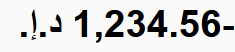

## Unicode Technical Standard #35

# Unicode Locale Data Markup Language (LDML)<br/>Part 9: Message Format

|Version|45 (draft)              |
|-------|------------------------|
|Editors|Addison Phillips and [other CLDR committee members](tr35.md#Acknowledgments)|

For the full header, summary, and status, see [Part 1: Core](tr35.md).

### _Summary_

This specification defines the data model, syntax, processing, and conformance requirements for the next generation of dynamic messages.

This is a partial document, describing only those parts of the LDML that are relevant for message format. For the other parts of the LDML see the [main LDML document](tr35.md) and the links above.

### _Status_

_This is a draft document which may be updated, replaced, or superseded by other documents at any time.
Publication does not imply endorsement by the Unicode Consortium.
This is not a stable document; it is inappropriate to cite this document as other than a work in progress._

<!-- _This document has been reviewed by Unicode members and other interested parties, and has been approved for publication by the Unicode Consortium.
This is a stable document and may be used as reference material or cited as a normative reference by other specifications._ -->

> _**A Unicode Technical Standard (UTS)** is an independent specification. Conformance to the Unicode Standard does not imply conformance to any UTS._

_Please submit corrigenda and other comments with the CLDR bug reporting form [[Bugs](tr35.md#Bugs)]. Related information that is useful in understanding this document is found in the [References](tr35.md#References). For the latest version of the Unicode Standard see [[Unicode](tr35.md#Unicode)]. For a list of current Unicode Technical Reports see [[Reports](tr35.md#Reports)]. For more information about versions of the Unicode Standard, see [[Versions](tr35.md#Versions)]._

## Parts

The LDML specification is divided into the following parts:

*   Part 1: [Core](tr35.md#Contents) (languages, locales, basic structure)
*   Part 2: [General](tr35-general.md#Contents) (display names & transforms, etc.)
*   Part 3: [Numbers](tr35-numbers.md#Contents) (number & currency formatting)
*   Part 4: [Dates](tr35-dates.md#Contents) (date, time, time zone formatting)
*   Part 5: [Collation](tr35-collation.md#Contents) (sorting, searching, grouping)
*   Part 6: [Supplemental](tr35-info.md#Contents) (supplemental data)
*   Part 7: [Keyboards](tr35-keyboards.md#Contents) (keyboard mappings)
*   Part 8: [Person Names](tr35-personNames.md#Contents) (person names)
*   Part 9: [MessageFormat](tr35-messageFormat.md#Contents) (message format)

## <a name="Contents">Contents of Part 9, Message Format</a>

* [Introduction](#introduction)
  * [Conformance](#conformance)
  * [Terminology and Conventions](#terminology-and-conventions)
  * [Stability Policy](#stability-policy)
* [Syntax](#syntax)
  * [Design Goals](#design-goals)
  * [Design Restrictions](#design-restrictions)
  * [Messages and their Syntax](#messages-and-their-syntax)
    * [Well-formed vs. Valid Messages](#well-formed-vs.-valid-messages)
  * [The Message](#the-message)
    * [Declarations](#declarations)
      * [Reserved Statements](#reserved-statements)
    * [Complex Body](#complex-body)
  * [Pattern](#pattern)
    * [Quoted Pattern](#quoted-pattern)
    * [Text](#text)
    * [Placeholder](#placeholder)
  * [Matcher](#matcher)
    * [Selector](#selector)
    * [Variant](#variant)
      * [Key](#key)
  * [Expressions](#expressions)
    * [Annotation](#annotation)
      * [Function](#function)
        * [Options](#options)
      * [Private-Use Annotations](#private-use-annotations)
      * [Reserved Annotations](#reserved-annotations)
  * [Markup](#markup)
  * [Attributes](#attributes)
  * [Other Syntax Elements](#other-syntax-elements)
    * [Keywords](#keywords)
    * [Literals](#literals)
    * [Names and Identifiers](#names-and-identifiers)
    * [Escape Sequences](#escape-sequences)
    * [Whitespace](#whitespace)
* [Complete ABNF](#complete-abnf)
  * [`message.abnf`](#message.abnf)
* [Errors](#errors)
  * [Error Handling](#error-handling)
  * [Syntax Errors](#syntax-errors)
  * [Data Model Errors](#data-model-errors)
    * [Variant Key Mismatch](#variant-key-mismatch)
    * [Missing Fallback Variant](#missing-fallback-variant)
    * [Missing Selector Annotation](#missing-selector-annotation)
    * [Duplicate Declaration](#duplicate-declaration)
    * [Duplicate Option Name](#duplicate-option-name)
  * [Resolution Errors](#resolution-errors)
    * [Unresolved Variable](#unresolved-variable)
    * [Unknown Function](#unknown-function)
    * [Unsupported Expression](#unsupported-expression)
    * [Invalid Expression](#invalid-expression)
    * [Unsupported Statement](#unsupported-statement)
  * [Selection Errors](#selection-errors)
  * [Formatting Errors](#formatting-errors)
* [Function Registry](#function-registry)
  * [Goals](#goals)
  * [Conformance and Use](#conformance-and-use)
  * [Registry Data Model](#registry-data-model)
  * [Example](#example)
  * [Default Registry](#default-registry)
    * [String Value Selection and Formatting](#string-value-selection-and-formatting)
      * [The `:string` function](#the-string-function)
        * [Operands](#operands)
        * [Options](#options)
        * [Selection](#selection)
        * [Formatting](#formatting)
    * [Numeric Value Selection and Formatting](#numeric-value-selection-and-formatting)
      * [The `:number` function](#the-number-function)
        * [Operands](#operands)
        * [Options](#options)
        * [Default Value of `select` Option](#default-value-of-select-option)
        * [Percent Style](#percent-style)
        * [Selection](#selection)
      * [The `:integer` function](#the-integer-function)
        * [Operands](#operands)
        * [Options](#options)
        * [Default Value of `select` Option](#default-value-of-select-option)
        * [Percent Style](#percent-style)
        * [Selection](#selection)
      * [Number Operands](#number-operands)
      * [Digit Size Options](#digit-size-options)
      * [Number Selection](#number-selection)
        * [Rule Selection](#rule-selection)
        * [Determining Exact Literal Match](#determining-exact-literal-match)
    * [Date and Time Value Formatting](#date-and-time-value-formatting)
      * [The `:datetime` function](#the-datetime-function)
        * [Operands](#operands)
        * [Options](#options)
      * [The `:date` function](#the-date-function)
        * [Operands](#operands)
        * [Options](#options)
      * [The `:time` function](#the-time-function)
        * [Operands](#operands)
        * [Options](#options)
      * [Date and Time Operands](#date-and-time-operands)
* [Formatting](#formatting)
  * [Formatting Context](#formatting-context)
  * [Expression and Markup Resolution](#expression-and-markup-resolution)
    * [Literal Resolution](#literal-resolution)
    * [Variable Resolution](#variable-resolution)
    * [Function Resolution](#function-resolution)
      * [Option Resolution](#option-resolution)
    * [Markup Resolution](#markup-resolution)
    * [Fallback Resolution](#fallback-resolution)
  * [Pattern Selection](#pattern-selection)
    * [Resolve Selectors](#resolve-selectors)
    * [Resolve Preferences](#resolve-preferences)
    * [Filter Variants](#filter-variants)
    * [Sort Variants](#sort-variants)
    * [Examples](#examples)
      * [Example 1](#example-1)
      * [Example 2](#example-2)
      * [Example 3](#example-3)
  * [Formatting](#formatting)
    * [Examples](#examples)
    * [Formatting Fallback Values](#formatting-fallback-values)
    * [Handling Bidirectional Text](#handling-bidirectional-text)
* [Interchange Data Model](#interchange-data-model)
  * [Messages](#messages)
  * [Patterns](#patterns)
  * [Expressions](#expressions)
  * [Markup](#markup)
  * [Extensions](#extensions)
* [Appendices](#appendices)
  * [Security Considerations](#security-considerations)
  * [Acknowledgements](#acknowledgements)

## Introduction

One of the challenges in adapting software to work for
users with different languages and cultures is the need for **_dynamic messages_**.
Whenever a user interface needs to present data as part of a larger string,
that data needs to be formatted (and the message may need to be altered)
to make it culturally accepted and grammatically correct.

> For example, if your US English (`en-US`) interface has a message like:
>
> > Your item had 1,023 views on April 3, 2023
>
> You want the translated message to be appropriately formatted into French:
>
> > Votre article a eu 1 023 vues le 3 avril 2023
>
> Or Japanese:
>
> > あなたのアイテムは 2023 年 4 月 3 日に 1,023 回閲覧されました。

This specification defines the
data model, syntax, processing, and conformance requirements
for the next generation of _dynamic messages_.
It is intended for adoption by programming languages and APIs.
This will enable the integration of
existing internationalization APIs (such as the date and number formats shown above),
grammatical matching (such as plurals or genders),
as well as user-defined formats and message selectors.

The document is the successor to ICU MessageFormat,
henceforth called ICU MessageFormat 1.0.

### Conformance

Everything in this specification is normative except for:
sections marked as non-normative,
all authoring guidelines, diagrams, examples, and notes.

The key words "MUST", "MUST NOT", "REQUIRED", "SHALL", "SHALL
NOT", "SHOULD", "SHOULD NOT", "RECOMMENDED", "NOT RECOMMENDED",
"MAY", and "OPTIONAL" in this document are to be interpreted as
described in BCP 14 \[[RFC2119](https://www.rfc-editor.org/rfc/rfc2119)\]
\[[RFC8174](https://www.rfc-editor.org/rfc/rfc8174)\] when, and only when, they
appear in all capitals, as shown here.

### Terminology and Conventions

A **_term_** looks like this when it is defined in this specification.

A reference to a _term_ looks like this.

> Examples are non-normative and styled like this.

### Stability Policy

> [!IMPORTANT]
> The provisions of the stability policy are not in effect until
> the conclusion of the technical preview and adoption of this specification.

Updates to this specification will not change
the syntactical meaning, the runtime output, or other behaviour
of valid messages written for earlier versions of this specification
that only use functions defined in this specification.
Updates to this specification will not remove any syntax provided in this version.
Future versions MAY add additional structure or meaning to existing syntax.

Updates to this specification will not remove any reserved keywords or sigils.

> [!NOTE]
> Future versions may define new keywords.

Updates to this specification will not reserve or assign meaning to
any character "sigils" except for those in the `reserved` production.

Updates to this specification
will not remove any functions defined in the default registry nor
will they remove any options or option values.
Additional options or option values MAY be defined.

> [!NOTE]
> This does not guarantee that the results of formatting will never change.
> Even when the specification doesn't change,
> the functions for date formatting, number formatting and so on
> will change their results over time.

Later specification versions MAY make previously invalid messages valid.

Updates to this specification will not introduce message syntax that,
when parsed according to earlier versions of this specification,
would produce syntax or data model errors.
Such messages MAY produce errors when formatted
according to an earlier version of this specification.

From version 2.0, MessageFormat will only reserve, define, or require
function names or function option names
consisting of characters in the ranges a-z, A-Z, and 0-9.
All other names in these categories are reserved for the use of implementations or users.

> [!NOTE]
> Users defining custom names SHOULD include at least one character outside these ranges
> to ensure that they will be compatible with future versions of this specification.

Later versions of this specification will not introduce changes
to the data model that would result in a data model representation
based on this version being invalid.

> For example, existing interfaces or fields will not be removed.

Later versions of this specification MAY introduce changes
to the data model that would result in future data model representations
not being valid for implementations of this version of the data model.

> For example, a future version could introduce a new keyword,
> whose data model representation would be a new interface
> that is not recognized by this version's data model.

Later specification versions will not introduce syntax that cannot be
represented by this version of the data model.

> For example, a future version could introduce a new keyword.
> The future version's data model would provide an interface for that keyword
> while this version of the data model would parse the value into
> the interface `UnsupportedStatement`.
> Both data models would be "valid" in their context,
> but this version's would be missing any functionality for the new statement type.

## Syntax

This section defines the formal grammar describing the syntax of a single message.

### Design Goals

_This section is non-normative._

The design goals of the syntax specification are as follows:

1. The syntax should leverage the familiarity with ICU MessageFormat 1.0
   in order to lower the barrier to entry and increase the chance of adoption.
   At the same time,
   the syntax should fix the [pain points of ICU MessageFormat 1.0](https://github.com/unicode-org/message-format-wg/blob/main/docs/why_mf_next.md).

   - _Non-Goal_: Be backwards-compatible with the ICU MessageFormat 1.0 syntax.

1. The syntax inside translatable content should be easy to understand for humans.
   This includes making it clear which parts of the message body _are_ translatable content,
   which parts inside it are placeholders for expressions,
   as well as making the selection logic predictable and easy to reason about.

   - _Non-Goal_: Make the syntax intuitive enough for non-technical translators to hand-edit.
     Instead, we assume that most translators will work with MessageFormat 2
     by means of GUI tooling, CAT workbenches etc.

1. The syntax surrounding translatable content should be easy to write and edit
   for developers, localization engineers, and easy to parse by machines.

1. The syntax should make a single message easily embeddable inside many container formats:
   `.properties`, YAML, XML, inlined as string literals in programming languages, etc.
   This includes a future _MessageResource_ specification.

   - _Non-Goal_: Support unnecessary escape sequences, which would theirselves require
     additional escaping when embedded. Instead, we tolerate direct use of nearly all
     characters (including line breaks, control characters, etc.) and rely upon escaping
     in those outer formats to aid human comprehension (e.g., depending upon container
     format, a U+000A LINE FEED might be represented as `\n`, `\012`, `\x0A`, `\u000A`,
     `\U0000000A`, `&#xA;`, `&NewLine;`, `%0A`, `<LF>`, or something else entirely).

### Design Restrictions

_This section is non-normative._

The syntax specification takes into account the following design restrictions:

1. Whitespace outside the translatable content should be insignificant.
   It should be possible to define a message entirely on a single line with no ambiguity,
   as well as to format it over multiple lines for clarity.

1. The syntax should define as few special characters and sigils as possible.
   Note that this necessitates extra care when presenting messages for human consumption,
   because they may contain invisible characters such as U+200B ZERO WIDTH SPACE,
   control characters such as U+0000 NULL and U+0009 TAB, permanently reserved noncharacters
   (U+FDD0 through U+FDEF and U+<i>n</i>FFFE and U+<i>n</i>FFFF where <i>n</i> is 0x0 through 0x10),
   private-use code points (U+E000 through U+F8FF, U+F0000 through U+FFFFD, and
   U+100000 through U+10FFFD), unassigned code points, and other potentially confusing content.

### Messages and their Syntax

The purpose of MessageFormat is to allow content to vary at runtime.
This variation might be due to placing a value into the content
or it might be due to selecting a different bit of content based on some data value
or it might be due to a combination of the two.

MessageFormat calls the template for a given formatting operation a _message_.

The values passed in at runtime (which are to be placed into the content or used
to select between different content items) are called _external variables_.
The author of a _message_ can also assign _local variables_, including
variables that modify _external variables_.

This part of the MessageFormat specification defines the syntax for a _message_,
along with the concepts and terminology needed when processing a _message_
during the [formatting](#formatting) of a _message_ at runtime.

The complete formal syntax of a _message_ is described by the [ABNF](#complete-abnf).

#### Well-formed vs. Valid Messages

A _message_ is **_<dfn>well-formed</dfn>_** if it satisfies all the rules of the grammar.
Attempting to parse a _message_ that is not _well-formed_ will result in a _Syntax Error_.

A _message_ is **_<dfn>valid</dfn>_** if it is _well-formed_ and
**also** meets the additional content restrictions
and semantic requirements about its structure defined below for
_declarations_, _matcher_ and _options_.
Attempting to parse a _message_ that is not _valid_ will result in a _Data Model Error_.

### The Message

A **_<dfn>message</dfn>_** is the complete template for a specific message formatting request.

> [!NOTE]
> This syntax is designed to be embeddable into many different programming languages and formats.
> As such, it avoids constructs, such as character escapes, that are specific to any given file
> format or processor.
> In particular, it avoids using quote characters common to many file formats and formal languages
> so that these do not need to be escaped in the body of a _message_.

> [!NOTE]
> In general (and except where required by the syntax), whitespace carries no meaning in the structure
> of a _message_. While many of the examples in this spec are written on multiple lines, the formatting
> shown is primarily for readability.
>
> > **Example** This _message_:
> >
> > ```
> > .local $foo   =   { |horse| }
> > {{You have a {$foo}!}}
> > ```
> >
> > Can also be written as:
> >
> > ```
> > .local $foo={|horse|}{{You have a {$foo}!}}
> > ```
> >
> > An exception to this is: whitespace inside a _pattern_ is **always** significant.

> [!NOTE]
> The syntax assumes that each _message_ will be displayed with a left-to-right display order
> and be processed in the logical character order.
> The syntax also permits the use of right-to-left characters in _identifiers_,
> _literals_, and other values.
> This can result in confusion when viewing the _message_.
>
> Additional restrictions or requirements,
> such as permitting the use of certain bidirectional control characters in the syntax,
> might be added during the Tech Preview to better manage bidirectional text.
> Feedback on the creation and management of _messages_
> containing bidirectional tokens is strongly desired.

A _message_ can be a _simple message_ or it can be a _complex message_.

```abnf
message = simple-message / complex-message
```

A **_<dfn>simple message</dfn>_** contains a single _pattern_,
with restrictions on its first character.
An empty string is a valid _simple message_.

```abnf
simple-message = [simple-start pattern]
simple-start   = simple-start-char / text-escape / placeholder
```

A **_<dfn>complex message</dfn>_** is any _message_ that contains _declarations_,
a _matcher_, or both.
A _complex message_ always begins with either a keyword that has a `.` prefix or a _quoted pattern_
and consists of:

1. an optional list of _declarations_, followed by
2. a _complex body_

```abnf
complex-message = *(declaration [s]) complex-body
```

#### Declarations

A **_<dfn>declaration</dfn>_** binds a _variable_ identifier to a value within the scope of a _message_.
This _variable_ can then be used in other _expressions_ within the same _message_.
_Declarations_ are optional: many messages will not contain any _declarations_.

An **_<dfn>input-declaration</dfn>_** binds a _variable_ to an external input value.
The _variable-expression_ of an _input-declaration_
MAY include an _annotation_ that is applied to the external value.

A **_<dfn>local-declaration</dfn>_** binds a _variable_ to the resolved value of an _expression_.

For compatibility with later MessageFormat 2 specification versions,
_declarations_ MAY also include _reserved statements_.

```abnf
declaration       = input-declaration / local-declaration / reserved-statement
input-declaration = input [s] variable-expression
local-declaration = local s variable [s] "=" [s] expression
```

_Variables_, once declared, MUST NOT be redeclared.
A _message_ that does any of the following is not _valid_ and will produce a
_Duplicate Declaration_ error during processing:
- A _declaration_ MUST NOT bind a _variable_
  that appears as a _variable_ anywhere within a previous _declaration_.
- An _input-declaration_ MUST NOT bind a _variable_
  that appears anywhere within the _annotation_ of its _variable-expression_.
- A _local-declaration_ MUST NOT bind a _variable_ that appears in its _expression_.

A _local-declaration_ MAY overwrite an external input value as long as the
external input value does not appear in a previous _declaration_.

> [!NOTE]
> These restrictions only apply to _declarations_.
> A _placeholder_ or _selector_ can apply a different annotation to a _variable_
> than one applied to the same _variable_ named in a _declaration_.
> For example, this message is _valid_:
> ```
> .input {$var :number maximumFractionDigits=0}
> .match {$var :number maximumFractionDigits=2}
> 0 {{The selector can apply a different annotation to {$var} for the purposes of selection}}
> * {{A placeholder in a pattern can apply a different annotation to {$var :number maximumFractionDigits=3}}}
> ```
> (See the [Errors](#errors) section for examples of invalid messages)

##### Reserved Statements

A **_<dfn>reserved statement</dfn>_** reserves additional `.keywords`
for use by future versions of this specification.
Any such future keyword must start with `.`,
followed by two or more lower-case ASCII characters.

The rest of the statement supports
a similarly wide range of content as _reserved annotations_,
but it MUST end with one or more _expressions_.

```abnf
reserved-statement = reserved-keyword [s reserved-body] 1*([s] expression)
reserved-keyword   = "." name
```

> [!NOTE]
> The `reserved-keyword` ABNF rule is a simplification,
> as it MUST NOT be considered to match any of the existing keywords
> `.input`, `.local`, or `.match`.

This allows flexibility in future standardization,
as future definitions MAY define additional semantics and constraints
on the contents of these _reserved statements_.

Implementations MUST NOT assign meaning or semantics to a _reserved statement_:
these are reserved for future standardization.
Implementations MUST NOT remove or alter the contents of a _reserved statement_.

#### Complex Body

The **_<dfn>complex body</dfn>_** of a _complex message_ is the part that will be formatted.
The _complex body_ consists of either a _quoted pattern_ or a _matcher_.

```abnf
complex-body = quoted-pattern / matcher
```

### Pattern

A **_<dfn>pattern</dfn>_** contains a sequence of _text_ and _placeholders_ to be formatted as a unit.
Unless there is an error, resolving a _message_ always results in the formatting
of a single _pattern_.

```abnf
pattern = *(text-char / text-escape / placeholder)
```
A _pattern_ MAY be empty.

A _pattern_ MAY contain an arbitrary number of _placeholders_ to be evaluated
during the formatting process.

#### Quoted Pattern

A **_<dfn>quoted pattern</dfn>_** is a _pattern_ that is "quoted" to prevent
interference with other parts of the _message_.
A _quoted pattern_ starts with a sequence of two U+007B LEFT CURLY BRACKET `{{`
and ends with a sequence of two U+007D RIGHT CURLY BRACKET `}}`.

```abnf
quoted-pattern = "{{" pattern "}}"
```

A _quoted pattern_ MAY be empty.

> An empty _quoted pattern_:
>
> ```
> {{}}
> ```

#### Text

**_<dfn>text</dfn>_** is the translateable content of a _pattern_.
Any Unicode code point is allowed, except for U+0000 NULL
and the surrogate code points U+D800 through U+DFFF inclusive.
The characters U+005C REVERSE SOLIDUS `\`,
U+007B LEFT CURLY BRACKET `{`, and U+007D RIGHT CURLY BRACKET `}`
MUST be escaped as `\\`, `\{`, and `\}` respectively.

In the ABNF, _text_ is represented by non-empty sequences of
`simple-start-char`, `text-char`, and `text-escape`.
The first of these is used at the start of a _simple message_,
and matches `text-char` except for not allowing U+002E FULL STOP `.`.
The ABNF uses `content-char` as a shared base for _text_ and _quoted literal_ characters.

Whitespace in _text_, including tabs, spaces, and newlines is significant and MUST
be preserved during formatting.

```abnf
simple-start-char = content-char / s / "@" / "|"
text-char         = content-char / s / "." / "@" / "|"
quoted-char       = content-char / s / "." / "@" / "{" / "}"
reserved-char     = content-char / "."
content-char      = %x01-08        ; omit NULL (%x00), HTAB (%x09) and LF (%x0A)
                  / %x0B-0C        ; omit CR (%x0D)
                  / %x0E-1F        ; omit SP (%x20)
                  / %x21-2D        ; omit . (%x2E)
                  / %x2F-3F        ; omit @ (%x40)
                  / %x41-5B        ; omit \ (%x5C)
                  / %x5D-7A        ; omit { | } (%x7B-7D)
                  / %x7E-2FFF      ; omit IDEOGRAPHIC SPACE (%x3000)
                  / %x3001-D7FF    ; omit surrogates
                  / %xE000-10FFFF
```

When a _pattern_ is quoted by embedding the _pattern_ in curly brackets, the
resulting _message_ can be embedded into
various formats regardless of the container's whitespace trimming rules.
Otherwise, care must be taken to ensure that pattern-significant whitespace is preserved.

> **Example**
> In a Java `.properties` file, the values `hello` and `hello2` both contain
> an identical _message_ which consists of a single _pattern_.
> This _pattern_ consists of _text_ with exactly three spaces before and after the word "Hello":
>
> ```properties
> hello = {{   Hello   }}
> hello2=\   Hello  \
> ```

#### Placeholder

A **_<dfn>placeholder</dfn>_** is an _expression_ or _markup_ that appears inside of a _pattern_
and which will be replaced during the formatting of a _message_.

```abnf
placeholder = expression / markup
```

### Matcher

A **_<dfn>matcher</dfn>_** is the _complex body_ of a _message_ that allows runtime selection
of the _pattern_ to use for formatting.
This allows the form or content of a _message_ to vary based on values
determined at runtime.

A _matcher_ consists of the keyword `.match` followed by at least one _selector_
and at least one _variant_.

When the _matcher_ is processed, the result will be a single _pattern_ that serves
as the template for the formatting process.

A _message_ can only be considered _valid_ if the following requirements are
satisfied:

- The number of _keys_ on each _variant_ MUST be equal to the number of _selectors_.
- At least one _variant_ MUST exist whose _keys_ are all equal to the "catch-all" key `*`.
- Each _selector_ MUST have an _annotation_,
  or contain a _variable_ that directly or indirectly references a _declaration_ with an _annotation_.

```abnf
matcher         = match-statement 1*([s] variant)
match-statement = match 1*([s] selector)
```

> A _message_ with a _matcher_:
>
> ```
> .input {$count :number}
> .match {$count}
> one {{You have {$count} notification.}}
> *   {{You have {$count} notifications.}}
> ```

> A _message_ containing a _matcher_ formatted on a single line:
>
> ```
> .match {:platform} windows {{Settings}} * {{Preferences}}
> ```

#### Selector

A **_<dfn>selector</dfn>_** is an _expression_ that ranks or excludes the
_variants_ based on the value of the corresponding _key_ in each _variant_.
The combination of _selectors_ in a _matcher_ thus determines
which _pattern_ will be used during formatting.

```abnf
selector = expression
```

There MUST be at least one _selector_ in a _matcher_.
There MAY be any number of additional _selectors_.

> A _message_ with a single _selector_ that uses a custom _function_
> `:hasCase` which is a _selector_ that allows the _message_ to choose a _pattern_
> based on grammatical case:
>
> ```
> .match {$userName :hasCase}
> vocative {{Hello, {$userName :person case=vocative}!}}
> accusative {{Please welcome {$userName :person case=accusative}!}}
> * {{Hello!}}
> ```

> A message with two _selectors_:
>
> ```
> .input {$numLikes :integer}
> .input {$numShares :integer}
> .match {$numLikes} {$numShares}
> 0   0   {{Your item has no likes and has not been shared.}}
> 0   one {{Your item has no likes and has been shared {$numShares} time.}}
> 0   *   {{Your item has no likes and has been shared {$numShares} times.}}
> one 0   {{Your item has {$numLikes} like and has not been shared.}}
> one one {{Your item has {$numLikes} like and has been shared {$numShares} time.}}
> one *   {{Your item has {$numLikes} like and has been shared {$numShares} times.}}
> *   0   {{Your item has {$numLikes} likes and has not been shared.}}
> *   one {{Your item has {$numLikes} likes and has been shared {$numShares} time.}}
> *   *   {{Your item has {$numLikes} likes and has been shared {$numShares} times.}}
> ```

#### Variant

A **_<dfn>variant</dfn>_** is a _quoted pattern_ associated with a set of _keys_ in a _matcher_.
Each _variant_ MUST begin with a sequence of _keys_,
and terminate with a valid _quoted pattern_.
The number of _keys_ in each _variant_ MUST match the number of _selectors_ in the _matcher_.

Each _key_ is separated from each other by whitespace.
Whitespace is permitted but not required between the last _key_ and the _quoted pattern_.

```abnf
variant = key *(s key) [s] quoted-pattern
key     = literal / "*"
```

##### Key

A **_<dfn>key</dfn>_** is a value in a _variant_ for use by a _selector_ when ranking
or excluding _variants_ during the _matcher_ process.
A _key_ can be either a _literal_ value or the "catch-all" key `*`.

The **_<dfn>catch-all key</dfn>_** is a special key, represented by `*`,
that matches all values for a given _selector_.

### Expressions

An **_<dfn>expression</dfn>_** is a part of a _message_ that will be determined
during the _message_'s formatting.

An _expression_ MUST begin with U+007B LEFT CURLY BRACKET `{`
and end with U+007D RIGHT CURLY BRACKET `}`.
An _expression_ MUST NOT be empty.
An _expression_ cannot contain another _expression_.
An _expression_ MAY contain one more _attributes_.

A **_<dfn>literal-expression</dfn>_** contains a _literal_,
optionally followed by an _annotation_.

A **_<dfn>variable-expression</dfn>_** contains a _variable_,
optionally followed by an _annotation_.

An **_<dfn>annotation-expression</dfn>_** contains an _annotation_ without an _operand_.

```abnf
expression            = literal-expression
                      / variable-expression
                      / annotation-expression
literal-expression    = "{" [s] literal [s annotation] *(s attribute) [s] "}"
variable-expression   = "{" [s] variable [s annotation] *(s attribute) [s] "}"
annotation-expression = "{" [s] annotation *(s attribute) [s] "}"
```

There are several types of _expression_ that can appear in a _message_.
All _expressions_ share a common syntax. The types of _expression_ are:

1. The value of a _local-declaration_
2. A _selector_
3. A kind of _placeholder_ in a _pattern_

Additionally, an _input-declaration_ can contain a _variable-expression_.

> Examples of different types of _expression_
>
> Declarations:
>
> ```
> .input {$x :function option=value}
> .local $y = {|This is an expression|}
> ```
>
> Selectors:
>
> ```
> .match {$selector :functionRequired}
> ```
>
> Placeholders:
>
> ```
> This placeholder contains a literal expression: {|literal|}
> This placeholder contains a variable expression: {$variable}
> This placeholder references a function on a variable: {$variable :function with=options}
> This placeholder contains a function expression with a variable-valued option: {:function option=$variable}
> ```

#### Annotation

An **_<dfn>annotation</dfn>_** is part of an _expression_ containing either
a _function_ together with its associated _options_, or
a _private-use annotation_ or a _reserved annotation_.

```abnf
annotation = function
           / private-use-annotation
           / reserved-annotation
```

An **_<dfn>operand</dfn>_** is the _literal_ of a _literal-expression_ or
the _variable_ of a _variable-expression_.

An _annotation_ can appear in an _expression_ by itself or following a single _operand_.
When following an _operand_, the _operand_ serves as input to the _annotation_.

##### Function

A **_<dfn>function</dfn>_** is named functionality in an _annotation_.
_Functions_ are used to evaluate, format, select, or otherwise process data
values during formatting.

Each _function_ is defined by the runtime's _function registry_.
A _function_'s entry in the _function registry_ will define
whether the _function_ is a _selector_ or formatter (or both),
whether an _operand_ is required,
what form the values of an _operand_ can take,
what _options_ and _option_ values are valid,
and what outputs might result.
See [function registry](#function-registry) for more information.

A _function_ starts with a prefix sigil `:` followed by an _identifier_.
The _identifier_ MAY be followed by one or more _options_.
_Options_ are not required.

```abnf
function = ":" identifier *(s option)
```

> A _message_ with a _function_ operating on the _variable_ `$now`:
>
> ```
> It is now {$now :datetime}.
> ```

###### Options

An **_<dfn>option</dfn>_** is a key-value pair
containing a named argument that is passed to a _function_.

An _option_ has an _identifier_ and a _value_.
The _identifier_ is separated from the _value_ by an U+003D EQUALS SIGN `=` along with
optional whitespace.
The value of an _option_ can be either a _literal_ or a _variable_.

Multiple _options_ are permitted in an _annotation_.
_Options_ are separated from the preceding _function_ _identifier_
and from each other by whitespace.
Each _option_'s _identifier_ MUST be unique within the _annotation_:
an _annotation_ with duplicate _option_ _identifiers_ is not valid.

The order of _options_ is not significant.

```abnf
option = identifier [s] "=" [s] (literal / variable)
```

> Examples of _functions_ with _options_
>
> A _message_ using the `:datetime` function.
> The _option_ `weekday` has the literal `long` as its value:
>
> ```
> Today is {$date :datetime weekday=long}!
> ```

> A _message_ using the `:datetime` function.
> The _option_ `weekday` has a variable `$dateStyle` as its value:
>
> ```
> Today is {$date :datetime weekday=$dateStyle}!
> ```

##### Private-Use Annotations

A **_<dfn>private-use annotation</dfn>_** is an _annotation_ whose syntax is reserved
for use by a specific implementation or by private agreement between multiple implementations.
Implementations MAY define their own meaning and semantics for _private-use annotations_.

A _private-use annotation_ starts with either U+0026 AMPERSAND `&` or U+005E CIRCUMFLEX ACCENT `^`.

Characters, including whitespace, are assigned meaning by the implementation.
The definition of escapes in the `reserved-body` production, used for the body of
a _private-use annotation_ is an affordance to implementations that
wish to use a syntax exactly like other functions. Specifically:

- The characters `\`, `{`, and `}` MUST be escaped as `\\`, `\{`, and `\}` respectively
  when they appear in the body of a _private-use annotation_.
- The character `|` is special: it SHOULD be escaped as `\|` in a _private-use annotation_,
  but can appear unescaped as long as it is paired with another `|`.
  This is an affordance to allow _literals_ to appear in the private use syntax.

A _private-use annotation_ MAY be empty after its introducing sigil.

```abnf
private-use-annotation = private-start [[s] reserved-body]
private-start          = "^" / "&"
```

> [!NOTE]
> Users are cautioned that _private-use annotations_ cannot be reliably exchanged
> and can result in errors during formatting.
> It is generally a better idea to use the function registry
> to define additional formatting or annotation options.

> Here are some examples of what _private-use_ sequences might look like:
>
> ```
> Here's private use with an operand: {$foo &bar}
> Here's a placeholder that is entirely private-use: {&anything here}
> Here's a private-use function that uses normal function syntax: {$operand ^foo option=|literal|}
> The character \| has to be paired or escaped: {&private || |something between| or isolated: \| }
> Stop {& "translate 'stop' as a verb" might be a translator instruction or comment }
> Protect stuff in {^ph}<a>{^/ph}private use{^ph}</a>{^/ph}
> ```

##### Reserved Annotations

A **_<dfn>reserved annotation</dfn>_** is an _annotation_ whose syntax is reserved
for future standardization.

A _reserved annotation_ starts with a reserved character.
The remaining part of a _reserved annotation_, called a _reserved body_,
MAY be empty or contain arbitrary text that starts and ends with
a non-whitespace character.

This allows maximum flexibility in future standardization,
as future definitions MAY define additional semantics and constraints
on the contents of these _annotations_.

Implementations MUST NOT assign meaning or semantics to
an _annotation_ starting with `reserved-annotation-start`:
these are reserved for future standardization.
Whitespace before or after a _reserved body_ is not part of the _reserved body_.
Implementations MUST NOT remove or alter the contents of a _reserved body_,
including any interior whitespace,
but MAY remove or alter whitespace before or after the _reserved body_.

While a reserved sequence is technically "well-formed",
unrecognized _reserved-annotations_ or _private-use-annotations_ have no meaning.

```abnf
reserved-annotation       = reserved-annotation-start [[s] reserved-body]
reserved-annotation-start = "!" / "%" / "*" / "+" / "<" / ">" / "?" / "~"

reserved-body             = reserved-body-part *([s] reserved-body-part)
reserved-body-part        = reserved-char / reserved-escape / quoted
```

### Markup

**_<dfn>Markup</dfn>_** _placeholders_ are _pattern_ parts
that can be used to represent non-language parts of a _message_,
such as inline elements or styling that should apply to a span of parts.

_Markup_ MUST begin with U+007B LEFT CURLY BRACKET `{`
and end with U+007D RIGHT CURLY BRACKET `}`.
_Markup_ MAY contain one more _attributes_.

_Markup_ comes in three forms:

**_<dfn>Markup-open</dfn>_** starts with U+0023 NUMBER SIGN `#` and
represents an opening element within the _message_,
such as markup used to start a span.
It MAY include _options_.

**_<dfn>Markup-standalone</dfn>_** starts with U+0023 NUMBER SIGN `#`
and has a U+002F SOLIDUS `/` immediately before its closing `}`
representing a self-closing or standalone element within the _message_.
It MAY include _options_.

**_<dfn>Markup-close</dfn>_** starts with U+002F SOLIDUS `/` and
is a _pattern_ part ending a span.

```abnf
markup = "{" [s] "#" identifier *(s option) *(s attribute) [s] ["/"] "}"  ; open and standalone
       / "{" [s] "/" identifier *(s option) *(s attribute) [s] "}"  ; close
```

> A _message_ with one `button` markup span and a standalone `img` markup element:
>
> ```
> {#button}Submit{/button} or {#img alt=|Cancel| /}.
> ```

> A _message_ with attributes in the closing tag:
>
> ```
> {#ansi attr=|bold,italic|}Bold and italic{/ansi attr=|bold|} italic only {/ansi attr=|italic|} no formatting.}
> ```

A _markup-open_ can appear without a corresponding _markup-close_.
A _markup-close_ can appear without a corresponding _markup-open_.
_Markup_ _placeholders_ can appear in any order without making the _message_ invalid.
However, specifications or implementations defining _markup_ might impose requirements
on the pairing, ordering, or contents of _markup_ during _formatting_.

### Attributes

**_Attributes_ are reserved for standardization by future versions of this specification.**
Examples in this section are meant to be illustrative and
might not match future requirements or usage.

> [!NOTE]
> The Tech Preview does not provide a built-in mechanism for overriding
> values in the _formatting context_ (most notably the locale)
> Nor does it provide a mechanism for identifying specific expressions
> such as by assigning a name or id.
> The utility of these types of mechanisms has been debated.
> There are at least two proposed mechanisms for implementing support for
> these.
> Specifically, one mechanism would be to reserve specifically-named options,
> possibly using a Unicode namespace (i.e. `locale=xxx` or `u:locale=xxx`).
> Such options would be reserved for use in any and all functions or markup.
> The other mechanism would be to use the reserved "expression attribute" syntax
> for this purpose (i.e. `@locale=xxx` or `@id=foo`)
> Neither mechanism was included in this Tech Preview.
> Feedback on the preferred mechanism for managing these features
> is strongly desired.
>
> In the meantime, function authors and other implementers are cautioned to avoid creating
> function-specific or implementation-specific option values for this purpose.
> One workaround would be to use the implementation's namespace for these
> features to insure later interoperability when such a mechanism is finalized
> during the Tech Preview period.
> Specifically:
> - Avoid specifying an option for setting the locale of an expression as different from
>   that of the overall _message_ locale, or use a namespace that later maps to the final
>   mechanism.
> - Avoid specifying options for the purpose of linking placeholders
>   (such as to pair opening markup to closing markup).
>   If such an option is created, the implementer should use an
>   implementation-specific namespace.
>   Users and implementers are cautioned that such options might be
>   replaced with a standard mechanism in a future version.
> - Avoid specifying generic options to communicate with translators and
>   translation tooling (i.e. implementation-specific options that apply to all
>   functions.
> The above are all desirable features.
> We welcome contributions to and proposals for such features during the
> Technical Preview.

An **_<dfn>attribute</dfn>_** is an _identifier_ with an optional value
that appears in an _expression_ or in _markup_.

_Attributes_ are prefixed by a U+0040 COMMERCIAL AT `@` sign,
followed by an _identifier_.
An _attribute_ MAY have a _value_ which is separated from the _identifier_
by an U+003D EQUALS SIGN `=` along with optional whitespace.
The _value_ of an _attribute_ can be either a _literal_ or a _variable_.

Multiple _attributes_ are permitted in an _expression_ or _markup_.
Each _attribute_ is separated by whitespace.

The order of _attributes_ is not significant.


```abnf
attribute = "@" identifier [[s] "=" [s] (literal / variable)]
```

> Examples of _expressions_ and _markup_ with _attributes_:
>
> A _message_ including a _literal_ that should not be translated:
>
> ```
> In French, "{|bonjour| @translate=no}" is a greeting
> ```
>
> A _message_ with _markup_ that should not be copied:
>
> ```
> Have a {#span @can-copy}great and wonderful{/span @can-copy} birthday!
> ```

### Other Syntax Elements

This section defines common elements used to construct _messages_.

#### Keywords

A **_<dfn>keyword</dfn>_** is a reserved token that has a unique meaning in the _message_ syntax.

The following three keywords are defined: `.input`, `.local`, and `.match`.
Keywords are always lowercase and start with U+002E FULL STOP `.`.

```abnf
input = %s".input"
local = %s".local"
match = %s".match"
```

#### Literals

A **_<dfn>literal</dfn>_** is a character sequence that appears outside
of _text_ in various parts of a _message_.
A _literal_ can appear
as a _key_ value,
as the _operand_ of a _literal-expression_,
or in the value of an _option_.
A _literal_ MAY include any Unicode code point
except for U+0000 NULL or the surrogate code points U+D800 through U+DFFF.

All code points are preserved.

A **_<dfn>quoted</dfn>_** literal begins and ends with U+005E VERTICAL BAR `|`.
The characters `\` and `|` within a _quoted_ literal MUST be
escaped as `\\` and `\|`.

An **_<dfn>unquoted</dfn>_** literal is a _literal_ that does not require the `|`
quotes around it to be distinct from the rest of the _message_ syntax.
An _unquoted_ MAY be used when the content of the _literal_
contains no whitespace and otherwise matches the `unquoted` production.
Any _unquoted_ literal MAY be _quoted_.
Implementations MUST NOT distinguish between _quoted_ and _unquoted_ literals
that have the same sequence of code points.

_Unquoted_ literals can contain a _name_ or consist of a _number-literal_.
A _number-literal_ uses the same syntax as JSON and is intended for the encoding
of number values in _operands_ or _options_, or as _keys_ for _variants_.

```abnf
literal        = quoted / unquoted
quoted         = "|" *(quoted-char / quoted-escape) "|"
unquoted       = name / number-literal
number-literal = ["-"] (%x30 / (%x31-39 *DIGIT)) ["." 1*DIGIT] [%i"e" ["-" / "+"] 1*DIGIT]
```

#### Names and Identifiers

An **_<dfn>identifier</dfn>_** is a character sequence that
identifies a _function_, _markup_, or _option_.
Each _identifier_ consists of a _name_ optionally preceeded by
a _namespace_.
When present, the _namespace_ is separated from the _name_ by a
U+003A COLON `:`.
Built-in _functions_ and their _options_ do not have a _namespace_ identifier.

The _namespace_ `u` (U+0075 LATIN SMALL LETTER U)
is reserved for future standardization.

_Function_ _identifiers_ are prefixed with `:`.
_Markup_ _identifiers_ are prefixed with `#` or `/`.
_Option_ _identifiers_ have no prefix.

A **_<dfn>name</dfn>_** is a character sequence used in an _identifier_
or as the name for a _variable_
or the value of an _unquoted_ _literal_.

_Variable_ names are prefixed with `$`.

Valid content for _names_ is based on <cite>Namespaces in XML 1.0</cite>'s
[NCName](https://www.w3.org/TR/xml-names/#NT-NCName).
This is different from XML's [Name](https://www.w3.org/TR/xml/#NT-Name)
in that it MUST NOT contain a U+003A COLON `:`.
Otherwise, the set of characters allowed in a _name_ is large.

> [!NOTE]
> _External variables_ can be passed in that are not valid _names_.
> Such variables cannot be referenced in a _message_,
> but are not otherwise errors.

Examples:
> A variable:
>```
> This has a {$variable}
>```
> A function:
> ```
> This has a {:function}
> ```
> An add-on function from the `icu` namespace:
> ```
> This has a {:icu:function}
> ```
> An option and an add-on option:
> ```
> This has {:options option=value icu:option=add_on}
> ```

Support for _namespaces_ and their interpretation is implementation-defined
in this release.

```abnf
variable   = "$" name
option     = identifier [s] "=" [s] (literal / variable)

identifier = [namespace ":"] name
namespace  = name
name       = name-start *name-char
name-start = ALPHA / "_"
           / %xC0-D6 / %xD8-F6 / %xF8-2FF
           / %x370-37D / %x37F-1FFF / %x200C-200D
           / %x2070-218F / %x2C00-2FEF / %x3001-D7FF
           / %xF900-FDCF / %xFDF0-FFFC / %x10000-EFFFF
name-char  = name-start / DIGIT / "-" / "."
           / %xB7 / %x300-36F / %x203F-2040
```

#### Escape Sequences

An **_<dfn>escape sequence</dfn>_** is a two-character sequence starting with
U+005C REVERSE SOLIDUS `\`.

An _escape sequence_ allows the appearance of lexically meaningful characters
in the body of _text_, _quoted_, or _reserved_ (which includes, in this case,
_private-use_) sequences respectively:

```abnf
text-escape     = backslash ( backslash / "{" / "}" )
quoted-escape   = backslash ( backslash / "|" )
reserved-escape = backslash ( backslash / "{" / "|" / "}" )
backslash       = %x5C ; U+005C REVERSE SOLIDUS "\"
```

#### Whitespace

**_<dfn>Whitespace</dfn>_** is defined as one or more of
U+0009 CHARACTER TABULATION (tab),
U+000A LINE FEED (new line),
U+000D CARRIAGE RETURN,
U+3000 IDEOGRAPHIC SPACE,
or U+0020 SPACE.

Inside _patterns_ and _quoted literals_,
whitespace is part of the content and is recorded and stored verbatim.
Whitespace is not significant outside translatable text, except where required by the syntax.

> [!NOTE]
> The character U+3000 IDEOGRAPHIC SPACE is included in whitespace for
> compatibility with certain East Asian keyboards and input methods,
> in which users might accidentally create these characters in a _message_.

```abnf
s = 1*( SP / HTAB / CR / LF / %x3000 )
```

## Complete ABNF

The grammar below uses the ABNF notation [[STD68](https://www.rfc-editor.org/info/std68)],
including the modifications found in [RFC 7405](https://www.rfc-editor.org/rfc/rfc7405).

RFC7405 defines a variation of ABNF that is case-sensitive.
Some ABNF tools are only compatible with the specification found in
[RFC 5234](https://www.rfc-editor.org/rfc/rfc5234).
To make `message.abnf` compatible with that version of ABNF, replace
the rules of the same name with this block:

```abnf
input = %x2E.69.6E.70.75.74  ; ".input"
local = %x2E.6C.6F.63.61.6C  ; ".local"
match = %x2E.6D.61.74.63.68  ; ".match"
```

### `message.abnf`

```abnf
message           = simple-message / complex-message

simple-message    = [simple-start pattern]
simple-start      = simple-start-char / text-escape / placeholder
pattern           = *(text-char / text-escape / placeholder)
placeholder       = expression / markup

complex-message   = *(declaration [s]) complex-body
declaration       = input-declaration / local-declaration / reserved-statement
complex-body      = quoted-pattern / matcher

input-declaration = input [s] variable-expression
local-declaration = local s variable [s] "=" [s] expression

quoted-pattern    = "{{" pattern "}}"

matcher           = match-statement 1*([s] variant)
match-statement   = match 1*([s] selector)
selector          = expression
variant           = key *(s key) [s] quoted-pattern
key               = literal / "*"

; Expressions
expression            = literal-expression
                      / variable-expression
                      / annotation-expression
literal-expression    = "{" [s] literal [s annotation] *(s attribute) [s] "}"
variable-expression   = "{" [s] variable [s annotation] *(s attribute) [s] "}"
annotation-expression = "{" [s] annotation *(s attribute) [s] "}"

annotation            = function
                      / private-use-annotation
                      / reserved-annotation

markup = "{" [s] "#" identifier *(s option) *(s attribute) [s] ["/"] "}"  ; open and standalone
       / "{" [s] "/" identifier *(s option) *(s attribute) [s] "}"  ; close

; Expression and literal parts
function       = ":" identifier *(s option)
option         = identifier [s] "=" [s] (literal / variable)
; Attributes are reserved for future standardization
attribute      = "@" identifier [[s] "=" [s] (literal / variable)]

variable       = "$" name
literal        = quoted / unquoted
quoted         = "|" *(quoted-char / quoted-escape) "|"
unquoted       = name / number-literal
; number-literal matches JSON number (https://www.rfc-editor.org/rfc/rfc8259#section-6)
number-literal = ["-"] (%x30 / (%x31-39 *DIGIT)) ["." 1*DIGIT] [%i"e" ["-" / "+"] 1*DIGIT]

; Keywords; Note that these are case-sensitive
input = %s".input"
local = %s".local"
match = %s".match"

; Reserve additional .keywords for use by future versions of this specification.
reserved-statement = reserved-keyword [s reserved-body] 1*([s] expression)
; Note that the following production is a simplification,
; as this rule MUST NOT be considered to match existing keywords
; (`.input`, `.local`, and `.match`).
reserved-keyword   = "." name

; Reserve additional sigils for use by future versions of this specification.
reserved-annotation       = reserved-annotation-start [[s] reserved-body]
reserved-annotation-start = "!" / "%" / "*" / "+" / "<" / ">" / "?" / "~"

; Reserve sigils for private-use by implementations.
private-use-annotation    = private-start [[s] reserved-body]
private-start             = "^" / "&"
reserved-body             = reserved-body-part *([s] reserved-body-part)
reserved-body-part        = reserved-char / reserved-escape / quoted

; Names and identifiers
; identifier matches https://www.w3.org/TR/REC-xml-names/#NT-QName
; name matches https://www.w3.org/TR/REC-xml-names/#NT-NCName
identifier = [namespace ":"] name
namespace  = name
name       = name-start *name-char
name-start = ALPHA / "_"
           / %xC0-D6 / %xD8-F6 / %xF8-2FF
           / %x370-37D / %x37F-1FFF / %x200C-200D
           / %x2070-218F / %x2C00-2FEF / %x3001-D7FF
           / %xF900-FDCF / %xFDF0-FFFC / %x10000-EFFFF
name-char  = name-start / DIGIT / "-" / "."
           / %xB7 / %x300-36F / %x203F-2040

; Restrictions on characters in various contexts
simple-start-char = content-char / s / "@" / "|"
text-char         = content-char / s / "." / "@" / "|"
quoted-char       = content-char / s / "." / "@" / "{" / "}"
reserved-char     = content-char / "."
content-char      = %x01-08        ; omit NULL (%x00), HTAB (%x09) and LF (%x0A)
                  / %x0B-0C        ; omit CR (%x0D)
                  / %x0E-1F        ; omit SP (%x20)
                  / %x21-2D        ; omit . (%x2E)
                  / %x2F-3F        ; omit @ (%x40)
                  / %x41-5B        ; omit \ (%x5C)
                  / %x5D-7A        ; omit { | } (%x7B-7D)
                  / %x7E-2FFF      ; omit IDEOGRAPHIC SPACE (%x3000)
                  / %x3001-D7FF    ; omit surrogates
                  / %xE000-10FFFF

; Character escapes
text-escape     = backslash ( backslash / "{" / "}" )
quoted-escape   = backslash ( backslash / "|" )
reserved-escape = backslash ( backslash / "{" / "|" / "}" )
backslash       = %x5C ; U+005C REVERSE SOLIDUS "\"

; Whitespace
s = 1*( SP / HTAB / CR / LF / %x3000 )
```

## Errors

Errors in messages and their formatting MAY occur and be detected
at different stages of processing.
Where available,
the use of validation tools is recommended,
as early detection of errors makes their correction easier.

### Error Handling

_Syntax Errors_ and _Data Model Errors_ apply to all message processors,
and MUST be emitted as soon as possible.
The other error categories are only emitted during formatting,
but it might be possible to detect them with validation tools.

During selection, an _expression_ handler MUST only emit _Resolution Errors_ and _Selection Errors_.
During formatting, an _expression_ handler MUST only emit _Resolution Errors_ and _Formatting Errors_.

_Resolution Errors_ and _Formatting Errors_ in _expressions_ that are not used
in _pattern selection_ or _formatting_ MAY be ignored,
as they do not affect the output of the formatter.

In all cases, when encountering a runtime error,
a message formatter MUST provide some representation of the message.
An informative error or errors MUST also be separately provided.

When a message contains more than one error,
or contains some error which leads to further errors,
an implementation which does not emit all of the errors
SHOULD prioritise _Syntax Errors_ and _Data Model Errors_ over others.

When an error occurs within a _selector_,
the _selector_ MUST NOT match any _variant_ _key_ other than the catch-all `*`
and a _Resolution Error_ or a _Selection Error_ MUST be emitted.

### Syntax Errors

**_<dfn>Syntax Errors</dfn>_** occur when the syntax representation of a message is not well-formed.

> Example invalid messages resulting in a _Syntax Error_:
>
> ```
> {{Missing end braces
> ```
>
> ```
> {{Missing one end brace}
> ```
>
> ```
> Unknown {{expression}}
> ```
>
> ```
> .local $var = {|no message body|}
> ```

### Data Model Errors

**_<dfn>Data Model Errors</dfn>_** occur when a message is invalid due to
violating one of the semantic requirements on its structure.

#### Variant Key Mismatch

A **_<dfn>Variant Key Mismatch</dfn>_** occurs when the number of keys on a _variant_
does not equal the number of _selectors_.

> Example invalid messages resulting in a _Variant Key Mismatch_ error:
>
> ```
> .match {$one :func}
> 1 2 {{Too many}}
> * {{Otherwise}}
> ```
>
> ```
> .match {$one :func} {$two :func}
> 1 2 {{Two keys}}
> * {{Missing a key}}
> * * {{Otherwise}}
> ```

#### Missing Fallback Variant

A **_<dfn>Missing Fallback Variant</dfn>_** error occurs when the message
does not include a _variant_ with only catch-all keys.

> Example invalid messages resulting in a _Missing Fallback Variant_ error:
>
> ```
> .match {$one :func}
> 1 {{Value is one}}
> 2 {{Value is two}}
> ```
>
> ```
> .match {$one :func} {$two :func}
> 1 * {{First is one}}
> * 1 {{Second is one}}
> ```

#### Missing Selector Annotation

A **_<dfn>Missing Selector Annotation</dfn>_** error occurs when the _message_
contains a _selector_ that does not have an _annotation_,
or contains a _variable_ that does not directly or indirectly reference a _declaration_ with an _annotation_.

> Examples of invalid messages resulting in a _Missing Selector Annotation_ error:
>
> ```
> .match {$one}
> 1 {{Value is one}}
> * {{Value is not one}}
> ```
>
> ```
> .local $one = {|The one|}
> .match {$one}
> 1 {{Value is one}}
> * {{Value is not one}}
> ```
>
> ```
> .input {$one}
> .match {$one}
> 1 {{Value is one}}
> * {{Value is not one}}
> ```

#### Duplicate Declaration

A **_<dfn>Duplicate Declaration</dfn>_** error occurs when a _variable_ is declared more than once.
Note that an input _variable_ is implicitly declared when it is first used,
so explicitly declaring it after such use is also an error.

> Examples of invalid messages resulting in a _Duplicate Declaration_ error:
>
> ```
> .input {$var :number maximumFractionDigits=0}
> .input {$var :number minimumFractionDigits=0}
> {{Redeclaration of the same variable}}
>
> .local $var = {$ext :number maximumFractionDigits=0}
> .input {$var :number minimumFractionDigits=0}
> {{Redeclaration of a local variable}}
>
> .input {$var :number minimumFractionDigits=0}
> .local $var = {$ext :number maximumFractionDigits=0}
> {{Redeclaration of an input variable}}
>
> .input {$var :number minimumFractionDigits=$var2}
> .input {$var2 :number}
> {{Redeclaration of the implicit input variable $var2}}
>
> .local $var = {$ext :someFunction}
> .local $var = {$error}
> .local $var2 = {$var2 :error}
> {{{$var} cannot be redefined. {$var2} cannot refer to itself}}
> ```

#### Duplicate Option Name

A **_<dfn>Duplicate Option Name</dfn>_** error occurs when the same _identifier_
appears on the left-hand side of more than one _option_ in the same _expression_.

> Examples of invalid messages resulting in a _Duplicate Option Name_ error:
>
> ```
> Value is {42 :number style=percent style=decimal}
> ```
>
> ```
> .local $foo = {horse :func one=1 two=2 one=1}
> {{This is {$foo}}}
> ```

### Resolution Errors

**_<dfn>Resolution Errors</dfn>_** occur when the runtime value of a part of a message
cannot be determined.

#### Unresolved Variable

An **_<dfn>Unresolved Variable</dfn>_** error occurs when a variable reference cannot be resolved.

> For example, attempting to format either of the following messages
> would result in an _Unresolved Variable_ error if done within a context that
> does not provide for the variable reference `$var` to be successfully resolved:
>
> ```
> The value is {$var}.
> ```
>
> ```
> .match {$var :func}
> 1 {{The value is one.}}
> * {{The value is not one.}}
> ```

#### Unknown Function

An **_<dfn>Unknown Function</dfn>_** error occurs when an _expression_ includes
a reference to a function which cannot be resolved.

> For example, attempting to format either of the following messages
> would result in an _Unknown Function_ error if done within a context that
> does not provide for the function `:func` to be successfully resolved:
>
> ```
> The value is {horse :func}.
> ```
>
> ```
> .match {|horse| :func}
> 1 {{The value is one.}}
> * {{The value is not one.}}
> ```

#### Unsupported Expression

An **_<dfn>Unsupported Expression</dfn>_** error occurs when an expression uses
syntax reserved for future standardization,
or for private implementation use that is not supported by the current implementation.

> For example, attempting to format this message
> would always result in an _Unsupported Expression_ error:
>
> ```
> The value is {!horse}.
> ```
>
> Attempting to format this message would result in an _Unsupported Expression_ error
> if done within a context that does not support the `^` private use sigil:
>
> ```
> .match {|horse| ^private}
> 1 {{The value is one.}}
> * {{The value is not one.}}
> ```

#### Invalid Expression

An **_<dfn>Invalid Expression</dfn>_** error occurs when a _message_ includes an _expression_
whose implementation-defined internal requirements produce an error during _function resolution_
or when a _function_ returns a value (such as `null`) that the implementation does not support.

An **_<dfn>Operand Mismatch Error</dfn>_** is an _Invalid Expression_ error that occurs when
an _operand_ provided to a _function_ during _function resolution_ does not match one of the
expected implementation-defined types for that function;
or in which a literal _operand_ value does not have the required format
and thus cannot be processed into one of the expected implementation-defined types
for that specific _function_.

> For example, the following _message_ produces an _Operand Mismatch Error_
> (a type of _Invalid Expression_ error)
> because the literal `|horse|` does not match the production `number-literal`,
> which is a requirement of the function `:number` for its operand:
> ```
> .local $horse = {horse :number}
> {{You have a {$horse}.}}
> ```
> The following _message_ might produce an _Invalid Expression_ error if the
> the function `:function` threw an exception or otherwise emitted an error
> rather than returning a valid value:
>```
> {{This has an invalid expression {$var :function} because it has a bug in it.}}
>```

#### Unsupported Statement

An **_<dfn>Unsupported Statement</dfn>_** error occurs when a message includes a _reserved statement_.

> For example, attempting to format this message
> would always result in an _Unsupported Statement_ error:
>
> ```
> .some {|horse|}
> {{The message body}}
> ```

### Selection Errors

**_<dfn>Selection Errors</dfn>_** occur when message selection fails.

> For example, attempting to format either of the following messages
> might result in a _Selection Error_ if done within a context that
> uses a `:number` selector function which requires its input to be numeric:
>
> ```
> .match {|horse| :number}
> 1 {{The value is one.}}
> * {{The value is not one.}}
> ```
>
> ```
> .local $sel = {|horse| :number}
> .match {$sel}
> 1 {{The value is one.}}
> * {{The value is not one.}}
> ```

### Formatting Errors

**_<dfn>Formatting Errors</dfn>_** occur during the formatting of a resolved value,
for example when encountering a value with an unsupported type
or an internally inconsistent set of options.

> For example, attempting to format any of the following messages
> might result in a _Formatting Error_ if done within a context that
>
> 1. provides for the variable reference `$user` to resolve to
>    an object `{ name: 'Kat', id: 1234 }`,
> 2. provides for the variable reference `$field` to resolve to
>    a string `'address'`, and
> 3. uses a `:get` formatting function which requires its argument to be an object and
>    an option `field` to be provided with a string value,
>
> ```
> Hello, {horse :get field=name}!
> ```
>
> ```
> Hello, {$user :get}!
> ```
>
> ```
> .local $id = {$user :get field=id}
> {{Hello, {$id :get field=name}!}}
> ```
>
> ```
> Your {$field} is {$id :get field=$field}
> ```

## Function Registry

Implementations and tooling can greatly benefit from a
structured definition of formatting and matching functions available to messages at runtime.
This specification is intended to provide a mechanism for storing such declarations in a portable manner.

### Goals

_This section is non-normative._

The registry provides a machine-readable description of MessageFormat 2 extensions (custom functions),
in order to support the following goals and use-cases:

- Validate semantic properties of messages. For example:
  - Type-check values passed into functions.
  - Validate that matching functions are only called in selectors.
  - Validate that formatting functions are only called in placeholders.
  - Verify the exhaustiveness of variant keys given a selector.
- Support the localization roundtrip. For example:
  - Generate variant keys for a given locale during XLIFF extraction.
- Improve the authoring experience. For example:
  - Forbid edits to certain function options (e.g. currency options).
  - Autocomplete function and option names.
  - Display on-hover tooltips for function signatures with documentation.
  - Display/edit known message metadata.
  - Restrict input in GUI by providing a dropdown with all viable option values.

### Conformance and Use

_This section is normative._

To be conformant with MessageFormat 2.0, an implementation MUST implement
the _functions_, _options_ and _option_ values, _operands_ and outputs
described in the section [Default Registry](#default-registry) below.

Implementations MAY implement additional _functions_ or additional _options_.
In particular, implementations are encouraged to provide feedback on proposed
_options_ and their values.

> [!IMPORTANT]
> In the Tech Preview, the [registry data model](#registry-data-model) should
> be regarded as experimental.
> Changes to the format are expected during this period.
> Feedback on the registry's format and implementation is encouraged!

Implementations are not required to provide a machine-readable registry
nor to read or interpret the registry data model in order to be conformant.

The MessageFormat 2.0 Registry was created to describe
the core set of formatting and selection _functions_,
including _operands_, _options_, and _option_ values.
This is the minimum set of functionality needed for conformance.
By using the same names and values, _messages_ can be used interchangeably
by different implementations,
regardless of programming language or runtime environment.
This ensures that developers do not have to relearn core MessageFormat syntax
and functionality when moving between platforms
and that translators do not need to know about the runtime environment for most
selection or formatting operations.

The registry provides a machine-readable description of _functions_
suitable for tools, such as those used in translation automation, so that
variant expansion and information about available _options_ and their effects
are available in the translation ecosystem.
To that end, implementations are strongly encouraged to provide appropriately
tailored versions of the registry for consumption by tools
(even if not included in software distributions)
and to encourage any add-on or plug-in functionality to provide
a registry to support localization tooling.

### Registry Data Model

_This section is non-normative._

> [!IMPORTANT]
> This part of the specification is not part of the Tech Preview.

The registry contains descriptions of function signatures.

The main building block of the registry is the `<function>` element.
It represents an implementation of a custom function available to translation at runtime.
A function defines a human-readable `<description>` of its behavior
and one or more machine-readable _signatures_ of how to call it.
Named `<validationRule>` elements can optionally define regex validation rules for
literals, option values, and variant keys.

MessageFormat 2 functions can be invoked in two contexts:

- inside placeholders, to produce a part of the message's formatted output;
  for example, a raw value of `|1.5|` may be formatted to `1,5` in a language which uses commas as decimal separators,
- inside selectors, to contribute to selecting the appropriate variant among all given variants.

A single _function name_ may be used in both contexts,
regardless of whether it's implemented as one or multiple functions.

A _signature_ defines one particular set of at most one argument and any number of named options
that can be used together in a single call to the function.
`<formatSignature>` corresponds to a function call inside a placeholder inside translatable text.
`<matchSignature>` corresponds to a function call inside a selector.

A signature may define the positional argument of the function with the `<input>` element.
If the `<input>` element is not present, the function is defined as a nullary function.
A signature may also define one or more `<option>` elements representing _named options_ to the function.
An option can be omitted in a call to the function,
unless the `required` attribute is present.
They accept either a finite enumeration of values (the `values` attribute)
or validate their input with a regular expression (the `validationRule` attribute).
Read-only options (the `readonly` attribute) can be displayed to translators in CAT tools, but may not be edited.

As the `<input>` and `<option>` rules may be locale-dependent,
each signature can include an `<override locales="...">` that extends and overrides
the corresponding input and options rules.
If multiple `<override>` elements would match the current locale,
only the first one is used.

Matching-function signatures additionally include one or more `<match>` elements
to define the keys against which they can match when used as selectors.

Functions may also include `<alias>` definitions,
which provide shorthands for commonly used option baskets.
An _alias name_ may be used equivalently to a _function name_ in messages.
Its `<setOption>` values are always set, and may not be overridden in message annotations.

If a `<function>`, `<input>` or `<option>` includes multiple `<description>` elements,
each SHOULD have a different `xml:lang` attribute value.
This allows for the descriptions of these elements to be themselves localized
according to the preferred locale of the message authors and editors.

### Example

The following `registry.xml` is an example of a registry file
which may be provided by an implementation to describe its built-in functions.
For the sake of brevity, only `locales="en"` is considered.

```xml
<?xml version="1.0" encoding="UTF-8" ?>
<!DOCTYPE registry SYSTEM "./registry.dtd">

<registry xml:lang="en">
    <function name="platform">
        <description>Match the current OS.</description>
        <matchSignature>
            <match values="windows linux macos android ios"/>
        </matchSignature>
    </function>

    <validationRule id="anyNumber" regex="-?[0-9]+(\.[0-9]+)"/>
    <validationRule id="positiveInteger" regex="[0-9]+"/>
    <validationRule id="currencyCode" regex="[A-Z]{3}"/>

    <function name="number">
        <description>
            Format a number.
            Match a **formatted** numerical value against CLDR plural categories or against a number literal.
        </description>

        <matchSignature>
            <input validationRule="anyNumber"/>
            <option name="type" values="cardinal ordinal"/>
            <option name="minimumIntegerDigits" validationRule="positiveInteger"/>
            <option name="minimumFractionDigits" validationRule="positiveInteger"/>
            <option name="maximumFractionDigits" validationRule="positiveInteger"/>
            <option name="minimumSignificantDigits" validationRule="positiveInteger"/>
            <option name="maximumSignificantDigits" validationRule="positiveInteger"/>
            <!-- Since this applies to both cardinal and ordinal, all plural options are valid. -->
            <match locales="en" values="one two few other" validationRule="anyNumber"/>
            <match values="zero one two few many other" validationRule="anyNumber"/>
        </matchSignature>

        <formatSignature>
            <input validationRule="anyNumber"/>
            <option name="minimumIntegerDigits" validationRule="positiveInteger"/>
            <option name="minimumFractionDigits" validationRule="positiveInteger"/>
            <option name="maximumFractionDigits" validationRule="positiveInteger"/>
            <option name="minimumSignificantDigits" validationRule="positiveInteger"/>
            <option name="maximumSignificantDigits" validationRule="positiveInteger"/>
            <option name="style" readonly="true" values="decimal currency percent unit" default="decimal"/>
            <option name="currency" readonly="true" validationRule="currencyCode"/>
        </formatSignature>

        <alias name="integer">
          <description>Locale-sensitive integral number formatting</description>
          <setOption name="maximumFractionDigits" value="0" />
          <setOption name="style" value="decimal" />
        </alias>
    </function>
</registry>
```

Given the above description, the `:number` function is defined to work both in a selector and a placeholder:

```
.match {$count :number}
1 {{One new message}}
* {{{$count :number} new messages}}
```

Furthermore,
`:number`'s `<matchSignature>` contains two `<match>` elements
which allow the validation of variant keys.
The element whose `locales` best matches the current locale
using resource item [lookup](tr35.md#Lookup) from LDML is used.
An element with no `locales` attribute is the default
(and is considered equivalent to the `root` locale).

- `<match locales="en" values="one two few other" .../>` can be used in locales like `en` and `en-GB`
  to validate the `when other` variant by verifying that the `other` key is present
  in the list of enumarated values: `one other`.
- `<match ... validationRule="anyNumber"/>` can be used to valide the `when 1` variant
  by testing the `1` key against the `anyNumber` regular expression defined in the registry file.

---

A localization engineer can then extend the registry by defining the following `customRegistry.xml` file.

```xml
<?xml version="1.0" encoding="UTF-8" ?>
<!DOCTYPE registry SYSTEM "./registry.dtd">

<registry xml:lang="en">
    <function name="noun">
        <description>Handle the grammar of a noun.</description>
        <formatSignature>
            <override locales="en">
                <input/>
                <option name="article" values="definite indefinite"/>
                <option name="plural" values="one other"/>
                <option name="case" values="nominative genitive" default="nominative"/>
            </override>
        </formatSignature>
    </function>

    <function name="adjective">
        <description>Handle the grammar of an adjective.</description>
        <formatSignature>
            <override locales="en">
                <input/>
                <option name="article" values="definite indefinite"/>
                <option name="plural" values="one other"/>
                <option name="case" values="nominative genitive" default="nominative"/>
            </override>
        </formatSignature>
        <formatSignature>
            <override locales="en">
                <input/>
                <option name="article" values="definite indefinite"/>
                <option name="accord"/>
            </override>
        </formatSignature>
    </function>
</registry>
```

Messages can now use the `:noun` and the `:adjective` functions.
The following message references the first signature of `:adjective`,
which expects the `plural` and `case` options:

> ```
> You see {$color :adjective article=indefinite plural=one case=nominative} {$object :noun case=nominative}!
> ```

The following message references the second signature of `:adjective`,
which only expects the `accord` option:

>```
> .input {$object :noun case=nominative}
> {{You see {$color :adjective article=indefinite accord=$object} {$object}!}}
>```

### Default Registry

> [!IMPORTANT]
> This part of the specification is part of the Tech Preview
> and is **_NORMATIVE_**.

This section describes the functions which each implementation MUST provide
to be conformant with this specification.

#### String Value Selection and Formatting

##### The `:string` function

The function `:string` provides string selection and formatting.

###### Operands

The _operand_ of `:string` is either any implementation-defined type
that is a string or for which conversion to a string is supported,
or any _literal_ value.
All other values produce an _Invalid Expression_ error.

> For example, in Java, implementations of the `java.lang.CharSequence` interface
> (such as `java.lang.String` or `java.lang.StringBuilder`),
> the type `char`, or the class `java.lang.Character` might be considered
> as the "implementation-defined types".
> Such an implementation might also support other classes via the method `toString()`.
> This might be used to enable selection of a `enum` value by name, for example.
>
> Other programming languages would define string and character sequence types or
> classes according to their local needs, including, where appropriate,
> coercion to string.

###### Options

The function `:string` has no options.

> [!NOTE]
> Proposals for string transformation options or implementation
> experience with user requirements is desired during the Tech Preview.

###### Selection

When implementing [`MatchSelectorKeys(resolvedSelector, keys)`](#resolve-preferences)
where `resolvedSelector` is the resolved value of a _selector_ _expression_
and `keys` is a list of strings,
the `:string` selector performs as described below.

1. Let `compare` be the string value of `resolvedSelector`.
1. Let `result` be a new empty list of strings.
1. For each string `key` in `keys`:
   1. If `key` and `compare` consist of the same sequence of Unicode code points, then
      1. Append `key` as the last element of the list `result`.
1. Return `result`.

> [!NOTE]
> Matching of `key` and `compare` values is sensitive to the sequence of code points
> in each string.
> As a result, variations in how text can be encoded can affect the performance of matching.
> The function `:string` does not perform case folding or Unicode Normalization of string values.
> Users SHOULD encode _messages_ and their parts (such as _keys_ and _operands_),
> in Unicode Normalization Form C (NFC) unless there is a very good reason
> not to.
> See also: [String Matching](https://www.w3.org/TR/charmod-norm)

> [!NOTE]
> Unquoted string literals in a _variant_ do not include spaces.
> If users wish to match strings that include whitespace
> (including U+3000 `IDEOGRAPHIC SPACE`)
> to a key, the `key` needs to be quoted.
>
> For example:
> ```
> .match {$string :string}
> | space key | {{Matches the string " space key "}}
> *             {{Matches the string "space key"}}
> ```

###### Formatting

The `:string` function returns the string value of the resolved value of the _operand_.

#### Numeric Value Selection and Formatting

##### The `:number` function

The function `:number` is a selector and formatter for numeric values.

###### Operands

The function `:number` requires a [Number Operand](#number-operands) as its _operand_.

###### Options

Some options do not have default values defined in this specification.
The defaults for these options are implementation-dependent.
In general, the default values for such options depend on the locale,
the value of other options, or both.

The following options and their values are required to be available on the function `:number`:
- `select`
   -  `plural` (default; see [Default Value of `select` Option](#default-value-of-select-option) below)
   -  `ordinal`
   -  `exact`
- `compactDisplay` (this option only has meaning when combined with the option `notation=compact`)
   - `short` (default)
   - `long`
- `notation`
   - `standard` (default)
   - `scientific`
   - `engineering`
   - `compact`
- `numberingSystem`
   - valid [Unicode Number System Identifier](https://cldr-smoke.unicode.org/spec/main/ldml/tr35.html#UnicodeNumberSystemIdentifier)
     (default is locale-specific)
- `signDisplay`
   -  `auto` (default)
   -  `always`
   -  `exceptZero`
   -  `negative`
   -  `never`
- `style`
  - `decimal` (default)
  - `percent` (see [Percent Style](#percent-style) below)
- `useGrouping`
  - `auto` (default)
  - `always`
  - `never`
  - `min2`
- `minimumIntegerDigits`
  - ([digit size option](#digit-size-options), default: `1`)
- `minimumFractionDigits`
  - ([digit size option](#digit-size-options))
- `maximumFractionDigits`
  - ([digit size option](#digit-size-options))
- `minimumSignificantDigits`
  - ([digit size option](#digit-size-options))
- `maximumSignificantDigits`
  - ([digit size option](#digit-size-options))

> [!NOTE]
> The following options and option values are being developed during the Technical Preview
> period.

The following values for the option `style` are _not_ part of the default registry.
Implementations SHOULD avoid creating options that conflict with these, but
are encouraged to track development of these options during Tech Preview:
- `currency`
- `unit`

The following options are _not_ part of the default registry.
Implementations SHOULD avoid creating options that conflict with these, but
are encouraged to track development of these options during Tech Preview:
- `currency`
   - valid [Unicode Currency Identifier](https://cldr-smoke.unicode.org/spec/main/ldml/tr35.html#UnicodeCurrencyIdentifier)
     (no default)
- `currencyDisplay`
   - `symbol` (default)
   - `narrowSymbol`
   - `code`
   - `name`
- `currencySign`
  - `accounting`
  - `standard` (default)
- `unit`
   - (anything not empty)
- `unitDisplay`
   - `long`
   - `short` (default)
   - `narrow`

###### Default Value of `select` Option

The value `plural` is the default for the option `select`
because it is the most common use case for numeric selection.
It can be used for exact value matches but also allows for the grammatical needs of
languages using CLDR's plural rules.
This might not be noticeable in the source language (particularly English),
but can cause problems in target locales that the original developer is not considering.

> For example, a naive developer might use a special message for the value `1` without
> considering a locale's need for a `one` plural:
> ```
> .match {$var :number}
> 1   {{You have one last chance}}
> one {{You have {$var} chance remaining}}
> *   {{You have {$var} chances remaining}}
> ```
>
> The `one` variant is needed by languages such as Polish or Russian.
> Such locales typically also require other keywords such as `two`, `few`, and `many`.

###### Percent Style
When implementing `style=percent`, the numeric value of the _operand_
MUST be multiplied by 100 for the purposes of formatting.

> For example,
> ```
> The total was {0.5 :number style=percent}.
> ```
> should format in a manner similar to:
> > The total was 50%.

###### Selection

The _function_ `:number` performs selection as described in [Number Selection](#number-selection) below.

##### The `:integer` function

The function `:integer` is a selector and formatter for matching or formatting numeric
values as integers.

###### Operands

The function `:integer` requires a [Number Operand](#number-operands) as its _operand_.


###### Options

Some options do not have default values defined in this specification.
The defaults for these options are implementation-dependent.
In general, the default values for such options depend on the locale,
the value of other options, or both.

The following options and their values are required in the default registry to be available on the
function `:integer`:
- `select`
   -  `plural` (default)
   -  `ordinal`
   -  `exact`
- `numberingSystem`
   - valid [Unicode Number System Identifier](https://cldr-smoke.unicode.org/spec/main/ldml/tr35.html#UnicodeNumberSystemIdentifier)
     (default is locale-specific)
- `signDisplay`
   -  `auto` (default)
   -  `always`
   -  `exceptZero`
   -  `negative`
   -  `never`
- `style`
  - `decimal` (default)
  - `percent` (see [Percent Style](#percent-style) below)
- `useGrouping`
  - `auto` (default)
  - `always`
  - `min2`
- `minimumIntegerDigits`
  - ([digit size option](#digit-size-options), default: `1`)
- `maximumSignificantDigits`
  - ([digit size option](#digit-size-options))

> [!NOTE]
> The following options and option values are being developed during the Technical Preview
> period.

The following values for the option `style` are _not_ part of the default registry.
Implementations SHOULD avoid creating options that conflict with these, but
are encouraged to track development of these options during Tech Preview:
- `currency`
- `unit`

The following options are _not_ part of the default registry.
Implementations SHOULD avoid creating options that conflict with these, but
are encouraged to track development of these options during Tech Preview:
- `currency`
   - valid [Unicode Currency Identifier](https://cldr-smoke.unicode.org/spec/main/ldml/tr35.html#UnicodeCurrencyIdentifier)
     (no default)
- `currencyDisplay`
   - `symbol` (default)
   - `narrowSymbol`
   - `code`
   - `name`
- `currencySign`
  - `accounting`
  - `standard` (default)
- `unit`
   - (anything not empty)
- `unitDisplay`
   - `long`
   - `short` (default)
   - `narrow`

###### Default Value of `select` Option

The value `plural` is the default for the option `select`
because it is the most common use case for numeric selection.
It can be used for exact value matches but also allows for the grammatical needs of
languages using CLDR's plural rules.
This might not be noticeable in the source language (particularly English),
but can cause problems in target locales that the original developer is not considering.

> For example, a naive developer might use a special message for the value `1` without
> considering a locale's need for a `one` plural:
> ```
> .match {$var :integer}
> 1   {{You have one last chance}}
> one {{You have {$var} chance remaining}}
> *   {{You have {$var} chances remaining}}
> ```
>
> The `one` variant is needed by languages such as Polish or Russian.
> Such locales typically also require other keywords such as `two`, `few`, and `many`.

###### Percent Style
When implementing `style=percent`, the numeric value of the _operand_
MUST be multiplied by 100 for the purposes of formatting.

> For example,
> ```
> The total was {0.5 :number style=percent}.
> ```
> should format in a manner similar to:
> > The total was 50%.

###### Selection

The _function_ `:integer` performs selection as described in [Number Selection](#number-selection) below.

##### Number Operands

The _operand_ of a number function is either an implementation-defined type or
a literal whose contents match the `number-literal` production in the [ABNF](#complete-abnf).
All other values produce an _Invalid Expression_ error.

> For example, in Java, any subclass of `java.lang.Number` plus the primitive
> types (`byte`, `short`, `int`, `long`, `float`, `double`, etc.)
> might be considered as the "implementation-defined numeric types".
> Implementations in other programming languages would define different types
> or classes according to their local needs.

> [!NOTE]
> String values passed as variables in the _formatting context_'s
> _input mapping_ can be formatted as numeric values as long as their
> contents match the `number-literal` production in the [ABNF](#complete-abnf).
>
> For example, if the value of the variable `num` were the string
> `-1234.567`, it would behave identically to the local
> variable in this example:
> ```
> .local $example = {|-1234.567| :number}
> {{{$num :number} == {$example}}}
> ```

> [!NOTE]
> Implementations are encouraged to provide support for compound types or data structures
> that provide additional semantic meaning to the formatting of number-like values.
> For example, in ICU4J, the type `com.ibm.icu.util.Measure` can be used to communicate
> a value that includes a unit
> or the type `com.ibm.icu.util.CurrencyAmount` can be used to set the currency and related
> options (such as the number of fraction digits).

##### Digit Size Options

Some _options_ of number _functions_ are defined to take a "digit size option".
Implementations of number _functions_ use these _options_ to control aspects of numeric display
such as the number of fraction, integer, or significant digits.

A "digit size option" is an _option_ value that the _function_ interprets
as a small integer value greater than or equal to zero.
Implementations MAY define an upper limit on the resolved value
of a digit size option option consistent with that implementation's practical limits.

In most cases, the value of a digit size option will be a string that
encodes the value as a decimal integer.
Implementations MAY also accept implementation-defined types as the value.
When provided as a string, the representation of a digit size option matches the following ABNF:
>```abnf
> digit-size-option = "0" / (("1"-"9") [DIGIT])
>```


##### Number Selection

Number selection has three modes:
- `exact` selection matches the operand to explicit numeric keys exactly
- `plural` selection matches the operand to explicit numeric keys exactly
  or to plural rule categories if there is no explicit match
- `ordinal` selection matches the operand to explicit numeric keys exactly
  or to ordinal rule categories if there is no explicit match

When implementing [`MatchSelectorKeys(resolvedSelector, keys)`](#resolve-preferences)
where `resolvedSelector` is the resolved value of a _selector_ _expression_
and `keys` is a list of strings,
numeric selectors perform as described below.

1. Let `exact` be the JSON string representation of the numeric value of `resolvedSelector`.
   (See [Determining Exact Literal Match](#determining-exact-literal-match) for details)
1. Let `keyword` be a string which is the result of [rule selection](#rule-selection) on `resolvedSelector`.
1. Let `resultExact` be a new empty list of strings.
1. Let `resultKeyword` be a new empty list of strings.
1. For each string `key` in `keys`:
   1. If the value of `key` matches the production `number-literal`, then
      1. If `key` and `exact` consist of the same sequence of Unicode code points, then
         1. Append `key` as the last element of the list `resultExact`.
   1. Else if `key` is one of the keywords `zero`, `one`, `two`, `few`, `many`, or `other`, then
      1. If `key` and `keyword` consist of the same sequence of Unicode code points, then
         1. Append `key` as the last element of the list `resultKeyword`.
   1. Else, emit a _Selection Error_.
1. Return a new list whose elements are the concatenation of the elements (in order) of `resultExact` followed by the elements (in order) of `resultKeyword`.

> [!NOTE]
> Implementations are not required to implement this exactly as written.
> However, the observed behavior must be consistent with what is described here.

###### Rule Selection

If the option `select` is set to `exact`, rule-based selection is not used.
Return the empty string.

> [!NOTE]
> Since valid keys cannot be the empty string in a numeric expression, returning the
> empty string disables keyword selection.

If the option `select` is set to `plural`, selection should be based on CLDR plural rule data
of type `cardinal`. See [charts](https://www.unicode.org/cldr/charts/latest/supplemental/language_plural_rules.html)
for examples.

If the option `select` is set to `ordinal`, selection should be based on CLDR plural rule data
of type `ordinal`. See [charts](https://www.unicode.org/cldr/charts/latest/supplemental/language_plural_rules.html)
for examples.

Apply the rules defined by CLDR to the resolved value of the operand and the function options,
and return the resulting keyword.
If no rules match, return `other`.

> **Example.**
> In CLDR 44, the Czech (`cs`) plural rule set can be found
> [here](https://www.unicode.org/cldr/charts/44/supplemental/language_plural_rules.html#cs).
>
> A message in Czech might be:
> ```
> .match {$numDays :number}
> one  {{{$numDays} den}}
> few  {{{$numDays} dny}}
> many {{{$numDays} dne}}
> *    {{{$numDays} dní}}
> ```
> Using the rules found above, the results of various _operand_ values might look like:
> | Operand value | Keyword | Formatted Message |
> |---|---|---|
> | 1 | `one` | 1 den |
> | 2 | `few` | 2 dny |
> | 5 | `other` | 5 dní |
> | 22 | `few` | 22 dny |
> | 27 | `other` | 27 dní |
> | 2.4 | `many` | 2,4 dne |

###### Determining Exact Literal Match

> [!IMPORTANT]
> The exact behavior of exact literal match is only defined for non-zero-filled
> integer values.
> Annotations that use fraction digits or significant digits might work in specific
> implementation-defined ways.
> Users should avoid depending on these types of keys in message selection.


Number literals in the MessageFormat 2 syntax use the
[format defined for a JSON number](https://www.rfc-editor.org/rfc/rfc8259#section-6).
A `resolvedSelector` exactly matches a numeric literal `key`
if, when the numeric value of `resolvedSelector` is serialized using the format for a JSON number,
the two strings are equal.

> [!NOTE]
> Only integer matching is required in the Technical Preview.
> Feedback describing use cases for fractional and significant digits-based
> selection would be helpful.
> Otherwise, users should avoid using matching with fractional numbers or significant digits.

#### Date and Time Value Formatting

This subsection describes the functions and options for date/time formatting.
Selection based on date and time values is not required in this release.

> [!NOTE]
> Selection based on date/time types is not required by MF2.
> Implementations should use care when defining selectors based on date/time types.
> The types of queries found in implementations such as `java.time.TemporalAccessor`
> are complex and user expectations may be inconsistent with good I18N practices.

##### The `:datetime` function

The function `:datetime` is used to format date/time values, including
the ability to compose user-specified combinations of fields.

If no options are specified, this function defaults to the following:
- `{$d :datetime}` is the same as `{$d :datetime dateStyle=short timeStyle=short}`

> [!NOTE]
> The default formatting behavior of `:datetime` is inconsistent with `Intl.DateTimeFormat`
> in JavaScript and with `{d,date}` in ICU MessageFormat 1.0.
> This is because, unlike those implementations, `:datetime` is distinct from `:date` and `:time`.

###### Operands

The _operand_ of the `:datetime` function is either
an implementation-defined date/time type
or a _date/time literal value_, as defined in [Date and Time Operand](#date-and-time-operands).
All other _operand_ values produce an _Invalid Expression_ error.

###### Options

The `:datetime` function can use either the appropriate _style options_
or can use a collection of _field options_ (but not both) to control the formatted
output.

If both are specified, an _Invalid Expression_ error MUST be emitted
and a _fallback value_ used as the resolved value of the _expression_.

**Style Options**

The function `:datetime` has these _style options_.
- `dateStyle`
  - `full`
  - `long`
  - `medium`
  - `short`
- `timeStyle`
  - `full`
  - `long`
  - `medium`
  - `short`

**Field Options**

_Field options_ describe which fields to include in the formatted output
and what format to use for that field.
The implementation may use this _annotation_ to configure which fields
appear in the formatted output.

> [!NOTE]
> _Field options_ do not have default values because they are only to be used
> to compose the formatter.

The _field options_ are defined as follows:

> [!IMPORTANT]
> The value `2-digit` for some _field options_ **must** be quoted
> in the MessageFormat syntax because it starts with a digit
> but does not match the `number-literal` production in the ABNF.
> ```
> .local $correct = {$someDate :datetime year=|2-digit|}
> .local $syntaxError = {$someDate :datetime year=2-digit}
> ```

The function `:datetime` has the following options:
- `weekday`
  - `long`
  - `short`
  - `narrow`
- `era`
  - `long`
  - `short`
  - `narrow`
- `year`
  - `numeric`
  - `2-digit`
- `month`
  - `numeric`
  - `2-digit`
  - `long`
  - `short`
  - `narrow`
- `day`
  - `numeric`
  - `2-digit`
- `hour`
  - `numeric`
  - `2-digit`
- `minute`
  - `numeric`
  - `2-digit`
- `second`
  - `numeric`
  - `2-digit`
- `fractionalSecondDigits`
  - `1`
  - `2`
  - `3`
- `hourCycle` (default is locale-specific)
  - `h11`
  - `h12`
  - `h23`
  - `h24`
- `timeZoneName`
  - `long`
  - `short`
  - `shortOffset`
  - `longOffset`
  - `shortGeneric`
  - `longGeneric`

> [!NOTE]
> The following options do not have default values because they are only to be used
> as overrides for locale-and-value dependent implementation-defined defaults.

The following date/time options are **not** part of the default registry.
Implementations SHOULD avoid creating options that conflict with these, but
are encouraged to track development of these options during Tech Preview:
- `calendar` (default is locale-specific)
  - valid [Unicode Calendar Identifier](https://cldr-smoke.unicode.org/spec/main/ldml/tr35.html#UnicodeCalendarIdentifier)
- `numberingSystem` (default is locale-specific)
   - valid [Unicode Number System Identifier](https://cldr-smoke.unicode.org/spec/main/ldml/tr35.html#UnicodeNumberSystemIdentifier)
- `timeZone` (default is system default time zone or UTC)
  - valid identifier per [BCP175](https://www.rfc-editor.org/rfc/rfc6557)

##### The `:date` function

The function `:date` is used to format the date portion of date/time values.

If no options are specified, this function defaults to the following:
- `{$d :date}` is the same as `{$d :date style=short}`

###### Operands

The _operand_ of the `:date` function is either
an implementation-defined date/time type
or a _date/time literal value_, as defined in [Date and Time Operand](#date-and-time-operands).
All other _operand_ values produce an _Invalid Expression_ error.

###### Options

The function `:date` has these _options_:
- `style`
  - `full`
  - `long`
  - `medium`
  - `short` (default)

##### The `:time` function

The function `:time` is used to format the time portion of date/time values.

If no options are specified, this function defaults to the following:
- `{$t :time}` is the same as `{$t :time style=short}`

###### Operands

The _operand_ of the `:time` function is either
an implementation-defined date/time type
or a _date/time literal value_, as defined in [Date and Time Operand](#date-and-time-operands).
All other _operand_ values produce an _Invalid Expression_ error.

###### Options

The function `:time` has these _options_:
- `style`
  - `full`
  - `long`
  - `medium`
  - `short` (default)


##### Date and Time Operands

The _operand_ of a date/time function is either
an implementation-defined date/time type
or a _date/time literal value_, as defined below.
All other _operand_ values produce an _Invalid Expression_ error.

A **_<dfn>date/time literal value</dfn>_** is a non-empty string consisting of an ISO 8601 date,
or an ISO 8601 datetime optionally followed by a timezone offset.
As implementations differ slightly in their parsing of such strings,
ISO 8601 date and datetime values not matching the following regular expression MAY also be supported.
Furthermore, matching this regular expression does not guarantee validity,
given the variable number of days in each month.

```regexp
(?!0000)[0-9]{4}-(0[1-9]|1[0-2])-(0[1-9]|[12][0-9]|3[01])(T([01][0-9]|2[0-3]):[0-5][0-9]:[0-5][0-9](\.[0-9]{1,3})?(Z|[+-]((0[0-9]|1[0-3]):[0-5][0-9]|14:00))?)?
```

When the time is not present, implementations SHOULD use `00:00:00` as the time.
When the offset is not present, implementations SHOULD use a floating time type
(such as Java's `java.time.LocalDateTime`) to represent the time value.
For more information, see [Working with Timezones](https://w3c.github.io/timezone).

> [!IMPORTANT]
> The [ABNF](#complete-abnf) and [syntax](#syntax) of MF2
> do not formally define date/time literals.
> This means that a _message_ can be syntactically valid but produce
> an _Operand Mismatch Error_ at runtime.

> [!NOTE]
> String values passed as variables in the _formatting context_'s
> _input mapping_ can be formatted as date/time values as long as their
> contents are date/time literals.
>
> For example, if the value of the variable `now` were the string
> `2024-02-06T16:40:00Z`, it would behave identically to the local
> variable in this example:
> ```
> .local $example = {|2024-02-06T16:40:00Z| :datetime}
> {{{$now :datetime} == {$example}}}
> ```

> [!NOTE]
> True time zone support in serializations is expected to coincide with the adoption
> of Temporal in JavaScript.
> The form of these serializations is known and is a de facto standard.
> Support for these extensions is expected to be required in the post-tech preview.
> See: https://datatracker.ietf.org/doc/draft-ietf-sedate-datetime-extended/


## Formatting

This section defines the behavior of a MessageFormat 2.0 implementation
when formatting a message for display in a user interface, or for some later processing.

To start, we presume that a _message_ has either been parsed from its syntax
or created from a data model description.
If this construction has encountered any _Syntax Errors_ or _Data Model Errors_,
an appropriate error MUST be emitted and a _fallback value_ MAY be used as the formatting result.

Formatting of a _message_ is defined by the following operations:

- **_Expression and Markup Resolution_** determines the value of an _expression_ or _markup_,
  with reference to the current _formatting context_.
  This can include multiple steps,
  such as looking up the value of a variable and calling formatting functions.
  The form of the resolved value is implementation defined and the
  value might not be evaluated or formatted yet.
  However, it needs to be "formattable", i.e. it contains everything required
  by the eventual formatting.

  The resolution of _text_ is rather straightforward,
  and is detailed under _literal resolution_.

> [!IMPORTANT]
>
> **This specification does not require either eager or lazy _expression resolution_ of _message_
> parts; do not construe any requirement in this document as requiring either.**
>
> Implementations are not required to evaluate all parts of a _message_ when
> parsing, processing, or formatting.
> In particular, an implementation MAY choose not to evaluate or resolve the
> value of a given _expression_ until it is actually used by a
> selection or formatting process.
> However, when an _expression_ is resolved, it MUST behave as if all preceding
> _declarations_ and _selectors_ affecting _variables_ referenced by that _expression_
> have already been evaluated in the order in which the relevant _declarations_
> and _selectors_ appear in the _message_.

- **_Pattern Selection_** determines which of a message's _patterns_ is formatted.
  For a message with no _selectors_, this is simple as there is only one _pattern_.
  With _selectors_, this will depend on their resolution.

  At the start of _pattern selection_,
  if the _message_ contains any _reserved statements_,
  emit an _Unsupported Statement_ error.

- **_Formatting_** takes the resolved values of the selected _pattern_,
  and produces the formatted result for the _message_.
  Depending on the implementation, this result could be a single concatenated string,
  an array of objects, an attributed string, or some other locally appropriate data type.

Formatter implementations are not required to expose
the _expression resolution_ and _pattern selection_ operations to their users,
or even use them in their internal processing,
as long as the final _formatting_ result is made available to users
and the observable behavior of the formatter matches that described here.

### Formatting Context

A message's **_formatting context_** represents the data and procedures that are required
for the message's _expression resolution_, _pattern selection_ and _formatting_.

At a minimum, it includes:

- Information on the current **_locale_**,
  potentially including a fallback chain of locales.
  This will be passed on to formatting functions.

- Information on the base directionality of the _message_ and its _text_ tokens.
  This will be used by strategies for bidirectional isolation,
  and can be used to set the base direction of the _message_ upon display.

- An **_<dfn>input mapping</dfn>_** of string identifiers to values,
  defining variable values that are available during _variable resolution_.
  This is often determined by a user-provided argument of a formatting function call.

- The _function registry_,
  providing the implementations of the functions referred to by message _functions_.

- Optionally, a fallback string to use for the message
  if it contains any _Syntax Errors_ or _Data Model Errors_.

Implementations MAY include additional fields in their _formatting context_.

### Expression and Markup Resolution

_Expressions_ are used in _declarations_, _selectors_, and _patterns_.
_Markup_ is only used in _patterns_.

In a _declaration_, the resolved value of the _expression_ is bound to a _variable_,
which is available for use by later _expressions_.
Since a _variable_ can be referenced in different ways later,
implementations SHOULD NOT immediately fully format the value for output.

In an _input-declaration_, the _variable_ operand of the _variable-expression_
identifies not only the name of the external input value,
but also the _variable_ to which the resolved value of the _variable-expression_ is bound.

In _selectors_, the resolved value of an _expression_ is used for _pattern selection_.

In a _pattern_, the resolved value of an _expression_ or _markup_ is used in its _formatting_.

The form that resolved values take is implementation-dependent,
and different implementations MAY choose to perform different levels of resolution.

> For example, the resolved value of the _expression_ `{|0.40| :number style=percent}`
> could be an object such as
>
> ```
> { value: Number('0.40'),
>   formatter: NumberFormat(locale, { style: 'percent' }) }
> ```
>
> Alternatively, it could be an instance of an ICU4J `FormattedNumber`,
> or some other locally appropriate value.

Depending on the presence or absence of a _variable_ or _literal_ operand
and a _function_, _private-use annotation_, or _reserved annotation_,
the resolved value of the _expression_ is determined as follows:

If the _expression_ contains a _reserved annotation_,
an _Unsupported Expression_ error is emitted and
a _fallback value_ is used as the resolved value of the _expression_.

Else, if the _expression_ contains a _private-use annotation_,
its resolved value is defined according to the implementation's specification.

Else, if the _expression_ contains an _annotation_,
its resolved value is defined by _function resolution_.

Else, if the _expression_ consists of a _variable_,
its resolved value is defined by _variable resolution_.
An implementation MAY perform additional processing
when resolving the value of an _expression_
that consists only of a _variable_.

> For example, it could apply _function resolution_ using a _function_
> and a set of _options_ chosen based on the value or type of the _variable_.
> So, given a _message_ like this:
>
> ```
> Today is {$date}
> ```
>
> If the value passed in the _variable_ were a date object,
> such as a JavaScript `Date` or a Java `java.util.Date` or `java.time.Temporal`,
> the implementation could interpret the _placeholder_ `{$date}` as if
> the pattern included the function `:datetime` with some set of default options.

Else, the _expression_ consists of a _literal_.
Its resolved value is defined by _literal resolution_.

> **Note**
> This means that a _literal_ value with no _annotation_
> is always treated as a string.
> To represent values that are not strings as a _literal_,
> an _annotation_ needs to be provided:
>
> ```
> .local $aNumber = {1234 :number}
> .local $aDate = {|2023-08-30| :datetime}
> .local $aFoo = {|some foo| :foo}
> {{You have {42 :number}}}
> ```

#### Literal Resolution

The resolved value of a _text_ or a _literal_ is
the character sequence of the _text_ or _literal_
after any character escape has been converted to the escaped character.

When a _literal_ is used as an _operand_
or on the right-hand side of an _option_,
the formatting function MUST treat its resolved value the same
whether its value was originally _quoted_ or _unquoted_.

> For example,
> the _option_ `foo=42` and the _option_ `foo=|42|` are treated as identical.

The resolution of a _text_ or _literal_ MUST resolve to a string.

#### Variable Resolution

To resolve the value of a _variable_,
its _name_ is used to identify either a local variable or an input variable.
If a _declaration_ exists for the _variable_, its resolved value is used.
Otherwise, the _variable_ is an implicit reference to an input value,
and its value is looked up from the _formatting context_ _input mapping_.

The resolution of a _variable_ MAY fail if no value is identified for its _name_.
If this happens, an _Unresolved Variable_ error MUST be emitted.
If a _variable_ would resolve to a _fallback value_,
this MUST also be considered a failure.

#### Function Resolution

To resolve an _expression_ with a _function_ _annotation_,
the following steps are taken:

1. If the _expression_ includes an _operand_, resolve its value.
   If this fails, use a _fallback value_ for the _expression_.
2. Resolve the _identifier_ of the _function_ and, based on the starting sigil,
   find the appropriate function implementation to call.
   If the implementation cannot find the function,
   or if the _identifier_ includes a _namespace_ that the implementation does not support,
   emit an _Unknown Function_ error
   and use a _fallback value_ for the _expression_.

   Implementations are not required to implement _namespaces_ or installable
   _function registries_.

3. Perform _option resolution_.

4. Call the function implementation with the following arguments:

   - The current _locale_.
   - The resolved mapping of _options_.
   - If the _expression_ includes an _operand_, its resolved value.

   The form that resolved _operand_ and _option_ values take is implementation-defined.

   A _declaration_ binds the resolved value of an _expression_
   to a _variable_.
   Thus, the result of one _function_ is potentially the _operand_
   of another _function_,
   or the value of one of the _options_ for another function.
   For example, in
   ```
   .input {$n :number minIntegerDigits=3}
   .local $n1 = {$n :number maxFractionDigits=3}
   ```
   the value bound to `$n` is the
   resolved value used as the _operand_
   of the `:number` _function_
   when resolving the value of the _variable_ `$n1`.

   Implementations that provide a means for defining custom functions
   SHOULD provide a means for function implementations
   to return values that contain enough information
   (e.g. a representation of
   the resolved _operand_ and _option_ values
   that the function was called with)
   to be used as arguments to subsequent calls
   to the function implementations.
   For example, an implementation might define an interface that allows custom function implementation.
   Such an interface SHOULD define an implementation-specific
   argument type `T` and return type `U`
   for implementations of functions
   such that `U` can be coerced to `T`.
   Implementations of a _function_ SHOULD emit an
   _Invalid Expression_ error for _operands_ whose resolved value
   or type is not supported.

> [!NOTE]
> The behavior of the previous example is
> currently implementation-dependent. Supposing that
> the external input variable `n` is bound to the string `"1"`,
> and that the implementation formats to a string,
> the formatted result of the following message:
>
> ```
> .input {$n :number minIntegerDigits=3}
> .local $n1 = {$n :number maxFractionDigits=3}
> {{$n1}}
> ```
>
> is currently implementation-dependent.
> Depending on whether the options are preserved
> between the resolution of the first `:number` _annotation_
> and the resolution of the second `:number` _annotation_,
> a conformant implementation
> could produce either "001.000" or "1.000"
>
> Each function **specification** MAY have
> its own rules to preserve some options in the returned structure
> and discard others.
> In instances where a function specification does not determine whether an option is preserved or discarded,
> each function **implementation** of that specification MAY have
> its own rules to preserve some options in the returned structure
> and discard others.
>

> [!NOTE]
> During the Technical Preview,
> feedback on how the registry describes
> the flow of _resolved values_ and _options_
> from one _function_ to another,
> and on what requirements this specification should impose,
> is highly desired.

   An implementation MAY pass additional arguments to the function,
   as long as reasonable precautions are taken to keep the function interface
   simple and minimal, and avoid introducing potential security vulnerabilities.

   An implementation MAY define its own functions.
   An implementation MAY allow custom functions to be defined by users.

   Function access to the _formatting context_ MUST be minimal and read-only,
   and execution time SHOULD be limited.

   Implementation-defined _functions_ SHOULD use an implementation-defined _namespace_.

5. If the call succeeds,
   resolve the value of the _expression_ as the result of that function call.

   If the call fails or does not return a valid value,
   emit a _Invalid Expression_ error.

   Implementations MAY provide a mechanism for the _function_ to provide
   additional detail about internal failures.
   Specifically, if the cause of the failure was that the datatype, value, or format of the
   _operand_ did not match that expected by the _function_,
   the _function_ might cause an _Operand Mismatch Error_ to be emitted.

   In all failure cases, use the _fallback value_ for the _expression_ as the resolved value.

##### Option Resolution

The result of resolving _option_ values is an unordered mapping of string identifiers to values.

For each _option_:

- Resolve the _identifier_ of the _option_.
- If the _option_'s right-hand side successfully resolves to a value,
   bind the _identifier_ of the _option_ to the resolved value in the mapping.
- Otherwise, bind the _identifier_ of the _option_ to an unresolved value in the mapping.
   Implementations MAY later remove this value before calling the _function_.
   (Note that an _Unresolved Variable_ error will have been emitted.)

Errors MAY be emitted during _option resolution_,
but it always resolves to some mapping of string identifiers to values.
This mapping can be empty.

#### Markup Resolution

Unlike _functions_, the resolution of _markup_ is not customizable.

The resolved value of _markup_ includes the following fields:

- The type of the markup: open, standalone, or close
- The _identifier_ of the _markup_
- The resolved _options_ values after _option resolution_.

The resolution of _markup_ MUST always succeed.

#### Fallback Resolution

A **_fallback value_** is the resolved value for an _expression_ that fails to resolve.

An _expression_ fails to resolve when:

- A _variable_ used as an _operand_ (with or without an _annotation_) fails to resolve.
  * Note that this does not include a _variable_ used as an _option_ value.
- A _function_ _annotation_ fails to resolve.
- A _private-use annotation_ is unsupported by the implementation or if
  a _private-use annotation_ fails to resolve.
- The _expression_ has a _reserved annotation_.

The _fallback value_ depends on the contents of the _expression_:

- _expression_ with _literal_ _operand_ (_quoted_ or _unquoted_):
  U+007C VERTICAL LINE `|`
  followed by the value of the _literal_
  with escaping applied to U+005C REVERSE SOLIDUS `\` and U+007C VERTICAL LINE `|`,
  and then by U+007C VERTICAL LINE `|`.

  > Examples:
  > In a context where `:func` fails to resolve,
  > `{42 :func}` resolves to the _fallback value_ `|42|` and
  > `{|C:\\| :func}` resolves to the _fallback value_ `|C:\\|`.
  > In any context, `{|| @reserved}` resolves to the _fallback value_ `||`.

- _expression_ with _variable_ _operand_ referring to a local _declaration_ (with or without an _annotation_):
  the _value_ to which it resolves (which may already be a _fallback value_)

  > Examples:
  > In a context where `:func` fails to resolve,
  > the _pattern_'s _expression_ in `.local $var={|val|} {{{$val :func}}}`
  > resolves to the _fallback value_ `|val|` and the message formats to `{|val|}`.
  > In a context where `:now` fails to resolve but `:datetime` does not,
  > the _pattern_'s _expression_ in
  > ```
  > .local $t = {:now format=iso8601}
  > .local $pretty_t = {$t :datetime}
  > {{{$pretty_t}}}
  > ```
  > (transitively) resolves to the _fallback value_ `:now` and
  > the message formats to `{:now}`.

- _expression_ with _variable_ _operand_ not referring to a local _declaration_ (with or without an _annotation_):
  U+0024 DOLLAR SIGN `$` followed by the _name_ of the _variable_

  > Examples:
  > In a context where `$var` fails to resolve, `{$var}` and `{$var :number}` and `{$var @reserved}`
  > all resolve to the _fallback value_ `$var`.
  > In a context where `:func` fails to resolve,
  > the _pattern_'s _expression_ in `.input $arg {{{$arg :func}}}`
  > resolves to the _fallback value_ `$arg` and
  > the message formats to `{$arg}`.

- _function_ _expression_ with no _operand_:
  U+003A COLON `:` followed by the _function_ _identifier_

  > Examples:
  > In a context where `:func` fails to resolve, `{:func}` resolves to the _fallback value_ `:func`.
  > In a context where `:ns:func` fails to resolve, `{:ns:func}` resolves to the _fallback value_ `:ns:func`.

- unsupported _private-use annotation_ or _reserved annotation_ with no _operand_:
  the _annotation_ starting sigil

  > Examples:
  > In any context, `{@reserved}` and `{@reserved |...|}` both resolve to the _fallback value_ `@`.

- supported _private-use annotation_ with no _operand_:
  the _annotation_ starting sigil, optionally followed by implementation-defined details
  conforming with patterns in the other cases (such as quoting literals).
  If details are provided, they SHOULD NOT leak potentially private information.

  > Examples:
  > In a context where `^` expressions are used for comments, `{^▽^}` might resolve to the _fallback value_ `^`.
  > In a context where `&` expressions are _function_-like macro invocations, `{&foo |...|}` might resolve to the _fallback value_ `&foo`.

- Otherwise: the U+FFFD REPLACEMENT CHARACTER `�`

  This is not currently used by any expression, but may apply in future revisions.

_Option_ _identifiers_ and values are not included in the _fallback value_.

_Pattern selection_ is not supported for _fallback values_.

### Pattern Selection

When a _message_ contains a _matcher_ with one or more _selectors_,
the implementation needs to determine which _variant_ will be used
to provide the _pattern_ for the formatting operation.
This is done by ordering and filtering the available _variant_ statements
according to their _key_ values and selecting the first one.

> [!NOTE]
> At least one _variant_ is required to have all of its _keys_ consist of
> the fallback value `*`.
> Some _selectors_ might be implemented in a way that the key value `*`
> cannot be selected in a _valid_ _message_.
> In other cases, this key value might be unreachable only in certain locales.
> This could result in the need in some locales to create
> one or more _variants_ that do not make sense grammatically for that language.
> > For example, in the `pl` (Polish) locale, this _message_ cannot reach
> > the `*` _variant_:
> > ```
> > .match {$num :integer}
> > 0    {{ }}
> > one  {{ }}
> > few  {{ }}
> > many {{ }}
> > *    {{Only used by fractions in Polish.}}
> > ```
>
> In the Tech Preview, feedback from users and implementers is desired about
> whether to relax the requirement that such a "fallback _variant_" appear in
> every message, versus the potential for a _message_ to fail at runtime
> because no matching _variant_ is available.

The number of _keys_ in each _variant_ MUST equal the number of _selectors_.

Each _key_ corresponds to a _selector_ by its position in the _variant_.

> For example, in this message:
>
> ```
> .match {:one} {:two} {:three}
> 1 2 3 {{ ... }}
> ```
>
> The first _key_ `1` corresponds to the first _selector_ (`{:one}`),
> the second _key_ `2` to the second _selector_ (`{:two}`),
> and the third _key_ `3` to the third _selector_ (`{:three}`).

To determine which _variant_ best matches a given set of inputs,
each _selector_ is used in turn to order and filter the list of _variants_.

Each _variant_ with a _key_ that does not match its corresponding _selector_
is omitted from the list of _variants_.
The remaining _variants_ are sorted according to the _selector_'s _key_-ordering preference.
Earlier _selectors_ in the _matcher_'s list of _selectors_ have a higher priority than later ones.

When all of the _selectors_ have been processed,
the earliest-sorted _variant_ in the remaining list of _variants_ is selected.

> [!NOTE]
> A _selector_ is not a _declaration_.
> Even when the same _function_ can be used for both formatting and selection
> of a given _operand_
> the _annotation_ that appears in a _selector_ has no effect on subsequent
> _selectors_ nor on the formatting used in _placeholders_.
> To use the same value for selection and formatting,
> set its value with a `.input` or `.local` _declaration_.

This selection method is defined in more detail below.
An implementation MAY use any pattern selection method,
as long as its observable behavior matches the results of the method defined here.

If the message being formatted has any _Syntax Errors_ or _Data Model Errors_,
the result of pattern selection MUST be a pattern resolving to a single _fallback value_
using the message's fallback string defined in the _formatting context_
or if this is not available or empty, the U+FFFD REPLACEMENT CHARACTER `�`.

#### Resolve Selectors

First, resolve the values of each _selector_:

1. Let `res` be a new empty list of resolved values that support selection.
1. For each _selector_ `sel`, in source order,
   1. Let `rv` be the resolved value of `sel`.
   1. If selection is supported for `rv`:
      1. Append `rv` as the last element of the list `res`.
   1. Else:
      1. Let `nomatch` be a resolved value for which selection always fails.
      1. Append `nomatch` as the last element of the list `res`.
      1. Emit a _Selection Error_.

The form of the resolved values is determined by each implementation,
along with the manner of determining their support for selection.

#### Resolve Preferences

Next, using `res`, resolve the preferential order for all message keys:

1. Let `pref` be a new empty list of lists of strings.
1. For each index `i` in `res`:
   1. Let `keys` be a new empty list of strings.
   1. For each _variant_ `var` of the message:
      1. Let `key` be the `var` key at position `i`.
      1. If `key` is not the catch-all key `'*'`:
         1. Assert that `key` is a _literal_.
         1. Let `ks` be the resolved value of `key`.
         1. Append `ks` as the last element of the list `keys`.
   1. Let `rv` be the resolved value at index `i` of `res`.
   1. Let `matches` be the result of calling the method MatchSelectorKeys(`rv`, `keys`)
   1. Append `matches` as the last element of the list `pref`.

The method MatchSelectorKeys is determined by the implementation.
It takes as arguments a resolved _selector_ value `rv` and a list of string keys `keys`,
and returns a list of string keys in preferential order.
The returned list MUST contain only unique elements of the input list `keys`.
The returned list MAY be empty.
The most-preferred key is first,
with each successive key appearing in order by decreasing preference.

#### Filter Variants

Then, using the preferential key orders `pref`,
filter the list of _variants_ to the ones that match with some preference:

1. Let `vars` be a new empty list of _variants_.
1. For each _variant_ `var` of the message:
   1. For each index `i` in `pref`:
      1. Let `key` be the `var` key at position `i`.
      1. If `key` is the catch-all key `'*'`:
         1. Continue the inner loop on `pref`.
      1. Assert that `key` is a _literal_.
      1. Let `ks` be the resolved value of `key`.
      1. Let `matches` be the list of strings at index `i` of `pref`.
      1. If `matches` includes `ks`:
         1. Continue the inner loop on `pref`.
      1. Else:
         1. Continue the outer loop on message _variants_.
   1. Append `var` as the last element of the list `vars`.

#### Sort Variants

Finally, sort the list of variants `vars` and select the _pattern_:

1. Let `sortable` be a new empty list of (integer, _variant_) tuples.
1. For each _variant_ `var` of `vars`:
   1. Let `tuple` be a new tuple (-1, `var`).
   1. Append `tuple` as the last element of the list `sortable`.
1. Let `len` be the integer count of items in `pref`.
1. Let `i` be `len` - 1.
1. While `i` >= 0:
   1. Let `matches` be the list of strings at index `i` of `pref`.
   1. Let `minpref` be the integer count of items in `matches`.
   1. For each tuple `tuple` of `sortable`:
      1. Let `matchpref` be an integer with the value `minpref`.
      1. Let `key` be the `tuple` _variant_ key at position `i`.
      1. If `key` is not the catch-all key `'*'`:
         1. Assert that `key` is a _literal_.
         1. Let `ks` be the resolved value of `key`.
         1. Let `matchpref` be the integer position of `ks` in `matches`.
      1. Set the `tuple` integer value as `matchpref`.
   1. Set `sortable` to be the result of calling the method `SortVariants(sortable)`.
   1. Set `i` to be `i` - 1.
1. Let `var` be the _variant_ element of the first element of `sortable`.
1. Select the _pattern_ of `var`.

`SortVariants` is a method whose single argument is
a list of (integer, _variant_) tuples.
It returns a list of (integer, _variant_) tuples.
Any implementation of `SortVariants` is acceptable
as long as it satisfies the following requirements:

1. Let `sortable` be an arbitrary list of (integer, _variant_) tuples.
1. Let `sorted` be `SortVariants(sortable)`.
1. `sorted` is the result of sorting `sortable` using the following comparator:
   1. `(i1, v1)` <= `(i2, v2)` if and only if `i1 <= i2`.
1. The sort is stable (pairs of tuples from `sortable` that are equal
   in their first element have the same relative order in `sorted`).

#### Examples

_This section is non-normative._

##### Example 1

Presuming a minimal implementation which only supports `:string` annotation
which matches keys by using string comparison,
and a formatting context in which
the variable reference `$foo` resolves to the string `'foo'` and
the variable reference `$bar` resolves to the string `'bar'`,
pattern selection proceeds as follows for this message:

```
.match {$foo :string} {$bar :string}
bar bar {{All bar}}
foo foo {{All foo}}
* * {{Otherwise}}
```

1. For the first selector:<br>
   The value of the selector is resolved to be `'foo'`.<br>
   The available keys « `'bar'`, `'foo'` » are compared to `'foo'`,<br>
   resulting in a list « `'foo'` » of matching keys.

2. For the second selector:<br>
   The value of the selector is resolved to be `'bar'`.<br>
   The available keys « `'bar'`, `'foo'` » are compared to `'bar'`,<br>
   resulting in a list « `'bar'` » of matching keys.

3. Creating the list `vars` of variants matching all keys:<br>
   The first variant `bar bar` is discarded as its first key does not match the first selector.<br>
   The second variant `foo foo` is discarded as its second key does not match the second selector.<br>
   The catch-all keys of the third variant `* *` always match, and this is added to `vars`,<br>
   resulting in a list « `* *` » of variants.

4. As the list `vars` only has one entry, it does not need to be sorted.<br>
   The pattern `Otherwise` of the third variant is selected.

##### Example 2

Alternatively, with the same implementation and formatting context as in Example 1,
pattern selection would proceed as follows for this message:

```
.match {$foo :string} {$bar :string}
* bar {{Any and bar}}
foo * {{Foo and any}}
foo bar {{Foo and bar}}
* * {{Otherwise}}
```

1. For the first selector:<br>
   The value of the selector is resolved to be `'foo'`.<br>
   The available keys « `'foo'` » are compared to `'foo'`,<br>
   resulting in a list « `'foo'` » of matching keys.

2. For the second selector:<br>
   The value of the selector is resolved to be `'bar'`.<br>
   The available keys « `'bar'` » are compared to `'bar'`,<br>
   resulting in a list « `'bar'` » of matching keys.

3. Creating the list `vars` of variants matching all keys:<br>
   The keys of all variants either match each selector exactly, or via the catch-all key,<br>
   resulting in a list « `* bar`, `foo *`, `foo bar`, `* *` » of variants.

4. Sorting the variants:<br>
   The list `sortable` is first set with the variants in their source order
   and scores determined by the second selector:<br>
   « ( 0, `* bar` ), ( 1, `foo *` ), ( 0, `foo bar` ), ( 1, `* *` ) »<br>
   This is then sorted as:<br>
   « ( 0, `* bar` ), ( 0, `foo bar` ), ( 1, `foo *` ), ( 1, `* *` ) ».<br>
   To sort according to the first selector, the scores are updated to:<br>
   « ( 1, `* bar` ), ( 0, `foo bar` ), ( 0, `foo *` ), ( 1, `* *` ) ».<br>
   This is then sorted as:<br>
   « ( 0, `foo bar` ), ( 0, `foo *` ), ( 1, `* bar` ), ( 1, `* *` ) ».<br>

5. The pattern `Foo and bar` of the most preferred `foo bar` variant is selected.

##### Example 3

A more-complex example is the matching found in selection APIs
such as ICU's `PluralFormat`.
Suppose that this API is represented here by the function `:number`.
This `:number` function can match a given numeric value to a specific number _literal_
and **_also_** to a plural category (`zero`, `one`, `two`, `few`, `many`, `other`)
according to locale rules defined in CLDR.

Given a variable reference `$count` whose value resolves to the number `1`
and an `en` (English) locale,
the pattern selection proceeds as follows for this message:

```
.input {$count :number}
.match {$count}
one {{Category match for {$count}}}
1   {{Exact match for {$count}}}
*   {{Other match for {$count}}}
```

1. For the selector:<br>
   The value of the selector is resolved to an implementation-defined value
   that is capable of performing English plural category selection on the value `1`.<br>
   The available keys « `'one'`, `'1'` » are passed to
   the implementation's MatchSelectorKeys method,<br>
   resulting in a list « `'1'`, `'one'` » of matching keys.

2. Creating the list `vars` of variants matching all keys:<br>
   The keys of all variants are included in the list of matching keys, or use the catch-all key,<br>
   resulting in a list « `one`, `1`, `*` » of variants.

3. Sorting the variants:<br>
   The list `sortable` is first set with the variants in their source order
   and scores determined by the selector key order:<br>
   « ( 1, `one` ), ( 0, `1` ), ( 2, `*` ) »<br>
   This is then sorted as:<br>
   « ( 0, `1` ), ( 1, `one` ), ( 2, `*` ) »<br>

4. The pattern `Exact match for {$count}` of the most preferred `1` variant is selected.

### Formatting

After _pattern selection_,
each _text_ and _placeholder_ part of the selected _pattern_ is resolved and formatted.

Resolved values cannot always be formatted by a given implementation.
When such an error occurs during _formatting_,
an implementation SHOULD emit a _Formatting Error_ and produce a
_fallback value_ for the _placeholder_ that produced the error.
A formatting function MAY substitute a value to use instead of a _fallback value_.

Implementations MAY represent the result of _formatting_ using the most
appropriate data type or structure. Some examples of these include:

- A single string concatenated from the parts of the resolved _pattern_.
- A string with associated attributes for portions of its text.
- A flat sequence of objects corresponding to each resolved value.
- A hierarchical structure of objects that group spans of resolved values,
  such as sequences delimited by _markup-open_ and _markup-close_ _placeholders_.

Implementations SHOULD provide _formatting_ result types that match user needs,
including situations that require further processing of formatted messages.
Implementations SHOULD encourage users to consider a formatted localised string
as an opaque data structure, suitable only for presentation.

When formatting to a string, the default representation of all _markup_
MUST be an empty string.
Implementations MAY offer functionality for customizing this,
such as by emitting XML-ish tags for each _markup_.

_Attributes_ are reserved for future standardization.
Other than checking for valid syntax, they SHOULD NOT
affect the processing or output of a _message_.

#### Examples

_This section is non-normative._

1. An implementation might choose to return an interstitial object
   so that the caller can "decorate" portions of the formatted value.
   In ICU4J, the `NumberFormatter` class returns a `FormattedNumber` object,
   so a _pattern_ such as `This is my number {42 :number}` might return
   the character sequence `This is my number `
   followed by a `FormattedNumber` object representing the value `42` in the current locale.

2. A formatter in a web browser could format a message as a DOM fragment
   rather than as a representation of its HTML source.

#### Formatting Fallback Values

If the resolved _pattern_ includes any _fallback values_
and the formatting result is a concatenated string or a sequence of strings,
the string representation of each _fallback value_ MUST be the concatenation of
a U+007B LEFT CURLY BRACKET `{`,
the _fallback value_ as a string,
and a U+007D RIGHT CURLY BRACKET `}`.

> For example,
> a message with a _Syntax Error_ and no fallback string
> defined in the _formatting context_ would format to a string as `{�}`.

#### Handling Bidirectional Text

_Messages_ contain text. Any text can be
[bidirectional text](https://www.w3.org/TR/i18n-glossary/#dfn-bidirectional-text).
That is, the text can can consist of a mixture of left-to-right and right-to-left spans of text.
The display of bidirectional text is defined by the
[Unicode Bidirectional Algorithm](http://www.unicode.org/reports/tr9/) [UAX9].

The directionality of the message as a whole is provided by the _formatting context_.

When a _message_ is formatted, _placeholders_ are replaced
with their formatted representation.
Applying the Unicode Bidirectional Algorithm to the text of a formatted _message_
(including its formatted parts)
can result in unexpected or undesirable
[spillover effects](https://www.w3.org/TR/i18n-glossary/#dfn-spillover-effects).
Applying [bidi isolation](https://www.w3.org/TR/i18n-glossary/#dfn-bidi-isolation)
to each affected formatted value helps avoid this spillover in a formatted _message_.

Note that both the _message_ and, separately, each _placeholder_ need to have
direction metadata for this to work.
If an implementation supports formatting to something other than a string
(such as a sequence of parts),
the directionality of each formatted _placeholder_ needs to be available to the caller.

If a formatted _expression_ itself contains spans with differing directionality,
its formatter SHOULD perform any necessary processing, such as inserting controls or
isolating such parts to ensure that the formatted value displays correctly in a plain text context.

> For example, an implementation could provide a `:currency` formatting function
> which inserts strongly directional characters, such as U+200F RIGHT-TO-LEFT MARK (RLM),
> U+200E LEFT-TO-RIGHT MARK (LRM), or U+061C ARABIC LETTER MARKER (ALM),
> to coerce proper display of the sign and currency symbol next to a formatted number.
> An example of this is formatting the value `-1234.56` as the currency `AED`
> in the `ar-AE` locale. The formatted value appears like this:
> ```
> ‎-1,234.56 د.إ.‏
> ```
> The code point sequence for this string, as produced by the ICU4J `NumberFormat` function,
> includes **U+200F U+200E** at the start and **U+200F** at the end of the string.
> If it did not do this, the same string would appear like this instead:
>
> 

A **_bidirectional isolation strategy_** is functionality in the formatter's
processing of a _message_ that produces bidirectional output text that is ready for display.

The **_Default Bidi Strategy_** is a _bidirectional isolation strategy_ that uses
isolating Unicode control characters around _placeholder_'s formatted values.
It is primarily intended for use in plain-text strings, where markup or other mechanisms
are not available.
Implementations MUST provide the _Default Bidi Strategy_ as one of the
_bidirectional isolation strategies_.

Implementations MAY provide other _bidirectional isolation strategies_.

Implementations MAY supply a _bidirectional isolation strategy_ that performs no processing.

The _Default Bidi Strategy_ is defined as follows:

1. Let `msgdir` be the directionality of the whole message,
   one of « `'LTR'`, `'RTL'`, `'unknown'` ».
   These correspond to the message having left-to-right directionality,
   right-to-left directionality, and to the message's directionality not being known.
1. For each _expression_ `exp` in _pattern_:
   1. Let `fmt` be the formatted string representation of the resolved value of `exp`.
   1. Let `dir` be the directionality of `fmt`,
      one of « `'LTR'`, `'RTL'`, `'unknown'` », with the same meanings as for `msgdir`.
   1. If `dir` is `'LTR'`:
      1. If `msgdir` is `'LTR'`
         in the formatted output, let `fmt` be itself
      1. Else, in the formatted output,
         prefix `fmt` with U+2066 LEFT-TO-RIGHT ISOLATE
         and postfix it with U+2069 POP DIRECTIONAL ISOLATE.
   1. Else, if `dir` is `'RTL'`:
      1. In the formatted output,
         prefix `fmt` with U+2067 RIGHT-TO-LEFT ISOLATE
         and postfix it with U+2069 POP DIRECTIONAL ISOLATE.
   1. Else:
      1. In the formatted output,
         prefix `fmt` with U+2068 FIRST STRONG ISOLATE
         and postfix it with U+2069 POP DIRECTIONAL ISOLATE.


## Interchange Data Model

This section defines a data model representation of MessageFormat 2 _messages_.

Implementations are not required to use this data model for their internal representation of messages.
Neither are they required to provide an interface that accepts or produces
representations of this data model.

The major reason this specification provides a data model is to allow interchange of
the logical representation of a _message_ between different implementations.
This includes mapping legacy formatting syntaxes (such as MessageFormat 1)
to a MessageFormat 2 implementation.
Another use would be in converting to or from translation formats without
the need to continually parse and serialize all or part of a message.

Implementations that expose APIs supporting the production, consumption, or transformation of a
_message_ as a data structure are encouraged to use this data model.

This data model provides these capabilities:
- any MessageFormat 2 message (including future versions)
  can be parsed into this representation
- this data model representation can be serialized as a well-formed
MessageFormat 2 message
- parsing a MessageFormat 2 message into a data model representation
  and then serializing it results in an equivalently functional message

This data model might also be used to:
- parse a non-MessageFormat 2 message into a data model
  (and therefore re-serialize it as MessageFormat 2).
  Note that this depends on compatibility between the two syntaxes.
- re-serialize a MessageFormat 2 message into some other format
  including (but not limited to) other formatting syntaxes
  or translation formats.

To ensure compatibility across all platforms,
this interchange data model is defined here using TypeScript notation.
Two equivalent definitions of the data model are also provided:

- `common/dtd/messageFormat/message.json` is a JSON Schema definition,
  for use with message data encoded as JSON or compatible formats, such as YAML.
- `common/dtd/messageFormat/message.json` is a document type definition (DTD),
  for use with message data encoded as XML.

Note that while the data model description below is the canonical one,
the JSON and DTD definitions are intended for interchange between systems and processors.
To that end, they relax some aspects of the data model, such as allowing
declarations, options, and attributes to be optional rather than required properties.

> [!NOTE]
> Users relying on XML representations of messages should note that
> XML 1.0 does not allow for the representation of all C0 control characters (U+0000-U+001F).
> Except for U+0000 NULL , these characters are allowed in MessageFormat 2 messages,
> so systems and users relying on this XML representation for interchange
> might need to supply an alternate escape mechanism to support messages
> that contain these characters.

> [!IMPORTANT]
> The data model uses the field name `name` to denote various interface identifiers.
> In the MessageFormat 2 [syntax](#syntax), the source for these `name` fields
> sometimes uses the production `identifier`.
> This happens when the named item, such as a _function_, supports namespacing.
>
> In the Tech Preview, feedback on whether to separate the `namespace` from the `name`
> and represent both separately, or just, as here, use an opaque single field `name`
> is desired.

### Messages

A `SelectMessage` corresponds to a syntax message that includes _selectors_.
A message without _selectors_ and with a single _pattern_ is represented by a `PatternMessage`.

In the syntax,
a `PatternMessage` may be represented either as a _simple message_ or as a _complex message_,
depending on whether it has declarations and if its `pattern` is allowed in a _simple message_.

```ts
type Message = PatternMessage | SelectMessage;

interface PatternMessage {
  type: "message";
  declarations: Declaration[];
  pattern: Pattern;
}

interface SelectMessage {
  type: "select";
  declarations: Declaration[];
  selectors: Expression[];
  variants: Variant[];
}
```

Each message _declaration_ is represented by a `Declaration`,
which connects the `name` of a _variable_
with its _expression_ `value`.
The `name` does not include the initial `$` of the _variable_.

The `name` of an `InputDeclaration` MUST be the same
as the `name` in the `VariableRef` of its `VariableExpression` `value`.

An `UnsupportedStatement` represents a statement not supported by the implementation.
Its `keyword` is a non-empty string name (i.e. not including the initial `.`).
If not empty, the `body` is the "raw" value (i.e. escape sequences are not processed)
starting after the keyword and up to the first _expression_,
not including leading or trailing whitespace.
The non-empty `expressions` correspond to the trailing _expressions_ of the _reserved statement_.

> [!NOTE]
> Be aware that future versions of this specification
> might assign meaning to _reserved statement_ values.
> This would result in new interfaces being added to
> this data model.

```ts
type Declaration = InputDeclaration | LocalDeclaration | UnsupportedStatement;

interface InputDeclaration {
  type: "input";
  name: string;
  value: VariableExpression;
}

interface LocalDeclaration {
  type: "local";
  name: string;
  value: Expression;
}

interface UnsupportedStatement {
  type: "unsupported-statement";
  keyword: string;
  body?: string;
  expressions: Expression[];
}
```

In a `SelectMessage`,
the `keys` and `value` of each _variant_ are represented as an array of `Variant`.
For the `CatchallKey`, a string `value` may be provided to retain an identifier.
This is always `'*'` in MessageFormat 2 syntax, but may vary in other formats.

```ts
interface Variant {
  keys: Array<Literal | CatchallKey>;
  value: Pattern;
}

interface CatchallKey {
  type: "*";
  value?: string;
}
```

### Patterns

Each `Pattern` contains a linear sequence of text and placeholders corresponding to potential output of a message.

Each element of the `Pattern` MUST either be a non-empty string, an `Expression`, or a `Markup` object.
String values represent literal _text_.
String values include all processing of the underlying _text_ values,
including escape sequence processing.
`Expression` wraps each of the potential _expression_ shapes.
`Markup` wraps each of the potential _markup_ shapes.

Implementations MUST NOT rely on the set of `Expression` and
`Markup` interfaces defined in this document being exhaustive.
Future versions of this specification might define additional
expressions or markup.

```ts
type Pattern = Array<string | Expression | Markup>;

type Expression =
  | LiteralExpression
  | VariableExpression
  | FunctionExpression
  | UnsupportedExpression;

interface LiteralExpression {
  type: "expression";
  arg: Literal;
  annotation?: FunctionAnnotation | UnsupportedAnnotation;
  attributes: Attribute[];
}

interface VariableExpression {
  type: "expression";
  arg: VariableRef;
  annotation?: FunctionAnnotation | UnsupportedAnnotation;
  attributes: Attribute[];
}

interface FunctionExpression {
  type: "expression";
  arg?: never;
  annotation: FunctionAnnotation;
  attributes: Attribute[];
}

interface UnsupportedExpression {
  type: "expression";
  arg?: never;
  annotation: UnsupportedAnnotation;
  attributes: Attribute[];
}

interface Attribute {
  name: string;
  value?: Literal | VariableRef;
}
```

### Expressions

The `Literal` and `VariableRef` correspond to the the _literal_ and _variable_ syntax rules.
When they are used as the `body` of an `Expression`,
they represent _expression_ values with no _annotation_.

`Literal` represents all literal values, both _quoted_ and _unquoted_.
The presence or absence of quotes is not preserved by the data model.
The `value` of `Literal` is the "cooked" value (i.e. escape sequences are processed).

In a `VariableRef`, the `name` does not include the initial `$` of the _variable_.

```ts
interface Literal {
  type: "literal";
  value: string;
}

interface VariableRef {
  type: "variable";
  name: string;
}
```

A `FunctionAnnotation` represents a _function_ _annotation_.
The `name` does not include the `:` starting sigil.

Each _option_ is represented by an `Option`.

```ts
interface FunctionAnnotation {
  type: "function";
  name: string;
  options: Option[];
}

interface Option {
  name: string;
  value: Literal | VariableRef;
}
```

An `UnsupportedAnnotation` represents a
_private-use annotation_ not supported by the implementation or a _reserved annotation_.
The `source` is the "raw" value (i.e. escape sequences are not processed),
including the starting sigil.

When parsing the syntax of a _message_ that includes a _private-use annotation_
supported by the implementation,
the implementation SHOULD represent it in the data model
using an interface appropriate for the semantics and meaning
that the implementation attaches to that _annotation_.

```ts
interface UnsupportedAnnotation {
  type: "unsupported-annotation";
  source: string;
}
```

### Markup

A `Markup` object has a `kind` of either `"open"`, `"standalone"`, or `"close"`,
each corresponding to _open_, _standalone_, and _close_ _markup_.
The `name` in these does not include the starting sigils `#` and `/`
or the ending sigil `/`.
The optional `options` for markup use the same `Option` as `FunctionAnnotation`.

```ts
interface Markup {
  type: "markup";
  kind: "open" | "standalone" | "close";
  name: string;
  options: Option[];
  attributes: Attribute[];
}
```

### Extensions

Implementations MAY extend this data model with additional interfaces,
as well as adding new fields to existing interfaces.
When encountering an unfamiliar field, an implementation MUST ignore it.
For example, an implementation could include a `span` field on all interfaces
encoding the corresponding start and end positions in its source syntax.

In general,
implementations MUST NOT extend the sets of values for any defined field or type
when representing a valid message.
However, when using this data model to represent an invalid message,
an implementation MAY do so.
This is intended to allow for the representation of "junk" or invalid content within messages.

## Appendices

### Security Considerations

MessageFormat 2.0 _patterns_ are meant to allow a _message_ to include any string value
which users might normally wish to use in their environment.
Programming languages and other environments vary in what characters are permitted
to appear in a valid string.
In many cases, certain types of characters, such as invisible control characters,
require escaping by these host formats.
In other cases, strings are not permitted to contain certain characters at all.
Since _messages_ are subject to the restrictions and limitations of their
host environments, their serializations and resource formats,
that might be sufficient to prevent most problems.
However, MessageFormat itself does not supply such a restriction.

MessageFormat _messages_ permit nearly all Unicode code points,
with the exception of surrogates,
to appear in _literals_, including the text portions of a _pattern_.
This means that it can be possible for a _message_ to contain invisible characters
(such as bidirectional controls,
ASCII control characters in the range U+0000 to U+001F,
or characters that might be interpreted as escapes or syntax in the host format)
that abnormally affect the display of the _message_
when viewed as source code, or in resource formats or translation tools,
but do not generate errors from MessageFormat parsers or processing APIs.

Bidirectional text containing right-to-left characters (such as used for Arabic or Hebrew)
also poses a potential source of confusion for users.
Since MessageFormat 2.0's syntax makes use of
keywords and symbols that are left-to-right or consist of neutral characters
(including characters subject to mirroring under the Unicode Bidirectional Algorithm),
it is possible to create messages that,
when displayed in source code, or in resource formats or translation tools,
have a misleading appearance or are difficult to parse visually.

For more information, see \[[UTS#55](https://unicode.org/reports/tr55/)\]
<cite>Unicode Source Code Handling</cite>.

MessageFormat 2.0 implementations might allow end-users to install
_selectors_, _functions_, or _markup_ from third-party sources.
Such functionality can be a vector for various exploits,
including buffer overflow, code injection, user tracking,
fingerprinting, and other types of bad behavior.
Any installed code needs to be appropriately sandboxed.
In addition, end-users need to be aware of the risks involved.

### Acknowledgements

Special thanks to the following people for their contributions to making MessageFormat v2.
The following people contributed to our github repo and are listed in order by contribution size:

Addison Phillips,
Eemeli Aro,
Romulo Cintra,
Stanisław Małolepszy,
Elango Cheran,
Richard Gibson,
Tim Chevalier,
Mihai Niță,
Shane F. Carr,
Mark Davis,
Steven R. Loomis,
Caleb Maclennan,
David Filip,
Daniel Minor,
Christopher Dieringer,
George Rhoten,
Ujjwal Sharma,
Daniel Ehrenberg,
Markus Scherer,
Zibi Braniecki,
Matt Radbourne,
Bruno Haible,
and Rafael Xavier de Souza.

Addison Phillips was chair of the working group from January 2023.
Prior to 2023, the group was governed by a chair group, consisting of
Romulo Cintra,
Elango Cheran,
Mihai Niță,
David Filip,
Nicolas Bouvrette,
Stanisław Małolepszy,
Rafael Xavier de Souza,
Addison Phillips,
and Daniel Minor.
Romulo Cintra chaired the chair group.

* * *

Copyright © 2001–2024 Unicode, Inc. All Rights Reserved. The Unicode Consortium makes no expressed or implied warranty of any kind, and assumes no liability for errors or omissions. No liability is assumed for incidental and consequential damages in connection with or arising out of the use of the information or programs contained or accompanying this technical report. The Unicode [Terms of Use](https://www.unicode.org/copyright.html) apply.

Unicode and the Unicode logo are trademarks of Unicode, Inc., and are registered in some jurisdictions.
