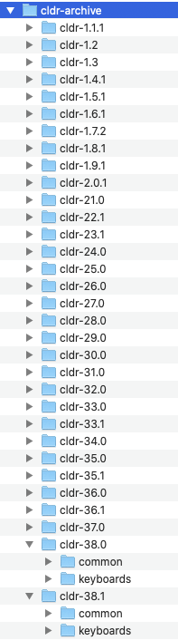

# Checking out the CLDR Archive

A number of the tools in CLDR depend on access to older versions. These tools include:

- [Generating Charts](/development/cldr-big-red-switch/generating-charts)
- [Update Validity XML](/development/updating-codes/update-validity-xml)
- [Updating English/Root](/development/cldr-development-site/updating-englishroot)
	- \[Note: add others when we find them]
	- Some tests
		- TestCompatibility.java
		- TestTransforms.java
		- TestValidity.java
	- Some other tools (typically when given a version argument on the command line)
		- FindPluralDifferences
		- ...

### Here's how to do that.

1. Create an archive directory **cldr\-archive**. The Simplest is if it on the same level as your local CLDR repository. In other words, if your [CLDR\_DIR](/development/cldr-development-site/running-cldr-tools) is .../workspace/cldr, then create the directory  **…/workspace/cldr\-archive**  
(Note: The Java property **ARCHIVE** can be used to overide the path to cldr\-archive).
2. Open up ToolConstants.java and look at ToolConstants.CLDR\_VERSIONS. You'll see something like:
	1. **public static final** List\<String\> ***CLDR\_VERSIONS*** \= ImmutableList.of(
	2. "1\.1\.1",
	3. "1\.2",
	4. "1\.3",
	5. "1\.4\.1",
	6. "1\.5\.1",
	7. "1\.6\.1",
	8. "1\.7\.2",
	9. "1\.8\.1",
	10. ...
	11. "41\.0"
	12. // add to this once the release is final!
	13. );
		- NOTE: this should also match CldrVersion.java (those two need to be merged together)
3. Add the just\-released version, such as "**42\.0**" to the list  above
	- Also update **DEV\_VERSION** to "43" (the next development version)
	- Finally, update CldrVersion.java and make similar changes.
4. Now, run the tool **org.unicode.cldr.tool.CheckoutArchive**
	- Or from the command line: 
	**mvn \-DCLDR\_DIR\=** *path\_to/cldr* **\-\-file\=tools/pom.xml \-pl cldr\-code compile \-DskipTests\=true exec:java \-Dexec.mainClass\=org.unicode.cldr.tool.CheckoutArchive  \-Dexec.args\=""**
	- Note other options for this tool:
	  *\-\-help* will give help
	  *\-\-prune* will run a 'git workspace prune' before proceeding
	  *\-\-echo* will just show the commands that would be run, without running anything
	(For example,  **\-Dexec.args\="\-\-prune"** in the above command line)

The end result (where you need all of the releases) looks something like the following:

## Advanced Configuration

- You can set the property  **\-DCLDR\_ARCHIVE** to point to a different parent directory for the archive
- You can set **\-DCLDR\_HAS\_ARCHIVE\=false** to tell unit tests and tools not to look for the archive

