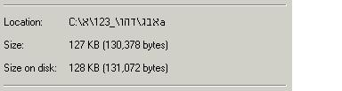
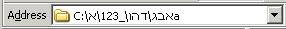
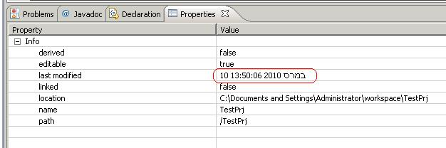
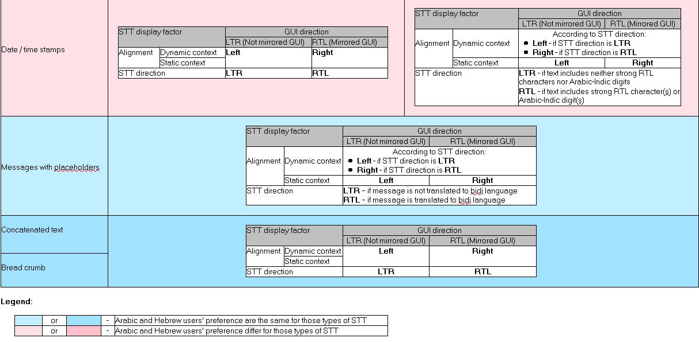
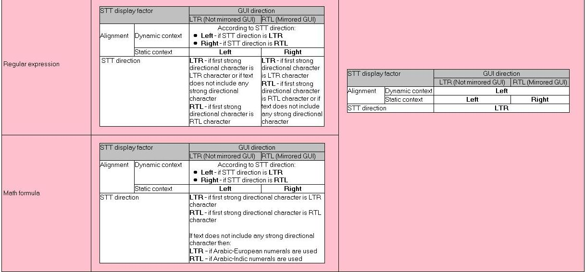
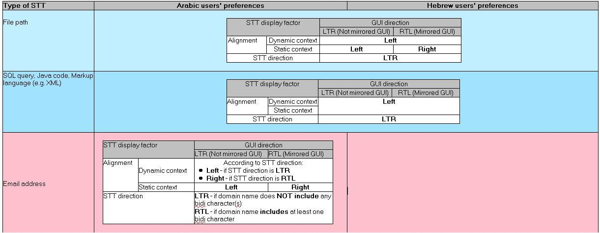

# BIDI handling of Structured Text

**Author: Tomer Mahlin - IBM Bidi Competency Center - e-mail comments to John Emmons - emmo@us.ibm.com**

**0. Terminology**

***Structured text*** (aka complex expressions) - text having implied or/and inherent structure such as: URL,file path, email, Java code, XML, regular expression, date/time stamp etc.

This term is abbreviated as STT.

**1. The problem**

When structured text includes characters from languages with bidirectional script default display system on the logical platform does not preserve the structure and as a result the text on the screen becomes incomprehensible. The problem is with display only and background text related processing is not affected. However, the way the text is displayed on the screen makes it very hard to work with it (in the best case).

**2. What solution would we like to have ?**

In most general terms the solution should allow:

1. Preparation of string for display which will assure that its structure is preserved, This entails development of flexible set of parsers which will analyze the structure of text and will inject UCC (Unicode Control Characters) when appropriate. The framework should be extendable in order to allow adding new parsers (either custom or built-in) in the future.
2. Taking into consideration user preferences (default rules for STT handling): Arabic vs. Hebrew. Users in different geographies are accustomed to different rules for STT display. For example math formulas are always displayed from left-to-right for Hebrew users, while for Arabic users, they may be displayed from right-to-left.
3. Ability to leverage default rules for STT handling (defined in CLDR) and also customize them.

**3. What this solution will NOT address (static vs. dynamic context)**

Static context is context in which text can't be directly edited by the end user (e.g. label, not editable cell of grid, tree branch label etc.).

Here is an example for file path:

Dynamic context is context in which text can be directly edited (e.g. input field, editable area, editable cell of grid etc.) .

Here is an example for file path:

Due to the ICU/CLDR nature (stand alone library without any widgetry) the solution will relate to **static** cases of text only.

Namely, the solution will prepare the text to be displayed in the static context.

Addressing dynamic context is beyond what ICU can provide. The main reason is heterogeneous environment in which ICU can be deployed and

different approaches for resolution of problem for STT. For example, even for Java world the difference between SWT and Swing will pose a challenge. For .Net world (in which ICU4C can be used), addressing the problem is beyond the scope of ICU since it will necessitate invocation of .Net level API.

**4. How the solution will be used (scope, applicability for ICU itself) ?**

In overwhelming majority of cases the deployers leveraging ICU will call an API similar to the following one:

**prepareForDisplay**( inputText, STT\_Type, additional\_parameters)

This API will inject UCC ( Unicode Control Characters ) into inputText according to STT\_Type and additional\_parameters and will return the result ready for display.

inputText - structured text subject to display

STT\_Type: file path, URL, email, Java etc.

additional\_parameters - external parameters which might affect STT processing and which are not directly available to ICU (e.g. GUI direction etc.)

The result string will be embedded by the caller into graphical element which will render it on the screen.

ICU users will be able to either accept default STT rules (associated with locale and defined originally in CLDR) or customize them (via convenient API

allowing setting / getting values for different aspects of such rules).

ICU users will be able to extend the list of provided out of the box parsers in order to address additional types of STT.

One additional usage of this functionality is in serialization / formatting dates / time stamps provided by ICU itself.

Date / time stamp is considered structured text as well.

To assure backward compatibility ICU should not inject UCC into date / time stamps by default. However, it can provide either flag or additional

signature of the same function (responsible for date / time stamps generation) which will prepare them for display (by injection of UCC appropriately).

This will assure proper display of date / time stamps generated by ICU. For example in Eclipse:

**5. Factors affecting the display of STT**

There are some different types of factors that can effect the proper display of structured text. Some types of STT such as URLs or file paths, have a strong LTR directionality associated with them, while others have different display semantics depending the directionality of the underlying GUI, or upon the content of the text itself. This is further complicated by the fact that the culturally accepted preferences for proper display of STT differ, even between Hebrew and Arabic users. Thus, we need to be able to define these rules within the CLDR that describe these and be able to use that data in order to be able to format STT properly in a given context.

The following table summarizes the recognized preferences for the proper display of STT in Hebrew and Arabic:

**6. Proposed additions to CLDR**

The following schema is proposed for addition into CLDR, most likely as sub-elements under the \<layout> category. This structure defines the sets of rules in CLDR necessary to describe proper display behavior for various types of structured text:

\<!-- Top level element is associated with STT type: email, xml, java ...-->

\<!ELEMENT sttDisplay (guiDir?)>

\<!ATTLIST sttDisplay type (filepath | sql | xml | java | regexp | mathexp | email | message | datetimestamp | concatenatedtext | breadcrumb) #REQUIRED >

\<!-- Next level element is associated with GUI direction (or mirroring mode). -->

\<!ELEMENT guiDir (textCondition?)>

\<!ATTLIST guiDir type (ltr | rtl) #REQUIRED >

\<!-- Next level element is associated with text content dependencies (if relevant). -->

\<!-- All attributes are optional since not for all types of STT there is a dependency on the text content.-->

\<!ELEMENT textCondition (sttDir, staticContextAlignment, dynamicContextAlignment)>

\<!ATTLIST textCondition messageLang (ar | he) #IMPLIED>

\<!ATTLIST textCondition hasStrongRTLchars (yes | no) #IMPLIED>

\<!ATTLIST textCondition hasArabicIndicDigits (yes | no) #IMPLIED>

\<!ATTLIST textCondition hasArabicEuropeanDigits (yes | no) #IMPLIED>

\<!ATTLIST textCondition firstStrongDirChar (none | ltr | rtl) #IMPLIED>

\<!ATTLIST textCondition domainHasStrongRTLChar (none | yes) #IMPLIED>

\<!-- On the lowest level we have only values derived from the conditions expressed by the higher level elements -->

\<!ELEMENT sttDir (#PCDATA)>

\<!ELEMENT staticContextAlignment (#PCDATA)>

\<!ELEMENT dynamicContextAlignment (#PCDATA)>

7\. Sample data for various types of STT:

&emsp;a). STT with strong directionality, such as filepath, would have the following rules in root:

\<sttDisplay type="filepath">

\<guiDir type = "ltr">

\<textCondition>

\<sttDir>LTR\</sttDir>

\<staticContextAlignment>LEFT\</staticContextAlignment>

\<dynamicContextAlignment>LEFT\</dynamicContextAlignment>

\</textCondition>

\</guiDir>

\<guiDir type = "rtl">

\<textCondition>

\<sttDir>LTR\</sttDir>

\<staticContextAlignment>RIGHT\</staticContextAlignment>

\<dynamicContextAlignment>LEFT\</dynamicContextAlignment>

\</textCondition>

\</guiDir>

\</sttDisplay>

&emsp;b). The "message" type has some variations based on the content, but the rules remain constant across locales, as follows:

root.xml:

\<sttDisplay type="message">

 \<guiDir type = "ltr">

 \<textCondition>

 \<sttDir>LTR\</sttDir>

 \<staticContextAlignment>LEFT\</staticContextAlignment>

 \<dynamicContextAlignment>LEFT\</dynamicContextAlignment>

 \</textCondition>

 \<textCondition messageLang="he">

 \<sttDir>RTL\</sttDir>

 \<staticContextAlignment>LEFT\</staticContextAlignment>

 \<dynamicContextAlignment>RIGHT\</dynamicContextAlignment>

 \</textCondition>

 \<textCondition messageLang="ar">

 \<sttDir>RTL\</sttDir>

 \<staticContextAlignment>LEFT\</staticContextAlignment>

 \<dynamicContextAlignment>RIGHT\</dynamicContextAlignment>

 \</textCondition>

 \</guiDir>

 \<guiDir type="rtl">

 \<textCondition>

 \<sttDir>LTR\</sttDir>

 \<staticContextAlignment>RIGHT\</staticContextAlignment>

 \<dynamicContextAlignment>LEFT\</dynamicContextAlignment>

 \</textCondition>

 \<textCondition messageLang="he">

 \<sttDir>RTL\</sttDir>

 \<staticContextAlignment>RIGHT\</staticContextAlignment>

 \<dynamicContextAlignment>RIGHT\</dynamicContextAlignment>

 \</textCondition>

 \<textCondition messageLang="ar">

 \<sttDir>RTL\</sttDir>

 \<staticContextAlignment>RIGHT\</staticContextAlignment>

 \<dynamicContextAlignment>RIGHT\</dynamicContextAlignment>

 \</textCondition>

 \</guiDir>

\</sttDisplay>

&emsp;c). Rules for date and time stamps differ between Hebrew and Arabic, so we would have:

In he.xml:

\<sttDisplay type="datetimestamp">

 \<guiDir type = "ltr">

 \<textCondition hasStrongRTLchars="yes">

 \<sttDir>RTL\</sttDir>

 \<staticContextAlignment>LEFT\</staticContextAlignment>

 \<dynamicContextAlignment>RIGHT\</dynamicContextAlignment>

 \</textCondition>

 \<textCondition hasArabicIndicDigits="yes">

 \<sttDir>RTL\</sttDir>

 \<staticContextAlignment>LEFT\</staticContextAlignment>

 \<dynamicContextAlignment>RIGHT\</dynamicContextAlignment>

 \</textCondition>

 \<textCondition hasStrongRTLchars="no" hasArabicIndicDigits="no">

 \<sttDir>LTR\</sttDir>

 \<staticContextAlignment>LEFT\</staticContextAlignment>

 \<dynamicContextAlignment>LEFT\</dynamicContextAlignment>

 \</textCondition>

 \</guiDir>

 \<guiDir type = "rtl">

 \<textCondition hasStrongRTLchars="yes">

 \<sttDir>RTL\</sttDir>

 \<staticContextAlignment>RIGHT\</staticContextAlignment>

 \<dynamicContextAlignment>RIGHT\</dynamicContextAlignment>

 \</textCondition>

 \<textCondition hasArabicIndicDigits="yes">

 \<sttDir>RTL\</sttDir>

 \<staticContextAlignment>RIGHT\</staticContextAlignment>

 \<dynamicContextAlignment>RIGHT\</dynamicContextAlignment>

 \</textCondition>

 \<textCondition hasStrongRTLchars="no" hasArabicIndicDigits="no">

 \<sttDir>LTR\</sttDir>

 \<staticContextAlignment>RIGHT\</staticContextAlignment>

 \<dynamicContextAlignment>LEFT\</dynamicContextAlignment>

 \</textCondition>

 \</guiDir>

\</sttDisplay>

The following rules in ar.xml ( Arabic ):

\<sttDisplay type="datetimestamp">

 \<guiDir type = "ltr">

 \<textCondition>

 \<sttDir>LTR\</sttDir>

 \<staticContextAlignment>LEFT\</staticContextAlignment>

 \<dynamicContextAlignment>LEFT\</dynamicContextAlignment>

 \</textCondition>

 \</guiDir>

 \<guiDir type = "rtl">

 \<textCondition>

 \<sttDir>RTL\</sttDir>

 \<staticContextAlignment>RIGHT\</staticContextAlignment>

 \<dynamicContextAlignment>RIGHT\</dynamicContextAlignment>

 \</textCondition>

 \</guiDir>

\</sttDisplay>

