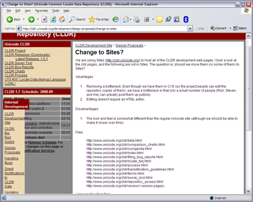

# Change to Sites?

We are using Sites ([http://cldr.unicode.org/](http://cldr.unicode.org/)) to host all of the CLDR development web pages. I took a look at the cldr pages, and the following are not in Sites. The question is, should we move them (or some of them) to Sites?

Advantages

1. Removing a bottleneck. Even though we have them in CVS (so the project people can edit the repository copies of them), we have a bottleneck in that only a small number of people (Rick, Steven, and me) can actually post them up publicly.
2. Editing doesn't require an HTML editor.

Disadvantages

1. The look and feel is somewhat different than the regular Unicode site (although we should be able to make it closer over time).

Files

http://www.unicode.org/cldr/beta.html

http://www.unicode.org/cldr/comparison\_charts.html

http://www.unicode.org/cldr/corrigenda.html

http://www.unicode.org/cldr/index.html

http://www.unicode.org/cldr/filing\_bug\_reports.html

http://www.unicode.org/cldr/locale\_faq.html

http://www.unicode.org/cldr/process.html

http://www.unicode.org/cldr/transliteration\_guidelines.html

http://www.unicode.org/cldr/terms.html

http://www.unicode.org/cldr/survey\_tool.html

http://www.unicode.org/cldr/repository\_access.html

http://www.unicode.org/cldr/version/ (version pages)

*Here are the other files:*

Special purpose, for redirecting.

http://www.unicode.org/cldr/header.html

Old or temporary page:

http://www.unicode.org/cldr/readme.txt

http://www.unicode.org/cldr/press.html

Already redirect, some to Docs pages

http://www.unicode.org/cldr/big\_red\_switch.html

http://www.unicode.org/cldr/charts.html

http://www.unicode.org/cldr/data\_formats.html

http://www.unicode.org/cldr/errata.html

http://www.unicode.org/cldr/procedures.html

http://www.unicode.org/cldr/tr35.html

http://www.unicode.org/cldr/timezone\_ids.html

http://www.unicode.org/cldr/survey\_tool\_known\_bugs.html

http://www.unicode.org/cldr/vetting.html

http://www.unicode.org/cldr/xmlGuide.html

Possible Bug - needs investigation.

