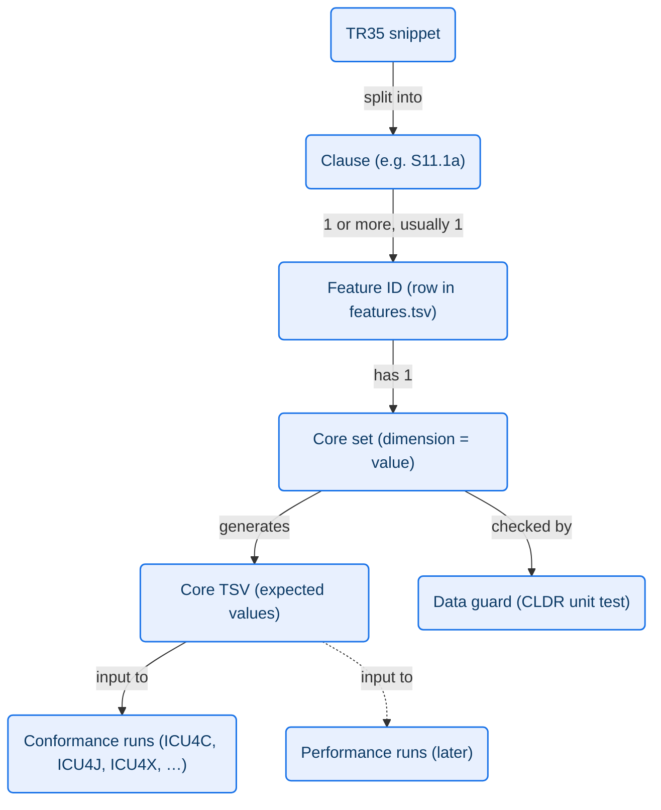

# Feature-Based Test Generation for CLDR Conformance Tests

|   |   |
|---|---|
| Author | Younies Mahmoud |
| Date | 2026-10-09 |
| Status | Draft |
| Bugs | [CLDR-19466](https://unicode-org.atlassian.net/browse/CLDR-19466) |

## 1. Problem

We need a structured way to organize the test data by feature, to make sure the spec is covered, and to make sure the data for each part of the spec tests what we need it to test.

Today the test data (`common/testData/decimal/`, and `common/testData/currency/` in [#5808](https://github.com/unicode-org/cldr/pull/5808)) is a cross product of dimensions, e.g. locales × currencies × styles × inputs. The currency files alone have 27,148 lines. They catch regressions, but:

- **Not organized by feature:** when a row fails, we can't tell which part of TR35 it tests.
- **No coverage check:** we can't prove that every part of TR35 is tested.
- **No check that the data does its job:** if CLDR data changes (e.g. PTE loses its own decimal separator in `pt_PT`), a row still passes but no longer tests that part of the spec.

Related work:

- The TR35 test coverage docs (in progress under CLDR-19466) split the currency and decimal sections of TR35 into numbered clauses (e.g. S11.1a) and check each clause against the generators' dimensions.
- [unicode-org/conformance](https://github.com/unicode-org/conformance) runs test data against ICU4C, ICU4J, ICU4X, NodeJS and other implementations.

## 2. Goals

1. **Point to the spec.** A failure names the TR35 clause that the implementation (or the spec) gets wrong.
2. **Prove 100% coverage.** Every TR35 clause in scope has at least one feature, and every feature has tests.
3. **Detect data drift.** If CLDR data no longer has the case a test relies on, a CLDR unit test fails.
4. **Measure performance per feature** (later), using the same test cases.

## 3. Terms

| Term | Meaning | Example |
|---|---|---|
| **Category** | One formatter area with its own dimensions. | `currency`, `decimal`, unit formatting |
| **Dimension** | One input of the formatter. | `locale`, `currency`, `currency_display`, `input` |
| **Clause** | One part of a TR35 snippet, as split in the coverage doc. | S11.1a: currency-specific `decimal` |
| **Feature** | A behavior that a clause requires, with a stable ID. A clause usually has one feature, and more only when a sub-case needs its own (4.1). | `currency_decimal_separator_special_currency` |
| **Core set** | The `(dimension = value)` pairs that exercise one feature. | `locale = pt_PT`, `currency = PTE` |
| **Core TSV** | The test cases generated from one core set. | `core_currency_decimal_separator_special_currency.tsv` |
| **Data guard** | A CLDR unit test that checks the core set still exercises the feature. | `pt_PT` PTE `decimal` exists and ≠ `pt_PT` `decimal` |



## 4. Design

### 4.1 Feature IDs

- Format: `<category>_<area>_<detail>`, lowercase snake case.
- Examples: `currency_decimal_separator_special_currency`, `currency_alpha_next_to_number_compact`, `currency_no_currency_pattern`.
- An ID never changes and is never reused. If the data for a feature disappears, the core set changes, not the ID.
- One clause can need more than one feature; one feature can serve more than one clause.
- **Granularity:** one feature per clause by default. A sub-case of a clause (another display, length or format type) gets its own feature only if it has:
  - its own spec text;
  - its own data requirement (a different data guard); or
  - an unclear or disputed spec reading.

  Example: S11.1a (currency-specific `decimal`) is `currency_decimal_separator_special_currency`. Its compact case (`1$3 mil`) is still being discussed in [CLDR-19798](https://unicode-org.atlassian.net/browse/CLDR-19798), so it is a separate feature, `currency_decimal_separator_special_currency_compact`. A compact failure then doesn't mark the clear part of the clause as failing.

### 4.2 Feature registry

One TSV file per category, `common/testData/<category>/features.tsv`, is the single source of truth. TSV, not YAML: it matches the test data, GitHub shows it as a table (which reviewers prefer), and the CLDR tools need no new library.

| Column | Example |
|---|---|
| `feature_id` | `currency_decimal_separator_special_currency` |
| `spec` | `tr35-numbers.md#currency-specific-decimal-and-grouping-overrides` |
| `clause` | `S11.1a` |
| `core_set` | `locale=pt_PT; currency=PTE; currency_display=symbol; input=1234565.0,-1230.05` |
| `summary` | A currency's own `decimal` replaces the locale's `decimal`. |

Like the core TSVs, every line has the same number of tabs. `core_set` has a strict format: `dimension=value` pairs separated by `; `, and several values for one dimension separated by `,`. The generator reads `core_set` to produce the core TSV. The data guard test and the coverage check (4.5) read the whole registry.

### 4.3 Core TSV files

- Path: `common/testData/<category>/core_<feature_id>.tsv`.
- Columns: **all** dimensions of the category (empty = default), then `expected`, then `other_features`. All core TSVs of a category share one header, so one parser reads them all.
- Every line, including the `#` header, has the same number of tabs, so GitHub renders the file as a table (requested in the review of [#5808](https://github.com/unicode-org/cldr/pull/5808)). For that reason metadata stays in the registry, not in extra `#` lines.
- `other_features` lists other feature IDs a row also exercises (comma-separated, may be empty). This is the "comment" that links one row to several features.

Example, `core_currency_decimal_separator_special_currency.tsv` (`pt_PT` group is U+00A0 and minimum grouping digits is 2; PTE has `decimal` `$`, `group` `,` and symbol U+200B):

| locale | currency | … | currency_display | input | expected | other_features |
|---|---|---|---|---|---|---|
| pt_PT | PTE | … | symbol | 1234565.0 | `1,234,565$00 ​` (`1,234,565$00\u00A0\u200B`) | `currency_group_separator_special_currency` |
| pt_PT | PTE | … | symbol | -1230.05 | `-1230$05 ​` (`-1230$05\u00A0\u200B`) | |

### 4.4 Data guard tests (CLDR side)

A new test class per category, `TestCurrencyFeatureData` (later `TestDecimalFeatureData`), has one check per feature, keyed by feature ID. A check asserts the facts that make the core set exercise the feature, and nothing about formatted output. A small shared helper reads `features.tsv` for every category.

These checks don't go in `TestCurrencyFormat`. That test checks that the TSVs match the generator's output, while a data guard failure means CLDR data changed. With separate classes, the failing test's name says which kind of failure it is.

```java
// currency_decimal_separator_special_currency
CLDRFile ptPT = CLDRConfig.getInstance().getCLDRFile("pt_PT", true);
String special = ptPT.getStringValue("//ldml/numbers/currencies/currency[@type=\"PTE\"]/decimal");
String general = ptPT.getStringValue("//ldml/numbers/symbols[@numberSystem=\"latn\"]/decimal");
assertNotNull("PTE has its own decimal in pt_PT", special);
assertNotEquals("PTE decimal differs from pt_PT decimal", general, special);
```

When a guard fails, the CLDR data changed. The fix is to find a new combination, then update the registry's `core_set` and the guard, and regenerate the core TSV. The feature ID stays the same.

### 4.5 Coverage check

A check in the same class as the data guards (`TestCurrencyFeatureData`, since it reads the same registry) verifies, for each category:

1. Every clause in the coverage doc (`tr35_<category>_test_coverage.md`) has a feature in the registry or is marked ⚪ Out of scope.
2. Every feature has a core TSV with at least one row and a data guard.
3. Every ID in `other_features` exists in the registry.

Goal 2 ("100% applied") = this check passes, and every feature passes in an implementation.

### 4.6 Conformance repo integration

In [unicode-org/conformance](https://github.com/unicode-org/conformance):

- `testgen` reads `core_*.tsv` and writes its JSON test and verify files. Each test case carries `feature_id` (and `other_features`).
- `verifier` groups results by feature, then by spec clause. A report row reads: *feature `currency_decimal_separator_special_currency` (S11.1a): ICU4J ✅, ICU4X ❌ 1/2*.
- If one feature fails in every implementation, suspect the spec or the expected value. If it fails in one implementation, suspect that implementation.

### 4.7 Performance (later)

The same core TSVs are the benchmark inputs. Each implementation reports time per operation for each feature, so a slow feature (e.g. compact + `alphaNextToNumber`) shows up by name.

### 4.8 Expected values

**Decision:** for now, ICU4J produces the expected values, as the current generators already do.

- Limit: if ICU4J is wrong, the core TSV is wrong too. Until a second source exists, a conformance run can't catch an ICU4J bug, or a spec error that ICU4J shares.
- Later: a naive but correct reference implementation of the spec (written for clarity, not speed) will replace ICU4J as the source. Because each core TSV covers one feature, the reference implementation can be built and switched over one feature at a time.
- When the switch happens, any row where ICU4J and the reference implementation differ is either an ICU4J bug or a spec ambiguity. Both are reported against the row's feature ID and clause.

## 5. Adding a feature

1. Pick a clause from the coverage doc.
2. Assign a feature ID.
3. Find a core set in CLDR data (prefer CORE values; see the coverage doc's method).
4. Write the data guard.
5. Add the registry row and regenerate the core TSV.

## 6. Rollout

1. Currency: convert the clauses of coverage sections 1–13 into the registry; generate the core TSVs; add data guards and the coverage check.
2. Conformance repo: `testgen` and `verifier` support for `feature_id`.
3. Decimal: sections 1–15.
4. Performance runs.
5. Reference implementation: replace ICU4J as the source of expected values, one feature at a time (4.8).
