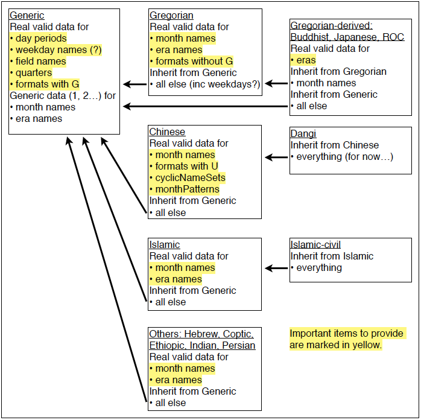

# Generic calendar data

|  |  |
|---|---|
| Authors |  Peter Edberg, Mark Davis |
|  Date |  2012-Dec-10,  **2012-Dec-18 update from 2012-Dec-12 TC discussion** |
|  Status |  Proposal |
|  Feedback to |  pedberg (at) apple (dot) com |
|  Bugs |   [#5385](http://unicode.org/cldr/trac/ticket/5385) , Add generic calendar as the base for all non-gregorian calendars   (**and related bugs to at least partly address at the same time:)  [#5421](http://unicode.org/cldr/trac/ticket/5421) , Fix era positions  [#5490](http://unicode.org/cldr/trac/ticket/5490) , Clean up stock date/time formats** |

**Problem:** The non-Gregorian calendars never receive the same attention from translators as the Gregorian one. This has led to a number of problems: gaps in the data, and consistency in the data. The problem with the gaps are that the root locale data “leaks through”, giving incorrect results in many cases. The consistency problems are because there is a large amount of data for people to review, and often the data entered is from different people. So there are inconsistencies within the same calendar, and gratuitous differences across calendars.

Yet a very large part of the data for different calendars could be shared, because the calendar format data tends to basically differ only by month and era names, and whether the era is included or not.

**Proposal:** I propose to use \<calendar type="generic"> under \<calendars> as a way to provide generic calendar format data; all other calendars will inherit most data (directly or indirectly) from this calendar. The main benefit of this is the ability to have a single place for a locale to specify date format patterns (standard formats, availableFormat, intervalFormats) for (nearly) all non-Gregorian calendars, to minimize effort and to ensure consistency.

## Inheritance

The inheritance relationships among the various calendars are as follows; these are specified in root but are set up to follow paths starting in each locale and the proceeding up to root. For example, lookup for Japanese calendar data in the German locale will first check for the data in calendar "japanese"; if not there, it will check for month names in the German data for calendar "gregorian", and for other items in the German data for calendar "generic"; if the latter is not present, it will look for the items in the root locale.

In a given locale, vetters should provide:

- Most data items for the generic calendar—except month and era names—using formats with eras.
- Selected data items for the gregorian calendar: month and era names, and formats without eras. They may customize other items but generally will not need to.
- For the chinese calendar, if they choose to support it, they will need to supply formats with U, plus month names, cyclicNameSets, and monthPatterns.
- For most other calendars they choose to support, they should only need to provide month and era names (if the root names are inappropriate). For buddhist/japanese/roc, they can skip the month names (which come from gregorian). Of course they can choose to customize other items for the calendar.

For the generic calendar, the month and era name data in root should truly be generic, with wide names such as “month1”…“month12” (and “era0”, “era1”. The weekday names should be non-generic and can mirror the types: "sun".."sat".

Per TC discussion: weekdays should inherit directly from generic, not from gregorian; in fact everything should inherit as much as possible directly from generic. We assume that every locale will provide generic calendar data.

## Special considerations for "generic" calendar

The generic calendar data is not intended to be associated with a calendar type in ICU, and is not intended to be used in a locale specification. Thus:

- No entry for it should be added in common/bcp47/calendar.xml
- There should be no \<type type="generic" key="calendar"> entry for it under \<localeDisplayNames>\<types> in English or any other locale, and the Survey Tool should not allow providing a localized name for it (coverage = 101 ?)
- ICU should not create a Calendar subclass "Generic".

This begs the question: Instead of making "generic" another calendar type, should we instead have special structure for it?

1. **Adding "generic" in \<calendars>:** The best argument for this is that it can be implemented easily with no additional structure and (probably) no change to the Survey Tool. Unless there is a strong argument for adding special structure, I think this is what we should do. If we decide later to add special structure, it should be relatively easy to move the "generic" calendar data into it.
2. **Adding special structure for generic calendar:** The advantage of this is that it would make clear that the "generic" calendar data is special. While CLDR inheritance could probably be made to work without much difficulty, this would require some effort to allow Survey Tool editing of the data. One concern is that various places in ICU code may currently assume that all CLDR calendar data is accessible in the "calendars" bundle as one type or another.

Agreed in TC that no special structure is necessary, just use \<calendar type="generic">.

## Handling generic calendar in Survey Tool

I think that all we need to do is adjust coverage levels appropriately. We need to ensure that items for the "generic" calendar have a reasonably low coverage level, except for month and era names which should not be editable. Then for most non-Gregorian calendars, everything other than the month and era names should have a high coverage level (100)? so they are less likely to be seen.

Agreed in TC.

## The role of calendar data in root

There are two ways to approach data for calendars in root.

1. Treat root as a valid locale in its own right, so that the formats in root are appropriate for "root" behavior. In this case we assume that other locales always override the root behavior.
2. Treat root data primarily as a fallback. In this case root should provide the best fallback behavior for the majority of locales, since locales may not always override the root behavior.

I think the intent for the "gregorian" calendar data in root is #1 above. The formats for this calendar are intended to match ISO 8601 style, with GyMdHms order, hyphen for separator, etc. (This is certainly not the most common order in CLDR locales, but is found in CJK locales). If that is the intent, it fails in a couple of ways; changes for these are suggested in section E below:

- Currently the weekday name is first, e.g. "EEEE, G y MMMM dd". While the ISO 8601 order does not include weekday name, it is generally big-endian which would put EEEE next to d, more like "G y MMMM dd, EEEE", which is also the ordering most common in CJK locales. It also leads to clearer intervalFormats.
- Currently all widths of month and weekday names are purely numeric. When formats—especially intervalFormats—include month, day number and weekday name, this can make them very cryptic and impossible to understand. I think we should have non-numeric wide/abbreviated month and day names in root. Yes, these would be in English, but we already have other root "gregorian" data in English such as \<fields>, and without this it is difficult to use the gregorian calendar with root as a valid locale.
- Currently the weekday numeric name strings use "1" for Sunday, "2' for Monday, etc. This is inconsistent with ISO 8601, which uses "7" for Sunday, "1" for Monday. Supplemental data also has firstDay=mon for 001, which would include root.

I think the intent for the "generic" calendar data in root should be #2 above. Since many locales will only localize the gregorian data and not customize the generic calendar data, we should provide the best possible fallback in root. This will also lead to some data reduction, since many locales may then not need to customize the generic calendar format data anyway. To this end, the "generic" calendar formats should use the ordering "EdMyG Hms" or subsets thereof, which is by far the most common ordering among all CLDR locales. This would mean some inconsistency in root between the "gregorian" and "generic" formats, which could make error checking more difficult.

The consensus from TC discussion was that neither #1 nor #2 apply. That is, root should not be treated as a locale in its own right, though some felt that the formats should still be tied to a standard such as ISO 8601. At the same time, root data will not be treated primarily as a fallback, we assume that all locales will override both "generic" data and the specific "gregorian" data items. However, we should use a consistent ordering for root data: "generic" and "gregorian" should use the same order, and if that order is GyMd..., then E should come after d: GyMdE. Also, we should provide month and weekday names in root that are not just numeric strings; the weekdays can be "sun".."sat", the months can be "month1".."month12".

## Specific changes/suggestions for root data

Based on the discussion above, the following changes/suggestions are proposed for root calendar data:

1. "gregorian" formats should change from "EGyMd Hms" order to "GyMdE Hms" order (and same for formats that use subsets of this). Note that this would be more consistent with the "d E" order already used for the Ed skeleton.
2. "generic" formats should use "EdMyG Hms" order and subsets thereof ("chinese" formats should use "EdMU Hms" etc.).
3. "generic" should provide non-numeric wide/abbreviated weekday names, probably "sunday"/"sun".."saturday"/"sat".
4. If "generic" provides numeric strings for e.g. narrow weekday names, it should probably use "1" for Monday to be consistent with ISO 8601. 
5. "gregorian" should provide non-numeric wide/abbreviated month names (it inherits the weekday names from "generic"). These could be e.g. "month1".."month12"/"mo1".."mo12" or "january".."december"/"jan".."dec". This will vastly improve legibility of some formats.
6. "generic" should have generic but non-numeric wide/abbreviated month and era names, e.g. "month1"/"mo1".."month12"/"mo12", "era0".."era1".
7. "chinese" should also provide generic but non-numeric month names.
8. No formats in root should use "yyyy", any such occurrences should be changed to "y". And in fact, for the "generic" calendar, we probably want availableFormats items that convert a skeleton with "yyyy" into a pattern with just "y".
9. For "generic" and "gregorian" I am adding availableFormats entries to cover several skeletons with G as in [#5421](http://unicode.org/cldr/trac/ticket/5421) "Fix era positions".
10. Currently most non-gregorian calendars in root do not provide \<fields> at all—not as an alias to "gregorian" data, and not as real data. I think for these we should now add an alias to the "generic" data.
11. Should all calendars inherit from \*gregorian\* weekday names? This will produce better results if locales only localize gregorian.

Based on the TC discussion:

- For #1-2 above, root "generic" and "gregorian" formats should use the same ordering, either "GyMdE Hms" (8601) or "EdMyG Hms" (common). Does not impact other locales since all locales should override both "generic" and "gregorian".
- For #3-7 above, root data for "generic" should provide weekday names of just "sun".."sat"; root data for "generic", "gregorian", and "chinese" should provide month names of "month1".."month12".
- For #8-9 abover, agreed.
- For #10 above, decided to move \<fields> to top level of \<dates>; this is a dtd change covered by new bug [#5512](http://unicode.org/cldr/trac/ticket/5512)
- For #11 above, agreed that all calendars should inherit weekday names directly from "generic"
- Also, agreed that the following should be addressed as much as possible while implementing the above:
	- [#5421](http://unicode.org/cldr/trac/ticket/5421), Fix era positions
	- [#5490](http://unicode.org/cldr/trac/ticket/5490), Clean up stock date/time formats

