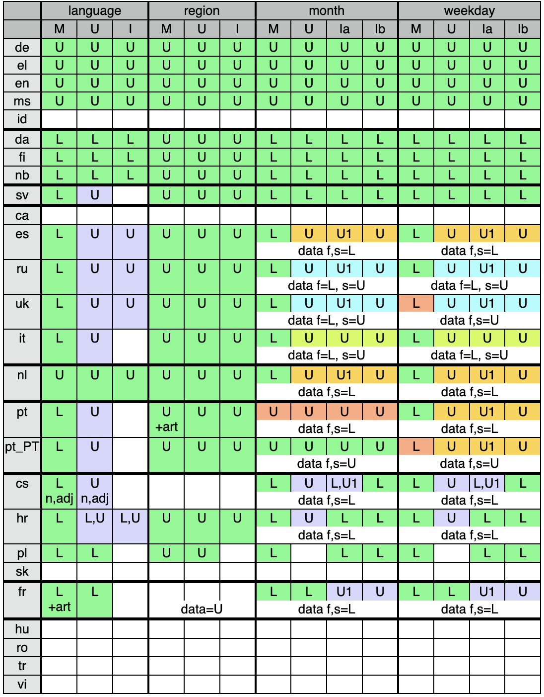
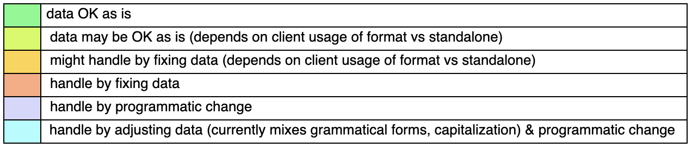

# Grammar & capitalization forms for date/time elements and others

|  |  |
|---|---|
|  Author |  Peter Edberg, comments from others as noted |
|  Date |  2011-11-17 **through 2011-11-30, 2012-01-10to17** |
|  Status |  Proposal |
|  Feedback to |  pedberg (at) apple (dot) com |
|  Bugs |  See list of tickets in section D |

## A. Issues

There are at least 4 axes of variation for choosing the correct form of a date (or fragment thereof). Many of these issues also apply to choosing to other tasks such as choosing the correct form for the name of a language or region, or the correct form for a plural unit.

In order to format a date/time (for example) properly, CLDR must support the necessary forms, a CLDR client such as ICU must have adequate information (e.g. from API options), and it must have a way to map this information to the appropriate CLDR data.

### 1. Capitalization context

Several capitalization contexts can be distinguished for which different languages use different capitalization behavior for dates, date elements, names of languages/regions/currencies

1. In the middle of normal running text (complete sentences).
2. In a UI list or menu.
3. As an isolated UI element. For dates, this might further break down as (a) an isolated complete date, or (b) an isolated single date element (e.g. a month or day name), though I don’t have clear evidence for this yet.
4. At the beginning of complete sentences. As far as I know, all bicameral writing systems capitalize the first word in a complete sentence, so no separate data is needed; this can be done programmatically given the necessary context information.

Certainly for month and day names we need separate data for cases 1, 2, and 3 above, since they may behave independently in some languages, though it may be the case that for other types of data such as language & region names, cases 2 & 3 above can be merged. Here are some examples of desired behavior for capitalization of month & day names:

| contexts → languages ↓ |  1, running text |  2, UI list or menu |  3b, isolated name (e.g. calendar heading) |
|---|---|---|---|
|  de, el, en, ms |  capitalized |  capitalized |  capitalized |
|  da, fi, nb |  lower |  lower |  lower |
|  cs, hr |  lower |  capitalized |  lower |
|  fr |  lower |  lower (after a menu/list title ending in colon, e.g. “First day of week:”) |  capitalized |

Mark: We need to know what the current data has. We have told vetters to use the style for a UI list or menu, but many have not followed this approach [Peter: A table in section E at the end of this document provides some data]. Mechanically it might be easiest to go from the middle-of-text style to the others.

Steven: For collecting the data, if we had good scenarios, we could present current data on contexts: 1, 2, 3 and ask vetters which are correct/incorrect.

### 2. Grammatical case (noun case)

Slavic languages, Greek, Finnish /Hungarian, and probably many other languages have multiple noun cases for day name and especially for month name (as well as multiple forms for time zone names, plural units, language names, etc.).

For month and day names, one dimension of variation is whether the name is used by itself (nominative form) or is part of an expression like “on Monday” or “in January” (some variety of locative/ablative form). These forms are quite important. Expressions like “before January” or “about January” require additional grammatical forms of month names in some languages (e.g. Polish), but those are probably not as important and won’t be considered here.

For month names, a second dimension is whether a day number is used with the month; all of the languages mentioned above have different grammatical forms for month name (genitive, partitive, locative, etc. depending on the language) when used with a day number.

In current CLDR data, standalone is used for the nominative form, and format is used for one of the other possibilities. Here are examples for Finnish and Czech (bold forms are currently in CLDR):

| EEEE | MMMM | MMMMd |
|---|---|---|
| “Saturday” = “ **lauantai** ” (fi, nominative) " **sobota** " (cs, nominative) | “January” = “ **tammikuu** ” (fi, nominative) “ **leden** ” (cs, nominative) | “January 31” = “31. **tammikuuta** ” (fi, partitive) “31. **ledna** ” (cs, genitive) |
| “on Saturday” = “ **lauantaina** ” (fi, essive) "v sobotu" (cs, abla./locative) | “in January” = “tammikuussa” (fi, inessive) “v lednu” (cs, abla./locative) | “on January 31” = “tammikuun 31.” (fi, genitive) “31.  **ledna** ” (cs, genitive) |

Many of these languages also have two grammatical forms for a time zone name, depending on whether it occurs by itself or with an actual time.

Finally, for language names, some of these languages have many noun forms. Most of these are not relevant for the types of usage that CLDR supports. However, for some languages like Czech, names in a list of languages need to be either in noun form or adjective form depending on how the list is being used (e.g. adjective form in a list of keyboard languages). Mark: The adjective form is ugly, since it will need to agree with the noun.

Note that there are similar issues for plural units, e.g. “3 hours” versus “in 3 hours”. Mark: Need to ensure that CLDR vetters and clients understand that the plural units are for durations (e.g. of a video), not a relative time.

### 3. Particles

In some languages such as Greek, French, and Catalan, day and month names in running text need an associated article or other particle, and this may depend on gender and/or spelling of the name. In Greek, Saturday is neuter but other weekdays are feminine, so in text one has “η Δευτέρα” (Monday) but “το Σάββατο” (Saturday). For “on Monday” etc., the particle for the feminine days is either “τη” or “την” depending on the spelling of the day. Lack of support for these articles is considered a major problem.

Note that current CLDR Catalan data uses format/standalone to distinguish month names with and without articles.

### 4. Degree of ambiguity allowed

Narrow day and month names may be ambiguous. Depending on how there are used, this may be acceptable. For example, if narrow weekday names are shown at the tops of columns on a calendar page, there is enough context to disambiguate which day is which. However, a narrow weekday name shown in an isolated date format may not be adequate. ICU needs to provide enough context information to allow use of ambiguous names only when appropriate.

Mark: This is really a distinction in width, not between format and standalone.

## B. Current solution

### 1. Format vs standalone

The current choice between “format” and “standalone” forms conflates all of the distinct issues above (except perhaps degree of ambiguity) into a single choice. CLDR vetters need to pick two points in the 4-D space as representing the “format” and “standalone” forms. For Slavic month names, typically the standalone form is a capitalized nominative (for use without day number), while the format form is in lowercase and intended for use with day number. This results in incorrect capitalization for many situations, and also does not address the important “on/in Xxx” forms.

### 2. inList, inText

\<inList> “controls whether display names (language, territory, etc) are title cased in GUI menu lists and the like,” for languages that normally use lowercase for these; the options are "titlecase-words" or "titlecase-firstword", with special handling supposedly available by using alt="list" on elements that need it (what it does is not specified).

\<inText> “indicates the casing of the data in the category identified by the ... type attribute, when that data is written in text or how it would appear in a dictionary. For example, \<inText type="languages"> shows how to lettercase language names. The possible values are “lowercase-words”, “titlecase-words”, “titlecase-firstword”, and “mixed” (unknown).

### 3. Related docs

Mark had some [discussion and ideas](https://cldr.unicode.org/development/development-process/design-proposals/consistent-casing) in [#2269](http://unicode.org/cldr/trac/ticket/2269).

## C. Outline of proposed solution

### 1. Grammatical form for month, weekday

The basic idea: Have additional \<monthContext> and \<dayContext> types, e.g. “monthNoDate”, “monthWithDate”, “inMonthNoDate”, “onMonthWithDate”, etc. In root, alias these to “format” or “standalone” as appropriate. Any locale can provide explicit data to override these if necessary (i.e. for most locales there would be no change, but Slavic locales (for example) could provide the necessary additional forms. ICU would have new APIs that would take additional usage parameters, and would map to the appropriate context when retrieving data. There would not be additional pattern characters for these contexts.

Note, this still does not address the multiple forms needed in some languages for time zone names and other types of names.

### 2. Letter casing / capitalization

(This section originally proposed a \<capitalization> element, with \<capitalizationContext> subelements. This was changed to \<contextTransform> to allow for the possibility of supporting other types of context-based transforms in the future.)

The basic idea: Have a new \<contextTransforms> element, with \<contextTransform> subelements. The latter takes a "type" attribute whose values include (for now) “uiListOrMenu” or “stand-alone”. There is no need for a "text" context since that should be the default form for the actual data (see section 4 below). The \<contextTransform> values are analogous to those for the \<inText> element; however, the only one currently needed is “titlecase-firstword” ("lowercase" should be the default form for the data, and “titlecase-words” does not seem to be useful).

Note that the “titlecase-firstword” behavior does not exactly match any current ICU behavior; it should probably do something like capitalize the first non-punctuation non-symbol character in a string (if that character can be capitalized). Whether it should skip digits and capitalize the first letter after initial digits needs to be discussed (and may need to be an option).

If no context-based name transforms are needed, the \<contextTransforms> element can be absent.

My initial thought was to include these elements (as many as necessary) inside each relevant name element: \<languages>, \<months>, \<days>, etc. As an example for Czech:

 \<months> \<monthContext type="format"> … \<contextTransforms> \<contextTransform type="uiListOrMenu">titlecase-firstword\</capitalizationContext> \</contextTransforms> \</monthContext> \</months> 

This would involve additions to the DTD everywhere we wanted to add these, which is a bit cumbersome. An initial list of where these should be added:

- \<languages>
- \<scripts>
- \<variants>
- \<keys>
- \<types>
- \<calendar type=...>\<months>\<monthContext type=...>
- \<calendar type=...>\<days>\<dayContext type=...>
- \<calendar type=...>\<fields>
- \<units>

A better alternative is to collect all of these elements in one place, analogous to the \<casing> element in the [Casing Structure](https://docs.google.com/document/d/1BFobx_7jA9tIasyeQSuLthar6kB3ddES9vfYNXF783Q/edit?hl=en_US) proposal (though that is meant to describe existing data, not desired behavior in different contexts), as implemented per cldrbug [4151](http://unicode.org/cldr/trac/ticket/4151) ([r6311](http://unicode.org/cldr/trac/changeset/6311) and later). In that case we need an additional element - say \<contextTransformUsage> - with a “type” attribute that indicates the set of items to which it applies, or the type "all" to indicate that it applies to all usages. The other sets for the type attribute would be the same as the buckets used for the \<casing> element mentioned above, as described in this [spreadsheet](https://docs.google.com/spreadsheets/d/1DK7YyE3vwVC9iFGAh8fPIGdePp1SaJYjUG9WqPQTMzc/edit?hl=en_US&hl=en_US#gid=1) (with some fixes) - for example, "language", "month-format-except-narrow", "calendar-field" (the list of these, and the mapping between them and paths, is currently hardcoded in tools/java/org/unicode/cldr/test/CheckConsistentCasing.java). This would just require a single addition to the DTD and be more expandable:

\<contextTransforms> \<contextTransformUsage type="languages"> \<contextTransform type="uiListOrMenu">titlecase-firstword\</contextTransform> \<contextTransform type="stand-alone">titlecase-firstword\</contextTransform> \</contextTransformUsage> \<contextTransformUsage type="month-format-except-narrow"> \<contextTransform type="uiListOrMenu">titlecase-firstword\</contextTransform> \</contextTransformUsage> \<contextTransformUsage type="month-standalone-except-narrow"> \<contextTransform type="uiListOrMenu">titlecase-firstword\</contextTransform> \</contextTransformUsage> \</contextTransforms>

The \<contextTransforms> data could be located in the same files as the \<casing> data: common/casing/xx.xml. Note that the \<casing> data is currently under a \<behavior> element that cannot co-exist with other LDML elements; this needs to be changed, and the \<behavior> element should be renamed something like \<surveyToolSpeedupData>.

As part of this, the existing inText and inList elements would be deprecated; they do not cover enough contexts and are not easily extensible (as \<contextTransform> would be by adding more type attribute values).

Again, ICU would need APIs that would take additional usage parameters indicating capitalization context, and would transform the data as appropriate for formatting.

### 3. ICU changes

We would need new forms of date formatting APIs, with additional parameters that indicated

- grammatical context (primarily whether there is a prepositional notion such as “on/in” associated with the date; eventually these might be expanded to include notions such as “before” or “after”.
- capitalization context (whether the date was for usage in running text, a UI list or menu, or as an isolated UI element).

Date parsing APIs would have to parse all of the relevant forms.

We would also need new forms of APIs that retrieve names such as language, script, region, etc.; these would also need an additional parameter indicating capitalization context.

### 4. CLDR data changes and capitalization guidance

In the locales I looked at (see section E), *all* of the language and region names already have the appropriate capitalization for running text (rather than for a UI list/menu), and nearly all of the format forms for month and day names have the appropriate capitalization for running text. Thus I think we should change our guidance to suggest that this is the preferred form for these, change the existing data as necessary, and programmatically capitalize as necessary for other contexts.

Some languages currently use the standalone month/day context to provide capitalized forms. If the language does not need different grammatical forms for these contexts, and if all standalone forms should always be capitalized, then we can leave that data alone. Otherwise (as with Russian) we should switch to using standalone for grammatical distinctions, and perform any necessary capitalization programmatically.

## D. Bugs

Old:

- CLDR [#1665](http://unicode.org/cldr/trac/ticket/1665), Case Used To Translate Languages, Scripts, Territories, Currencies, [closed, has some background]
- CLDR [#1678](http://unicode.org/cldr/trac/ticket/1678), Review and fix inText as part of casing revision
- CLDR [#1855](http://unicode.org/cldr/trac/ticket/1855), Case used to translate languages, scripts,...
- CLDR [#1924](http://unicode.org/cldr/trac/ticket/1924), InList casing is deprecated, but tech standard still uses it
- CLDR [#2265](http://unicode.org/cldr/trac/ticket/2265), Need design proposal: "stand alone" is overloaded
- CLDR [#2269](http://unicode.org/cldr/trac/ticket/2269), Consistent Casing [has proposal from Mark]
- CLDR [#2383](http://unicode.org/cldr/trac/ticket/2383), Have model language as a preference and do casing test on a per item basis [Kent]
- CLDR [#2392](http://unicode.org/cldr/trac/ticket/2392), LDML2ICUConverter - convert ldml / layout / inList & intext elements [comment from Kent about these elements]
- CLDR [#2701](http://unicode.org/cldr/trac/ticket/2701), Consider having 3 forms for Months/Days
- CLDR [#3347](http://unicode.org/cldr/trac/ticket/3347), Update capitalization guidance
- CLDR [#3406](http://unicode.org/cldr/trac/ticket/3406), Language Titlecasing
- CLDR [#3733](http://unicode.org/cldr/trac/ticket/3733), Consider changing the case of "Yesterday", "In {0} days", etc.
- ICU [#4836](http://bugs.icu-project.org/trac/ticket/4386), RFE: ICU needs API to access inList CLDR data

New:

- CLDR [#4284](http://unicode.org/cldr/trac/ticket/4284), Add \<contextTransforms> elements, deprecate \<inList>/\<inText>

## E. Capitalization data

For several languages, the table below shows the desired capitalization behavior in various contexts, and how the current data might need to be altered (statically or programmatically) to match the desired behavior.

Second row title key: M = middle of running text, U = UI list or menu, I = isolated UI element which can be (a) part of a complete isolated date, or (b) isolated single date symbol name (month or day name)

Table body cells, key for desired casing (upper section of cell for language): L = lower case in this context, U = capitalized, U1 = capitalize just the first word of the date. The rest of the cell may have notes on case of CLDR data, whether an article must be used, or whether both noun & adjective forms are needed.

Table body cells, color code:

 

Here is the table:

 

  
