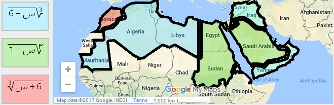

# Math Formula Preferences

As outlined in [http://unicode.org/cldr/trac/ticket/10100,](http://unicode.org/cldr/trac/ticket/10100)

the directional flow for mathematical formulas can differ across bidirectional locales, as does the numbering system used for writing mathematical formulas. As we can see in the map below, some Arabic speaking prefer a left to right presentation for mathematical formulas, while others prefer right to left. Furthermore, the numbering system used in mathematical formulas may differ from the numbering system used for formatting regular numbers.

This proposal adds some additional structure to CLDR's DTD to allow applications to format mathematical formulas properly:

1. Under the "numbers" element, add a new element mathFormulaDirection as follows.....

\<!ELEMENT numbers ( alias | ( defaultNumberingSystem\*, otherNumberingSystems\*, minimumGroupingDigits\*, **mathFormulaDirection\*,** symbols\*,

\<!ELEMENT mathFormulaDirection ( #PCDATA ) >

\<!ATTLIST mathFormulaDirection alt NMTOKENS #IMPLIED >

\<!ATTLIST mathFormulaDirection draft (approved | contributed | provisional | unconfirmed | true | false) #IMPLIED >

&emsp;\<!--@METADATA-->

&emsp;\<!--@DEPRECATED:true, false-->

2. Under the "otherNumberingSystems" element, add an additional numbering system called "math", that can be used to handle those situations where the default numbering system for the locales differs from the numbering system used in mathematical formulas. We can and should document in [tr35](http://www.unicode.org/reports/tr35/tr35-numbers.html#otherNumberingSystems) , that if the "math" numbering system is not defined for a locale, then the default numbering system should be used

\<!ELEMENT otherNumberingSystems ( alias | ( native\*, traditional\*, finance\*, **math\***, special\* ) ) >

\<!ELEMENT math ( #PCDATA ) >

\<!ATTLIST math alt NMTOKENS #IMPLIED >

\<!ATTLIST math draft (approved | contributed | provisional | unconfirmed | true | false) #IMPLIED >

&emsp;\<!--@METADATA-->

&emsp;\<!--@DEPRECATED:true, false-->

Given the information we have currently, the amount of new data needed in CLDR is fairly minimal. In root.xml, we would have:

mathFormulaDirection = "left-to-right", while ar.xml would have "right-to-left", which would cover the majority of Arabic speaking locales, but we would then add "left-to-right" in ar\_MO.xml to cover Morocco.

Similarly, the vast majority of Arabic speaking locales would simply inherit their "math" numbering system from the default numbering system for the locale, and we would only need to explicitly specify a "math" numbering system where it differs from the default, for example, Yemen, Oman, Iraq.

