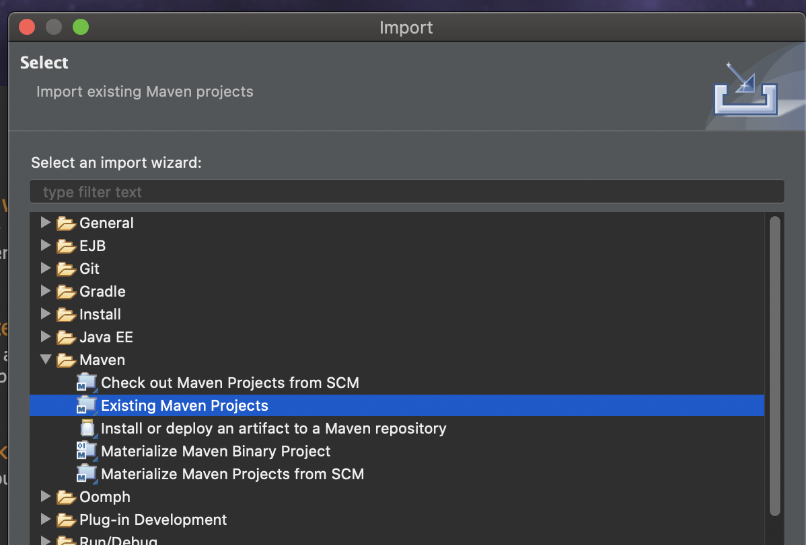
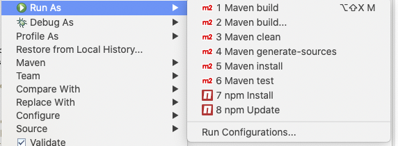

# Maven Setup

## Introduction

For a number of reasons, CLDR has switched to [Maven](https://maven.apache.org/).

The purpose of this document is to assist with initial configuration of Maven.

CLDR pulls pre\-release [ICU](https://icu-project.org)4J jars from ICU's GitHub Maven repository.

At present, GitHub requires authentication even for publicly accessible repositories.

The GitHub documentation covering this topic is https://docs.github.com/en/packages/using-github-packages-with-your-projects-ecosystem/configuring-apache-maven-for-use-with-github-packages and will be referred to.

## Getting Started \- GitHub token

We are going to create a token. A token is used like a password, and should be kept secret as one. You can revoke a token independently from all other tokens, so we will create a token specifically for this use.

1. go to https://github.com/settings/tokens \- you may need to login with a 2nd factor.
2. click "generate new token".
	- update the Note, something you will remember such as "Maven settings on my laptop"
	- give the token "**read:packages**" scope (permission).
	- Click the "Generate Token" button at the bottom.
	- You will see the new token (random numbers and letters) at the top of the page. Copy it down for the following steps, but **you will not need to save it permanently.**
	- You're done with this page now.

## Non\-Eclipse

### Installing Maven

You can run "mvn \-\-version" from the command line to see if Maven is already installed. If you see "Apache Maven 3…" then you are ready to go.

Otherwise, install the "maven" package from your OS or other package manager, or see instructions under https://maven.apache.org/

- Mac brew.sh: ```brew install maven```
- Linux: ```sudo apt install maven```

### Configuring Maven

It might be helpful to refer to the [GitHub documentation](https://docs.github.com/en/packages/using-github-packages-with-your-projects-ecosystem/configuring-apache-maven-for-use-with-github-packages) and the [Maven documentation](https://maven.apache.org/settings.html#Servers) for settings during this step.

The file you will be modifying is .m2/settings.xml (the .m2 directory is in your HOME directory, create it if it does not exist).

If the file doesn't exist, create it with this content. If it does exist, add the \<server\> stanza into the \<servers\> section.

Keep the id "githubicu" as it is. (The id "githubcldr" is for accessing CLDR's prebuilt maven assets.)

```xml
<settings xmlns="http://maven.apache.org/SETTINGS/1.0.0"
xmlns:xsi="http://www.w3.org/2001/XMLSchema-instance"
xsi:schemaLocation="http://maven.apache.org/SETTINGS/1.0.0
http://maven.apache.org/xsd/settings-1.0.0.xsd">
 <servers>
  <server>
   <id>githubicu</id> <!-- needed for building CLDR -->
   <username>your github id</username>
   <password>your access token</password>
  </server>
  <server> <!-- used by ICU and other clients of CLDR -->
   <id>githubcldr</id>
   <username>your github id</username>
   <password>your access token</password>
  </server>
 </servers>
</settings>
```

### Try It Out

In the CLDR repo root, go into the tools directory and run:

```mvn package```

This will run all tests and create the all\-in\-one **tools/cldr\-code/target/cldr\-code.jar**. See [CLDR Tools](/development/cldr-tools) for details on how to use this jar file.

### More details

**Building without running tests:**

```mvn package -DskipTests=true```

**Running specific tests:**

Example to run only one test from the main unit tests and one test in the web tests: (one long command line, two separate parameters)

```
mvn test '-Dorg.unicode.cldr.unittest.testArgs=-f:TestUntimedCounter -n -q'
         '-Dorg.unicode.cldr.unittest.web.testArgs=-f:TestMisc -n -q'
```

**Peter's version:**

To run ConsoleCheck for say a specific locale like "fr", I might do (from the top of the CLDR directory):

```
java -DCLDR_DIR=$(pwd) -jar tools/cldr-code/target/cldr-code.jar check -S common,seed -e -z BUILD -f fr
```

**Running a specific tool from Maven:**

```
mvn -DCLDR_DIR=$HOME/src/cldr exec:java -pl cldr-code -Dexec.mainClass=org.unicode.cldr.json.Ldml2JsonConverter -Dexec.args='-p true -r true -t main -m "de"'
```

## Using Eclipse

(note: a screen capture demonstrating this setup is attached to this page.)

1. See also “[Set up Eclipse for Survey Tool](https://docs.google.com/document/d/1wkJsoQXPcGN_dlCzXzwhfjQoq9Mes7VezIRmNrHWV8c/edit)”
2. To run the SurveyTool components you will need the IDE for Enterprise Developers, you can download this from https://www.eclipse.org/downloads/packages/
3. Make sure the config files are set up first ([**3.2** Configuring Maven](/development/maven)), and that CLDR is checked out locally from git in some directory.
4. Go to File \-\> Import, choose Maven and import Existing Maven Projects (see image at right)



1. Give the root of your CLDR checkout, and import all projects.
	1. If you are not working on the Survey Tool, you may not need the cldr\-apps and cldr\-rdf projects.
	2. To run tests, Choose Run As \> Maven test on the top level (**cldr\-all**) project, or on the cldr\-code project, etc.



1. To start up the Survey Tool, right\-click on 'cldr\-apps' and choose 'Run As… Run On Server'. Create a Tomcat 9 server.

