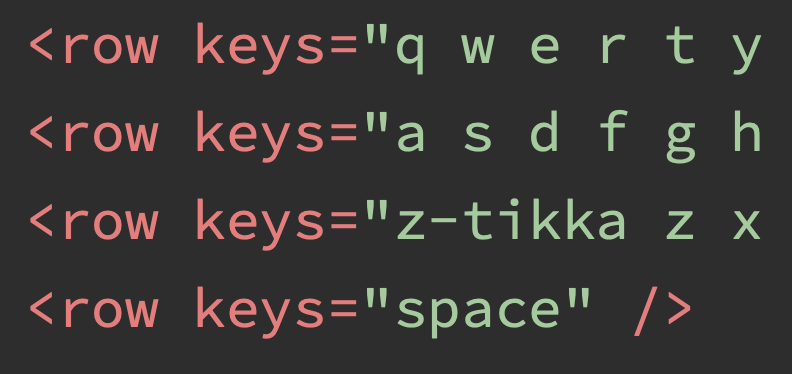

# CLDR Keyboard Subcommittee

The CLDR Keyboard Subcommittee is developing a new cross-platform standard XML format for use by keyboard authors for inclusion in the CLDR source repository.

## News

2023-Feb-29: The CLDR-TC has authorized the proposed specification to be released as stable (out of Technical Preview).

2023-May-15: The CLDR-TC has authorized [Public Review Issue #476](https://www.unicode.org/review/pri476/) of the proposed specification, as a "Technical Preview." The PRI closed on 2023-Jul-15.

## Background

**CLDR (Common Locale Data Repository)**

Computing devices have become increasingly personal and increasingly affordable to the point that they are now within reach of most people on the planet. The diverse linguistic requirements of the world's 7+ billion people do not scale to traditional models of software development. In response to this, Unicode [CLDR](https://cldr.unicode.org/) has emerged as a standards-based solution that empowers specialist and community input, as a means of balancing the needs of language communities with the technologies of major platform and service providers.

### The challenge and promise of Keyboards

Text input is a core component of most computing experiences and is most commonly achieved using a keyboard, whether hardware or virtual (on-screen or touch). However, keyboard support for most of the world's languages is either completely missing or often does not adequately support the input needs of language communities. Improving text input support for minority languages is an essential part of the Unicode mission.

Keyboard data is currently completely platform-specific. Consequently, language communities and other keyboard authors must see their designs developed independently for every platform/operating system, resulting in unnecessary duplication of technical and organizational effort.

There is no central repository or contact point for this data, meaning that such authors must separately and independently contact all platform/operating system developers.

## LDML: The universal interchange format for keyboards

The CLDR Keyboard Subcommittee is currently rewriting and redeveloping the existing LDML (XML) definition for keyboards (UTS#35 part 7) in order to define core keyboard-based text input requirements for the world's languages. This format allows the physical and virtual (on-screen or touch) keyboard layouts for a language to be defined in a single file. Input Method Editors (IME) or other input methods are not currently in scope for this format.

## CLDR: A home for the world's newest keyboards

Today, there are many existing platform-specific implementations and keyboard definitions. This project does not intend to remove or replace existing well-established support.

The goal of this project is that, **where otherwise unsupported languages are concerned**, CLDR becomes the common source for keyboard data, for use by platform/operating system developers and vendors.

As a result, CLDR will also become the point of contact for keyboard authors and language communities to submit new or updated keyboard layouts to serve those user communities. CLDR has already become the definitive and publicly available source for the world's locale data.

## Unicode: Enabling the world's languages

Keyboard support is part of a multi-step, often multi-year process of enabling a new language or script.

Three critical parts of initial support for a language in content are:

- Encoding, in [the Unicode Standard](https://www.unicode.org/standard/standard.html)   
- Display, including fonts and text layout
- Input
    

Today, the vast majority of the languages of the world are already in the Unicode encoding. The open-source Noto font provides a wide range of fonts to support display, and the Unicode character properties play a vital role in display. However, input support often lags many years behind when a script is added to Unicode.

The LDML keyboard format, and the CLDR repository, will make it much easier to deliver text input.

## Common Questions

### What is the history of this effort?

In 2012, the original LDML keyboard format was designed to describe keyboards for comparative purposes. In 2018, a [PRI was created](http://blog.unicode.org/2018/01/unicode-ldml-keyboard-enhancements.html) soliciting further feedback.

The CLDR Keyboard Subcommittee was formed and has been meeting since mid-2020. It quickly became apparent that the existing LDML format was insufficient for implementing new keyboard layouts.

### What is the current status?

Release

Updates to LDML (UTS#35) Part 7: Keyboards are scheduled to be released as part of [CLDR v45](https://cldr.unicode.org/index/downloads/cldr-45).

Implementations

- The [SIL Keyman](https://keyman.com/ldml/) project is actively working on an open-source implementation of the LDML format.
    
### How can I get involved?

If you want to be engaged in this workgroup, please contact the CLDR Keyboard Subcommittee via the [Unicode contact form](https://corp.unicode.org/reporting/staff-contact.html).

