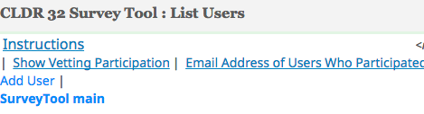
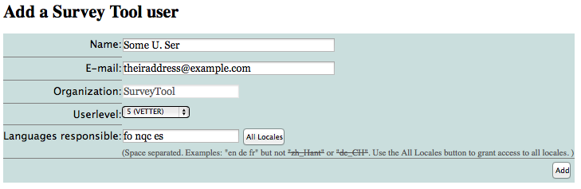
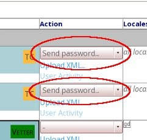
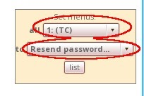
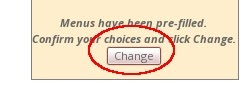
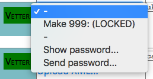
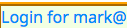
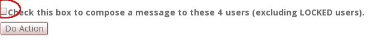
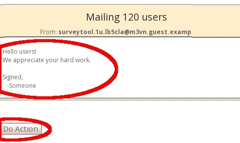
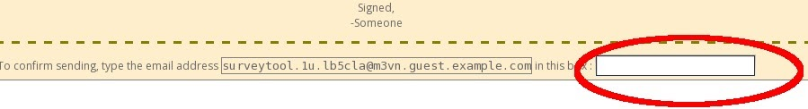

# Managing Users

If you have a TC or Manager level account, you can manage other translators (users). When data submission starts, you'll want to lock the users who are not active, add new users, and send messages to your users. For the existing users you might need to resend passwords \-\- it is simplest just to do that for everyone once you've added new users.

When you create users, you give them permissions and choose which locales they are to work on. It is also important that you set your [organization][CLDR Organization]'s coverage levels appropriately, see "[Setting your Organization's Coverage levels](/index/survey-tool/coverage)".

The tool might feel a bit awkward to use, so please ask if you have any questions.

Note that you shouldn't use your TC or Manager account for voting; that should only be done for carrying out committee decisions. What most people do is open a second account as a Vetter if they have a language they want to contribute to.

## To manage Users

Under [the ☰ menu](https://st.unicode.org/cldr-apps/v#menu///), choose "[List *Org-name* Users](https://st.unicode.org/cldr-apps/v#account///)".

## To add a user

Click on \[Add User] at the top:

Set the name, email, and the locale(s) they are responsible for.

Set the Userlevel based on your assessment of the person's skill. Normally this is "Vetter". You can use "Street" for volunteers whom you don't know. People don't have to come from your organization as long as you have confidence in them.

See the [CLDR Process](/index/process) page for a description of the user levels and their privileges.

*Known bug: if you try to create a user and that email address already has an account, you get an unknown error message. Often this is because the user is locked. Click on "Show locked users", find the person, and change the status (see below).*

## To forward old votes to a new user
When replacing a previous user with a new one, you will likely want that new user to inherit the votes from their predecessor. Otherwise the new user would have to submit all votes from scratch manually, which can be several thousands.

1. Once the new user has been created, find them in the list of users and click on the link "Copy votes to this vetter"
2. Choose the user's predecessor (i.e. the user you want to copy votes *from*).
3. Choose what locale you want to copy votes *from*. (In case the old user has been active in multiple locales.)
4. Choose what locale you want to copy the old user's votes *to*. (In almost all cases, that will be the same locale, which is the default choice.)
5. Vote copying will take place.
6. Tell the new user to exit and re-enter the survey tool.

At this time, the survey tool will consider the old user's voting history the same as the new user's. When the new user logs in, survey tool will automatically apply all the old user's votes **when they match the currently shipping value**. In any case where the old vote does not match the currently shipping value OR where the value is new, the vote will be abstained and the new user will have to submit a new vote.

Remind the new user that **they are still responsible for inherited votes**, and should review them carefully to ensure they agree with them. The vote inheritance is provided for efficiency and convenience, but does not shift responsibility.

## To resend a password

**Make sure you let your users know that they should use their Survey Tool password *only* for the Survey Tool, since it is often sent to them in email.**

1. In the Action column, pick Send Password for each user you want to send their password to. Then click the \[Do Action] button at the top or bottom of the screen to send the password to all selected users.
2. If you want to do a bunch at a time, use the "Set menus" box on the left to fill in the Action columns
	1. "all" means the type of user, so pick one or more of those (eg TC).
	2. "to" means what you want to do (eg Resend password).
	3. Click the "list" button to set the Action menus for those users.

You'll see a \[Change] button. Click it to do the action (eg resending passwords to TC users).

## To log in as one of your users

You will sometimes need to log in as one of your users for testing. Click on the magnifying glass:

Then use the action Show Password:

You will then get a blue link for Login for XXX. Click on it to log in **as that user.** Remember to log out when you're done.

## To send a message to all of your users

At the bottom, click the box for "Check this box to compose a message to..."

Click \[Do Action], and it will take you to a text box to compose your message.

1. Once you have entered the message, click \[Do Action].
2. Next, you need to confirm the message before it goes out.
3. Fill in your address (you can copy and paste) in the box (*this is just to prevent mistakes*), and click \[Do Action]

Later on, in the vetting phase, you can send messages with the outstanding disputes (cases where people disagree on the translation) by checking the box marked "Check this box to send a Dispute complaint"

## To change users' status

1. Click on the magnifying glass in the left column. You zoom in on that user, and have more Actions in the action column.
2. Click the one you want, and click \[Do Action]
3. If a user is inactive, lock their account. (We don't delete accounts since it removes information about what they've submitted so far.)

##To check that all of your important locales have vetters assigned

1. Under [the ☰ menu](https://st.unicode.org/cldr-apps/v#menu///), choose "[Vetting Participation](https://st.unicode.org/cldr-apps/v#vetting_participation///)". It may take a while to load.
2. The listed locales are ones that are a priority for your organization according to the coverage information. (If it's wrong, see "[Changing Your Organization's Coverage Levels](/index/survey-tool/coverage)".)
3. If you need new locales added, let your committee representative know.
4. Under each locale, the currently active users are listed. The ones listed with yellow background have not participated in the current cycle. The ones with gray background have participated, and their vote count is shown.
5. Note that locales are listed in ISO code order, so for example "Chinese" is listed at the bottom for "zh".

##To see how your translators are doing

1. Under [the ☰ menu](https://st.unicode.org/cldr-apps/v#menu///), choose "[Priority Items Summary](https://st.unicode.org/cldr-apps/v#vsummary///)".
2. You will be shown a recent snapshot of the summary with UTC time stamp. If this snapshot is not recent enough for your needs, you can create a new with the button "Create New Summary" under the tables. Note that this will take several minutes.
4. You will get different tables for different coverage levels. The header row is repeated throughout the table for easier readability - this is expected.
5. We often find it useful to copy parts of that table into a spreadsheet application for comparison and analysis.
6. The table will let you look up number of issues in various categories in the locales, the same information your users have access to in the [Dashboard](/translation/getting-started/guide#dashboard).

[CLDR Organization]: /index/survey-tool/cldr-organization
