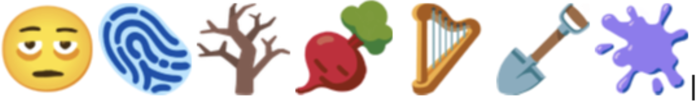

# Information Hub for Linguists

### Starting Submission

During Submission, please read the CLDR Training (if new to the survey tool), please focus on the missing, provisional, and errors. Please read the [**Announcements and Updates**](https://cldr.unicode.org/translation#h.pfa5snbaw7ds). For more information about the priorities during Submission, see [Survey Tool stages](https://cldr.unicode.org/translation/getting-started/survey-tool-phases) under **Survey Tool phase: General Submission**. The [Submission phase](https://cldr.unicode.org/translation/getting-started/survey-tool-phases#h.wqmb27e55b4l) lasts until **June 11**; then the [Vetting phase](https://cldr.unicode.org/translation/getting-started/survey-tool-phases#h.ddjb4w32ki37) lasts until **June 30**.

### Prerequisites

1. If you're **new to CLDR**, take the CLDR training below.    
2. If you're already **experienced with CLDR**, read the Critical reminders section (mandatory).    
3. Review the **Status and Schedule, New Areas, Survey Tool**, and **Known Issues**.    
4. Once you are ready, go to the [**Survey Tool**](https://st.unicode.org/cldr-apps/) and log in.
    
### Updates

- There are substantial changes to the guidance on dealing with Emoji. Be sure to read the updates in **New Areas**! 
- The Survey Tool Approval column has new icons in the Approval column; see **Survey Tool**.
    
When a section below changes, the date will be in the header.

## Status and Schedule

The Survey Tool is now open for [Submission](https://cldr.unicode.org/translation/getting-started/survey-tool-phases#h.wqmb27e55b4l) until the start of [Vetting](https://cldr.unicode.org/translation/getting-started/survey-tool-phases#h.ddjb4w32ki37) on June 12th ([schedule](https://docs.google.com/spreadsheets/d/1N6inI5R84UoYlRwuCNPBOAP7ri4q2CmJmh8DC5g-S6c/edit#gid=1680747936)); then the [Vetting phase](https://cldr.unicode.org/translation/getting-started/survey-tool-phases#h.ddjb4w32ki37) lasts until **June 30**.

- **Disconnect error**. If you see a persistent Loading error with a disconnect message or other odd behavior, please [empty your cache](https://cldr.unicode.org/translation).  
- Survey Tool email notification may be going to your spam folder. Check your spam folder regularly.   
- "**Same as code**" errors - when translating codes for items such as languages, regions, scripts, and keys, it is normally an error to select the code itself as the translated name. If the error appears under Typography, you can ignore it. \[[CLDR-13552](https://unicode-org.atlassian.net/browse/CLDR-13552)\]
    
## New Areas (2024-05-30)

Most of the following are relevant to locales at the Modern Coverage Level.

### New emoji

Seven new emoji have been added (images above). These will be released in Unicode 16 in September, so they need short names and search keywords.

### Emoji search keywords

1. **Important Notes** 
    1. **The Additions from WhatsApp are not listed as Missing in the Dashboard.**
        1. **They are listed instead under the Abstained label, and show up with ☑️ in the main window in the A column.**  
        2. **So be sure the Abstained label is checked.**
        3. **If you have too many Abstained items to deal with, handle the emoji first.**    
    2. **The usage model is:**
        1. The user types one or more words in an emoji search field.   
        2. Each word successively narrows a number of emoji in a results box.
            - heart → 🥰 😘 😻 💌 💘 💝 💖 💗 💓 💞 💕 💟 ❣️ 💔 ❤️‍🔥 ❤️‍🩹 ❤️ 🩷 🧡 💛 💚 💙 🩵 💜 🤎 🖤 🩶 🤍 💋 🫰 🫶 🫀 💏 💑 🏠 🏡 ♥️ 🩺   
            -  Blue → 🥶 😰 💙 🩵 🫐 👕 👖 📘 🧿 🔵 🟦 🔷 🔹 🏳️‍⚧️  
            - heart blue → 💙 🩵        
        3. A word with no hits is ignored    
            - \[heart | blue | confabulation\] is equivalent to \[heart | blue\]        
        4. As the user types a word, each character added to the word narrows the results.   
        5. Whenever the list is short enough to scan, the user will mouse-click on the right emoji - so it doesn't have to be narrowed too far.  
            - In the following, the user would just click on 🎉 if that works for them.       
                1. celebrate → 🥳 🥂 🎈 🎉 🎊 🪅          
        6. The order of words doesn't matter; nor does upper- versus lowercase.      
    3. **The limits on the number of keywords per emoji have been relaxed** in the beginning, but will be decreased to the final limit (20) soon. So please work on reducing duplicates and breaking up multi-word search keywords.   
    4. **Don't follow the English emoji names and keywords literally**; they are *just* for comparison. The names and keywords should reflect **your** cultural associations with the emoji images, and should match what **users of your language** are most likely to search in order to find emoji.   
        1. English phrases like "give up" = surrender are often translated as single words in other languages. *Don't just translate each word!* For example, in \[**hold** |… | **shut** |… | **tongue** |… | **up** |… | **your**\], the corresponding phrases are "shut up" and "hold your tongue".        
2. **Steps**
    1. **Break up multi-word keywords (see the usage model). For example,**
        1. Where *white flag* (🏳️) has \[white waving flag | white flag\] , it is better to replace that with \[white | waving | flag\].    
        2. Because of the usage model, this works far better.  
        3. Reduce or remove "[stopwords](https://www.opinosis-analytics.com/knowledge-base/stop-words-explained/)", except with close associations, such as \[down\] with *thumbs down* (👎)     
    2. **Reduce duplicates (and uncommon synonyms) in meaning. For example,**
        1. If you see \[jump | jumping | bounding | leaping | prancing\], it is better to replace that with just \[jump\] unless you are confident people will frequently use the other forms.   
        2. Because each character narrows the results, \[jumping\] is not necessary if you have \[jump\].
            - Favor the prefixes: \[jump\] is better than \[jumping\]  
            - Keep forms where one character word is not the prefix of another, eg \[race | racing\] and \[ride | riding\]     
    3. **Add equivalents among gender alternates. For example,**
        1. If a *man scientist* (👨‍🔬) has \[researcher\], add the equivalent to both *women scientist* (👩‍🔬) and *scientist* (🧑‍🔬). 
        2. Those equivalents may have different forms in your language, depending on the gender. For example, Forscher (man) vs Forscherin (woman) in German.  
    4. **Avoid:**
        1. Names of specific people or places except for close associations, such as \[Japan | Japanese \] with *map of Japan* (🗾) or *sushi* (🍣).
            - Fictional characters or places are ok, if first used before 1855.  
            - Certain other names have been verified to be in the public domain (Pinocchio, Dracula).
            - Don't add others (post-1855) without verifying with the TC.          
        2.  Intellectual Property (IP), such as trademarks or names of products, companies, books or movies   
        3. Religious references, except for close associations, such as \[Christian | church | chapel\] with *church* ( ⛪), \[cherub | church\] with *baby angel* (👼), \[islam | Muslim | ramadan\] with *star and crescent* (☪️)
        4. Specific terms for sexuality, unless strongly associated with the emoji, eg \[lgbt|lgbtq |... \] for *rainbow* (🌈), *rainbow flag* (🏳️‍🌈), and *transgender flag* (🏳️‍⚧️). 
    5.  **Note:** The English values have also been reviewed and modified for these rules.
        

### New/expanded units

1. Additional units: 
    1. **night**, as in "your hotel reservation is for **3 nights**".  
    2. **light-speed**, a special unit used in combination with a duration, such as "[light-second](https://en.wikipedia.org/wiki/Light-second)". Because of that limited usage, typically the "-speed" suffix is dropped, and the "light" typically doesn't change for inflections (incl. plurals) - *but this may vary by language.*   
    3. **portion-per-1e9**, which will normally be translated as something like [parts per billion](https://en.wikipedia.org/wiki/Parts-per_notation). 
2. Additional grammatical forms have been added for a few units.
    1. point - meaning the [typographical measurement](https://en.wikipedia.org/wiki/Point_%28typography%29).     
    2. milligram-ofglucose-per-deciliter - used for blood sugar measurement     
    3. millimeter-ofhg - used for pressure measurements    
    4. Beaufort - used for [wind speed](https://en.wikipedia.org/wiki/Beaufort_scale) (only in certain countries)
        

### Language names

As new locales reach Basic Coverage, their language names have been added for locales targeting modern coverage: Anii, Kuvi, …, Zhuang

### Metazones

There is a new metazone for Kazakhstan (which merged its two time zones).

## Survey Tool (2024-05-30)

Once trained and up to speed on Critical reminders (above), log in to the [Survey Tool](https://st.unicode.org/cldr-apps/) to begin your work.

### Survey Tool Changes

1. There has been substantial performance work that will show up for the first time. If there are performance issues, please file a ticket with a row URL and an explanation for what happened.  
2. In the Dashboard, you can filter the messages instead of jumping to the first one. In the Dashboard header, each notification category (such as "Missing" or "Abstained") has a checkbox determining whether it is shown or hidden. 
3. In each row of the vetting page, there is now a visible icon when there are forum messages at the right side of the English column:
    1. 👁️‍🗨️ if there are any open posts 
    2. 💬 if there are posts, but all are closed    
4. For Units and a few other sections, the Pages have changed to reduce the size on the page to improve performance.
    1. Pages may be split, and/or retitled
    2. Rows may move to a different page.    
5. In the Dashboard, the Abstains items will now only have one entry per page. You can use that entry to go to its page, and then fix Abstains on that page. Once you are done on that page, hit the Dashboard refresh button (↺). This fixes a performance problem for people with a large number of Abstains, and reduces clutter in the Dashboard.
6. The symbols in the A column have been changed to be searchable in browsers (with *Find in Page*) and stand out
    

more on the page. See below for a table. They override the symbols in [Survey Tool Guide: Icons](https://cldr.unicode.org/translation/getting-started/guide#h.fbq7vldvjuz4).

### Important Notes

- Some of the Page reorganization may continue.

### New Approve Status Icons

| Symbol | Status | Notes |
|:---:|---|---|
| ✅ | Approved | Enough votes for use in implementations … |
| ☑️ | Contributed | Enough votes for use in implementations … |
| ✖️ | Provisional | Not enough votes for implementations … |
| ❌ | Unconfirmed | Not enough votes for implementations … |
|  🕳️ | Missing | Completely missing |
| ⬆️ | Inherited | Used in combination with ✖️ and ❌ |

## Known Issues (2024-06-03)

This list will be updated as fixes are made available in Survey Tool Production. If you find a problem, please [file a ticket](https://github.com/unicode-org/cldr/blob/main/docs/requesting_changes.md), but please review this list first to avoid creating duplicate tickets.

1. [CLDR-17694](https://unicode-org.atlassian.net/browse/CLDR-17694) - Back button in browser fails in forum under certain conditions  
2. [CLDR-17693](https://unicode-org.atlassian.net/browse/CLDR-17693) SurveyTool fatal in getDBConnection 
3. [CLDR-17658](https://unicode-org.atlassian.net/browse/CLDR-17658) - Dashboard slowness 
4. Images for the plain symbols. Non-emoji such as [€](https://cldr-smoke.unicode.org/smoketest/v#/fr/Symbols2/47925556fd2904b5), √, », ¹, §, ... do not have images in the info pane. \[[CLDR-13477](https://unicode-org.atlassian.net/browse/CLDR-13477)\]**Workaround**: Look at the Code column; unlike the new emoji, your browser should display them there. 
5. [CLDR-17683](https://unicode-org.atlassian.net/browse/CLDR-17683) - Some items are not able to be flagged for TC review. This is being investigated.Meanwhile, Please enter forum posts meanwhile with any comments.
    

## Resolved Issues

1. [CLDR-17465](https://unicode-org.atlassian.net/browse/CLDR-17465) - dashboard download fails
2. [CLDR-17671](https://unicode-org.atlassian.net/browse/CLDR-17671) - survey tool search fails
3. [CLDR-17652](https://unicode-org.atlassian.net/browse/CLDR-17652) - Manual import of votes fails
    

## Recent Changes

1. [*CLDR-17658*](https://unicode-org.atlassian.net/browse/CLDR-17658) - In the Dashboard, the Abstains items will only have one entry per page. You can use that entry to go to its page, and then fix Abstains on that page. Once you are done on that page, hit the Dashboard refresh button (↺). This fixes a performance problem for people with a large number of Abstains, and reduces clutter in the Dashboard.
    
## CLDR training (for new linguists)

Before getting started to contribute data in CLDR, and jumping in to using the Survey Tool, it is important that you understand the CLDR process & take the CLDR training. It takes about 2-3 hours to complete the training.

1. **Understand the basics about the CLDR process** read the [Survey Tool Guide](https://cldr.unicode.org/translation/getting-started/guide) and an overview of the [Survey Tool Stages](https://cldr.unicode.org/translation/getting-started/survey-tool-phases).
    - New: A [video is available](https://www.youtube.com/watch?v=Wxs0TZl7Ljk) which shows how to login and begin contributing data for your locale.     
2. **Read the Getting Started topics** on the Information Hub:  
    - General translation guide 
        - [Capitalization](https://cldr.unicode.org/translation/translation-guide-general/capitalization)       
        - [Default Content](https://cldr.unicode.org/translation/translation-guide-general/default-content)
        - [References](https://cldr.unicode.org/translation/translation-guide-general/references)
    - [Handling Errors and Warnings](https://cldr.unicode.org/translation/getting-started/errors-and-warnings)
    - [Handling Logical Group Errors](https://cldr.unicode.org/translation/getting-started/resolving-errors)
    - [Plurals & Units](https://cldr.unicode.org/translation/getting-started/plurals)
    - [Review Date & Time](https://cldr.unicode.org/translation/date-time)
    - [Review Numbers](https://cldr.unicode.org/translation/number-currency-formats)
    - [Review Zones](https://cldr.unicode.org/translation/time-zones-and-city-names)
    - [Data stability](https://cldr.unicode.org/translation/getting-started/data-stability)
    - [Empty cache](https://cldr.unicode.org/translation/getting-started/empty-cache)

\*If you (individual or your organization) have not established a connection with the CLDR technical committee, start with [Survey Tool Accounts](https://cldr.unicode.org/index/survey-tool/survey-tool-accounts).

## Critical reminders (for all linguists)

You're already familiar with the CLDR process, but do keep the following in mind:

1. **Aim at commonly used language** - CLDR should reflect *common-usage* standards **not** *academic /official* standards (unless commonly followed). Keep that perspective in mind.
2. **Carefully consider changes to existing standards** - any change to an existing CLDR standard should be carefully considered and discussed with your fellow linguists in the CLDR [Forum](https://cldr.unicode.org/translation/getting-started/guide#h.fx4wl2fl31az). Remember your change will be reflected across thousands of online products!
3. **Keep consistency across logical groups** - ensure that all related entries are consistent. If you change the name of a weekday, make sure it's reflected across all related items. Check that the order of month and day are consistent in all the date formats, etc.
    - *Tip: The [Reports](https://cldr.unicode.org/translation/getting-started/review-formats) are a great way to validate consistency across related logical groups, e.g. translations of date formats. Use them to proofread your work for consistency.*
4. **Avoid voting for English** - for items that do not work in your language, don't simply use English. Find a solution that works for your language. For example, if your language doesn't have a concept of calendar "quarters", use a translation that describes the concept "three-month period" rather than "quarter-of-a-year".
5. **Watch out for complex sections** and read the instructions carefully if in doubt:
    1. [Date & Time](https://cldr.unicode.org/translation/date-time/date-time-names)
        - [Names](https://cldr.unicode.org/translation/date-time/date-time-names)            
        - [Patterns](https://cldr.unicode.org/translation/date-time)            
        - [Symbols](https://cldr.unicode.org/translation/date-time/date-time-symbols)            
    2. [Time zones](https://cldr.unicode.org/translation/time-zones-and-city-names)        
    3. [Plural forms](https://cldr.unicode.org/translation/getting-started/plurals)
        

*Tip: The links in the [Info Panel](https://cldr.unicode.org/translation/getting-started/guide#h.2jch1980f8sy) will point you to relevant instructions for the entry you're editing/vetting. Use it if in doubt.*

