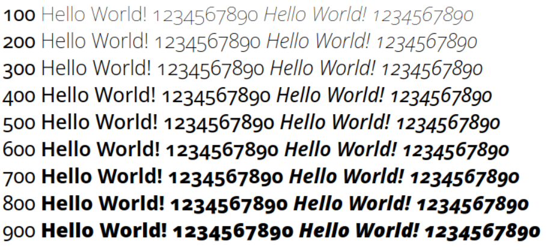

# Typographic Names

CLDR maintains typographic terms for apps like word processors, graphic design apps, or font pickers in operating systems.

## Common Problems

**When entering translations, please refer to a terminological dictionary or ask a professional graphic designer/printer**.

A quick web search or Wikipedia lookup will usually not find the correct terms. Most native speakers do not know the correct terminology unless they work in the graphics industry. For some languages, there’s also special-interest sites on the web that care about correct terminology; for example, [typolexikon.de](http://www.typolexikon.de/) in German.

The most common problem is giving the same name to two *different* fields. For example, you must *not* give the same name to [wght-400 (English=“regular”)](http://st.unicode.org/cldr-apps/v#/de/Typography/147d124e18ef76e9) and [wdth-100 (English=“normal”)](http://st.unicode.org/cldr-apps/v#/de/Typography/29a3de4cf27e33c6). 

**However, there is an important exception for Feature fields that have a suffix after a number ("-heavy"), such as** [**wght-900-heavy (English=“heavy”)**](http://st.unicode.org/cldr-apps/v#/de/Typography/292fe4e98aa53cfe)**. You can** ***(and often should)*** **give the same name in your language to these as you give to the Code without a suffix.**

**That is: the name in your language for** [**wght-900-heavy (English=“heavy”)**](http://st.unicode.org/cldr-apps/v#/de/Typography/292fe4e98aa53cfe) **can be identical to the name for** [**wght-900 (English=“black")**](http://st.unicode.org/cldr-apps/v#/de/Typography/435b966dbd7681ab)**: both could be “schwartz” in German.**

**Slant vs Italic**

1. Slant is different than italic: in the latter, the characters are slanted, but also usually different shapes. See [Italic](http://cldr.unicode.org/translation/characters-emoji-symbols/typographic-names/italic.png).

**Width vs Weight**

1. The wdth-100 and wght-400 (which are *normal* and *regular* in English) must have different names: *normal* is width (how wide the character is — see [Width](http://cldr.unicode.org/translation/characters-emoji-symbols/typographic-names/optical-size.png)), and *regular* is boldness (how heavy the lines in the character are — see [Weight](http://cldr.unicode.org/translation/characters-emoji-symbols/typographic-names/font-weight-2.png)). If there is not a distinction in your language, you can qualify, eg *normal-width*
2. Similarly wdth-125 and wght-700 (in English: *wide* and *bold*) need to be different (width vs boldness)
3. However, only the first two parts of the code make a difference (up to and including the number). The last part (after the number) is purely optional. You only need to have different names for the optional ones if your language really has alternative names for the same feature. That means that you can give the same names to each of the following:
	- wdth-50
	- wdth-50-compressed
	- wdth-50-narrow

## Samples

### Weight

The **Weight axis** is used to vary text from lighter to bolder. See [here](https://en.wikipedia.org/wiki/Font#Weight).

### Width

The **Width axis** is used to vary text from narrower to wider. Also called “stretch”. See [here](https://docs.microsoft.com/en-us/typography/opentype/spec/dvaraxistag_wdth).

### Italic

The **Italic axis** is used to vary text from upright/plain/regular to cursive/italic. See also [here](https://en.wikipedia.org/wiki/Italic_type) and [here](https://docs.microsoft.com/en-us/typography/opentype/spec/dvaraxistag_ital).

### Slant

The **Slant axis** is used to vary text from upright/plain/regular to slanted/oblique. See [here](https://docs.microsoft.com/en-us/typography/opentype/spec/dvaraxistag_slnt).

Fonts can also be slanted towards the opposite of the reading direction.

This style is called **reverse oblique, reverse slanted,** or **back slanted.**

### Optical Size

The **Optical Size axis** is used to adjust letterforms to different text size, from fine print to large display type. See [here](https://en.wikipedia.org/wiki/Font#Optical_size), [here](https://docs.microsoft.com/en-us/typography/opentype/spec/dvaraxistag_opsz), or [here](http://wwwimages.adobe.com/www.adobe.com/content/dam/acom/en/products/type/pdfs/ArnoPro.pdf) (page 11) for a nice description.

