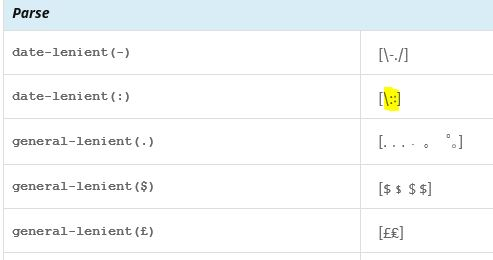

# Alphabetic Information

## Ellipsis Patterns

Ellipsis patterns are used in a display when the text is too long to be shown. It will be used in environments where there is very little space, so it should be just one character; where that really can't work, it should be as short as possible. 

There are three different possible patterns that need to be translated. Typically the same character is used in all three, but three choices are provided just in case different characters would be appropriate in different contexts, for some languages.

| English Pattern | English Example | Meaning |
|---|---|---|
| {0}… or { FIRST_PART_OF_TEXT }… | The quick brown f... | The end of the string is being truncated. |
| {0}…{1} or { FIRST_PART_OF_TEXT }…{ LAST_PART_OF_TEXT } | The quic…azy dog. | The middle of the string is being truncated. |
| …{1} or …{ LAST_PART_OF_TEXT } | …ver the lazy dog. | The start of the string is being truncated. |

English uses the same basic text for all three cases, and just changes the placeholders. An example of where a language might use different characters is where a space should come between the placeholder and the elipsis. In that case, the patterns would be as in the second column below.

| English Pattern | With Spaces |
|---|---|
| {0}… | {0} … |
| {0}…{1} | {0} … {1} |
| …{1} | … {1} |

English uses the elipsis character (Unicode U+2026), which is preferred over three periods in a row. The latter may have a different appearance, as in the following table.

|   |   |
|---|---|
| Ellipsis Character | … |
| Three dots (periods/full-stops) | ... |

If your language also uses three dots to indicate that some text is being elided, then you should also use the elipsis character unless three separate dots are strongly preferred.

## Parse (Parse Lenient)

This list of characters are those that should be treated the same when a program (or system) reads it as input. An example would be when you type a date into a browser URL field.

For example, in the screenshot below, the two forms of a colon are treated the same in parsing a date (in this case, each type of colon is intended to indicate a time separator, such as 13:45).

Like the Core Data > Alphabetic Information, a change needs to be flagged for review, and you should post in the forum why any change is needed.

## More Information Character

This character will appear where the user will click on it to get more information. It will be used in environments where there is very little space, so it should be just one character; where that really can't work, it should be as short as possible.

The English value is “?”, but another character might be better for your language.

## Delimiters

The delimiters are the characters used for quoting text. For example, for English they are the “curly” right and left forms as in **“this phrase.”** The alternate forms are for embedded quotations, such as “He yelled **‘Stop!’**, and turned around.”

*BIDI languages (Arabic, Hebrew,…):*

“Start” means the character that *starts* the quotation, and “end” the one that *finishes* it. With most languages, the start quotation will appear on the left, while with BIDI languages, it will appear on the right.

**Valid Delimiters**

Currently the CLDR survey tool checks input delimiters against a predefined set of possibilities. The following delimiters are considered "valid" by the CLDR survey tool.

‘  U+2018 LEFT SINGLE QUOTATION MARK ’  U+2019 RIGHT SINGLE QUOTATION MARK ‚  U+201A SINGLE LOW-9 QUOTATION MARK “  U+201C LEFT DOUBLE QUOTATION MARK ”  U+201D RIGHT DOUBLE QUOTATION MARK „  U+201E DOUBLE LOW-9 QUOTATION MARK 「  U+300C LEFT CORNER BRACKET 」  U+300D RIGHT CORNER BRACKET 『  U+300E LEFT WHITE CORNER BRACKET 』  U+300F RIGHT WHITE CORNER BRACKET ‹  U+2039 SINGLE LEFT-POINTING ANGLE QUOTATION MARK ›  U+203A SINGLE RIGHT-POINTING ANGLE QUOTATION MARK «  U+00AB LEFT-POINTING DOUBLE ANGLE QUOTATION MARK »  U+00BB RIGHT-POINTING DOUBLE ANGLE QUOTATION MARK

If you need to enter a delimiter that is not one of the characters on this list, please file a new ticket by following [these instructions](https://cldr.unicode.org/index/bug-reports).

## Yes/No

There are special versions of "Yes" and "No" used in POSIX (Portable Operating System Interface) context or other similar applications. Please supply the full word in your language (in lowercase if applicable), followed by a colon, then a common abbreviation separated by colons.

| Name | English Example |
|---|---|
| Yes | yes:y |
| No | no:n |

