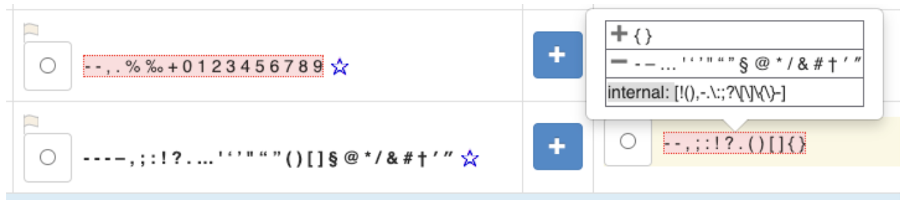
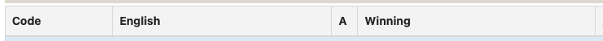
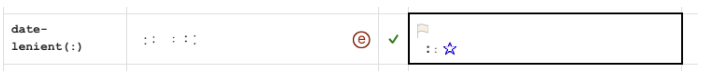

# Unicode Sets

## Format

Certain fields have _**sets**_ of characters (and strings) as values, called **Unicode Sets**. These have the following format **in CLDR 44 or later**:

1. Each character or string is separated from others by a space. For example, the following are letters used in Croatian. Notice that dž, lj, and nj have no spaces between them: that means that they are strings, **_not_** single characters.
	- **a b c č ć d dž đ e f g h i j k l lj m n nj o p r s š t u v z ž**
	- Be careful not to omit the spaces: **ab c** is not the same as **a b c**!
2. A range of characters can be represented with the ➖ character. For example
	- **A➖E** is equivalent to A B C D E
	- **가➖힣** is equivalent to typing 11,172 separate characters
3. Special characters can be represented by ❰…❱, called an escape.
	- For example, ❰NBSP❱ represents a non-breaking space.
	- Any character can also be represented by its Hex value. Thus typing either φ or ❰03C6❱ has the same effect.
	- See the table on the left; you can copy an escape from the left column to insert into a Unicode Set
4. The ➖, ❰, and ❱ characters are chosen to be unusual, so that it is unlikely that they would be normally among the characters you would want to have in a set such as the punctuation characters used in your language
5. You can add characters in any order: they'll be displayed in the default order for your locale. Exceptions are very large character sets like Korean Hangul, which use a code point order so that they can make use of the ➖ character.

**In CLDR 43 and previous versions**, a different format was used, one that require special "escapes" for certain characters and for strings. This caused problems for many people, and was replaced by the simpler format above.

### Key to Escapes

| Abbr. | Code Point | Name |
|---|---|---|
| ❰TAB❱ | U+0009 | tab |
| ❰LF❱ | U+000A | line feed |
| ❰CR❱ | U+000D | carriage return |
| ❰SP❱ | U+0020 | space |
| ❰NSP❱ | U+2009 | narrow/thin space |
| ❰NBSP❱ | U+00A0 | no-break space |
| ❰NNBSP❱ | U+202F | narrow/thin no-break space |
| ❰WNJ❱ | U+200B | allow line wrap after, aka ZWSP |
| ❰WJ❱ | U+2060 | prevent line wrap |
| ❰SHY❱ | U+00AD | soft hyphen |
| ❰ZWNJ❱ | U+200C | cursive non-joiner |
| ❰ZWJ❱ | U+200D | cursive joiner |
| ❰ALM❱ | U+061C | Arabic letter mark |
| ❰LRM❱ | U+200E | left-right mark |
| ❰RLM❱ | U+200F | right-left mark |
| ❰LRO❱ | U+202D | left-right override |
| ❰RLO❱ | U+202E | right-left override |
| ❰PDF❱ | U+202C | end override |
| ❰BOM❱ | U+FEFF | byte-order mark |
| ❰ANS❱ | U+0600 | Arabic number sign |
| ❰ASNS❱ | U+0601 | Arabic sanah sign |
| ❰AFM❱ | U+0602 | Arabic footnote marker |
| ❰ASFS❱ | U+0603 | Arabic safha sign |
| ❰SAM❱ | U+070F | Syriac abbreviation mark |
| ❰KIAQ❱ | U+17B4 | Khmer inherent aq |
| ❰KIAA❱ | U+17B5 | Khmer inherent aa |
| ❰RANGE❱ | U+2796 | range syntax mark |
| ❰ESCS❱ | U+2770 | escape start |
| ❰ESCE❱ | U+2771 | escape end |
| ❰…❱ | U+… | Other; … = hex notation |

### Examples

In the info panel, a mouse hover over the non-winning values shows a comparison to the Winning value. The ➕ { } indicates that { and } are additions to the Winning value, and ➖ ‐ – … ' ‘ ’ " “ ” § @ \* / & # † ′ ″ indicates that ➖, ‐. –. …. and so on are subtractions from the Winning value. That makes it much easier to see what the difference in the outcome would be.

The very last line shows an internal UnicodeSet format. You can normally ignore this. However, if you want more details about the characters you can copy the [...] from that line in the Info Panel and paste that into the Input box on [UnicodeSet](https://util.unicode.org/UnicodeJsps/list-unicodeset.jsp) (and hit Show Set) to see more information about the characters, such as [[!(),-.\\:;?\\[\\]\\{\\}‑]](https://util.unicode.org/UnicodeJsps/list-unicodeset.jsp?a=%5B!%28%29,-.%5C:;?%5C%5B%5C%5D%5C%7B%5C%7D%E2%80%91%5D).

## Exemplar Characters

The exemplar character sets contain the commonly used letters for a given modern form of a language. These are used for testing and for determining the appropriate repertoire of letters for various tasks, like choosing charset converters that can handle a given language. The term “letter” is interpreted broadly, and includes characters used to form words, such as 是 or 가. It should not include presentation forms, like [U+FE90](https://util.unicode.org/UnicodeJsps/character.jsp?a=FE90) ( ‎ﺐ‎ ) ARABIC LETTER BEH FINAL FORM, or isolated Jamo characters (for Hangul). 

- For charts of the standard (non-CJK) exemplar characters, see a chart of the [standard exemplar characters](https://www.unicode.org/cldr/charts/45/by_type/core_data.alphabetic_information.main.html).
- For more information, please see [Section 5.6 Character Elements](http://unicode.org/reports/tr35/tr35-6.html#Character_Elements) in UTS#35: Locale Data Markup Language (LDML).

There are different categories:

| Category | English Example | Meaning |
|---|---|---|
| _standard_ | a b c d e f g h i j k l m n o p q r s t u v w x y z | **The minimal characters** required for your language (other than punctuation).   The test to see whether or not a letter belongs in the main set is based on whether it is acceptable in your language to always use spellings that avoid that character. For example, English characters do not contain the accented letters that are sometimes seen in words like  résumé  or  naïve , because it is acceptable in common practice to spell those words without the accents.  If your language has both upper and lowercase letters, only include the lowercase (and İ for Turkish and similar languages). |
| _punctuation_ | ‐ – — , ; : ! ? . … ‘ ' ’ ′ ″ “ " ” ( ) [ ] / @ &amp; # § † ‡ * | **The punctuation characters** customarily used with your language.   For example, compared to the English list, Arabic might remove ; , ? /, and add ؟ \ ، ؛.   _Don't include purely math symbols such as +, =,   ±, and so on._ |
| _auxiliary_ | á à ă â å ä ã ā æ ç é è ĕ ê ë ē í ì ĭ î ï ī ñ ó ò ŏ ô ö ø ō œ ú ù ŭ û ü ū ÿ | **Additional letters and punctuation** (beyond the minimal set) used in foreign or technical words found in typical magazines, newspapers, &amp;c.   For example, you could see the name Schröder in English in a magazine, so  ö  is in the set. However, it is very uncommon to see  ł , so that isn't in the auxiliary set for English. Publication style guides, such as  The Economist Style Guide  for English, are useful for this.   If your language has both upper and lowercase letters, only include the lowercase (and İ for Turkish and similar languages). |
| _index_ | A B C D E F G H I J K L M N O P Q R S T U V W X Y Z | **The “shortcut” letters** for quickly jumping to sections of a sorted, indexed list (for an example, see [mu.edu](https://www.marquette.edu/tools/atoz.php)).   The choice of letters should be appropriate for your language. Unlike the **minimal** or **additional** characters, it should have either uppercase or lowercase, depending on what is typical for your language (typically uppercase). |

## Parse Characters

These are sets of characters that are treated as equivalent in parsing. In the Code column you'll see a description of the characters with a sample in parentheses. For example, the following indicates that in date/time parsing, when someone types any of the characters in the Winning column, they should be treated as equivalent to ":". 

Note that if your language doesn't use any of these characters in date and times, the value doesn't really matter, and you can simply vote for the default value. For example, if a time is represented by "3.20" instead of "3:20", then it doesn't matter which characters are equivalent to ":".

### Handling Warnings in Exemplar characters

There are two kinds of warnings you can get with Exemplar Characters. While these are categorized as warnings, every effort should be made to fix them.

**A. A particular translated item contains characters that aren't in the exemplars.**

For example:

- Suppose the currency code XAF is translated as "Φράγκο BEAC CFA" in Greek. That raises a warning because the "BEAC CFA" are not in the Greek exemplars.
- Suppose that a currency symbol contains ৲ (BENGALI RUPEE MARK). That also raises a warning, even though it is a symbol and not a letter, because it has a script (Bengali).

Three possible solutions:

1. If the character really is used in the language, add it to the appropriate exemplar set (**standard, auxiliary,…**).
	- For example, the Bengali Rupee mark should be added to the **currency** exemplar set.
	- To add to the Exemplar Characters, go first to the main view for your locale, then select **Other Items** [Characters]. For example, see German characters.
2. For currencies, if the character is part of a 'gloss', that is, it is parenthetically included for reference, and the gloss is all ASCII, then include it in brackets. You can use [square brackets] or (parentheses) in currencies. Everywhere else, please use only square brackets.
	- So the XAF above can be fixed by changing it to "Φράγκο [BEAC CFA]" or "Φράγκο (BEAC CFA)". For the timezone name "ACT (Ακρ)", the fix is to change to "Ακρ [ACT]".
3. If neither of these approaches is appropriate, try rephrasing the translated item to avoid the character.
4. If it really can't be avoided, then please file a [new ticket](https://cldr.unicode.org/index/bug-reports#TOC-Filing-a-Ticket) describing the problem.

**B. The exemplar characters shouldn't contain a particular character.**

The **standard** characters shouldn't contain punctuation. They also should not contain symbols, unless those symbols are only used with the language's writing system (aka script). For example, the **standard** Bengali currency symbols should contain the Bengali Rupee mark (which is Bengali-only), but should not include the $ Dollar Sign (which is common across all scripts).

