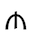
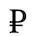
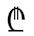

# Currency Symbols

Each currency code such as USD or EUR can be represented in several ways, as given in the table below. Be sure to look at the international symbol to see which currency is being translated. For example, the English examples below are for USD. The Symbol and International code will be used in number patterns, as shown in the Examples of Usage. For more information, see [Number Patterns](https://cldr.unicode.org/translation/number-currency-formats/number-and-currency-patterns).

| Type | Code | Example | Examples of Usage | Meaning |
|---|---|---|---|---|
| Symbol | USD | $ |   **$** 12,345.68   | This is to be most commonly understood currency designator next to an amount for this currency in your locale. For example, the localized value of Canadian dollars in US English would likely be "CA\$". Showing Swedish krona in Sweden would be "kr", but showing Danish krona in Sweden would be "Dkr", to distinguish it from the Swedish counterpart. The reversed may be used in Danish. Meanwhile showing Bermudan dollar in Sweden, using ISO code "BMD" might be better than "\$BM" since it's not a commonly referenced currency. This is an area where you need to think localization, more than translation.   Note : It is not necessary to specify ISO 4217 codes (e.g. "USD") as the symbol merely to ensure that they are available to CLDR clients who want to use them; a developer who specifically wants to use the ISO codes (say, in a table of currency transactions) can get those elsewhere in CLDR, there is no need to "translate" them in a locale. This symbol field is meant for showing an amount with a commonly recognizable and understandable currency designation.  **Warnings:**  - Never use the same symbol for two different currencies. If "\$" is used for USD, it cannot also be used for AUD.  - This is one of the areas where the country matters. USD is \$ in the default English (which is for US), and other dollar symbols are qualified (AU$, C$, ...). However, in en-AU (Australian English), the choices are switched: \$ is AUD, and USD is US\$. |
|  | EUR | € | **€**  12,345.68 |  |
| Symbol-narrow | DKK | kr |  12,345.68 kr      | This is an opportunity to provide an even shorter symbol for a currency. When using narrow currency symbols, it it assumed that the context is well known, so it is not necessary for the narrow currency symbol to be unique. In the example of where Swedish used "Dkr" for Danish krona above, you may use this field for just "kr", and assume that context in its usage will make up for the lack of distinction.  Note: It can be the same as currency-symbol. Many languages use € for Euro in both fields. That's OK if that best represents common usage. |
| International Code | USD | n/a | **USD** 12,345.68   | International symbol used in formatting currency amounts. Normally, this is not under translator control, so you won't even see these presented for translation, but they can be specified by the programmer. |
| International Code | EUR | n/a | **EUR** 12,345.68   | ... |
| Name | USD | **US Dollar** | **Dollar des États-Unis** | Descriptive name of the currency. It should be the most neutral grammatical form for your language, appropriate for menus. Typically this is nominative singular, but the conventions may be different for your language.  To provide greatest flexibility, this should use capitalization appropriate for the **middle of a sentence** . CLDR has separate contextTransforms data to specify how this should be programmatically capitalized (if at all) for different contexts such as use in menus, stand-alone use (e.g. a web page title), etc. |
| Plural forms (e.g. name-other, name-one, name-few, ...) | USD | 1 **US dollar** vs 2 **US dollars** | 1 **US dollar** vs 2 **US dollars** | Use the plural  fields such as name-other and possibly name-one, name-few, etc. to indicate the different plural form(s) if plural forms are used in your language. If they are not used, typically only the name-other plural form will be shown. Follow the general [capitalization guidance](https://cldr.unicode.org/translation/translation-guide-general/capitalization) . Also see Plurals  for general information on plural handling in CLDR. |

Note: in some cases, the English currency symbol may appear as box, typically because you don't have fonts for all of the characters. This is especially the case for currency symbols recently added to Unicode, such as the following:

| image | symbol | when added |
|---|---|---|
|  | U+20BC Manat symbol (Azerbaijan) | Unicode 7, June 2014 |
|  | U+20BD Ruble symbol (Russia...) | Unicode 7, June 2014 |
|  | U+20BE Lari  symbol (Georgia) | Unicode 8, June 2015 |

