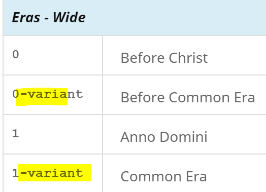
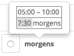

# Date/Time Names

Date/Time names is required topic to work in [Date/Time Patterns](https://cldr.unicode.org/translation/date-time/date-time-patterns).

## Textual Fields

Certain calendar fields can have both numeric and textual forms. **Textual forms** are things like months of the year (January, February, etc..) and days of the week (Sunday, Monday, etc..)

- This text forms can vary in length
	- Wide (e.g. Sunday)
	- Abbreviated (e.g Sun)
	- Narrow (e.g. S)
	- There are two styles. For more information, see [When to use standalone vs. formatting](https://cldr.unicode.org/translation/date-time-1/date-time-patterns#TOC-When-to-use-Standalone-vs.-Formatting) in Date/Time patterns.
		- Formatting
		- Standalone
- Capitalization should follow the middle of a sentence rule. For more information, see [Capitalization](https://cldr.unicode.org/translation/translation-guide-general/capitalization).  
	- \<contextTransforms> data can specify the capitalization for other contexts; currently this is not available in the Survey Tool, so you must file a CLDR JIRA ticket to request a change.
	- Most sets of names form [Logical Groups](https://cldr.unicode.org/translation/getting-started/resolving-errors), and you need to make sure they have the same contribution status (e.g. Status: Approved) or you will get error messages. See [Logical Groups](https://cldr.unicode.org/translation/getting-started/resolving-errors) for more information.

## Date Field Names

The date field _names_ are used in user interfaces on computer systems as labels as shown in this table example, where  a user is asked to enter the year, month, and day:

|||
|---|---|
| Year | 1942 |
| Month | ... |
| Day | ... |

The grammatical form should be whatever is typical for such isolated or stand-alone cases: generally it will be nominative singular. The letter casing should be appropriate for middle-of-sentence use, since there is now separate capitalization context data that can specify how these should be capitalized for use in a label. Also see the translation guide on [Capitalization](https://cldr.unicode.org/translation/translation-guide-general/capitalization). 

There are three lengths: full, short, and narrow. They are listed below along with English examples and explanations (a few of the fields are not straightforward).

| Field name |  | English examples for different name widths |  |   Explanation of the field being named, example as a label |
|---|---|---|---|---|
|  | (full) | -short | -narrow |  |
|   **era** |  era |  era |  era |  Name of the field that distinguishes different calendar epochs in a calendar, such as CE / BCE for the Gregorian calendar, or 平成 / 昭和 / 大正 for the Japanese calendar. Can be used as a popup menu label, e.g. “Era:   CE ▾  ” to select CE for Gregorian calendar. |
|   **year** |  year |  yr. |  yr. | Name of the field that designates years. |
|   **quarter** |  quarter |  qtr. |  qtr. |  Name of the field for a three-month “quarter” often used for reporting financial transactions. Can be used as a popup menu label, e.g. “Quarter:   2 ▾  ” to select the second quarter of the year. |
|   **week** |  week |  wk. |  wk. |  Name of the field for week number of the year. Can be used as a popup menu label, e.g. “Week:   20 ▾  ” to select the 20th week of the year for an event. |
|   **weekOfMonth** |  week of month |  wk. of mo. |  wk. of mo. |  Name of the field for the week number in the month. Can be used as a popup menu label, e.g. “Week of month:   3 ▾  ” to select the 3rd week of the month for an event. |
|   **day** |  day |  day |  day |  Name of the field for the day number in the month. Can be used as a popup menu label, e.g. “Day:   19 ▾  ” to select the 19th day of the month for an event. |
|   **dayOfYear** |  day of year |  day of yr. |  day of yr. |  Name of the field for the day number in the year. Can be used as a popup menu label, e.g. “Day of year:   139 ▾  ” to select the 139th day of the year for an event. |
|   **weekday** |  day of the week |  day of wk. |  day of wk. |  Name of the field for the day of the week. Can be used as a popup menu label, e.g. “Day of the Week:   Friday ▾  ” to select Friday for an event. |
|   **weekdayOfMonth** |  weekday of the month |  wkday. of mo. |  wkday. of mo. |  Name of the field specifying the number of the occurrence of a particular weekday within the month. Can be used as a popup menu label, e.g. “Weekday of the month:   3 ▾  ” to select the 3rd Friday of the month for an event, assuming that Friday is specified with a different popup. |
|   **dayperiod** |  AM/PM |  AM/PM |  AM/PM |  Name of the field that designates range of time within a day. Can be used as a popup menu label, e.g. “AM/PM:   morning ▾  ” to select the desired time for a flight departure; different values could be used to select other ranges such as "evening", "AM" or "PM", or particular points such as “noon” or “midnight” (The current English name is not necessarily the best example for this). |
|   **hour** |  hour |  hr. |  hr. |  Name of the field that designates hours. |
|   **minute** |  minute |  min. |  min. |  Name of the field that designates minutes. |
|   **second** |  second |  sec. |  sec. |  Name of the field that designates seconds. |
|   **zone** |  time zone |  zone |  zone |  Name of the field that designates the time zone. Can be used as a popup menu label, e.g. “Time zone:   Pacific Time ▾  ” to select Pacific Time; different values could be used to select other time zones, such as “GMT” or “Beijing Time”. |

### Eras

Era names are in Gregorian Calendar and other calendars:

- There are only two values for an era in a Gregorian calendar.
	- The common use of these era names in English are more for religious forms. "BC" (Before Christ) and AD (Anno Domini)" - from the Latin for "The year of our Lord".
	- The secular equivalents of these two era names are "BCE" (Before Common Era) and "CE" (Common Era).
- Other calendars (see [Different calendars in Date/Time patterns](https://cldr.unicode.org/translation/date-time-1/date-time-patterns#TOC-Different-Calendars-)) have a different numbers of eras.
	- The names for eras are often specific to the given calendar, such as the Japanese era names.
	- If other calendars are in common use in one of the countries/regions that use your language, other calendars will show under the modern coverage level.

💡 **Translation Tips**
- For Gregorian Calendar you will need to consider whether the religious (BC/AD) form or the secular (BCE/CE) form is more commonly used in your language, and make the most common form the default form (code 0, 1).
- The alternate form, if used, can be provide under the entries for codes 0-variant, 1-variant. If your locale does not commonly use an alternate form, do not provide any entries for these.

### Quarters

In the Gregorian calendar, these designate the four three-month periods often used for financial reporting. The abbreviated or narrow forms may simply be something like “Q2” or “2” respectively. These may not be useful in calendars that do not always have 12 months in a year.

### Months of the Year

This field is one of the months of the year, such as January or February. 

 In many languages, it is not common to use abbreviated months. The preferred way to address this is using date/time patterns that never use the abbreviated months MMM or LLL, as explained in [Patterns without abbreviated months](https://cldr.unicode.org/translation/date-time/date-time-patterns). 

💡 **Translation Tips**

- If there is no way to supply abbreviated month names, the full month names may be used for abbreviated month names.
- Use grammatical form such as genitive or related for **Formatting** month names if applicable in your language.
	- Used in patterns with a day number. (e.g. Finnish, and many Slavic languages distinguish between nominative and genitive/related)
- Use the type such as the nominative case for **Standalone** month names.
	- Used in pattern without a day number.
- The specific values that are used in the format and stand-alone names need to be closely co-ordinated with the date patterns that will use them. See [When to use standalone vs. format names](https://cldr.unicode.org/translation/date-time-1/date-time-patterns#TOC-When-to-use-Standalone-vs.-Formatting) in Date/Time patterns.
	- Some languages (for example, Catalan) use a preposition to combine the month and day number like in the format “11 de setembre” (11 of September). If the month name begins with a vowel, the preposition is contracted, for example, “12 d’octubre
		- Include the preposition in its correct form (contracted or not) for formatting month names
		- DO NOT include the preposition for standalone month names and in patterns that use standalone month names

### Days of the Week

This field is one of the days of the week: Monday, Tuesday, Wednesday, etc...

Same as month names, you need to use different symbols to coordinate use of standalone (e.g. cccc) and format names (e.g. EEEE) in patterns. See [When to use standalone vs. format names](https://cldr.unicode.org/translation/date-time-1/date-time-patterns#TOC-When-to-use-Standalone-vs.-Formatting) in Date/Time patterns.

💡 **Translation Tips**

- The formatting vs standalone guidance also applies to days of the week:
	- Formatting names: Use the type such as genitive or related
	- Standalone names: Use the nominative case

### Day Periods (AM, PM, etc.)

AM/PM (special handling for locales using 24 hrs)

Also see [Additional Date/time formats](https://cldr.unicode.org/translation/date-time-1/date-time-patterns#TOC-Additional-Date-Time-Formats). 

💡 **Translation Tips**

- For locales using the 24 hr as the standard formats, AM/PM data fields are difficult to handle. 
	- If the English AM/PM strings are more commonly understood, vote for inheritance English strings AM/PM. (See related tickets: Hindi #[11417](https://unicode-org.atlassian.net/browse/CLDR-11417), German #[10789](https://unicode-org.atlassian.net/browse/CLDR-10789))
	- If translations of AM/PM are commonly understood in your locale, use the translations.
- There may be codes that may have no English equivalent.
	- _For example, Malayalam has the code [**morning2**](https://st.unicode.org/cldr-apps/v#/ml/Gregorian/2bcc83b0ea697571), which doesn’t exist in English._
- The goal is to make sure that the **abbreviated** format and **abbreviated** standalone forms are correct.
	- _Start with the Wide forms, then the abbreviated forms, then the narrow forms. You will see the inheritance option (the abbreviated form) will be available in the Others column._

The time span associated with each code is different for different languages!
- To see what the time-spans are for your language, hover over the value.
	- You should see something like the following:

  

- It shows the time span (with a 24 hour clock) for the code, and then an example (for the format codes).
	- You can also go to the web page [Day Periods](https://www.unicode.org/cldr/charts/45/supplemental/day_periods.html), and look for your language.
	- For example, for Malayalam, you would go to ...[day\_periods.html#ml](https://www.unicode.org/cldr/charts/45/supplemental/day_periods.html#ml) , and see that **morning2** is the period that extends from **06:00** to **12:00**. 

|   | Code | English | German | Russian |
|---|---|---|---|---|
| **Standalone** | morning1 | morning | Morgen | утра |
| **Formatting** | morning1 | in the morning | morgens | утро |
| **_formatting example_** | morning1 | 10:00 in the morning | 10.00 morgens | 10:00  утра |

The **format** version will be substituted into a time format, and should contain whatever inflections/prepositions are necessary for that.

- For example:

DayPeriods are spans of time during the day. There are two forms for each possible period:

- **stand-alone**: used to label a particular period, such as "_morning_".
- **format**: used in combination with a specific time, such as "_12 noon_" or "_7 in the morning_".

The codes may also be used—like plural categories—to select messages based on the day period. For example, an email program might use them to select among messages like: "_arrived last night_" or "_arrived this morning_".

In all of the **Span** examples below, the times are 24 hour starting at 00:00 (midnight). The span does not actually include the second number of the range. For example, 05:00-08:00 is really 05:00-07:59:59.999... 

There are two types of day periods, **fixed** and **locale-specific**.

### Fixed Periods

The fixed periods have the same definition in each language. The codes am and pm must always exist, even if your language always uses 24 hour time and doesn't use am/pm in any patterns (they are required for testing). So use the best term you can. As long as the 24 hour symbol (H) is used in the patterns, they won't actually show up in formatted times and dates.

Noon or midnight don't have to be present if the precise terms don't exist in your language. For example, many languages don't have a special term for precisely 12:00 noon. They may have a term for "midday" that spans from (say) 11:00-13:00, but not have unique term for exactly 12:00 noon or a noon hour. Such a language should not have a code for noon show up in the Survey Tool.

In formatting, where your language has a term for midnight, it is used instead of the term for am for the point in time 00:00 (= 24:00) when the pattern uses ‘b’ instead of ‘a’. Similarly, where your language has a term for noon, it is used instead of pm for the point in time 12:00 when the pattern uses ‘b’.

| Code | English Examples | Span |
|---|---|---|
| _am_ | am | 00:00–12:00 (noon) |
| _pm_ | pm | 12:00–24:00 |
| _midnight_ | midnight | The point in time at 00:00 midnight (to the degree of precision determined by the other fields shown) |
| _noon_ | noon | The point in time at precisely 12:00 noon ( to the degree of precision determined by the other fields shown) |

### Locale-Specific Periods

These mark approximate periods in the day, _and those periods differ between languages_. The codes are arbitrary, and don't have to match the English meaning for your language: the important feature is the time span. The spans are approximate; in reality they may vary with the time of year (they might be dependent on sunrise), or context (someone might say they went to bed at 2 at night, and later one say that they woke up at 2 in the morning). 

**For a list of the day period IDs defined in CLDR for your language, see [Day Periods](https://www.unicode.org/cldr/charts/45/supplemental/day_periods.html)**. If you think the rules are wrong (or missing) for your language, please [file a ticket](https://cldr.unicode.org/index/bug-reports#TOC-Filing-a-Ticket) and supply the missing information. Here are examples for English and Chinese.

| Code | English | Span | Chinese | Span |
|---|---|---|---|---|
| _morning1_ | morning | 06:00–12:00 | 早上 | 05:00-08:00 |
| _morning2_ | unused |  | 上午 | 08:00-12:00 |
| _afternoon1_ | afternoon | 12:00–18:00 | 中午 | 12:00-13:00 |
| _afternoon2_ | unused |  | 下午 | 13:00-19:00 |
| _evening1_ | evening1 | 18:00-21:00 | 晚上 | 19:00-00:00 |
| _evening2_ | unused |  | unused |  |
| _night1_ | night | 21:00–06:00 | 凌晨 | 00:00-05:00 |
| _night2_ | unused |  | unused |  |

### Narrow Date Fields

The narrow date fields are the shortest possible names (in terms of width in common fonts), and are not guaranteed to be unique. Think of what you might find on a credit-card-sized wallet or checkbook calendar, such as in English for days of the week:

S M T W T F S

### Non-Gregorian calendar considerations

Cyclic Name Sets

Cyclic name sets are used in calendars where naming cycles are used for naming years, months, days, times of day or zodiacs. For example, the Chinese and Hindu calendars each use a 60-name cycle for naming years. Each cyclic name set has standalone and formatting names of varying lengths, similar to months or days.

### Month Patterns

For lunar calendars that can have months added or removed from the usual set of months in a year, month patterns are used to rename the affected months or the months around them.

### Relative Date and Time

Some dates can be specified by giving relative names, such as "this month", "last month" or "next month". 

For example, if today is Jan 10, then:

- When [_this month_](https://st.unicode.org/cldr-apps/v#/USER/Fields/1f4d786ca4059002) is used, it would be referring to January.
- When [_last month_](https://st.unicode.org/cldr-apps/v#/USER/Fields/6108b3da46e4171b) is used, it would be referring to December.
- When [_next month_](https://st.unicode.org/cldr-apps/v#/USER/Fields/30dd17974909ca8e) is used, it would be referring to February.

| Category | English Examples | Meaning |
|---|---|---|
| _next_ X | next month | Used in a context referring to an event that will occur in the _next calendar month_   (day, etc)  _next month_  _tomorrow_ ( [_next day in English_](https://st.unicode.org/cldr-apps/v#/en/Fields/7fc094eb7ad294e) )  _next year_  _next Saturday_  etc.. |
| _this_ X | this month, today | Used in a context referring to an event that will occur in the _current calendar month_   (day, etc)  this month  today ( [this day in English](https://st.unicode.org/cldr-apps/v#/en/Fields/7dde82ea0015888c) )  this year  this Saturday  etc... |
| _last_ X | last month, yesterday | Used in a context referring to an event that occurred in the _immediately last month_  (day, etc).  last month  yesterday ( [next day in English](https://st.unicode.org/cldr-apps/v#/en/Fields/7fc094eb7ad294e) )  last year  last Saturday  etc... |
| _in_ X  | in 3 days in 1 week in 3 Sunday | Used in a context referring to an event will occur in X number relative to _immediate month_  (day, etc).  in 1 month (see  [English example](https://st.unicode.org/cldr-apps/v#/en/Fields/1db35f10d8d9f78e) )  in 1 week (see [English example](https://st.unicode.org/cldr-apps/v#/en/Fields/6e4eb506cda6779e) )  in 3 days (see [English example](https://st.unicode.org/cldr-apps/v#/en/Fields/7b1d0a7c01f0d438) )  in 3 Mondays (see  [English example](https://st.unicode.org/cldr-apps/v#/en/Fields/7ec4b3073848a7af) )  etc... |
| X ago  | [_4  days ago_](https://st.unicode.org/cldr-apps/v#/en/Fields/3452a65a06e410e1)   | Used in a context referring to an event that occurred in X number relative to  _immediate month_  (day, etc).  1 month ago (see  [English example](https://st.unicode.org/cldr-apps/v#/en/Fields/15e23f61693dfb6d) )  1 week ago (see  [English example](https://st.unicode.org/cldr-apps/v#/en/Fields/15880f047d0f52ea) )  3 days ago (see  [English example](https://st.unicode.org/cldr-apps/v#/en/Fields/40fb4f2b9b84b6e8) )  3 Mondays ago (see  English example )  etc... |

When listing calendar events, or when emails arrived, an interface may abbreviate dates using relative names. 

For example, in the following table of sample emails, the emails up to 2 months ago are listed with explicit dates, while the closer ones use relative dates. 

Relative date usage examples:

| From | Subject | Date |
|---|---|---:|
| Rick | Re: Meeting in February | 12:15 |
| Tom, Sarah,… | Avoiding taxes | **Yesterday** |
| Nicole | Investment opportunities in Germany? | 4 **days ago** |
| Rick | Meeting in February | **Last Month** |
| Jane | New Year's Eve Party! | Dec 12, 2009 |

These relative names can be programmatically capitalized (using the contextTransform data) for different contexts, such as for listing in a menu of column of an interface. 

💡 **Translation Tips**

- There is a difference between unit patterns (_see [Plurals](https://cldr.unicode.org/translation/getting-started/plurals)_) such as "1 year ago" and relative names such as "Last Year".
- Consider:
	- The phrase "1 year ago" has more of sense of a _duration_.
	- The phrase "last year" is more sense of relativity to current (For example, on January 2nd, 2019, to refer to an event on December 30th, 2018, you would refer to it as "last year", but NOT "1 year ago."
- Some languages have a special word for "The day before yesterday", which may also be displayed for translation in the survey tool if relevant even if English is not available. For example, see [Korean](https://st.unicode.org/cldr-apps/v#/ko/Fields/1d45310cbcf1b2e5).
- The names might be used in various contexts and the new guidance is that they should be capitalized as appropriate for the middle of a sentenc
- The distinction between 'this' and 'next' may not be present in your language, thus they may have the same translation.

### Week of

There are a number of patterns like “the week of {0}” used for constructions such as “the week of April 11, 2016” or “the week of April 11–15”. The placeholder can be a full or partial date. There are related week-of date pattern that it should be as consistent with as possible, described [here](https://cldr.unicode.org/translation/date-time/date-time-patterns).

\<dateFormatItem id="MMMMW" count="one">'week' W 'of' MMM\</dateFormatItem>

