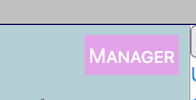

Once your organization acccount is set up, you may create new users to assist with translation.

Your manager account may also be used for regular voting— you do not need one account for managing and one for voting.

To check that you are logged in as a manager, go to to the **☰** menu and choose **Account Settings**.

You should see your account name next to a box labelled **MANAGER**.

## Managing Users

For details on how to manage users, see [Managing Users].

You will want to create your users with **Vetter** level, unless they are also to be managers, in which case you can create them at **Manager** level. You can have multiple managers.

## Locales

You may only be able to set up users with access to locales your organization is registered for.  Contact [Support] if you receive an error trying to add a user to a new locale.

[Managing Users]: /index/survey-tool/managing-users
[Support]: /translation/ddl/#support
