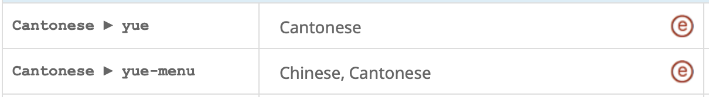
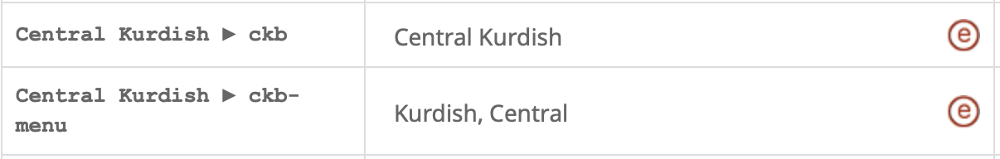

# Language/Locale Names

Some language names are simple, like "English". However, it is often important to distinguish a variant of the language, even when it is only written. For example, British English and American English are often written differently. In some cases, the difference can be quite substantial, such as when the same language is written with different [scripts](https://cldr.unicode.org/translation/displaynames/script-names) (aka writing systems, like Latin letters vs Greek letters).

Thus more complex language names may be composed from simple languages plus variants. A pattern is used to control how the translations for language, script, and region codes are composed into a name when the compound code doesn't have a specific translation. An example is "αγγλικά (Αυστραλία)", which has the native name for "English", followed by the native word for "Australia" in parentheses. See [Patterns for Locale/Language Names](https://cldr.unicode.org/translation/displaynames/languagelocale-name-patterns).

For the simple language names, please follow these guidelines:

- Each of the simple language names **must** be unique.
- Don't use commas and don't invert the name (eg use "French Creole", not "French, Creole").
- Don't use the characters "(" and ")", since they will be confusing in combination with countries or scripts in more complex language names. If you have to use brackets, use square ones: [ and ].
- The most neutral grammatical form for the language name should be chosen.
- Use the capitalization that would be appropriate for a language name in the middle of a sentence; the \<contextTransforms> data can specify the capitalization for other contexts. For more information, see [Capitalization](https://cldr.unicode.org/translation/translation-guide-general/capitalization).

## Unique Names

There are a few special cases:

- Local variants of a language sometimes need to be translated, such as *Australian English* (internal code: en\_AU) or Simplified Chinese (zh\_Hans).
- "Iberian Portuguese" or "European Portuguese" is the style of Portuguese used in Portugal (as opposed to Brazil)
- Similarly "Iberian Spanish" or "European Spanish" is the style of Spanish specifically used in Spain (as opposed to Latin America).
- "Swiss High German" (*Schweizer Hochdeutsch*), also called "Swiss Standard German", has the code de\_CH.
- "Swiss German" (*Schwyzerdütsch*) has the code gsw.

## Menu variants

For languages that are part of a larger family, the Survey Tool may request translations of a “menu variant” of the language name that puts the family name first so it will be grouped in a menu together with other languages of the same family. For example:

If your standard translation of the language name already puts the family name first (as in “Kurdish, Central”) then you can supply the same name as the menu variant.

## Other variants

Some languages may have other variant forms. For example, “ckb” may in English be called “Central Kurdish” or “Sorani Kurdish”; the former is used as the standard name for English, and the latter is the variant. In other languages the equivalent of “Sorani Kurdish” may be used as the standard name; if there is also an equivalent for “Central Kurdish” it may be supplied as the variant. If there is only one form in your language, please use it for both the standard and the variant form.

