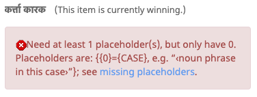

# Error and Warning Codes

This page is being developed to help provide more detailed information on error messages. As of now, only a few items are populated.

## Placeholders

Many patterns have placeholders of the form {0}. The number of these placeholders is determined by the pattern. You can see errors like the following if the placeholders are not right.

The error message will show which placeholders are expected, with an uppercase placeholder name for each possible placeholder, such as **{0}={CASE}** above, and a sample or ‹explanation› of what will go into the placeholder, such as **‹noun phrase in this case›**. Here are some more details on the kinds of errors you might see:

|   |   |   |
|---|---|---|
| gapsInPlaceholderNumbers | Placeholders have to be strictly ascending order, such as  **... {0} ... {1} ...  {2} ...** . If you have the right number of placeholders, but the wrong numbers, you'll see this error. NOTE: the placeholders can be in any position, s o  **...  {2} ... {0} ... {1}  ...** is ok. |  |
| duplicatePlaceholders | A few patterns, such as minimal pairs, may allow for duplicate placeholders, such as **{0} abc {0} def** . All others disallow duplicates; for them you may see this error. |  |
| missingPlaceholders | A few patterns allow for placeholders to be omitted. All others have to have all of the required placeholders ; for them you may see this error. |  |
| extraPlaceholders | Occasionally people add too many placeholders: they supply a **{1}** when only **{0}** is allowed. |  |
| invalidPlaceHolder | If you have a malformed placeholder, like **{0$}** , you'll see this message. The placeholders have exactly 1 digit, and so must be of the form **{0}** , **{1}** , **... {9}** |  |

**Warning: Some of the more complicated cases are the MinimalPairs**

They allow for, and often need, duplicate placeholders.

- For plurals and ordinals, make sure to read [Determining Plural Categories](http://cldr.unicode.org/index/cldr-spec/plural-rules#TOC-Determining-Plural-Categories).
- For case and gender, make sure read [Grammatical Inflection](https://cldr.unicode.org/translation/grammatical-inflection).

