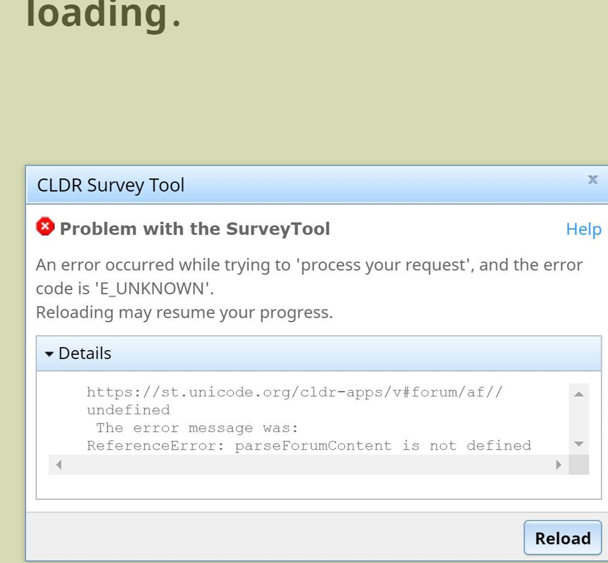
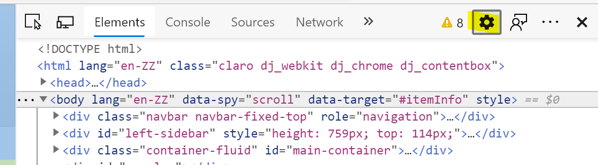
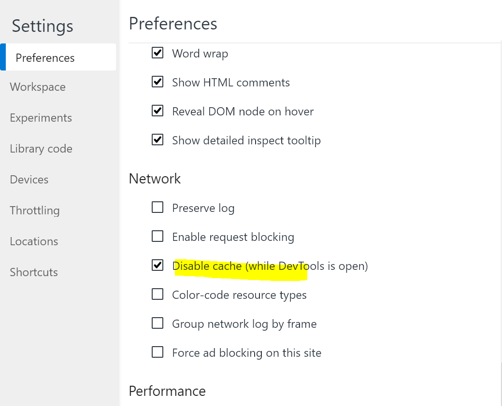
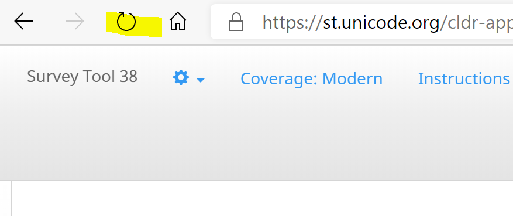

# Empty Cache

**The Survey Tool depends on Javascript and you may run into issues because of JavaScript on your system being outdated.**

In the Survey tool, when going to pages like the Forum or Dashboard, you may see a Disconnect error. As shown in this example screenshot with the Details expanded.

These errors are typically JavaScript being outdated on your system and clearing cache will resolve the problem.

To clear your cache, follow the steps below (Windows/macOS).

**Windows** (please scroll down for macOS/Safari)

1\. On the page that you are running in to the error, click F12 or open **Developer Tools** from the browser (**Settings > More tools > Developer tools**).

2\. Go to the settings, the ⚙️ icon:

3\. Find "**Disable Cache (while DevTools is open)**" and check.

4\. Refresh the page by clicking on the Refresh button on the page.

For additional information about Browser cache tips, see https://www.getfilecloud.com/blog/2015/03/tech-tip-how-to-do-hard-refresh-in-browsers/#.XRJaApMzbuM for examples.

**macOS - Safari**

1. Open Safari's settings (cmd-, or go to **Preferences** under the Safari menu)
2. Go to the **Advanced** tab and enable the **Develop menu**
3. In the Develop menu, select **Empty Caches** (cmd-alt-E)
4. Now refresh the web-page (cmd-R)

~~When you run into case JavaScript is the issue, you may have to try the following:~~

~~**How do I stop JavaScript caching in Chrome?**~~

~~Open Google Chrome and navigate to the page you want to test.~~

~~Press **F12** (if available) or open **Developer Tools** from within Chrome's settings (**Settings > More tools > Developer tools**).~~

~~Click the cog in the top right of the pop-out box. Check the "**Disable Cache (while DevTools is open)**" setting box.~~

~~Then right-click the "Refresh" button (arrow going in a circle), and pick the last option (hard reload/empty cache).~~

~~Sometimes you need to flush your browser's cache when the Survey Tool updates.~~

~~See~~ https://www.getfilecloud.com/blog/2015/03/tech-tip-how-to-do-hard-refresh-in-browsers/#.XRJaApMzbuM ~~for examples.~~

