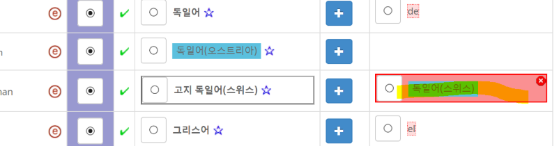

# Handling Errors and Warnings

_\* Note that if the committee finds systematic errors in data, new tests can be added during the submission period, resulting in new Errors or warnings._

## Errors

Errors in the survey tool MUST be fixed for the Winning column. Following are common errors that you may encounter and tips on ways to fixing them.

- **Can't have same translation as… (Must fix)**

Exactly the same name can't be used for two different items of the same type.

For example, it is an error if "Malawi-Kwacha" is used as the translation for two different currency codes:

- MZN (Mozambican metical), and
- MWK (Malawian Kwachas)

In the above case, it is a pretty clear mistake. It is not as simple in other cases. Some region names are very similar, for example, and it can be a bit tricky to know how to handle them. Currencies have the problem that a new currency code may have the same name as an obsolete one.

You can find some guidance under "Unique Names" in the following pages:

- [Country/Region Names](https://cldr.unicode.org/translation/displaynames/countryregion-territory-names),
- [City Names](https://cldr.unicode.org/translation/timezones#TOC-City-Names),
- [Currency Symbols & Names](https://cldr.unicode.org/translation/currency-names-and-symbols/currency-names)
        
**The characters ‎\[…\]‎ should not be used (Must fix)**

For what to do, see [Characters](https://cldr.unicode.org/translation/-core-data/exemplars#TOC-Handing-Warnings-in-Exemplar-characters), in the section Handling Warnings. _While these are categorized as warnings, every effort should be made to fix them._

**Unquoted special character '.' in pattern (Must fix)**
    

Number patterns can only contain an unquoted . when it is the decimal separator.

In other cases, such as to finish an abbreviation, it must be quoted, as in: 000 tūkst'.'

For more information, see [Number Patterns](https://cldr.unicode.org/translation/number-currency-formats/number-and-currency-patterns).

- Errors in Others column can be ignored. For example, this is an example of an Inheritance value in the Others column where the Language (Country/region) names have a collision issue. Do not vote on values that have errors.

## Warnings

- **The value is the same as in English**

Because a common mistake is for people to copy the English values precisely, a warning is provided when this happens.

This may not be an error, because it is often perfectly legitimate to have an identical string. For example, the word for "France" in French is the same as English, for example. So this warning is just to call your attention to the text in case it needs to be changed.

- **The value is the same as 'code'**

Another common mistake is to copy a code value, such as "cs" for Czech, instead of translating it.

This may not be an error, because it is often perfectly legitimate to have an identical string.For example the script code for "Thai" is "Thai", which matches the English word exactly. So this warning is just to call your attention to the text in case it needs to be changed.

