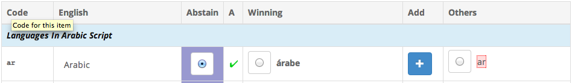
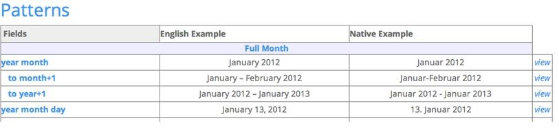

# Survey Tool Guide

### _News_

_2022-11-28 Updated several images and instructions to reflect improvements, such as revised menus, buttons,regional inheritance, and the Dashboard and Forum._

[**Survey Tool**](https://st.unicode.org/cldr-apps/v#locales///) **|** [**Accounts**](https://cldr.unicode.org/index/survey-tool/survey-tool-accounts) **|** [**Guide**](https://cldr.unicode.org/translation/getting-started/guide) **|** [**FAQ and Known Bugs**](https://cldr.unicode.org/index/survey-tool/faq-and-known-bugs)

The Survey tool is a web based tool for collecting CLDR data and includes various features that the contributors (vetters) should know before getting started.

Note that the exact appearance in screenshots may change as the tool is enhanced over time and based on your vetter level.

### 💡 Helpful Tips

- Please read the home page of the [Translation Guidelines](https://cldr.unicode.org/translation) before starting your data contribution.
    - If you experience a **Loading...** problem with the Survey Tool, try clearing your browser cache. See [Reloading JavaScript](https://www.filecloud.com/blog/2015/03/tech-tip-how-to-do-hard-refresh-in-browsers/#.XOjGNtMzbuM).
- **Browser support** for Survey Tool includes the latest versions of Edge, Safari, Chrome, and Firefox.  
- Use [Reports](https://cldr.unicode.org/translation/getting-started/guide#TOC-Reports) at the beginning to review the data in your language in a holistic manner for Date & time, Zones, and Numbers.
    - Capitalization: Translations should be what is most appropriate for ”middle-of-sentence” use. So, for example, if your language normally doesn't spell languages with a capital letter, then you shouldn’t do that here. Please see [Capitalization](https://cldr.unicode.org/translation/translation-guide-general/capitalization) for more details.
    - Plurals: For important information regarding the use of plural forms for your language, please read [Plurals](https://cldr.unicode.org/translation/getting-started/plurals).
        
### Vetting Phase

At a point towards the end of Survey Tool period, the Technical Committee will change the survey tool to "Vetting Mode". In Vetting Mode, submitting new data/translations is no longer possible, but you can still change your votes and participate in the forum. (The exception is that you can submit new data if the currently winning value has generated an error or a warning.)

## Login and Import of old votes

1. Go to http://st.unicode.org/cldr-apps/survey/ and log in.

1. **Import of old votes** is automatically handled when you log in for all your votes **matching** the latest released data. If you have voted previously, upon first log-in, you will see a message showing the number of your votes that matched the currently winning votes that have been auto-imported.
2. Import of your old votes will take some time, but this will be done at 1st log-in only.

1. **Import old votes manually**. You can still import your old voted data that **DO NOT match** the last released data.
    1. Go to the **☰ Menu**, look under **My Votes**, and choose **Import Old Votes**.
    

1. Scroll to the bottom to see the category selection for bulk import.     
2. Select the categories that you want to import and click **Import selected items** button at the bottom.
3. Go to the data categories in the Survey tool where you have imported your old votes, these will show up in the Others column with no votes.
4. Review and add your vote. The best practice is to create a forum entry explaining why this is the data that should be changed to and drive to gain consensus with other vetters.
        

### Picking Locales

1. On the left sidebar, you will see the CLDR locale(s). Your default view will be the languages you have permissions for. All the locales that you have permission to contribute submissions to are marked with PENCIL icon. You can view the others but not submit contributions. For example, if you have permissions to the default language Afrikaans (af), you will not have permissions to Afrikaans (Namibia), and vice versa.
    

1. Each language is followed by a list of regions that represent specific locales. The locale that is grayed out and preceded by an × is the default. The others are considered “sub-locales”. If you are working on the default locale, select the language name. For example, if you work on Spanish in general (default = Spain), you will see that that Spain is grayed out in the list below: choosing Spanish means that you are working on the default (Spanish for Spain).
    

1.  Only those of you working on a specific variant language (or "sub-locale") will pick a non-default region. If you work on Mexican Spanish, pick **Mexico**. (This should already be pre-selected for you.)
    

_Make sure that you haven't mistakenly turned the Information Panel off! See_ [_**No Information Panel**_](https://cldr.unicode.org/translation/getting-started/guide%23TOC-No-Information-Panel)_**.**_

### Voting view

1. Once you have selected your locale, more options show up in the left sidebar. (You’ll note that the sidebar only shows if you mouse over the **\>** character on the left.)
2. If the locale is relatively new and very complete, start working on the **Core Data** section and go through the rest of the sections. If the locale is mostly complete, then go to [**Dashboard**](https://cldr.unicode.org/translation/getting-started/guide) below. 
3. Once you have selected a section, you'll see a table to enter votes in. The main table has these columns:
    - **Code**: the code CLDR uses to identify this data point. 
    - **English**: the plain English value of the data point (the text you are to translate).  
    - **Abstain**: the default vote value for you. Only use abstain if you don't know a good value to be used.  
    - **A**: The value’s current status. A checkmark means it’s approved and is slated to be used. A cross means it’s a missing value. (Note, for sub-locales, a cross is not necessarily bad. If the parent locale has a good value, the sub-locale will inherit it. Check the **Winning** column.)  
    - **Winning**: this is the currently winning value. If the survey tool would close now, this is the value we would publish. If the value has a blue star next to it, that means it’s also the value that was published in the previous version. Normally it takes at least two votes from two different organizations to change value: in some locales the bar is lower, and for some items it is higher. 
    - **Add**: If the winning value is not correct and is not listed under Others, then use the plus button here to enter the correct value. If you enter a new value, your vote will be applied to it automatically.  
        - If what you want is a variation of what is in Winning or Others, you can cut & paste, and then modify.  
    - **Others**: other suggested values, not currently winning, but available to vote for.
4. Click on one of the radio buttons to make your vote. The winning status changes in real-time so depending on vote requirements and existing votes, your vote may move your desired value to the winning column right away.
    1. Look at the Regional Variants to see if any should be changed: see **Information Panel** below. 
5. Once you are done with all the sections, go to the [**Dashboard**](https://cldr.unicode.org/translation/getting-started/guide)**.**
6. Under the English column, look for "**i**" for additional information and "**e**" for an example.

### Icons

The main panel uses icons to indicate important information and possible problems. After clicking on the **Code** cell, look to the right-side info panel for more details.

(Icons for the **Dashboard** are listed in the [**Dashboard Icons**](https://cldr.unicode.org/translation/getting-started/guide) section below.)

### Examples

An example with an ❌ shows a case where the pattern has an inappropriate placeholder substituted. That example should be ungrammatical; if it is grammatical, then either the translated unit or the minimal pair pattern itself is incorrect. The example will show in the Info Panel, and also if you hover over the item.

### Information Panel

1. If you hover over an item (including the English item), a tooltip will appear showing a sample value and usage of the item in context. The item itself will have a white background; other text in context will have a gray background.
2.  When you select an item (the text, **NOT** the radio button), additional information will show in the right-hand **Information Panel**. See screenshot below.
3. Make sure you use a wide-screen monitor and enlarge your window until you can see it, something like the image below.
4. The box at the top shows information about the code you are translating. _It also has a link that you should click on the first type you encounter that kind of item that will explain any "gotchas"._
5. If there is an error or warning for the item, you see that in the middle.
6. Below that, you'll see an example. This is the same as you get by hovering over the item in the center section.
7. If there are votes, you'll see a breakdown of them; you also see the number of votes required to change the value. Unicode organization members usually have 4 votes; _vetters which are not representing a Unicode organization usually have 1 vote_. Your vote value and the vote value required for change will show on the right navigation for the selected item as shown in this screenshot (4 and 8 respectively in this case).
8. Near the bottom, you'll see a pulldown menu that shows the values for different regional Variants. Here, you can quickly compare the values and go to different sub-locales to correct inconsistencies.
9. You'll also see the New Forum Post button (as shown in the screenshot _to the right_). This is the easiest way to post discussions for the selected item. Remember that the Forum posts are at language level and not at Sub-locale level. For more information, see [Forum](https://cldr.unicode.org/translation/getting-started/guide).
10. **No Information Panel?**
    - If you click on the **Code** cell and there is no **Information Panel**, you may have turned it off accidentally. Click on the **Open Info Panel** button near the top right of the window.

## Inheritance

Some items are by default inherited from other places in the data. You have the option of voting for the inherited value or entering a different one.

The inherited values are color coded:

You can click on the link in the right sidebar to see the original value.

**Note:** Voting on inheritance means "always use the inherited value, even if it changes.” An inheritance vote is advised if there are no differences in spelling conventions and political relations between your locale and the parent locale. Voting for inheritance minimizes duplication of data.

### Regional Variants (also known as Sub-locales)

Language variants by Region are differentiated as Parent-locale and sub-locales. For example,

-   **Spanish es** is the parent (or the default) locale for all Spanish locales. Its default content is for Spanish (Spain) es\_ES.
    
-   **Spanish (Latin America) es\_419** is one of the sub-locales for Spanish. Votes on inheritance will ensure that it will only contain content that is different than what is in Spanish.
    
-   **Spanish (Argentina) es\_AR** is one of the sub-locales for Spanish (Latin America). Votes on inheritance will ensure that it will only contain content that is different than what is in Spanish (Latin America)
    

The regional variants menu for a data point is shown on the right navigation information pane. It will look something like the following (the exact appearance depends on the browser).

When you pull it down, it will show which regional variants have different values than the main language locale. The current locale will show as darker gray as shown in the screenshot on the right.

In the example in the screenshot above, Switzerland and Liechtenstein have different regional data than German (=Germany). Hover over the menu item to see the value it has. In the above diagram, you'll see "." as the decimal separator for Switzerland in the yellow hover box above as shown in the screenshot above.

If any values are incorrect, please correct them. You can do that by selecting the menu item, which will take you to the same item, but in the regional locale. For example, selecting “Belgium” above goes to the decimal separator for _German (Belgium)_. You can then correct the item.

Normally, the only values that should be different are in date and number formats. In some locales there are other variations: for example, German (Switzerland) spells words with “ss” instead of “ß”, so differences can occur on many different pages.

### Regional Inheritance

If you are voting in a sub-locale such as en\_AU, es\_MX, fr\_CA etc., you can vote to follow whatever the translation is for the locale you inherit from. You do this by voting for the translation highlighted in blue box. When you do this, you are essentially saying "**always use the inherited value, even if it changes in the source parent value**". In the screenshot below, this is the case for the vote for "inglês". If the parent value eventually changes, the value in your locale will also change. Subsequent voting in your locale could still result in having a different value than the parent locale.

An inheritance vote is useful if there are no differences in spelling conventions and political relations between your locale and the parent locale. Abstaining from voting may have the same effect, but if another vetter votes for something different, your Abstained vote means that it's not opposed by you; thus, your intention is not known to others. By voting for the blue inheritance value you make your opinion known to other vetters.

- Inheritance is important, to prevent data duplication. 
- Inheritance is not only limited to “sub locales”. Parent locales (or default language locales) also have inheritance from either other fields or the root. 
- By default, all data are inherited if there are no contributions. The data are indicated as Missing or Abstain. Sub-locales have inherited values that are generally from the parent locale (e.g. de\_CH will inherit values from de\_DE). 
- The inherited values appear in the **Others** column highlighted in blue box (e.g. “embu” and "inglês"). By clicking the radio button in front of those values, you are voting for inheritance. 
- If the inherited value is not correct for your locale or it’s likely for your locale to change the data in the future, click the + button, and enter a new suggestion.

The vote status column will show an orange-up arrow () if the winning item is inherited and it does not have any votes.

### _Progress Widget_

_There is a new style for the progress widget that shows your voting progress on the page in the upper right corner of the Survey Tool next to the Info Panel toggle. You will see details of your progress when you hover over the widget, including what progress is being measured, and the total number of items remaining for you to vote on in that category. Your progress is measured based on the coverage level you have set, so make sure that it is set correctly._

_**Note:**_ _The total progress widget is currently only visible when the dashboard is open._

### _Page progress_
_Progress bar shows progress of items on page for your coverage level._

### _Overall progress_

_Progress bar shows progress of items overall for your coverage level._

## Dashboard

The Dashboard will show you a list of data items with warnings of different kinds. Some will require action, some may be false positives. (For the veterans, this is the redesigned Priority Viewer.)

 

The goal is that you should work the Dashboard down to show zero items, then review the [**Reports**](https://cldr.unicode.org/index/survey-tool/guide#TOC-Reports), below.

_The first priority is to fix all the_ _**Missing**_ _items by supplying the correct translations._

### Dashboard Reports

Go through each of the sections to address the problems. These sections are explained below.

At the top of the Dashboard is a header with a button for each section the title (such as **Missing**) and the number of items. Below that header are a series of rows.

### Dashboard Columns

There are six columns in the Dashboard view.

- **Dashboard category**: The first letter of the section name enclosed in a circle.    
- **Data Type**: The section that the item belongs to.
- **Code**: this links to the field in survey tool. Click on it to go to the item in the Survey Tool.  
- **English**: The English value is highlighted in blue.  
- **Winning** _**XX**_: The currently winning value is highlighted in green.
- **Hide checkbox**: For items that can be hidden a checkbox to hide that option appears on the far right.

 

### How to handle different categories

Following are guidelines on best practices for handling items under each category in Dashboard.

- **Missing**
    - These are items where there is no localization provided by any contributor. Click on the line to be taken to the item in the Survey Tool where items are highlighted and you can add a translation. When you fix a **Missing** item it will turn to **Changed**.

 

- **Losing**
    - These are items that you already voted on. This indicates that your vote is not for the currently winning value. If you can live with the winning item—if it is reasonable, even if you don't think it is optimal—change your vote to be for the winning item. If not, click the **Forum** button in the **Info Panel** and give reasons for people to change their vote to what you have suggested. If not all users have voted yet, these values may still be approved before the end of the cycle. **Engage with others on the Forum discussions**. Make sure to post the reasons why others should change their votes and **respond to others’ posts**.
- **Disputed**
    - This is very similar to **Losing**, except in this case your vote is winning and someone else's is losing. Review all of the items to see if someone else’s item is better and read the forum post, and whether you want to change your vote. Discuss in the forum, then use the Hide button to hide disputes you’ve addressed in the forum.
- **Changed**     
    - The Changed count is provided in the Dashboard only as a reference. The **Changed** items are either:
        - Missing items now have a value.
        - The Winning value of the translation has been changed.
- **English Changed**
    - These are items where the English source has changed after the last change in your language. Items that are listed in this section indicates that you need to re-check them and assess the impact to your language and update as appropriate. (Some English changes will have no impact to translations.)
- **Warnings**
    - These are issues which appear after automatic checks. (For examples, a message could be "_The value is the same as English"_, which is a quite common warning for languages that are close to English in the spelling of languages or territories. If the value is actually ok, then click on the Hide button (crossed eye). If not, then vote for a fix, or post on the Forum for discussion.

 

### Dashboard Summary

There are two ways to clear items from the **Dashboard** list:

1. Fix them (such as adding a translation for a missing item)
2. Hide them (such as when the English has changed but the translation doesn’t need to change).
    - _**Only**_ _hide items if it really is a false positive,_ _**not**_ _because you gave up on fixing it…_    
    - _If you hide an item by mistake:_ 
        - _Unhide all the lines with the top eye button._     
        - _Click on the orange eye button in the line (a “Show" tooltip will appear)._  
        - _Hide all the lines again by clicking the top eye button._
            

## Reports

The reports show lists of items that need to be reviewed for consistency. You should look through these after you do the **Dashboard** to make sure that the items are consistent, when viewed in the context of others. Each of them has a link to instructions at the top. Please read these before continuing.

Reports are under the left navigation.

Reports are a good way to review the data in your language in a wholistic view for the Date and time, Zones, and Numbers.

 

_Example:_

 

## Special cases

**You may not make changes to this locale**

You may see a message like the following when trying to modify a regional locale, like pt-BR.

→

The reason that Brazil is grayed out is that it is the default content locale for Portuguese. So to modify pt-BR, you need to simply click on Portuguese. If you do click on Brazil, you will get to a page with the following at the top. Clicking on [default content locale](https://cldr.unicode.org/translation/translation-guide-general/default-content) will explain in more detail.

### 20 vote items May not be modified

Some items have change protection in place that will stop vetters from changing it, but you can still advocate a change. This is indicated by the message "May not be modified-see details" as shown in the screenshot below, or that the threshold for changing the value is 20 votes, instead of the usual 8 or 4. This indicates that the item is particularly sensitive to data instability and has a broad impact. Changes to these items require Technical Committee review. To suggest a change, you have to "flag" the value.

To change it, you have to flag the item for committee review:

1. Click on the “**Flag for Review button**”.
2. On the new page, you'll see a message box. 
3. Enter the change that you want to make, and add a justification for changing it. 
4. Then click **“Post**”.
5. Towards the end of data collection cycle, the Technical Committee will review the change request and either accept it, or reject it with comments.

Note: The **Flag for Review** button will be available only when the item has a 20 vote value AND there is a suggestion in the **Others** column.

## Forum

Forum is the place to discuss and collaborate with other vetters on questions and issues in your language. The forum is at Language level and not at sub-locale level; if you are talking about a translation in a sub-locale, be sure that you are clear about that.

It's a best practice to **create a Forum post whenever you propose a change to a previously approved value**, and provide an explanation and links to references.

### Forum Etiquette

While creating New Posts on Forum or participating in discussions please follow these general etiquette guidelines for best productive outcomes:

- Be professional. Provide accurate, reasoned answers so that other participants can easily understand what you are talking about.
- Be courteous. Refrain from inappropriate language and derogatory or personal attacks.  
- Don’t “SHOUT”; that is don’t use all capitals.
- In case of disagreement, focus on the data and provide evidence to support your position. Avoid challenges that may be interpreted as a personal attack.
- Be prepared to have your own opinions challenged or questioned, but don’t take answers personally.
- It’s possible that participants have different expectations on the intent of the data. Clarify what you think is the intent may help especially if disputes continue.
- Remember that open discussion is an important part of the process; abiding by these guidelines will encourage active participation by all vetters and a better end result.

### Forum Workflow

Forum posts work with the following workflow:

1. Create a new **Request** 
2. Responses by other vetters in your language with Agree, Decline, or Comment.
3. Once resolved, the creators of the the initial Request or Discuss closes the post.
    

### How to create a new forum post

A forum post can be specific to a particular data point or a general issue. In either case, create a new forum post to an item.

- A post that is specific to a particular data point.
- A general issue that impacts multiple data points. In a general case that impacts multiple data points, you do not need to post new forum posts for every item impacted. The general issue should be flagged to other vetters and once a consensus is reached, it is expected that vetters update their votes on all impacted items. New forum posts can be used to flag to other vetters if others fail to update their votes on all impacted items. ONLY request if others have missed or have not updated consistently.
        

**Create forum posts from the** [**Information pane**](https://cldr.unicode.org/translation/getting-started/guide#TOC-Information-Panel)**l in the voting window.**

1. Vote on an item (or add new +) for the item you want to suggest changing.

2. In the Information panel on the right, there are two buttons to indicate the type of forum posts:
    1. **Request** You have voted on a non-winning item, and you want to Request others to change their votes.    
    2. **Discuss -** Currently only TC members can make discuss posts.

3. Click **Request** button and fill out the details of your request. (Note: The **Request** button is disabled unless you have voted)

**Request**
1. A precomposed text is included to help start your post. **Important!: Request works WITH the item you voted for currently.**
2. _Please consider voting for “{your voted-value}”. My reasons are:_ Complete the text by filling out your reasons and links to references.
3. Then **Submit.**

### Responding to Request posts

There are two ways to respond to forum posts:
- Info Panel (This is the recommended option.)
- In the Forum view (See [Working in the Forum view](https://cldr.unicode.org/translation/getting-started/guide#TOC-Working-in-the-Forum-view-))

**Respond from the** [**Info Panel**](https://cldr.unicode.org/translation/getting-started/guide#TOC-Information-Panel) **in the voting window.**

In the **Info Panel**, select the **Comment** button
- Each posted response is labeled in Red and its response type: Agree, Decline or Comment.

**Choosing your Response:** Vote, or Comment

1. When you make a vote on an item that already has a Request post by another vetter, then an Agree or Decline post will be made for you automatically. If you agree with the reasons for change, you don't need to add more explanations for agreeing.
2. An **Automated** _**Agreement** will be posted if you vote for the requested value. Your agreement will be automatically posed with a precomposed reply_: I voted for “{requested-value}”

3. **Comment:** Use this option if you do not Agree or Decline, and you have other input to bring to the discussion or if you want to ask for more information.

### Responding to Discuss posts

There are two ways to respond to new forum post:
- Info Panel (This is the recommended option.)
- In the Forum view (See [Working in the Forum view](https://cldr.unicode.org/translation/getting-started/guide#TOC-Working-in-the-Forum-view-))
        

**Respond to forum posts from the** [**Info Panel**](https://cldr.unicode.org/translation/getting-started/guide#TOC-Information-Panel) **in the voting window.**
1. In the Info Panel click the **Comment** button and add your input to the open discussion.
2. The label **Discuss** in Red indicates that this is a Discuss post (to distinguish from Request posts)

### Working in the Forum view

In the Survey Tool [Forum](https://st.unicode.org/cldr-apps/v#forum/fr//) view, there are multiple filtering options available for you to work more effectively.
1. The Forum view can be accessed from the left navigation **Forum.**

2. By default, the filter is for **Needing action**.

3. Filter options:
    - **Needing action**: Forum posts included in this filter are Requests and Discussion posts by someone in your language. You have not yet taken action on either agreed or declined or posted a discussion asking for additional information. For Discussion posts, these are where you are not the last poster.
    - **Open requests by you**: Forum posts included in this filter are Requests that you have posted that you have not closed yet.
    - **All Open topics**: All posts that are open. This includes both Request and Discussions that have not closed yet.
    - **All topics:** All topics, open or closed, including forum posts from previous releases.
    - Note that Forum posts that were active in previous releases will be marked as Closed at the start of a new Survey tool cycle.

**Respond to forum posts in the Forum view**

In the Forum view, you can respond to Request and Discuss posts.

For **Request posts**, you can select your decision using the 3 available buttons: **Agree, Decline, Comment.**

See [Responding to Request posts in Information Pane](https://cldr.unicode.org/translation/getting-started/guide#TOC-Responding-to-Request-posts).

## Reporting Survey Tool issues

If you run into a problem with the Survey Tool functionalities, please see [FAQ & Known Bugs](https://cldr.unicode.org/index/survey-tool/faq-and-known-bugs) to see whether it has already been reported (and whether there is a work-around). If not, or if you have suggestions for improvements, please file a bug using the Feedback link at the bottom of each window. If you encounter problems or have enhancement suggestions for the survey tool, please [file a ticket](https://cldr.unicode.org/index/bug-reports#TOC-Filing-a-Ticket).

**Email notification**

1. Another way to check for posts that may need your attention is to review email notifications to the e-mail account for your locale. You can delete these notifications if they are for changes initiated by you. You can open the post directly from a link in the email.     
2. When you make a forum entry, it will be emailed to all other linguists working on locales with the same language, parent or sub-locale (i.e. **forum is at Language level and not at sub-locale level**). If you are talking about a translation in a sub-locale, be sure that you are clear about that.
        

### Forum posts for CLDR ticket feedback

CLDR users can send in data feedback using [JIRA](https://github.com/unicode-org/cldr/blob/main/docs/requesting_changes.md). Tickets filed in JIRA will be processed as described below. Please expect to see posts by CLDR Technical Committee members (TCs) in Forums, and participate by providing your response to any tickets needing your input.

The goal is to bring it to the attention to all linguists contributing in a particular language, and gather their input, so an informed decision can be made and/or suggested.

1. CLDR TC members accept JIRA tickets.
2. For each ticket assigned to them, the TC member will post a forum topic in each language mentioned in the ticket, asking for vetters to look at the issue and either make the requested change, or explain in a forum post why changes should not be made.
3. A reason for not changing could be for example that it is a reasonable change, but doesn't exceed the 'stability' bar in the translation guidelines.
4. TC members will monitor the forum discussion/change during the Submission phase, and will close the JIRA ticket after the forum discussion is concluded.
        

## Advanced Features

1. Users familiar with CLDR XML format can upload votes (and submissions) for multiple items at once. See [**Bulk Data Upload**](https://cldr.unicode.org/index/survey-tool/bulk-data-upload)**.** 
2. Organization managers can manage users for their organization (add, remove, send passwords, set locales, etc.) For more information, see [**Managing Users**](https://cldr.unicode.org/index/survey-tool/managing-users)**.**
    1. Some users may want to reset their Coverage Level, with the menu that looks like the image to the right. 
    2. The Coverage Level determines the items that you will see for translation: the minimal level has the highest priority items. You normally start with the level marked "Default" (which will vary by your organization and locale). Each successively higher level adds more items, at successively lower priorities. You will not normally go beyond "Modern", unless you have special instructions for your organization.
    3. _Note that some companies won't use the data until it is complete at a certain coverage level, typically_ _**Modern**._

