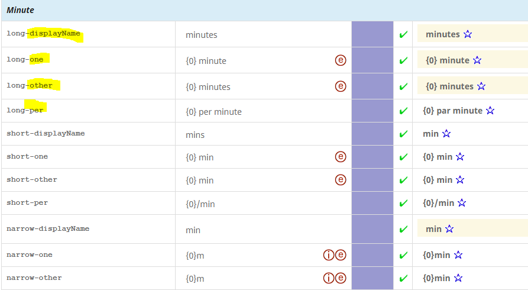

# Plurals & Units

## Plurals

In CLDR, Plurals are used for localized Units and Compact numbers (under Numbers).

In the Survey Tool for translation purpose, plural forms shown per language will differ as only those that are relevant to that language are shown.

For example, in French, the distinction of the One and Other are available. Please see [Plural Rules](https://cldr.unicode.org/index/cldr-spec/plural-rules), and [file a ticket](https://github.com/unicode-org/cldr/blob/main/docs/requesting_changes.md) if you see a form in the Survey Tool that is not expected in your language.

**Note:** Many of the sets of names form Logical Groups, and you need to make sure they have the same status or you will get error messages. See [Logical Groups](https://cldr.unicode.org/translation/getting-started/resolving-errors) for more information.

## Localized Units

Localized units provide more natural ways of expressing unit phrases that vary in plural form, such as "1 hour" vs "2 hours". While they cannot express all the intricacies of natural languages, the plural forms allow for more natural phrasing than constructions like "1 hour(s)".

As well as being used for durations, like "3.5 hours", they can also be used for relative times, such as:

- "3 hours ago" (regarding an event that took place 3 hours in the past; that is, 3 hours before now).
- "In 3 hours" (regarding an event that will take place 3 hours in the future; that is, 3 hours from now).

## Casing of Relative Times

**All of these should have the same casing for the first character (capitalized or not) if the pattern has letters coming before the placeholder.** For example, in the following, either #1 needs to have a lowercase 'd', or #2 needs to have an uppercase 'H'.

1. **D**entro de {0} horas
2. **h**ace {0} años
    
Each unit may have multiple plural forms, one for each category (see below). These are composed with numbers using a _unitPattern_. A formatted number will be substituted in place of the number placeholder.

For example, for English if the unit is an hour and the number is 1234, then the number is looked up to get the rule category _other_. The number is then formatted into "1,234" and composed with the unitPattern for _other_ to get the final result. Examples are in the table below for the unit **hour**.

| Locale | Number | Formatted number | Plural category | CLDR Unit Pattern | PH Unit Pattern | Final Result |
|---|:---:|:---:|---|---|---|:---:|
| en | 0 | "0" | other | {0} hours | [NUMBER] hours | "0 hours" |
| en | 1 | "1" | one | {0} hour | [NUMBER] hour | "1 hour" |
| en | 1234 | "1,234" | other | {0} hours | [NUMBER] hours | "1,234 hours" |
| fr | 0 | "0" | one | {0} heure | [NUMBER] heure | "0 heure" |
| fr | 1 | "1" | one | {0} heure | [NUMBER] heure | "1 heure" |
| fr | 1234 | "1 234" | other | {0} heures | [NUMBER] heures | "1 234 heures" |

## Narrow and Short Forms

### Unit formats

Whereas an expression like _“_{0} englische Meile pro Stunde” may be fine for the _long_ form of the unit speed-mile-per-hour, it does not work for the _short_ or _narrow_ forms. In particular, the _narrow_ form needs to be _**absolutely**_ as short as possible. _It is intended for circumstances where there is very little room in the UI._ However, the message will have additional context. Thus the user will typically know, for example, that the units are speed or distance. So a much shorter abbreviation can be used than would work in general.

In addition, when English units are used in languages that don't use them, they will typically be accompanied by the equivalent metric amount. For example, a map in Russian might show the distance between cities in the US both in metric units and in English units (since they are used in the US, and may be needed for reference there). Or an ad for computer monitors might have “60,9 cm (24 Zoll) Full-HD Monitor”, with Zoll for inches. The metric unit might not even be present where the English unit is in common use, such as when measuring computer screen sizes.

The _short_ form can be longer than the _narrow_ form, but should also be as short as possible, while still being clear and grammatical. It may have less context available than the _narrow_ form, and thus may need to be somewhat longer than the _narrow_ form in order to be clear.

Some techniques for shortening the _narrow_ or _short_ form include:

1. Drop the space between the value and the unit: “{0}km” instead of “{0} km”.
2. Use symbols like km² or / instead of longer terms like “Quadrat” or “ pro ”.
3. Use symbols that would be understood in context: eg “/h” for “ per hour” when the topic is speed, or "Mi" for mile(s) when the topic is distance.
4. Replace the qualifiers "English" or "American" by an abbreviation (UK, US), or drop if most people would understand that the measurement would be an English unit (and not, say, an obsolete German or French one). 
5. Use narrow symbols for CJK languages, such as “/” instead of “／”.

Which of these techniques you can use will depend on your language, of course.

### Unit display names

The short and narrow forms of the display names for a unit need not be as short as the symbol used in the actual unit formats. In fact, since the display name may often provide the context necessary to properly understand a unit symbol, the display name will often be longer and more explicit than the short or narrow form of a unit symbol. Often the narrow display name is not specified so that it falls back to the short display name.

## Past and Future

Unit patterns for past and future (3 hours ago, In 4 hours) are related to [Relative Dates](https://cldr.unicode.org/translation/date-time/date-time-names), and occur in the same circumstances. They need to have the same casing behavior. That is, if the translation for "Yesterday" starts with an uppercase 'Y', then the translation for "In {0} hours" needs to start with an uppercase 'I' (if it doesn't start with the placeholder).

## Minimal Pairs

Minimal pairs are used to verify the different grammatical features used by a language. _**These messages are not to be translated literally; do not simply translate the English!**_

- **Plurals (cardinals) and Ordinals.** See [Determining Plural Categories](https://cldr.unicode.org/index/cldr-spec/plural-rules#TOC-Determining-Plural-Categories).
- **Grammatical Case and Gender.** See [Grammatical Inflection](https://cldr.unicode.org/translation/grammatical-inflection)
    

## Compound Units

Units of measurement can be formed from other units and other components. For more information, see [Compound Units](https://cldr.unicode.org/translation/units/unit-names-and-patterns).

