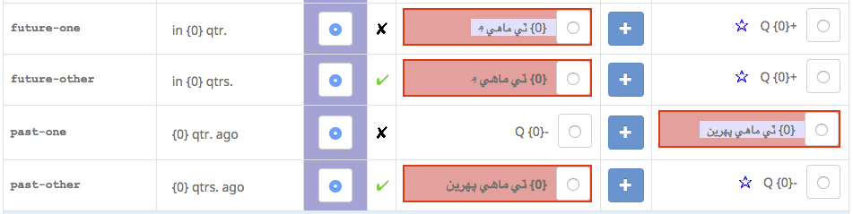
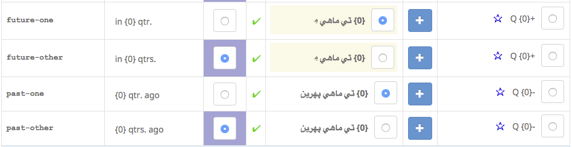

# Handling Logical Group Errors

A "logical group" is a set of _items_ that need to be treated as a single unit in terms of voting.

Examples of common logical groups in the survey tool data are:
- Sets of month names or weekday names in a calendar.
- Any group of items that have plural categories associated with them ( for example, in currencies "1 US Dollar", "5 US Dollars" ).
- In compact decimals, groups of formats for 4-5-6 digits, 7-8-9 digits, 10-11-12 digits, or 13-14-15 digits.

All errors in logical groups must be resolved. All non-resolved errors must be resolved by the CLDR technical committee before a new version of CLDR can be released.

### Logical Group Errors

There are two Errors or Warnings that you may see in the SurveyTool, and these errors should fix from linguistic side if as much as possible.

1. **Error type 1: "Incomplete Logical Group"**
    1. This is most serious and it means that one or more items in what's considered as a logical group has been added; however, in doing so at least one other is missing (✘).
        1. To fix: Make sure that values for ALL of the items in the logical group are there. 
        2. An example: vote/enter values for **all** of the month names. Once you enter values for all the items in a logical group, this error will disappear.
    2. Error type 2: "**Inconsistent Draft Status**"
        1. This happens when the voting results would leave one of items in a group having a lower draft status (✔︎ approved, ✔︎ contributed, ✘ provisional, ✘ unconfirmed) than some other item in the group.   
        2. **All** of the items have to have the same status.  
        3. To fix: Go through all your votes and use the forum to coordinating with other vetters and come to an agreement on all items in the group.
    3. Error type 3: "**This item has a lower draft status (in its logical group) than X.**".
        1. same as Error type 2.
2. Inherited items can count as errors if they are part of a Logical Group. The easiest way to resolve these are to explicitly vote for the inherited or aliased items. Here is an example, before and after.
    

#### Before

#### After

