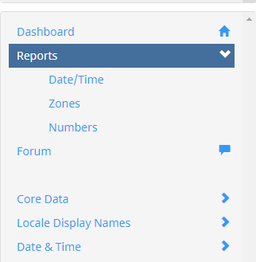
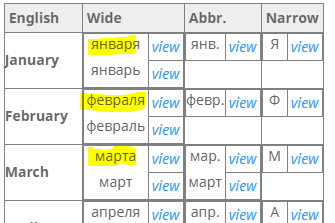
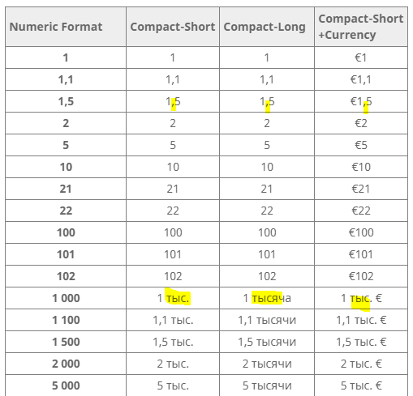
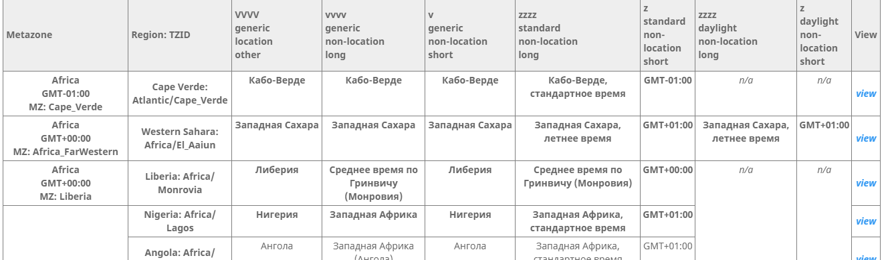

# Review Reports

The Reports provide a way to get an overview of some of the formats to help ensure consistency. They help you to see how the data from different sections will fit together to produce the results that users will see.

_**Some of the reports will not be relevant during a Limited Submission, because you will not be able to make changes to data. In v43, only the Person Names Report is relevant.**_

You should review the reports:

1. well before\* the end of the Submission phase
2. at the start of the Vetting phase
3. well before\* the end of the Vetting phase

\* Make sure you leave enough time that you can vote for any additional needed items. Often a fix will require cooperation from other vetters, so you will need to file at least one forum request so that they know that there is a problem and why you think it needs fixing.

Once you are done, check the appropriate item in the top window:

- **I have reviewed the items below, and they are all acceptable**
- **The items are not all acceptable, but I have entered in votes for the right ones and filed at least one forum post to explain the problems.**
- **I have not reviewed the items.**
    

Sometimes there will be a structural problem that cannot be fixed by votes, even if all the vetters agree. For example, Latvian needs [some extra support](https://unicode-org.atlassian.net/browse/CLDR-16231) for formatting person names. In that case, you should file a ticket to report the problem. Don't file a ticket if the problem can be solved by you and the other vetters changing your votes.

To get started, in the Survey tool, open the **Reports** from the left navigation.

### General Tips

1. To correct the data, use the **View** links on the right of each line in Reports to go directly to the field and correct the data. Sometimes the 'view' can't go to the exact line, where there are multiple items involved in the formatting.  
2. File at least one forum request where you need others to change their votes. If it is a general problem, such as the capitalization being wrong for all abbreviated months, you can file a forum request for the first one, and state the general problem there.

### Examples of Problems

Check for consistency between different forms by looking at them side by side.

1. The casing is inconsistent; (e.g. some months are capitalized and others are lower cased). see. capitalization rule. 
2. Spelling consistency.
3. Use of hyphens in some rows/columns, but not in others.
4. Some abbreviations have periods and others don't, or some use native 'periods' and others use ASCII ".".
        

### Person Name tips

1. Please read the [Miscellaneous: Person Name Formats](https://cldr.unicode.org/translation/miscellaneous-person-name-formats) under "**Review Report**".
        

### Date & Time Review Tips

1. Even if your language preference is to use the 12 hour format, it's important to also pay attention to the **Times 24h** section. In applications using CLDR data, users can set their preference to 24 hour formats.
2. Lower down on the page are charts of weekdays, months, and quarters for review. When a language has two different forms depending on format vs stand-alone, there will be two rows for the same item. Russian, for example, uses the genitive for format (top row, highlighted in yellow in the screenshot), and the nominative for stand-alone (second row).

### Number formats Review tips

1. Each forms should be acceptable for your locale.    
2. Review the cells within each row for consistency.
3. Also look for consistency across the rows for consistency.
4. Check that each cell has the correct plural form (if your language has plural forms).

### Zones Review tips

1. The first two columns identify the timezone (metazone) 
2. Compare the items in each row for consistency.
3. Compare the items in the same column across different rows.
4. City names that use hyphens do not show the hyphens in patterns because they are constructed from the city name and the pattern {0} Zeit. Consider whether it would be better to always remove the hyphens, or to add them to the pattern {0}-Zeit.
        

