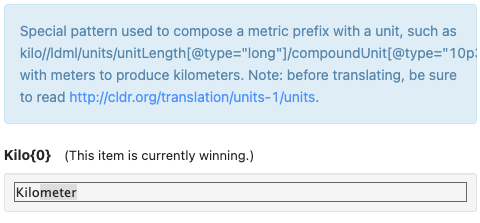
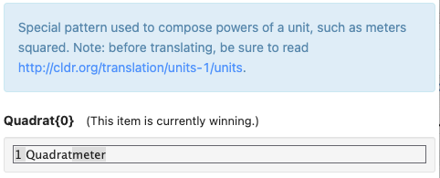
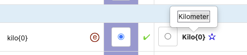

# Grammatical Inflection

## Miscellaneous > Minimal Pairs

Here you need to add patterns that distinguish different cases or genders. Some languages need both, and others just need gender, or just case (see table above).

***WARNING:***

- ***Do not simply translate the code values - these values are NOT translations but rather*** [***transcreations***](https://www.articulatemarketing.com/blog/translation-vs-transcreation)***.***
- ***Instead they are patterns that require items of that gender and/or case.***
- ***They must have the placeholder {0} and indicators such as an article for gender/case!***
### Minimal Pairs: Gender

1. Provide a phrase that **requires** a noun or noun/adjective placeholder to have **that specific gender**.
	- For example, the German phrase “Die {0} ist…” requires the noun/placeholder to be feminine (singular).
	- Each phrase must be different, and be suitable for a different noun or noun phrase — and if possible, should be suitable for substituting a unit of measurement.
	- ***Don't worry about elision or mutation like changing la to l'****;* the phrases **don't have to** work for **all** items of that gender if there are side effects because of certain letters.

Here is an example from [German](https://st.unicode.org/cldr-apps/v#/de/MinimalPairs). Notice that the example needs the verb "ist" because otherwise for "Die" (feminine article), the unit could be plural of any gender.

**German Case**

| № | Case | Pattern | Sample phrase with right case | Composed value |
|---|---|---|---|---|
| 1 | nominative | {0} kosten 13,50 € . | 1 britisch**er** Teelöffel und 3 britisch**e** Gallonen | 1 britisch**er** Teelöffel und 3 britisch**e** Gallonen kosten 13,50 € . |
| 2 | accusative | … für {0} … | 1 britisch**en** Teeöffel und 3 britisch**e** Gallonen | … für 1 britisch**en** Teelöffel und 3 britisch**e** Gallonen … |
| 3 | dative | … mit {0} … | 1 britisch**en** Teelöffel und 3 britisch**en** Gallonen | … mit 1 britisch**en** Teelöffel und 3 britisch**en** Gallonen … |
| 4 | genitive | Anstatt {0} … | 1 britisch**en** Teelöffels und 3 britisch**er** Gallonen | Anstatt 1 britisch**en** Teelöffel s und 3 britisch**er** Gallonen … |

You do not have to supply the *sample unit (column 4)* in the Survey Tool, but you should make sure that you *could* supply a **possible** sample unit.

***It is absolutely crucial that you make sure that each Pattern is constructed in a way so that none of the samples could also correctly fit in the Composed Value on a different row.*** For example, you couldn't put "Jahr" (a neuter unit from #3) into the pattern in #2, as the result - "Die Jahr ist …" - would not be grammatically correct (feminine article + neuter noun).

In English, all of these would say "The {0} is...", with {0} e.g. being a day, a week, or a year (could be other units as well, doesn't have to be duration). 

English has only one gender for all common nouns, and thus the English column on the Survey Tool page is blank.

The equivalent Italian patterns might be:

| # | Gender | Pattern | Sample unit with right gender | Composed value |
|---|---|---|---|---|
| 1 | masculine | Il {0} è … | centimetri | Il centimetri è... |
| 2 | feminine | La {0} è … | miglia | La miglia è … |

### Minimal Pairs: Case

1. Provide a phrase that **requires** the noun or noun/adjective placeholder to be in **that** specific **case**.
	- For example, for German, “... mit {0} ...” requires the {0} to be in the dative case (for a noun phrase).
	- Each phrase must be different, and if possible should be suitable for substituting a unit measure, such as "1 British gallon".
	- It may need to be a noun phrase, with an adjective, not just a single noun.
	- There should be some **single** noun-phrase placeholders that **must** change form for each pattern, without changing the plural form of that noun phrase, just the case. (This is different than gender).
	- ***Don't worry about elision or mutation like changing la to l'****;* the phrases **don't have to** work for **all** items of that gender if there are side effects because of certain letters.
	- Not all possible placeholder values will exhibit differences. For example, in German only masculine noun phrases are different in the accusative case (*den* Mann vs. *der* Mann). Sometimes you may need a combination of two different units (A *and* B), as in the example below.

Here is an example from [German](https://st.unicode.org/cldr-apps/v#/de/MinimalPairs). Notice that this case is more complicated than gender, because we need a noun phrase (with an adjective, "British") and two separate measures, because no single noun-adjective combination has differences in all 4 cases in German. The "British teaspoon" is different in 3 cases, but the genitive is the same as the dative. The "British gallons" is different in 3 cases, but the nominative and accusative are identical. 

***It is absolutely crucial that you make sure that each Pattern is constructed in a way so that none of the samples could also correctly fit in the Composed Value on a different row.*** *For example, in the table below the nominative sample phrase could not be correctly substituted into the accusative pattern.* That would produce "für 1 britisch**er** Teelöffel und 3 britische Gallonen", which would be incorrect.

| № | Case | Pattern | Sample phrase with right case | Composed value |
|---|---|---|---|---|
| 1 | nominative | {0} kosten 13,50 € . | 1 britisch**er** Teelöffel und 3 britisch**e** Gallonen | 1 britisch**er** Teelöffel und 3 britisch**e** Gallonen kosten 13,50 € . |
| 2 | accusative | … für {0} … | 1 britisch**en** Teeöffel und 3 britisch**e** Gallonen | … für 1 britisch**en** Teelöffel und 3 britisch**e** Gallonen … |
| 3 | dative | … mit {0} … | 1 britisch**en** Teelöffel und 3 britisch**en** Gallonen | … mit 1 britisch**en** Teelöffel und 3 britisch**en** Gallonen … |
| 4 | genitive | Anstatt {0} … | 1 britisch**en** Teelöffels und 3 britisch**er** Gallonen | Anstatt 1 britisch**en** Teelöffel s und 3 britisch**er** Gallonen … |

You do not have to supply the *sample phrase (column 4)* in the Survey Tool, but you should make sure that you could supply one a **possible** sample phrase.

### Minimal Pairs: Plurals and Ordinals

See [Plural Rules](https://cldr.unicode.org/index/cldr-spec/plural-rules)

## Units > Compound Units

There are two Codes that need your attention: **Power2** and **Power3**. These are typically adjectives, and would need to agree with unit of measurement.

The Code is now longer, allowing for case and gender:

- If your language doesn’t have case, the case will be “nominative”.
- If your language doesn’t have gender, it will be “dgender”.
- That is also used for a selected instance for gendered languages: either *neuter* or *masculine* (if the language has no neuter).

For examples, see [French Compound Units](https://st.unicode.org/cldr-apps/v#/fr/CompoundUnits/) 

- **long-one-nominative-dgender** requests the **masculine** case in French
- **long-one-nominative-feminine** requests the **feminine** case in French

(Note: the dgender is a workaround for this release: we plan to show the correct value in the future)

## Units > ... > gender

For example, see [French gender for Liter](https://st.unicode.org/cldr-apps/v#/de/Volume/1027df24bd31941e) 

If your language supports gender for units of measure, you’ll see a new element for the gender of each relevant unit. For example, a Liter in German is masculine. If you try to put in an incompatible value, you’ll get a message that lists the valid values for your locale, such as

The gender value for this locale must be one of: [feminine, masculine, neuter]

Many of the units have “seed” values for the gender variants. These are marked as provisional, and you’ll have to verify whether they are correct or need changes.

## Units > ... > long-one-accusative

For example, see [German case variants for Liter](https://st.unicode.org/cldr-apps/v#/de/Volume/529c3100fd1c0226)

If your language support case inflections for units of measure, you’ll see new rows for the relevant units. You should pick the form appropriate for the case and plural category. Often it is the same as for some other category.

Many of the units have “seed” values for the case variants. These are marked as provisional, and you’ll have to verify whether they are correct or need changes.

## English (inch-pound) units

Many of the units are just used in a few English-speaking countries. While it may seem pointless to translate these obscure units, **there are circumstances that require them**.

Some inch-pound units are of different sizes in the US and the UK. To distinguish them, the **header** will use the term **Imperial** for the British version. So for example, Gallon is always the US version, and Gallon-Imperial is always the UK version.

1. Typically locales will just qualify the UK version, such as “**{0} Imp. Gallone**” or “**{0} britische Gallone**”. The seed data may differ between these conventions; if so you’ll have to change either the seed data or the data from the last release.
2. In some cases, the US version has a qualification, such as “**{0} amerikanische Flüssiggallone**”. Again, you’ll want to check that the last-release and seed data are consistent, and fix if not.
3. In some cases, the seed data will be completely wrong, and have a name for the UK version being used for the US unit, or vice versa. These you’ll need to fix.
4. You also want to review the other units to make sure that they have **consistent phrasing**. For example, you don’t want “**Flüssiggallone**” for one unit, and simply “**Gallone**” for another.
5. In general, shorter is better, as long as it is clear.

There are some cases where there is a distinction between a metric and English version of a unit. For those, use the unqualified word for whatever is best understood to be the default in your language. For example, in German you would translate [Metric Ton](https://st.unicode.org/cldr-apps/v#/de/MassWeight/58bb01d0ca5c56ae) as "Tonnen" and a [Ton](https://st.unicode.org/cldr-apps/v#/de/MassWeight/196ea772e721f4c5) (the English ton, aka short ton) as a qualified term.

**Prefixes and Powers**

The prefixes and powers are used to format compound units, such as the following.

**Prefix (kilo, milli, etc)**

**Power (square, cubic)**

Hovering over the winning value will also show an example of how the prefix or power is used, as in the following:

