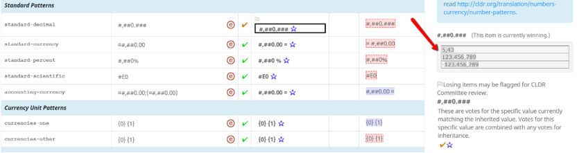

# Number and currency patterns

## Number formats introduction

Pre-requisite topics to read:

- [Number Symbols](https://cldr.unicode.org/translation/number-currency-formats/number-symbols)

Numbers are formatted using patterns, like "#,###.00". For example, the pattern "#,###.00" when used to format the number 12345.678 could result in "12'345,67" if the grouping separator for your locale use an apostrophe ('), and the decimal separator is a comma (,).

Whenever any of these symbols are in the English pattern, they **must be retained** in the pattern for your locale. The positions of some of them (%, ¤) may be changed, or spaces added or removed. The symbols will be replaced by the local equivalents, using the [Number Symbols](https://cldr.unicode.org/translation/number-currency-formats/number-symbols) for your language. (See 💡 Helpful Tips below the table)

| Type | Example pattern | Meaning |
|---|:---:|---|
| . | #,##0 **.** 00 | The decimal separator placeholder. In a computer program, this gets replaced automatically by the actual symbol used for the decimal point in your locale.  **Not a real period ; must be retained!** |
|  , | # **,** ##0 . 00 | The grouping (thousand) separator placeholder. In a computer program, this gets automatically replaced by the actual grouping separator in your language.  **Not a real comma ; must be retained!** |
| 0 | #,## **0** .### | The placeholder for the start of a whole number. In a computer program, this gets replaced by an actual digit (or a zero if there aren't enough digits). **Not a real zero(digit) ; must be retained!** |
| # | **#** , **##** 0. **###** | The # symbols are place holders for placements of digits based on positions of digit separator. In a computer program, these would be replaced by actual digits. The main use of # is to show the placement of the "," (grouping separator). |
| ¤ | **¤** #,## 0 .00 #,##0.00 **¤** | The currency symbol placeholder. This placeholder indicates the position of the currency symbol (or currency code) and the beginning of the number #. In a  computer program, this will be replaced by a currency symbol (e.g $) or code (e.g. USD).  By C LDR default, a space gets added automatically depending on rules as defined in the [spec TR35 Currency](https://unicode.org/reports/tr35/tr35-numbers.html#Currencies)   This space handling would be seen in a computer program ONLY w hen applicable as per the spec.   See  💡 **Translation Tips** below on when to add spacing **¤ #** ,##0.### and not  **¤#** ,##0.### |
| % | #,## 0 **%** | This marks a percent format. The position of the % symbol would be locale specific and may appear in the front, back, with or without spacing. **Not a real % ; must be retained!** |
| E | # **E** 0 | This marks a scientific format. The E symbol may change position. **Must be retained.** |
| ' | See German example:  [0 Mio'.' ¤](https://st.unicode.org/cldr-apps/v#/de/Compact_Decimal_Formatting/6ececfcb96e2cda8)   | If any of the above characters are used as literal characters, they must be quoted with ASCII single quotes. This is mostly used in Compact Number formatting with abbreviations.  For example, in a  Short Numbers   if a period needs to be used to mark an abbreviation, it would appear as:   0.0 tis'.'  *not*   0.0 tis. |
| ...;... | #,##0.###;#,##0.###-     #,##0.00¤ **; (** #,##0.00¤ **)**   #,##0 % **;** #,##0 - % .    | If your language expresses negative numbers in a format other than adding "-" at the front, you can put in  two  patterns, separated by a semicolon with no space.   - The first format before the ";" will be used to indicate the formatting for zero and positive values.  - The second format after the ";" will be used to indicate the formatting for negative values.  - For accounting-currency, a " - " is not required to indicate the negative pattern.   Also see 💡 **Translation Tips** below |

💡 **Translation Tips**

- If your locale grouping separation is not by thousands, then move the comma separator in the format to the correct placement.
- For example, if your language expects to see the separator in the first group of 3 and then 2s thereafter: 1,00,00,000.00, the pattern should reflect that: #,##,##0.###.
- *DO NOT "translate" the placeholder characters #,###.00. For example:*
	- *Do not change '.' to ',' even though in your language the decimal point is written with a comma.*
	- *Do not* change the zero (0) or hash marks (#) after a decimal point (for example, #,##0.###); those will be reset by computer programs.
		- Even if your currency doesn't use any decimal points, do not remove the decimal indicators (for example, ¤#,##0.00).
	- Negative patterns can be handled two ways:
	- If the negative pattern is the same as the positive pattern with a minus sign in front (e.g. -1,234,00), then that negative pattern will be automatically generated.
		- You don't need to supply a negative pattern in that case, and if you do supply one it will be automatically removed.
		- If your locale uses a different way to express the negative number (other than a negative sign in front), then use the ";" to provide two patterns. The semicolon after the positive pattern indicates a separate format for the negative pattern.
		- For example, in an Accounting currency format, if your locale uses ( )  to express the negative number, specify the negative number with ";", such as #,##0.00¤;(#,##0.00¤). This example format indicates that the negative currencies appear like "(1'234,56£)" instead of "-1'234,56£".
		- For example, if the position of the negative sign is before the % symbol, you'd specify:  #,##0%;#,##0-%.
- Move the the currency symbol (¤) or percent sign (%), if it is used in a different position.
	- To deal with CLDR's default automatic space handling in place for currency symbol when using a currency code(e.g. USD):
	- Do NOT add a space ¤#,##0.### for result: $12 and USD 12.
	- ADD a manual space ¤ #,##0.### for result: $ 12 and USD 12. 
	- Always verify with examples in the right information pane and see how the data from number symbols are used in formatting numbers. The final results of the number formatting will show the correct symbols for decimal, grouping, etc... from [Number Symbols](https://st.unicode.org/cldr-apps/v#/USER/Symbols/) in your locale.
- For bidi scripts (e.g. Arabic and Hebrew) you may need to add directionality markers (U+200E (\<LRM> LEFT-TO-RIGHT MARK, U+200F \<RLM> RIGHT-TO-LEFT MARK, U+061C \<ALM> ARABIC LETTER MARK)
	- For number formats in bidi scripts, the Survey Tool shows examples in both a right-to-left context and a neutral context (with both positive and negative numeric values). In the future it may show examples in a left-to-right contex as well.
	- The hightest priority is to make the formats look correct in a right-to-left context; the next most important is to make them look correct in a a neutral cotext. If possible it is also a good idea to make them work in a left-to-right context.
	- To make them work in different contexts, you can add the directionality markers specified above. As a last resort you can also use the bidi isolate markers U+2066 \<LRI> LEFT-TO-RIGHT ISOLATE, U+2067 \<RLI> RIGHT-TO-LEFT ISOLATE, and U+2068 \<FSI> FIRST STRONG ISOLATE, each of which must be paired with a terminating U+2069 \<PDI> POP DIRECTIONAL ISOLATE. However, these bidi isolate markers can result in copy-paste issues if the PDI is not copied along with the other paired mark.
	- When adding directionaliry markers to formats, keep in mind that the minus and plus signs may also have directionality markers that affect layout of patterns with those signs.

## Types of Number Patterns

There are four general-purpose number patterns supported in CLDR: decimal, currency, percent, and scientific.

Remember that the "." and "," are placeholders and do not mean the literal characters: computer programs that use CLDR will change them to the right number symbols for your language as explained in the section above.

*The currency formats have two types (standard and accounting); each of these may have up to two additional alternate forms (-alphaNextToNumber, -noCurrency) as descibed in the table below.*

| Type | English Example | Meaning |
|---|---|---|
| currency (standard) | ¤#,##0.00 | Used for currency values. The currency symbol (¤) will be replaced by the appropriate currency symbol for whatever currency is being formatted. The choice of whether to use the international currency symbols (USD, EUR, JAY, RUB,…) or localized symbols ($, €, ¥, руб.,…) is up to the application program that uses CLDR. Note: the number of decimals will be set by programs that use CLDR to whatever is appropriate for the currency, so do not change them; Keep exactly 2 decimals in place. |
| currency-alphaNextToNumber | ¤ #,##0.00 | Alternate currency format to be used when the currency symbol has alphabetic characters adjacent to the numeric part. Typically this just adds a non-breaking space between symbol and number if the the standard currency format does not already have a space. It is used to produc result such as “US$ 23.45” versus “$23.45”. |
| currency-noCurrency | #,##0.00 | Alternate currency format to be used for currency-style formats without the currency symbol. This format may be used, for example, in a table of values all for the same currency (in which repeating the symbol for each value is unnecessary). |
| currency-accounting | ¤#,##0.00;(¤#,##0.00) | Used for currency formats in accounting contexts. |
| currency-accounting-alphaNextToNumber | ¤ #,##0.00;(¤ #,##0.00) | The -alphaNextToNumber variant of the accounting currency format. |
| currency-accounting-noCurrency | #,##0.00;(#,##0.00) | The -noCurrency variant of the accounting currency format. |
| Decimal | #,##0.### | Used for formatting general decimal numbers. The number of decimals will be set by programs that use CLDR, so don't alter them. Typically the only change needed for this format is to the position of the thousands separator (see above 💡 **Translation Tips** ). |
| Percent | #,##0% | Used for percent values, such as 12%. The number of decimals will be set by programs that use CLDR, so don't alter them. |
| Scientific | #E0 | Used for scientific notation. Typically not translated. |

## Miscellaneous Number Patterns

| Code | example | Meaning |
|---|---|---|
| approximately | ~{0} | Used to indicate a number that is not exact represented by the placeholder {0}. This is used when an exact number is not required, like for example, to indicate the number of people who have commented on an article. |
| At least | {0}+ | Used to indicate a number that falls within a range with a known **minimum** , represented by the placeholder {0}. This is used when an exact number is not required, like for example, to indicate the number of people who have commented on an article. |
| At most | ≤{0} | Used to indicate a number that falls within a range with a known **maxium** , represented by the placeholder {0}. This is used when an exact number is not required, like for example, to indicate the number of people who have commented on an article. |
| Range | {0}–{1} | Used to indicate a range of numbers |

## Compact decimal formatting

There are also patterns for compact forms of numbers, such as the such as "1M" and "1 million". These patterns may be substantially different across languages, as shown by comparing the English patterns to the Japanese patterns in the table below. These patterns also have plural categories.

*The compact currency formats can have  an -alphaNextToNumber variant, as with the regular currency formats. Ther eis usually no need to provide a -noCurrency variant, since if that is not present the compact decimal formats will be used. However if those are not equivalent to what the noCurrency variant would be, then a separate -noCurrency variant of the ompact currency formats may be provided.*

| Code | Meaning | English Pattern | English Formatted Example | Japanese Pattern | Japanese Formatted Example |
|:---:|---:|:---:|:---:|:---:|:---:|
| 4-digit-short-one (1000)  | **1 thousand = 1,000** | 0K | 1K | 0 (see translation tip below) | 1 |
| 5-digit-short-one (10000) | **10,000** | 00K | 12K | 0万 | 1万 |
| 6-digit-short-one (100000) | **100,000** | 000K | 123K | 00万 | 12万 |
| 7-digit-short-one (1000000) | **1,000,000** | 0.0M | 1.2M | 000万 | 123万 |
| 8-digit-short-one (10000000) | **10,000,000** | 00M | 12M | 0000万 | 1234万 |
| 9-digit-short-one (100000000) | **100,000,000** | 000M | 123M | 0億 | 1 億 |
| 10-digit-short-one (1000000000) | **1,000,000,000** | 0B | 1B | 00億 | 12億 |
| 11-digit-short-one (10000000000) | **10,000,000,000** | 00B | 12B | 000億 | 123億 |
| 12-digit-short-one (100000000000) | **100,000,000,000** | 000B | 123B | 0000億 | 1234億 |
| 13-digit-short-one (1000000000000) | **1,000,000,000,000** | 0T | 1T  | 0兆  | 1兆  |
| 14-digit-short-one (10000000000000) | **10,000,000,000,000**   |  00T | 12T | 00兆 | 12兆 |
| 15-digit-short-one (100000000000000) | **100,000,000,000,000** | 000T | 123T | 000兆 | 123兆 |

  
When computer programs use CLDR, the number of decimals can be changed by computer programs according to the task its designed for. For example, the pattern for 10,000 in the table below (00K for English, 0万 for Japanese) may be modified to have more or fewer decimals — it could be changed to have 3 digits of accuracy: 00.0K for English, 0.00万 for Japanese.

💡 **Translation Tips**

- If it is impossible to abbreviate numbers in that way (e.g. 1M) in your language, then use a single 0 (zero digit). In Compact number formatting, "0" is special character indicating to use the standard decimal formatting/currency formatting. "0" should be used for decimal and currency when there's NO compact/abbreviated way to express the number. For example, in Basque, compact number expression starts with 1M; therefore, all compact numbers up to 1M are expressed as "0".
	- For example, the Japanese pattern for 1000 uses a zero digit because 1,000 is expressed with the character 千. This should be avoided wherever possible, however, since it may cause display issues on devices with small screens, such as mobile phones.
	- In some languages the text will inflect according to the number. For example, languages that write "1 million" but "2 millions".
	- The patterns do not allow for gender or case inflection, so use the most neutral form.
		- Remember that these are number patterns, so literal characters like a period (".") must occur within quotation marks if they are not the placeholder standing for the decimal period. See [Pattern Characters](https://cldr.unicode.org/translation/number-currency-formats/number-and-currency-patterns).
- Compact decimal patterns do not require a "0" when there is a single word or a symbol that is unique. For example, in Hebrew and Somali, 4-digit-short-one gets formatted to a single word or symbol, without an extra digit. In a Somali example,1000 would be formatted to "Kun" and not "0 Kun" (in Somali, you would express 1000 as "Kun" not "1 Kun").
	- However, this can **only** be done where the number is unique. For example, in French 4-digit-short-one (1000) is used to format not only 1K, but also 1.1K. If you supply a pattern with no digits, the user can't tell what the number is suppose to be. An error will occur if you try to do this.
	- There is a mechanism for special cases of exact matches. A special row can be added for your language for specific numbers, such as exactly 1, where the digits must be omitted. You would see a Code value of 4-digit-short-one, for example. If your language has such cases, please file a ticket to request adding them.
- Different patterns are required for currency and non-currency. Please add both.

## Plural Forms of Numbers

Some languages have multiple plural forms for numbers, and will have multiple plural categories for each number. See [Plural Rules and Tool](https://cldr.unicode.org/translation/plurals#TOC-Rules-and-Tool) for numbers mapped to the various plural categories. 

X digit-one

X digit-two

Xdigit-other

